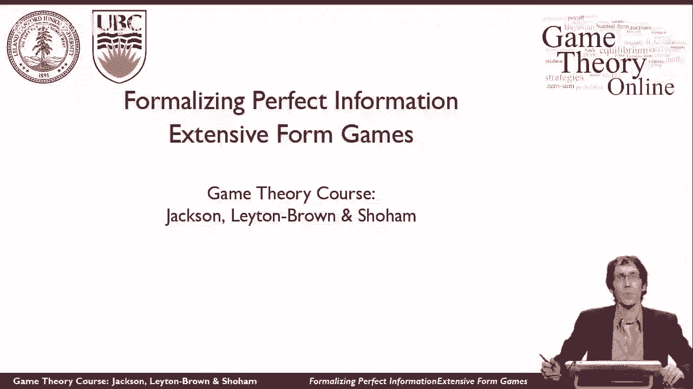
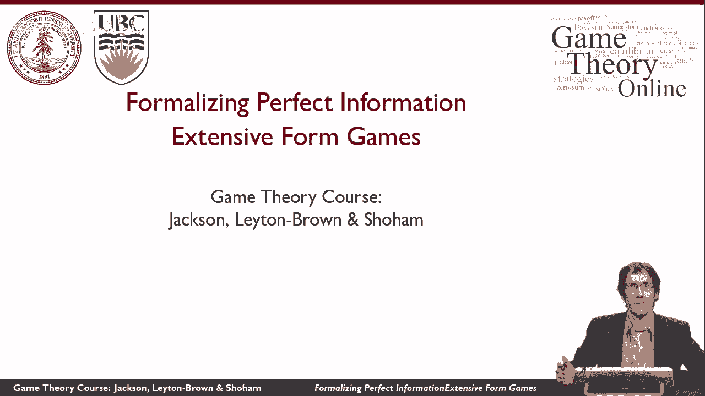
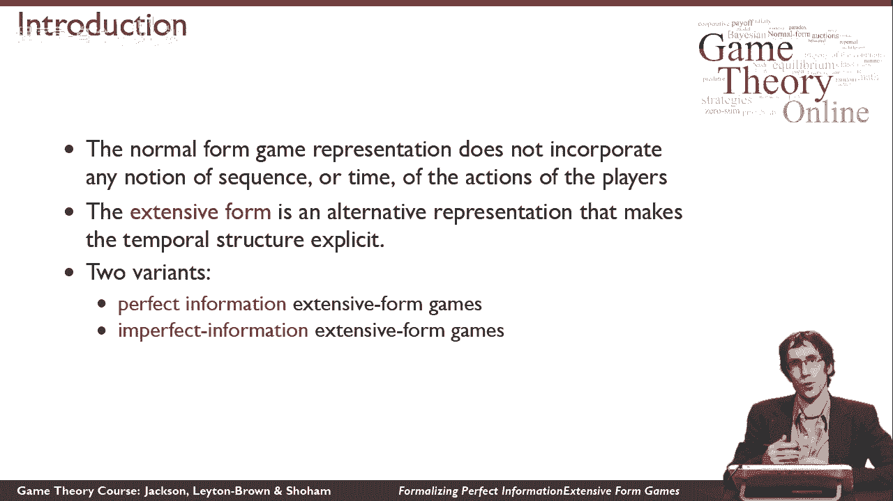
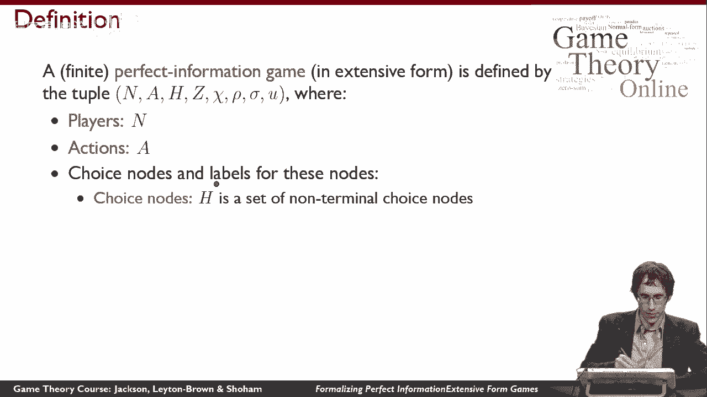
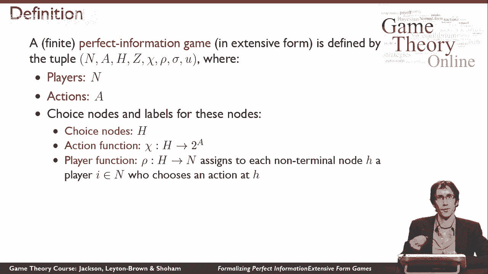
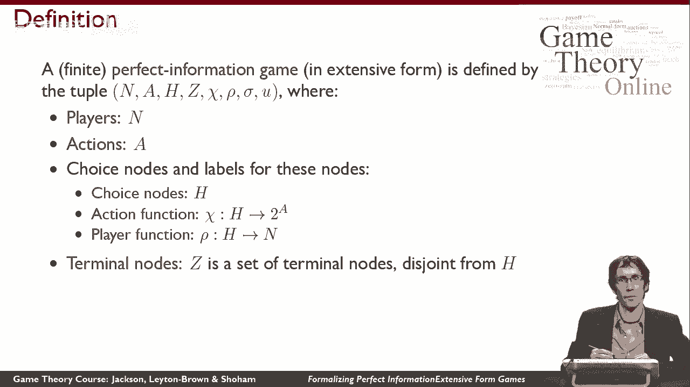
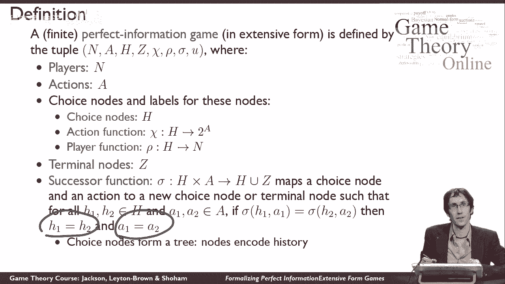
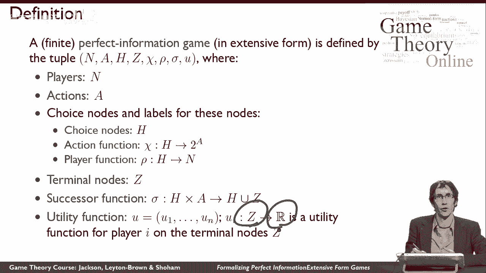
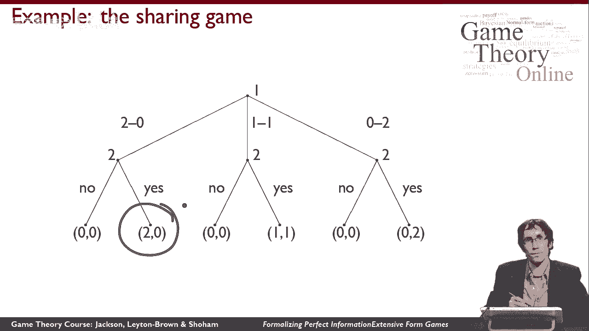

# 26：完美信息扩展形式博弈的形式化表述 🎲





在本节课中，我们将学习如何用“扩展形式”来形式化地描述博弈。与之前学习的“标准形式”（即矩阵形式）不同，扩展形式博弈能够清晰地刻画玩家行动的先后顺序，即博弈的时间结构。我们将从最简单的“完美信息”情况开始，这意味着每个玩家在行动时，都完全清楚之前发生的所有行动。

---

## 扩展形式博弈的构成要素



上一节我们介绍了扩展形式博弈的核心思想是描述行动顺序。本节中，我们来看看构成一个完美信息扩展形式博弈所需的全部数学要素。它比标准形式博弈要复杂一些，需要多个组件共同定义。

以下是定义一个完美信息扩展形式博弈所需的七个核心组件：

1.  **玩家集合 (N)**：与标准形式博弈一样，这是一个包含所有参与博弈的玩家的集合。例如，`N = {1, 2, ..., n}`。

2.  **行动集合 (A)**：这是博弈中所有可能行动的集合。注意，这里是一个全局的行动集，而不是为每个玩家单独定义的行动集。



3.  **选择节点集合 (H)**：这些是博弈树中的决策点，代表玩家需要在此处采取行动的节点。`H` 是一个节点的集合。

4.  **玩家函数 (P)**：这个函数为每个选择节点 `h ∈ H` 指定在该节点行动的玩家。即，`P(h)` 的值是玩家集合 `N` 中的一个玩家 `i`。



5.  **行动函数 (χ)**：这个函数为每个选择节点 `h ∈ H` 指定在该节点可用的行动集合。即，`χ(h) ⊆ A`，表示在节点 `h` 处，轮到行动的玩家可以从集合 `χ(h)` 中选择一个行动。

6.  **后继函数 (S)**：这个函数定义了博弈树的边。它将一个选择节点 `h` 和在该节点采取的一个行动 `a ∈ χ(h)` 映射到一个新的节点。这个新节点可以是另一个选择节点（`∈ H`），也可以是一个终止节点。后继函数 `S` 必须满足“树”的结构：从根节点到任何一个特定节点，有且仅有一条路径。形式化表述为：对于任意两个不同的选择节点-行动对 `(h, a)` 和 `(h‘, a’)`，如果 `S(h, a) = S(h‘, a’)`，那么必然有 `h = h‘` 且 `a = a’`。



7.  **效用函数 (u_i)**：对于每个玩家 `i ∈ N`，都有一个效用函数 `u_i`。这个函数为每个**终止节点**（即博弈结束的节点，其集合记为 `Z`，且 `Z ∩ H = ∅`）分配一个实数值，表示如果博弈在该节点结束，玩家 `i` 获得的收益或效用。

---

## 一个实例：分钱游戏 💰



为了理解上述抽象定义，让我们看一个经典例子——“分钱游戏”。这个博弈讲述了一个哥哥和妹妹如何分配两美元的故事。

博弈从哥哥（玩家1）开始。在根节点（第一个选择节点），他可以选择如何提出分配方案。他有三个行动可选：
*   **行动 (2,0)**：自己留2美元，给妹妹0美元。
*   **行动 (1,1)**：和妹妹平分，各得1美元。
*   **行动 (0,2)**：自己留0美元，给妹妹2美元。



在哥哥做出选择后，博弈进入一个新的选择节点，轮到妹妹（玩家2）行动。无论哥哥的提议是什么，妹妹在每个节点都有两个相同的行动可选：
*   **接受 (Y)**：同意该分配方案，双方按提议获得钱。
*   **拒绝 (N)**：拒绝该分配方案，双方都获得0美元。

以下是该博弈的树形结构示意（括号内为（哥哥收益，妹妹收益））：
```
        哥哥
       /  |  \
    (2,0)(1,1)(0,2)
      /    |    \
    妹妹   妹妹   妹妹
    / \   / \   / \
   Y   N Y   N Y   N
  /     |     |     \
(2,0) (0,0) (1,1) (0,0) (0,2) (0,0)
```
*   如果妹妹选择 **Y (接受)**，则博弈在终止节点结束，收益就是哥哥提议的数额。
*   如果妹妹选择 **N (拒绝)**，则博弈在终止节点结束，双方收益均为 (0, 0)。

在这个博弈树中：
*   **玩家集合 N** = {哥哥， 妹妹}
*   **选择节点**包括哥哥的初始决策点和妹妹的三个后续决策点。
*   **玩家函数 P** 在根节点指向哥哥，在妹妹的决策点指向妹妹。
*   **行动函数 χ** 在根节点给出集合 {(2,0), (1,1), (0,2)}，在妹妹的节点给出集合 {Y, N}。
*   **后继函数 S** 定义了上述树中的所有箭头连接。
*   **效用函数** 在每个终止节点标出，例如 `u_哥哥((2,0)) = 2`, `u_妹妹((2,0)) = 0`。

---

## 总结



本节课中，我们一起学习了如何形式化地定义“完美信息扩展形式博弈”。我们了解到，它通过七个组件 `(N, A, H, P, χ, S, {u_i})` 精确定义了一个博弈树，从而清晰地描述了玩家行动的先后顺序、可选行动以及最终收益。这为我们分析像“分钱游戏”这样具有明确时间顺序的博弈提供了强大的建模工具。在接下来的课程中，我们将利用这个框架来求解此类博弈的均衡。