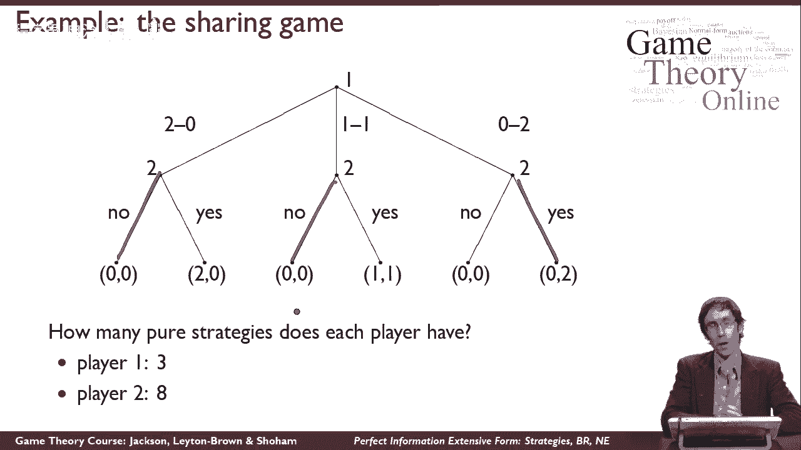
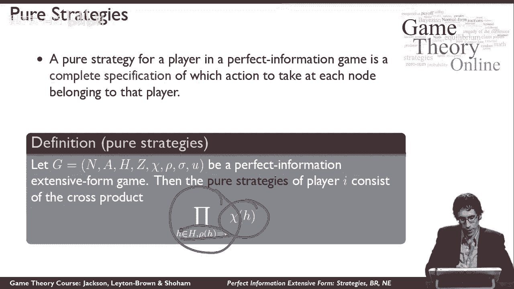
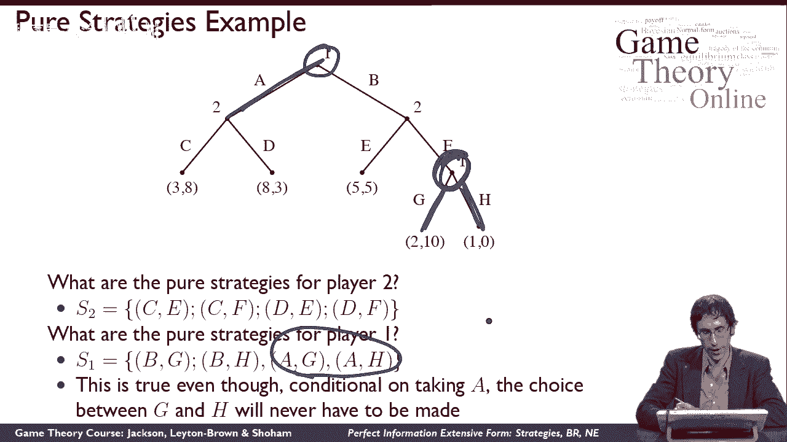
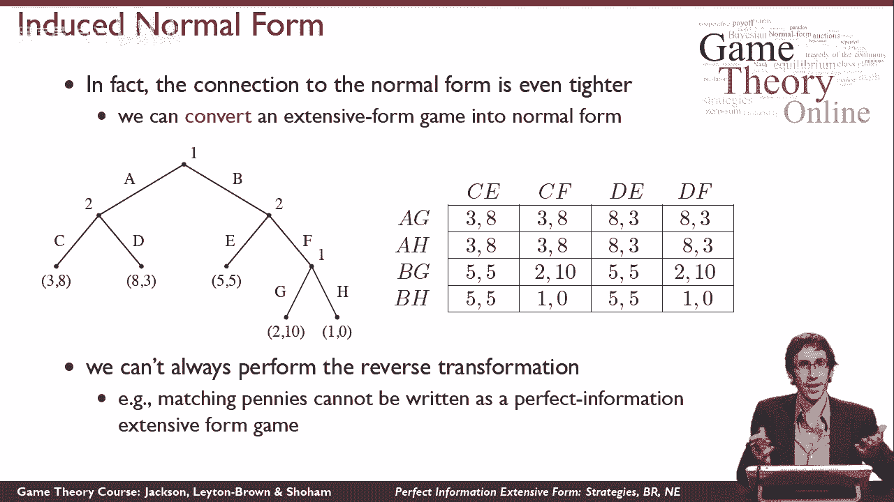
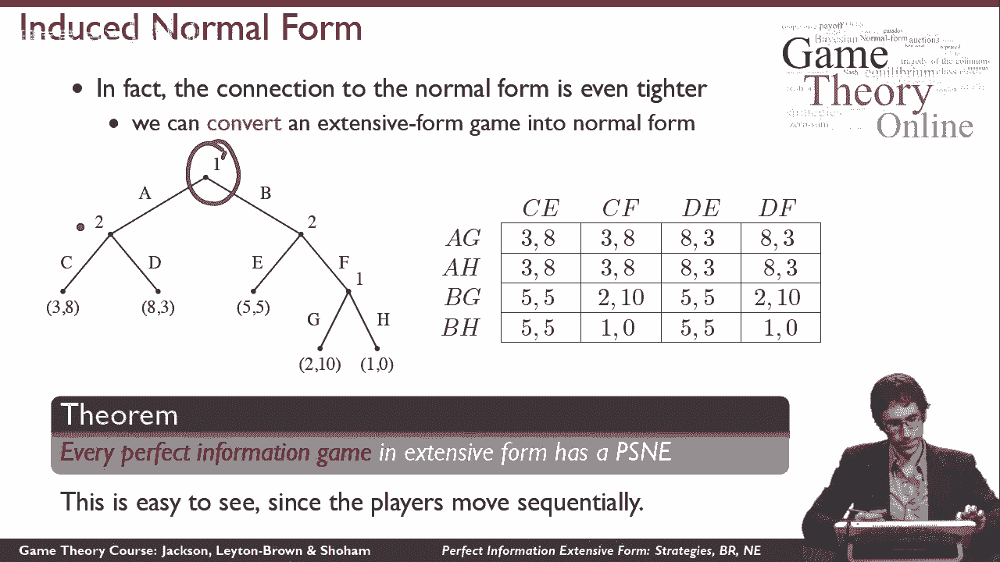
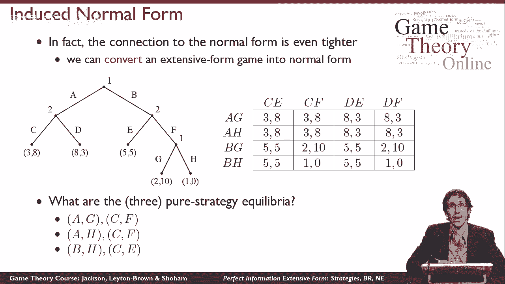

# 27：完善信息泛化形式策略、最佳反应与纳什均衡 🎮

在本节课中，我们将学习完善信息泛化形式博弈中的策略、最佳反应与纳什均衡。我们将从策略的定义开始，探讨如何计算纯策略的数量，并理解如何将泛化形式博弈转换为标准形式。最后，我们将分析具体博弈中的纳什均衡。

## 泛化形式博弈中的纯策略

在标准形式博弈中，纯策略通常指单一行动。然而，在泛化形式博弈中，玩家在多个决策节点上可能面临不同选择，因此策略需要更为复杂。

以下是计算纯策略数量的方法。在完善信息泛化形式博弈中，玩家的纯策略需完全指定该玩家将如何应对游戏中所有可能发生的情况。具体而言，它说明了在每个选择节点上采取什么行动。

一种直观的理解方式是，将泛化形式博弈中的纯策略视为给代理人的指令。假设玩家想让朋友代为游戏，她需要告诉朋友在每个可能遇到的选择节点上应采取的行动。因此，纯策略就是一组完整的代理指令。

用数学语言正式描述，给定完善信息泛化形式博弈中玩家的纯策略，是该玩家在所有选择节点上可用行动集的笛卡尔积。也就是说，如果我们查看玩家在每个选择节点上可用的行动集，纯策略的集合就是这些集合在所有决策节点上的叉积。

### 示例：计算纯策略

让我们通过一个比分享游戏更复杂的例子来具体说明。首先，请思考二号玩家的纯策略是什么。请注意，这里不是要求你计数，而是描述它们。

二号玩家有两个选择节点，因此其纯策略将是每个选择节点上行动集的叉积。例如，纯策略 `cf` 表示在第一个选择节点，玩家二将选择 `c`；在第二个选择节点，玩家二将选择 `f`。由于有两组行动，二号玩家总共有四种纯策略。

对于一号玩家，情况更有趣。一号玩家有两个选择节点，因此其纯策略同样是这两组行动的叉积。所以，一号玩家也有四种纯策略。有趣的是，如果一号玩家选择了某个行动，他可能永远不会到达第二个选择节点，但根据纯策略的定义，策略 `AG` 与策略 `AH` 被视为不同。因此，一号玩家仍有四种纯策略，而非三种。

## 混合策略、最佳反应与纳什均衡

一旦我们定义了纯策略，就可以沿用标准形式博弈中的其他概念定义。

在标准形式博弈中，混合策略定义为纯策略上的概率分布。在泛化形式博弈中，我们可以逐字使用相同的定义：混合策略是纯策略上的概率分布。唯一的变化是潜在的纯策略本身不同，它们现在是在游戏中每个选择节点上采取行动的策略。

同样，泛化形式博弈中的最佳反应是最大化预期效用的混合策略，给定其他参与者的混合策略组合。这与标准形式中的定义完全相同。

最后，纳什均衡是一个策略组合，其中每个参与者对其他参与者的策略都是最佳反应。这三个概念都与标准形式博弈一致。

## 泛化形式博弈到标准形式博弈的转换

我们可能想知道纳什均衡是否存在，以及如何推理。仅靠定义无法给出答案，但与标准形式博弈的紧密联系提供了更多工具。我们可以将泛化形式博弈转换为标准形式博弈，这有几个有趣的原因。首先，因为存在对应的标准形式博弈，我们可以利用已有的结果，例如均衡的存在性。其次，如果我们发现标准形式博弈更容易推理，可以构建它并进行分析，而不是直接处理泛化形式。

转换过程实际上非常简单。以下是一个泛化形式博弈及其对应的标准形式博弈。在标准形式中，我们列出每个参与者的所有纯策略作为行动。例如，一号玩家有四种纯策略，二号玩家也有四种纯策略。然后，我们通过模拟游戏来填写收益值。例如，如果一号玩家选择纯策略 `BG`，二号玩家选择纯策略 `CF`，我们按照游戏树进行模拟，到达特定节点，并记录收益值。整个表格都是这样填满的，这就是所谓的诱导标准形式。

关于诱导标准形式需要注意的一点是，它通常比泛化形式中的叶节点数量更多。例如，某些收益值可能在表格中重复出现，即使它们只对应游戏树中的一个叶节点。这不是意外，因为有多个纯策略组合可能导致树中的同一个叶节点。这可能带来问题，因为这种爆炸性增长是指数级的。虽然在这个小游戏中看起来还可以，但随着游戏树规模的增长，这种爆炸可能非常显著，使得在实践中难以写出诱导标准形式。

另一件重要的事情是，我们不能总是进行反向转换。如果你给我一个标准形式博弈，我能用它构建一个完善信息泛化形式博弈吗？答案通常是否定的。这种特殊结构对于具有重复收益的博弈很重要，而一般标准形式博弈不能转换为泛化形式博弈。一个直观的例子是“匹配便士”游戏，其中两个玩家同时行动非常重要。我们无法在一个完善信息游戏中表示两个玩家同时行动，因为其中一个玩家必须先行动，第二个玩家会看到这个行动。因此，直觉上，我们不应期望从“匹配便士”转换到完善信息游戏，因为某些东西会在转换中丢失。

## 完善信息博弈中的纯策略纳什均衡

有一个定理指出，每一个完善信息泛化形式博弈至少有一个纯策略纳什均衡。在一般标准形式博弈中，这不成立。例如，“匹配便士”就不存在纯策略均衡。直觉上，随机化常常起到迷惑对手的作用。在一个完善信息游戏中，真的没有理由这样做，因为如果一号玩家随机选择，二号玩家仍然可以看到一号玩家做了什么。因此，在游戏中随机化不会带来额外好处，这可以为以前没有的均衡创造机会。

## 示例：分析博弈中的纳什均衡

最后，让我们看一个具体游戏，并理性分析其中的三个纯策略均衡是什么。在这个小游戏中，直接列出纯策略并对其进行推理可能更为方便。因此，我们构建它的诱导标准形式，并直接对这个游戏中的纯策略进行推理。

三个纯策略均衡是：`AG CF`、`AH CF` 和 `BH CF`。让我们讨论如何验证这些是均衡。回忆一下，我们测试纯策略均衡的方式是，检查每个玩家是否有任何偏离能带来更大的效用。

以 `BH CF` 为例。如果一号玩家在这里偏离，你可以看到他没有其他行动可以采取，使其收益超过5。同样，如果二号玩家偏离，她也没有其他行动可以采取，使其收益超过5。在这两种情况下，可能存在平局，但这没关系，因为最佳反应只是说没有更好的选择。这证实了这是一个均衡。

相比之下，如果我们看 `BG CF`，这不是一个均衡。你可以通过检查每个参与者来看到它不平衡。二号玩家确实不会比10做得更好，所以 `CF` 是二号玩家对 `BG` 的最佳反应。但另一方面，一号玩家可以从 `BG` 偏离到 `AG`，获得3的回报而不是2。因此，`BG` 不是一号玩家对 `CF` 的最佳反应，所以这不是纳什均衡。

## 总结

在本节课中，我们一起学习了完善信息泛化形式博弈中的策略、最佳反应与纳什均衡。我们首先定义了纯策略，并探讨了如何计算其数量。接着，我们理解了混合策略、最佳反应和纳什均衡在泛化形式中的定义与标准形式一致。然后，我们学习了如何将泛化形式博弈转换为标准形式博弈，并注意到这种转换的局限性。最后，我们通过具体示例分析了博弈中的纯策略纳什均衡，并验证了均衡的存在性。这些概念为我们理解和分析更复杂的博弈场景奠定了基础。