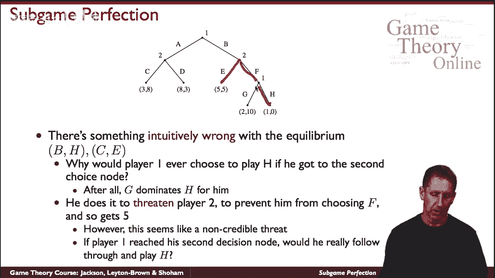
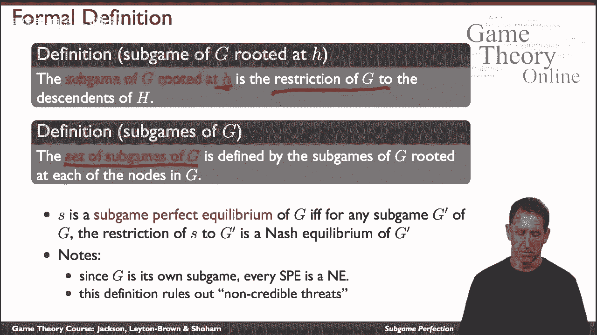
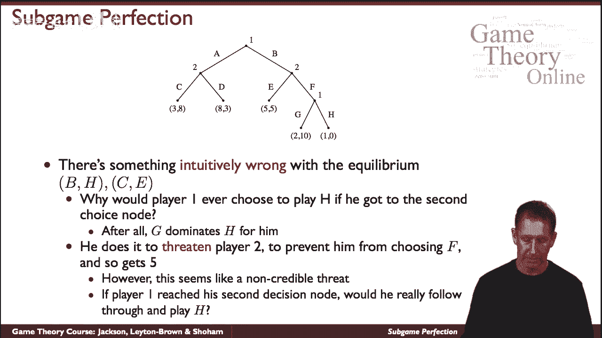
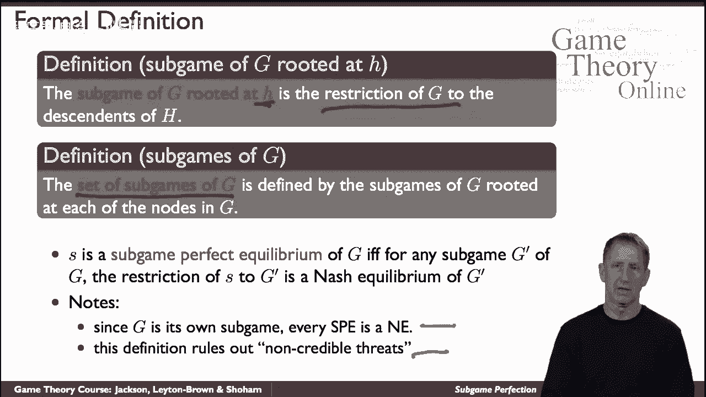
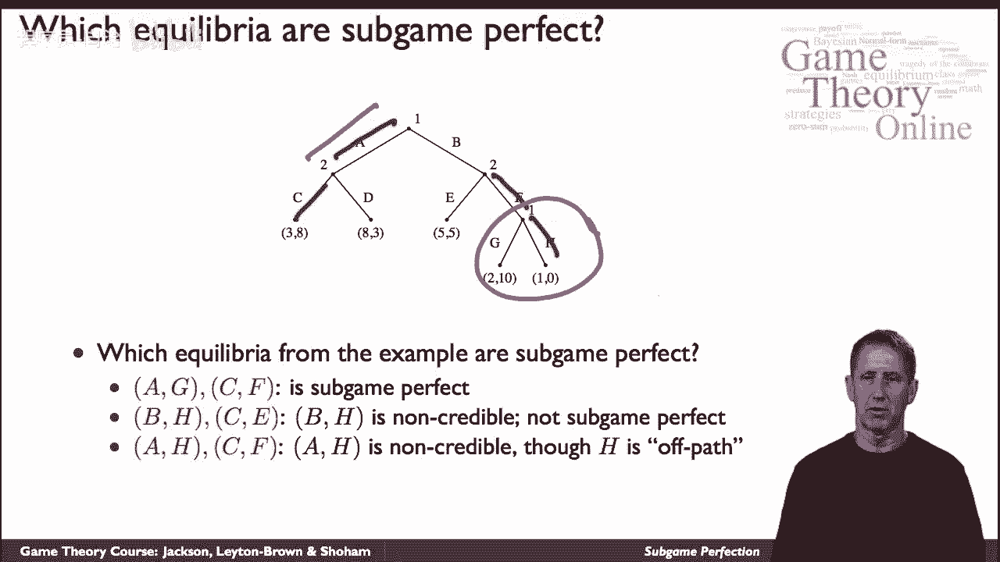

# 28：子博弈完美均衡 🎯

在本节课中，我们将学习博弈论中的一个重要概念——子博弈完美均衡。我们将从一个简单的例子开始，理解为什么某些纳什均衡会让人感到“不安”，并学习如何通过子博弈完美均衡的概念来排除那些包含“不可信威胁”的均衡。

## 重温纳什均衡

上一节我们介绍了纳什均衡的基本概念。本节中，我们来看看一个具体的广泛式博弈例子，它有许多纳什均衡。

考虑以下博弈树。其中一个纳什均衡策略组合是：**玩家1的策略为 (B, H)**，**玩家2的策略为 (C, F)**。在这个策略组合下，博弈的最终结果是玩家1选择B，玩家2选择C，两位玩家都获得收益5。

以下是验证其为纳什均衡的步骤：
*   **检查玩家2**：固定玩家1的策略，玩家2无法通过单方面偏离获利。如果玩家2从C改为F，不会改变最终路径（因为玩家1选了B）。如果玩家2从C改为D，其收益会从5降为0。
*   **检查玩家1**：固定玩家2的策略，玩家1也无法通过单方面偏离获利。如果玩家1从B改为A，其收益会从5降为3。如果玩家1将第二个选择从H改为G，考虑到玩家2会选择C，这不会改变最终结果。

因此，根据定义，这确实是一个纳什均衡。

## 不可信威胁的困扰

然而，这个均衡有些“令人不安”。让我们清理一下思路，重点关注玩家1的策略。

在策略组合 **(B, H)** 中，玩家1声称：如果博弈进行到第二个决策节点（即玩家2选择了D之后），他将选择H。但在这个节点上，选择H的收益是1，而选择G的收益是2。显然，选择G对玩家1更有利。

这个均衡之所以能成立，是因为玩家1用“我会选H”来威胁玩家2：“如果你敢选D（让我进入第二个节点），我就会选H，让你得到0收益。所以你最好选C，这样我们都能得5。” 然而，一旦玩家2真的选择了D，这个威胁就变得**不可信**，因为此时选择H并不符合玩家1自身的利益。

那么，我们如何在正式定义中捕捉并排除这种“不可信威胁”呢？这就引出了**子博弈完美均衡**的概念。

## 定义子博弈与子博弈完美均衡

在介绍子博弈完美均衡之前，我们首先需要明确什么是子博弈。

**子博弈** 的定义非常直观：从博弈树中的**任何一个决策节点**开始，包含该节点及其所有后续节点和收益信息所构成的**子树**，就是一个子博弈。整个博弈树本身也是一个子博弈。

以下是子博弈的集合：
*   所有根植于原博弈树中各个决策节点的子树。
*   特例：整个博弈树本身。

**子博弈完美均衡** 的定义是：一个策略组合是子博弈完美均衡，当且仅当它在**原博弈的每一个子博弈**上，都构成一个纳什均衡。

这个定义的核心思想是，均衡策略不仅在全局路径上稳定，在博弈可能进行到的**任何一个局部**（子博弈）也都是稳定的，从而排除了基于不可信威胁的均衡。

## 概念应用与辨析

让我们通过测试来加深对这个概念的理解。

**例1：策略组合 (B, H) 和 (C, F)**
我们之前已经分析过，这不是一个子博弈完美均衡。原因在于，在根植于玩家1第二个决策节点的子博弈（一个单人博弈）中，限制策略是H。但在这个简单的子博弈中，玩家1选择H并不是最优反应（选择G收益更高）。因此，它对子博弈的限制不是纳什均衡，所以原策略组合不是子博弈完美的。

**例2：策略组合 (A, G) 和 (C, F)**
这个策略组合导致的结果是玩家1选A，获得收益3。我们可以验证它是一个纳什均衡。更重要的是，我们需要检查它在所有子博弈上是否都是均衡。
*   在玩家1的第一个决策节点（整个博弈）：没有单方面有利可图的偏离。
*   在玩家2的决策节点（玩家1选B之后）：玩家2选C得10，偏离到D只得5，无利可图。
*   在玩家1的第二个决策节点（玩家2选D之后）：玩家1选G得2，偏离到H只得1，无利可图。
因此，**(A, G) 和 (C, F)** 是一个**子博弈完美纳什均衡**。

**例3：策略组合 (A, H) 和 (C, F)**
这个组合也是一个纳什均衡（玩家1选A得3）。但它同样不是子博弈完美的。原因与第一个例子类似：在玩家1的第二个决策节点构成的子博弈中，限制策略H并不是该子博弈的均衡（选择G更好）。即使这个节点在均衡路径上根本不会到达（off-path），子博弈完美性的要求也意味着，如果博弈“意外地”进行到那里，玩家也必须采取理性行动。因此，它排除了这种不可信的“偏离路径”威胁。

## 总结

本节课中，我们一起学习了**子博弈完美均衡**这一核心概念。

我们首先通过一个例子，指出了某些纳什均衡因包含“不可信威胁”而显得不合理。为了正式排除这类均衡，我们定义了**子博弈**（从任一决策节点开始的子树）和**子博弈完美均衡**（要求策略组合在每一个子博弈上都构成纳什均衡）。

关键点在于：
1.  子博弈完美均衡一定是纳什均衡，但纳什均衡不一定是子博弈完美的。
2.  子博弈完美性通过要求策略在**所有可能发生的局部博弈**中都具有稳定性，从而确保了均衡策略的“可信度”。
3.  寻找子博弈完美均衡的常用方法是**逆向归纳法**，即从最后的决策节点开始，逆向推导出每个子博弈中的最优选择。

掌握子博弈完美均衡，能帮助我们更精确地预测在动态博弈中，哪些结果是真正稳定且可信的。