# 30：子博弈完美例子：最后通牒博弈 💰

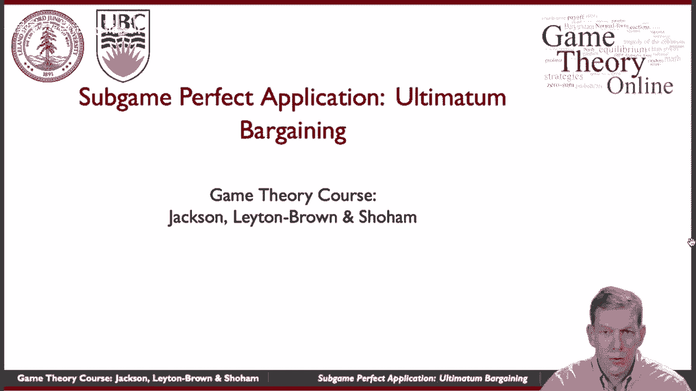

在本节课中，我们将学习子博弈完美均衡的一个经典应用案例：最后通牒博弈。我们将分析这个简单博弈的理论预测，并将其与实验数据进行对比，探讨理论与现实之间的差异。

---

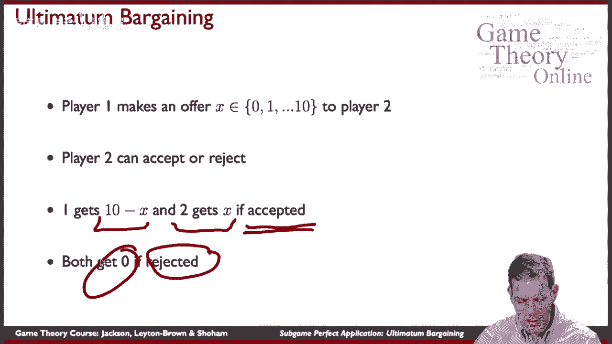

## 博弈设定与规则

上一节我们介绍了子博弈完美均衡的概念，本节中我们来看看它在“最后通牒博弈”这一具体例子中的应用。

最后通牒博弈可能是最简单的讨价还价游戏之一，它是一种“要么接受，要么离开”的提议。假设有10个单位的资源（例如10元钱）需要在两个玩家之间分配。玩家1首先行动，提出一个分配方案。具体来说，玩家1提议给玩家2 **x** 个单位（x为0到10之间的整数），自己则保留剩下的 **10 - x** 个单位。随后，玩家2可以接受或拒绝这个提议。

以下是博弈的收益规则：
*   如果玩家2 **接受** 提议 **x**，则玩家2获得 **x**，玩家1获得 **10 - x**。
*   如果玩家2 **拒绝** 提议 **x**，则双方都获得 **0**。

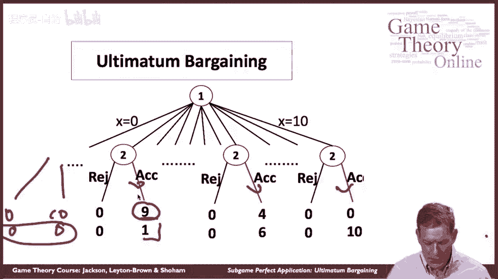

这个博弈的特点是只有一次出价机会，没有来回谈判的过程。

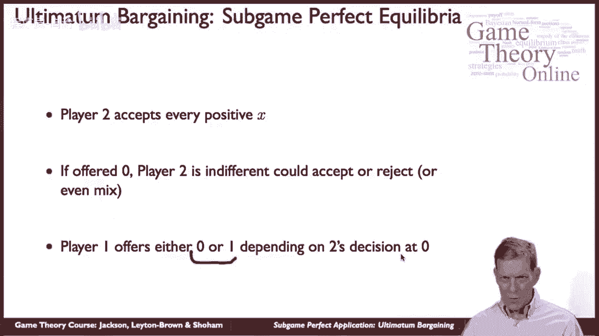

---

## 子博弈完美均衡分析

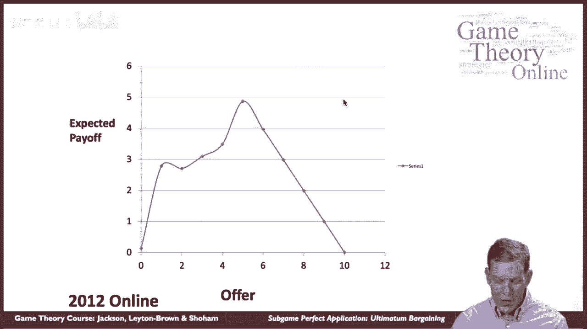

现在，我们使用逆向归纳法来求解这个博弈的子博弈完美均衡。

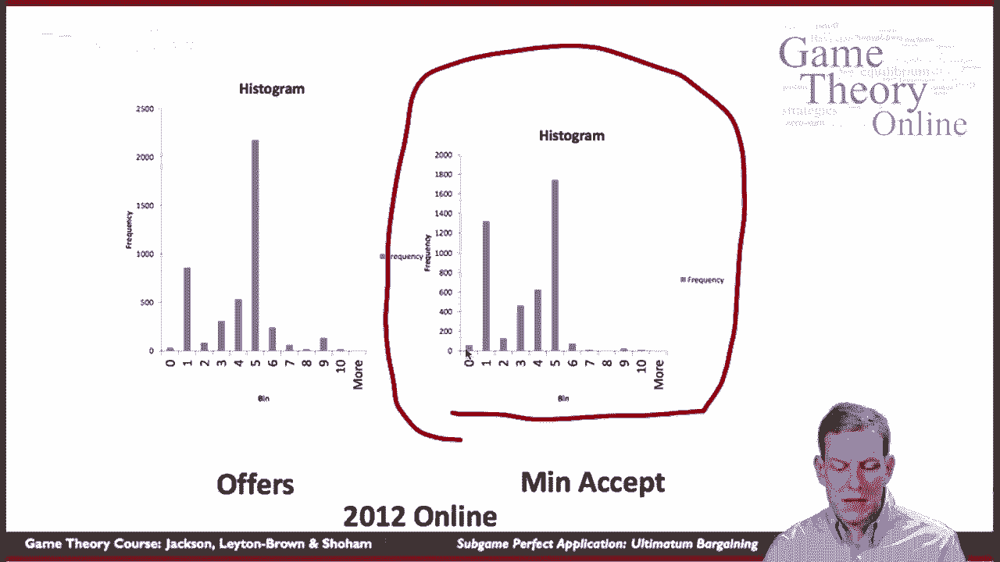

首先分析博弈树末端的玩家2。对于玩家2来说，接受任何 **x > 0** 的提议都能得到正的收益（x），而拒绝则得到0。因此，从理性角度出发，玩家2应该接受任何正的出价。当 **x = 0** 时，接受与拒绝的收益相同（均为0），此时玩家2可能接受，也可能拒绝。

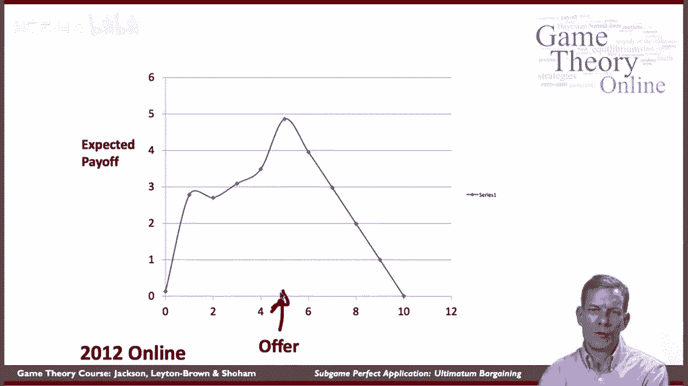

考虑到玩家2的上述策略，我们向前推回到玩家1的决策点。玩家1知道，任何 **x >= 1** 的提议都会被接受。那么，为了使自己的收益 **10 - x** 最大化，玩家1会给出尽可能小的正出价，即 **x = 1**。如果玩家1认为玩家2在 **x = 0** 时会接受，那么他也可以给出 **x = 0** 的提议。

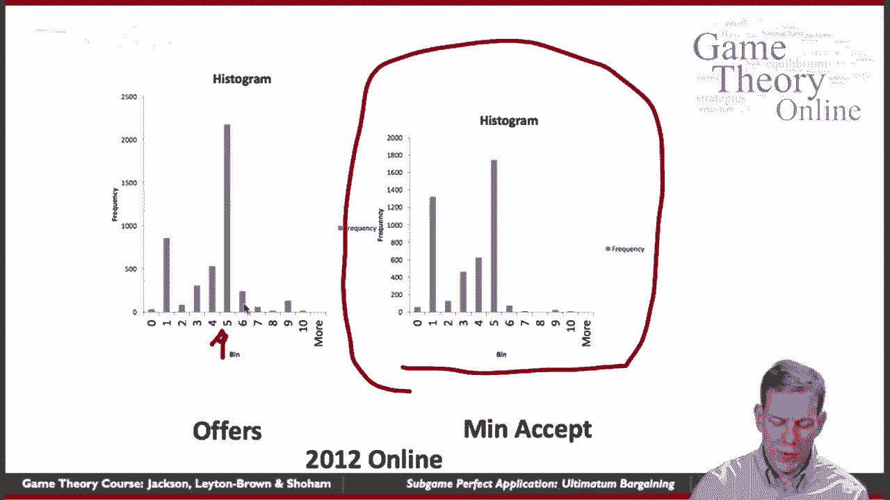

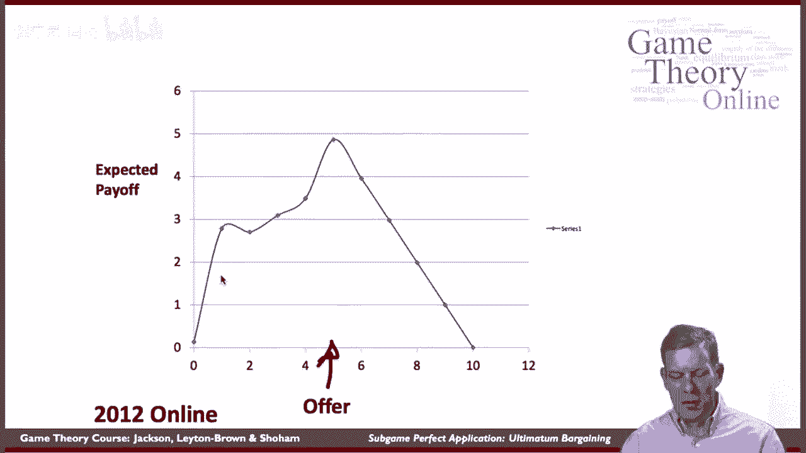

因此，子博弈完美均衡给出了一个清晰的预测：**玩家1将提议 x = 0 或 x = 1，而玩家2会接受任何 x >= 1 的提议。**

---

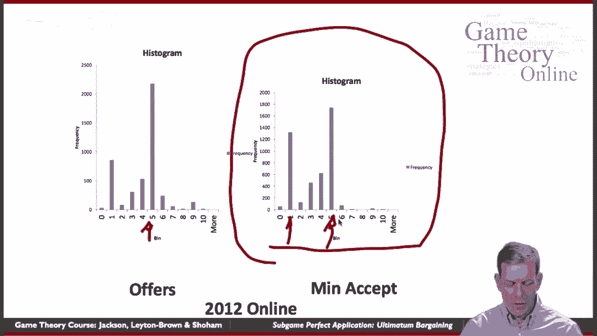

## 实验数据与理论预测的对比

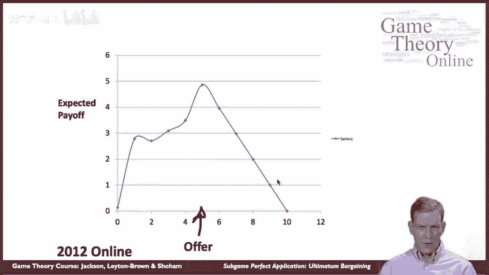

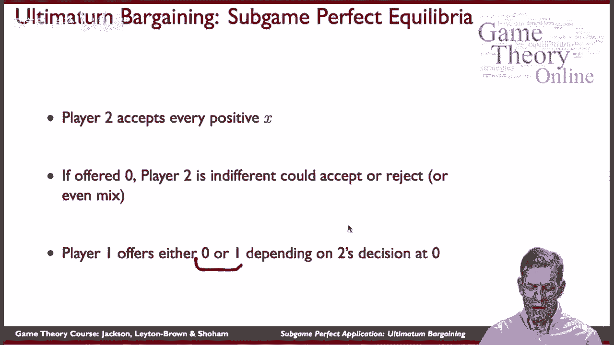

理论预测非常明确，但现实中人们会这样行动吗？让我们来看一些实验数据。

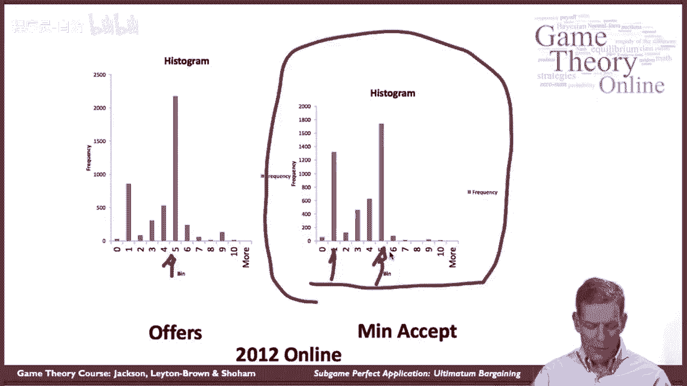

以下是某次在线实验中，玩家1提出的分配方案统计：

*   **提供5个单位**（即平分）：超过2000次（最频繁的提议）。
*   **提供1个单位**：略低于1000次。
*   其他数额的提议也有出现，但频率较低。

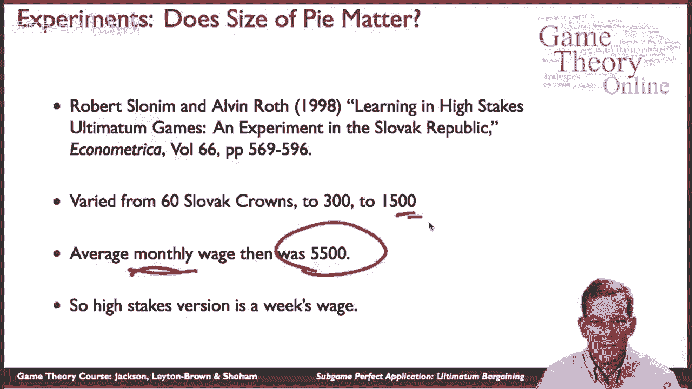

同时，实验也询问了玩家2“愿意接受的最低金额”。理论预测这个值应为0或1。但数据显示：

*   许多玩家将最低接受金额设定为5（即要求平分）。
*   接受阈值普遍高于理论预测值。

显然，实验数据与子博弈完美的预测并不一致。人们并没有表现出极端的“理性”行为，而是倾向于提出或要求更公平的分配。

---

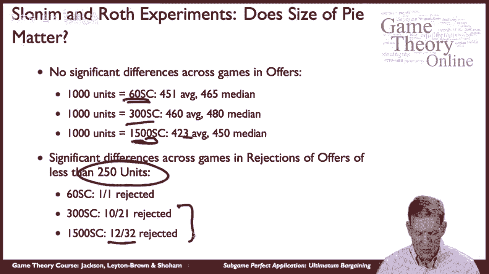

## 对观察现象的解释

为什么人们的行为会偏离理论预测？以下是几种可能的解释：

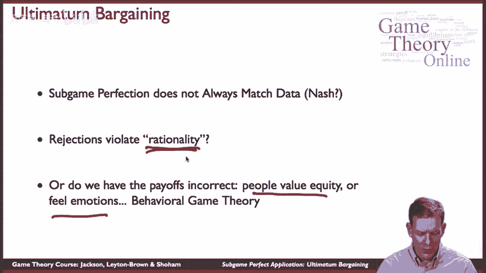

*   **公平偏好**：玩家的真实收益可能不仅仅是货币数量。他们可能厌恶不平等，当自己所得远少于对方时会感到不快。这改变了收益函数，使得“公平分配”（如5:5）带来了额外的效用。
*   **策略性考虑**：如果玩家1知道人群中存在大量要求公平的玩家2（即最低接受额为5），那么他提出 **x=5** 的提议反而是最稳妥、期望收益最高的选择。这与实验中观察到的“提供5”是最优策略的现象一致。
*   **赌注大小**：有人认为，实验中的货币激励不够大。如果涉及巨额资金，人们可能会变得更“理性”。然而，后续在斯洛伐克进行的高赌注实验（涉及相当于一周工资的金额）表明，虽然平均出价略有下降，但人们仍然不会压榨到 **x=1** 的程度，且不公平的出价仍会被频繁拒绝。

---

## 总结与延伸思考

本节课中我们一起学习了最后通牒博弈及其子博弈完美均衡分析。

我们从中学到：
1.  子博弈完美均衡基于序贯理性，筛选出了一部分更“可信”的纳什均衡。
2.  然而，其预测常常与真实的人类行为数据不符。
3.  这种差异促使了“行为博弈论”的发展，该领域通过扩展收益函数（纳入公平、互惠等社会偏好）或考虑认知偏差，来更好地解释和预测现实。

最后通牒博弈揭示了博弈论中的一个核心议题：经典理论假设的“理性”是狭义的，而真实世界中的决策者有着复杂的动机。子博弈完美是一个强大的分析工具，但应用时必须考虑其假设是否符合所研究的现实情境。

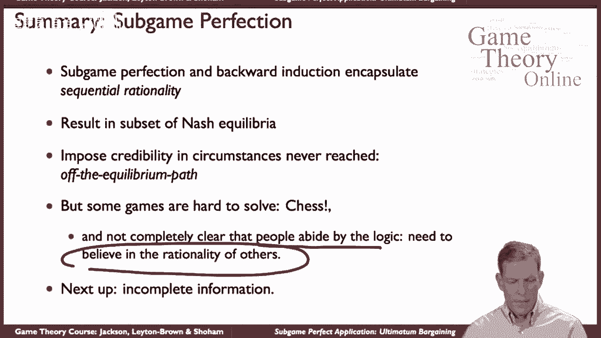

在接下来的课程中，我们将开始考虑不完全信息博弈。