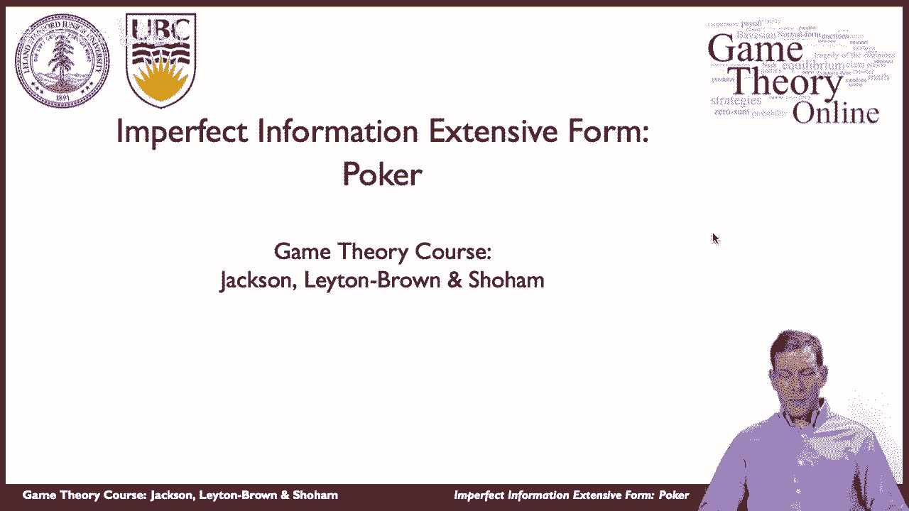
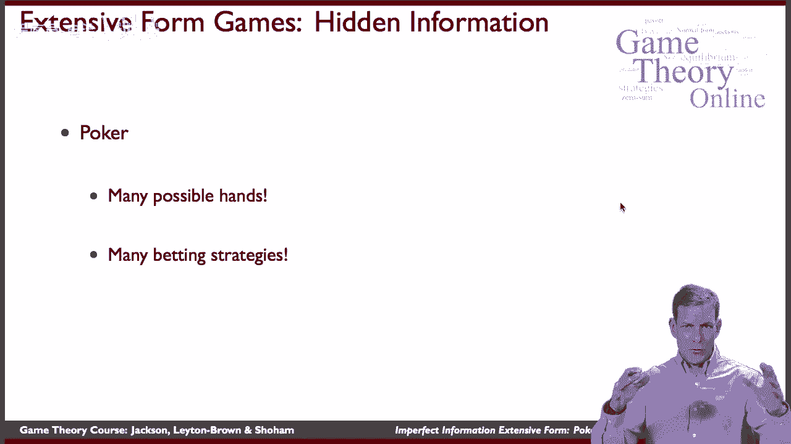
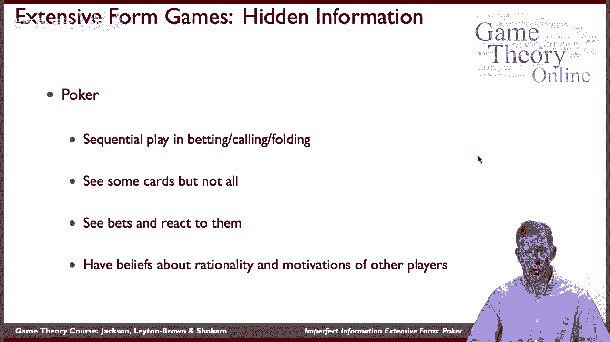
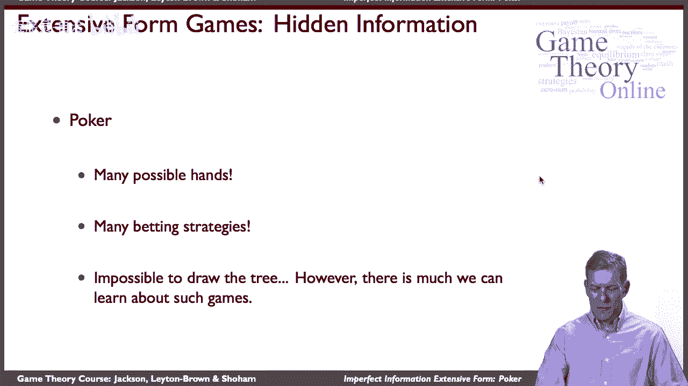

# 31：博弈论 - 不完美信息扩展形式：扑克游戏 🃏

在本节课中，我们将要学习**不完美信息扩展形式博弈**。我们将以扑克游戏为例，探讨在玩家行动有先后顺序，且彼此对对方的收益、策略或“手牌”等信息不完全了解的情况下，如何分析和表示这类博弈。

---

## 概述

上一节我们介绍了扩展形式博弈的基本概念。本节中，我们来看看当博弈中存在**不完美信息**时，情况会变得如何复杂。我们将以扑克游戏作为核心案例，因为它完美融合了顺序行动、信息不对称和策略推断等关键要素。

## 扑克游戏的特征

扑克是一种非常流行且古老的游戏。它的一个关键方面在于其**顺序性**：一名玩家先做出下注决策，其他玩家必须对此做出反应（如跟注、加注或弃牌）。同时，玩家只能看到部分信息（如自己的牌和公共牌），而无法得知对手的全部手牌强度。

因此，玩家必须根据对手的行动（如下注行为）来推断其可能持有的牌型以及其策略。这涉及到对对手动机、理性程度及其潜在收益的信念判断。

## 博弈树的复杂性

当我们尝试用博弈树来表示扑克时，会遇到巨大的复杂性。因为可能的手牌组合非常多，相应的策略分支（如下注、加注、弃牌）会使整棵博弈树变得极其庞大和复杂。

在屏幕上完整绘制这棵树几乎是不可能的。尽管如此，我们仍然可以通过分析这类博弈，来学习如何表示和理解**不完美信息扩展形式博弈**，并研究其中出现的策略类型。

## 超越扑克：更广泛的应用

扑克是一种相当复杂的游戏。类似的高风险博弈也存在于其他领域。

例如，一个国家考虑是否入侵另一个国家时，就面临着一场不完美信息博弈。入侵方可能不完全了解对方的真实军事实力、国民战斗意志或政治反应。在这种情况下，一方先行动（入侵），必须预期对方的反应（如投降或战斗）；而被入侵方则必须根据入侵行动来推断对方的实力和意图。

这些情境都具有与扑克相似的特征：顺序行动、信息不对称和策略性互动。因此，开发一套表示和分析这类博弈的方法，是我们接下来的方向。

## 核心概念与表示

为了分析这类博弈，我们需要扩展之前的博弈树表示法，引入**信息集**的概念。在不完美信息博弈中，一个信息集包含了玩家在做出决策时无法区分的所有可能节点。

例如在扑克中，当轮到玩家A行动时，他可能处于对手持有“强牌”或“弱牌”的多种游戏状态下，但由于信息不完美，他无法区分具体是哪一个，这些状态就构成了他的一个信息集。

我们可以用以下方式简要描述一个不完美信息扩展式博弈：

*   **玩家集合**: `N = {1, 2, ..., n}`
*   **行动顺序**: 用博弈树表示。
*   **信息集**: 对于每个玩家i，将其决策节点划分成不同的集合 `H_i`，同一集合内的节点玩家i无法区分。
*   **收益函数**: 在博弈树终端节点，为每位玩家指定收益。

## 总结

本节课中，我们一起学习了**不完美信息扩展形式博弈**。我们以扑克游戏为例，探讨了其顺序行动、信息不对称和策略推断的核心特征。我们认识到直接绘制完整的博弈树非常困难，但通过引入**信息集**等概念，可以为分析此类复杂博弈提供框架。最后，我们看到这种分析框架不仅适用于扑克，也能应用于国际冲突等更广泛的高风险策略互动中。下一节，我们将深入探讨如何形式化地表示和分析信息集。