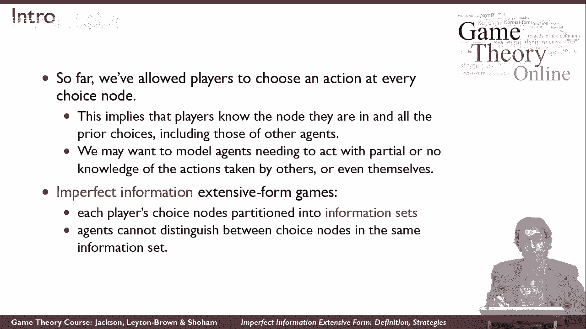
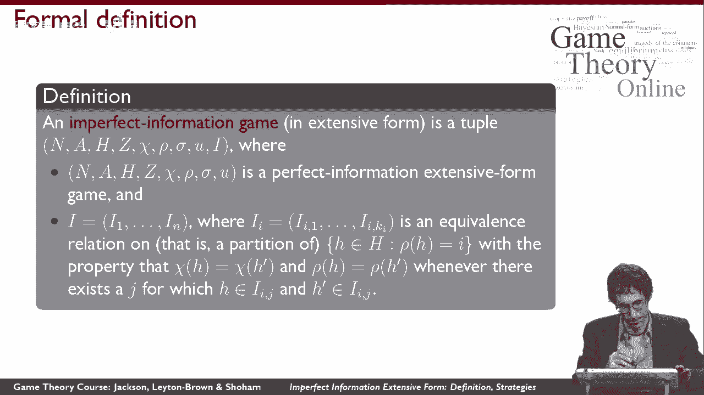
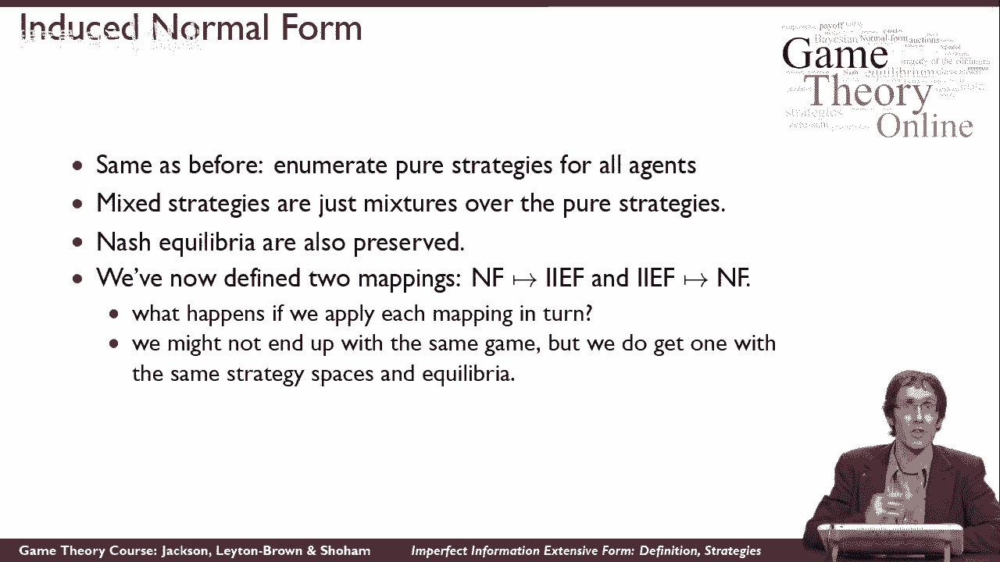

# 32：不完美信息扩展形式的相关定义与策略 🎲

在本节课中，我们将学习如何正式定义**不完美信息扩展形式博弈**，并探讨如何在这种博弈中推理策略。我们将从回顾完美信息博弈开始，逐步引入新的概念，以描述玩家无法完全观察到对手行动的情况。

---

## 概述 📋

在完美信息的扩展形式博弈中，每个玩家在游戏的每个决策节点上行动，并且完全清楚之前发生的所有行动历史。然而，许多现实情况（如“战舰”游戏）中，玩家无法观察到对手的某些行动。为了模拟这种更丰富的情况，我们需要扩展博弈的定义，引入**信息集**的概念，以表示玩家无法区分的决策节点集合。

---

## 从完美信息到不完美信息 🔄

上一节我们介绍了完美信息扩展形式博弈。本节中，我们来看看如何将其扩展为**不完美信息扩展形式博弈**。

其核心方法是：我们保留完美信息博弈的原有定义，但增加一个关键成分——**等价类**。对于给定的玩家，我们将一些决策节点归入同一个等价类。这意味着，当轮到该玩家行动时，他只知道自己在某个等价类中，但无法确定具体是哪一个决策节点。

### 等价类的形式化定义

正式定义一个不完美信息扩展形式博弈，我们从一个完美信息扩展形式博弈开始，然后添加一个元素 **I**。**I** 是一组等价类的集合，每个玩家对应一组。

*   对于玩家 *i*，其等价类集合为 **I_i = {I_i1, I_i2, ..., I_ik}**。
*   每个等价类 **I_ij** 包含一个或多个决策节点，这些节点是玩家 *i* 无法区分的。

如果每个等价类都只包含一个节点，我们就回到了完美信息的情况。如果任何等价类包含多个节点，我们就有了一个玩家信息不完全的博弈。

为了使定义合理，我们需要对等价类施加两个限制：

以下是等价类必须满足的条件：
1.  **同一玩家**：同一个等价类中的所有节点必须属于同一个玩家。
2.  **相同行动集**：同一个等价类中的所有节点必须具有相同的可用行动集合。

---

## 示例与纯策略定义 🧩

让我们通过一个示例游戏来理解等价类和策略定义。

在这个游戏中：
*   玩家1首先行动（选择L或R）。
*   如果玩家1选择R，游戏结束。
*   如果玩家1选择L，则轮到玩家2行动（选择A或B）。
*   之后，玩家1再次行动，但他**无法观察**玩家2刚才的选择。因此，玩家1无法区分自己是在上方的节点还是下方的节点。我们用虚线将这两个节点连接，表示它们属于玩家1的同一个等价类。

那么，如何为这个游戏中的玩家定义**纯策略**呢？

在完美信息博弈中，纯策略是玩家在每个决策点上行动的笛卡尔积。但在不完美信息博弈中，玩家在同一个等价类中的不同节点上必须采取相同的行动。

因此，纯策略的定义修改为：
**玩家 *i* 的纯策略，是其每个不同等价类中可用行动集的笛卡尔积。**

对于本例中的玩家1：
*   他有两个等价类：第一个是根节点（单独一类），第二个是末端的两个节点（同一类）。
*   在第一个等价类中，他可选择 `{L, R}`。
*   在第二个等价类中，他可选择 `{l, r}`（注意，他在这两个节点上必须选相同的行动）。
*   因此，玩家1的纯策略是 `{L, R} × {l, r} = {(L,l), (L,r), (R,l), (R,r)}`，共4种，而不是完美信息情况下可能的8种。

---

## 表示范式博弈与诱导范式 🔀

不完美信息扩展形式是一种更强大的表示方法。例如，我们可以用它来表示任何**范式博弈**（即标准式、矩阵式博弈），而这在完美信息扩展形式中是无法做到的。

以下是如何用不完美信息扩展形式表示“囚徒困境”博弈：
1.  玩家1先决定合作(C)或背叛(D)。
2.  然后玩家2决定合作(C)或背叛(D)。
3.  关键点在于，玩家2行动时，**无法区分**玩家1选择了C还是D（即他的两个决策节点属于同一个等价类）。
4.  双方行动后，根据结果给出收益，这些收益与矩阵中的收益一致。

反过来，我们也可以从一个不完美信息扩展形式博弈出发，构造其**诱导范式博弈**。方法与从完美信息博弈构造范式完全相同：
1.  列出每个玩家的所有纯策略（基于其等价类定义）。
2.  将玩家1的策略作为行，玩家2的策略作为列，形成一个矩阵。
3.  对于矩阵中的每个单元格（即每一对纯策略组合），模拟博弈进程，计算出对应的收益并填入矩阵。

一旦得到这个诱导范式博弈，所有已有的概念——**混合策略**、**纳什均衡**、**最佳对策**——都可以直接应用。例如，根据纳什定理，由于诱导范式博弈是有限的，因此**任何有限的不完美信息扩展形式博弈都至少存在一个纳什均衡**。

---

## 变换的复合与战略等价性 ⚖️

最后，你可能会想：如果我将一个不完美信息扩展形式博弈先变成范式，再变回扩展形式，会得到原来的博弈吗？

答案是否定的。原始的扩展形式博弈可能具有复杂的树形结构和交错行动顺序，而经过“扩展形式→范式→扩展形式”的变换后，得到的将是一个只有两个层级（先一个玩家行动，后另一个玩家在一个大的等价类中行动）的简单扩展形式博弈。

尽管这两种扩展形式博弈在**显式的时间顺序**上看起来不同，但它们是**战略等价的**。它们拥有：
*   相同的玩家纯策略集合。
*   相同的收益函数。
*   因此，拥有相同的纳什均衡集。

---

## 总结 🎯

本节课中，我们一起学习了不完美信息扩展形式博弈的核心内容：
1.  **定义**：通过引入**等价类（信息集）** 来形式化描述玩家无法区分的决策节点，并施加“同一玩家”和“相同行动集”的限制。
2.  **策略**：在不完美信息下，玩家的纯策略是其**每个信息集上行动的笛卡尔积**，而非每个节点。
3.  **与范式博弈的关系**：不完美信息扩展形式可以表示任何范式博弈，并且可以通过构造**诱导范式**来应用纳什均衡等分析工具。
4.  **战略等价性**：博弈的不同表示形式（如复杂的扩展形式与简单的扩展形式）可能战略等价，拥有相同的均衡结果。

理解不完美信息是分析扑克、谈判、军事冲突等现实世界交互情境的关键一步。