# 33：混合策略与行为策略 🎲

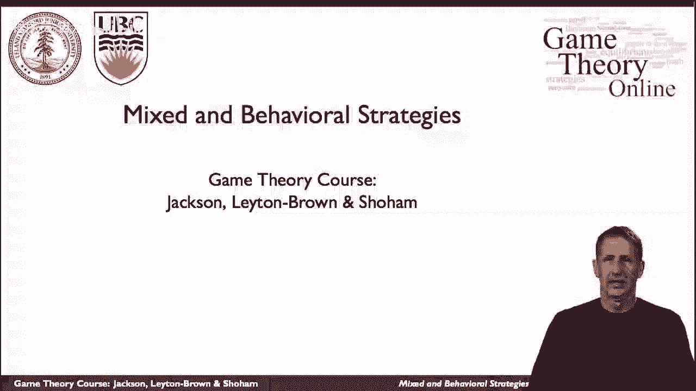

在本节课中，我们将学习博弈论中两种重要的策略概念：混合策略与行为策略。我们将探讨它们的定义、区别，以及在不完全信息博弈和完美回忆条件下的关系。

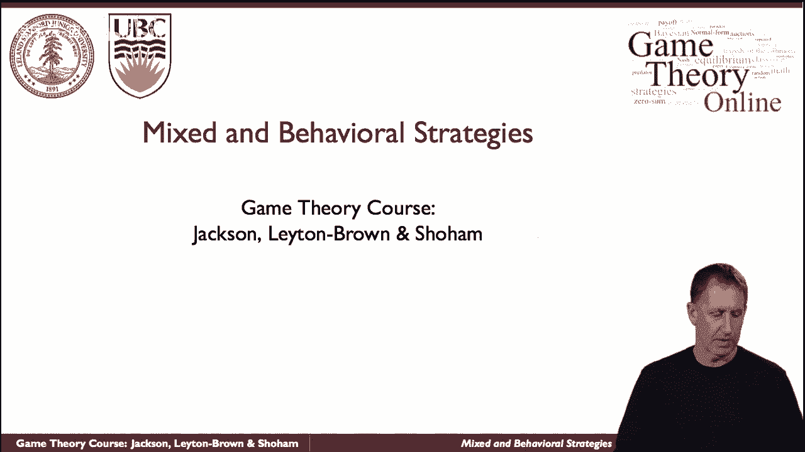

---

## 概述

在具有不完全信息的扩展式博弈中，我们可以区分行为策略和混合策略。它们定义方式不同，但在某些条件下可以相互模仿。本节我们将通过具体例子来理解这两种策略。

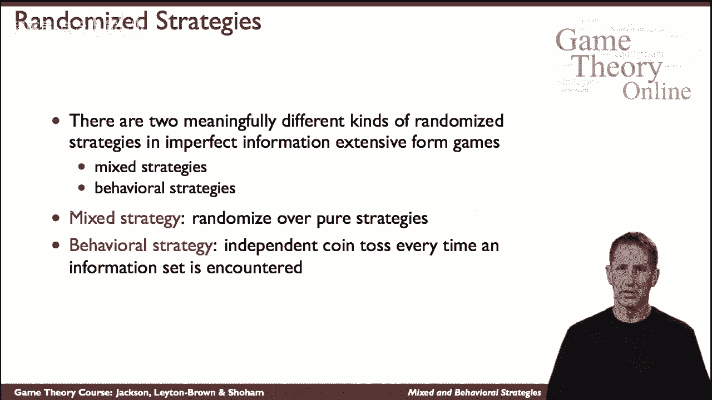

---

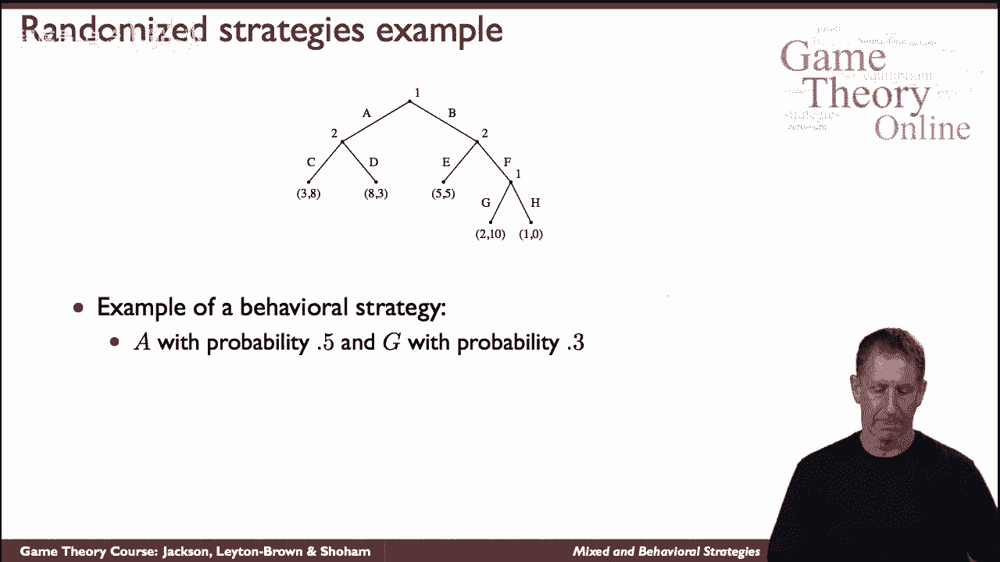

## 混合策略与行为策略的定义

上一节我们介绍了不完全信息博弈的背景。本节中，我们来看看混合策略和行为策略的具体含义。

混合策略是以一种完全搁置的方式定义的。我们首先有一个纯策略的概念，即每个参与者在他们所有的信息集中选择一个确定的行动。混合策略则是对这种纯策略集合的一种概率分布。

一个行为策略则略有不同。它并不从纯策略出发，而是规定在每个信息集中，参与者应如何进行随机化选择。这看起来可能与混合策略类似，但本质上并不相同。

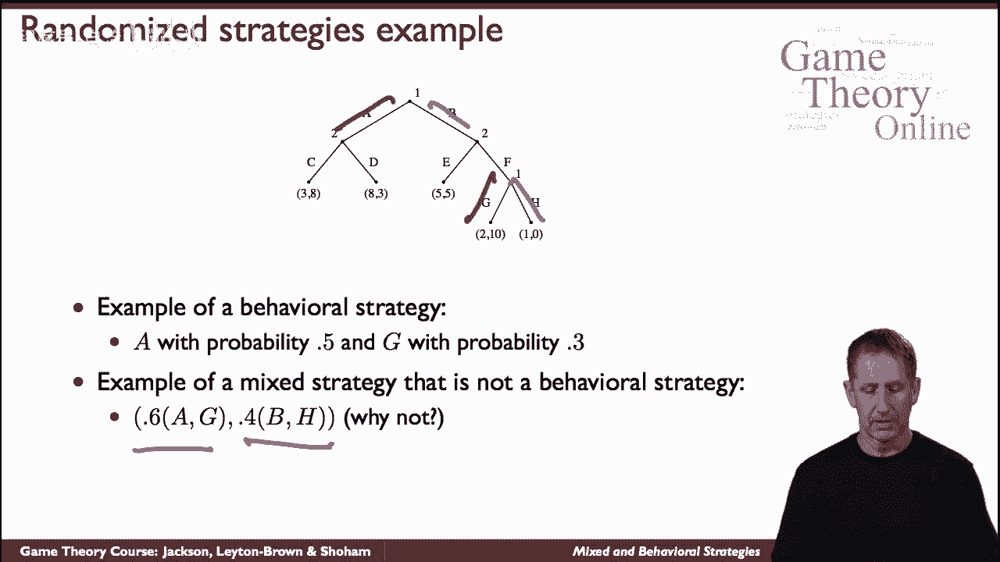

让我们看一个例子。

---

## 一个具体例子

考虑以下博弈树。这里有一个行为策略的例子：在第一个决策点以0.5的概率随机选择，在第二个决策点以0.3的概率随机选择。这意味着参与者会独立地在每个点进行随机化。

现在，让我们看看两个纯策略，例如策略A和策略G。一个混合策略可能是这两个纯策略的凸组合，比如以0.6的概率选择A，以0.4的概率选择G。观察这个例子，你可能会认为一种策略可以模拟另一种策略。

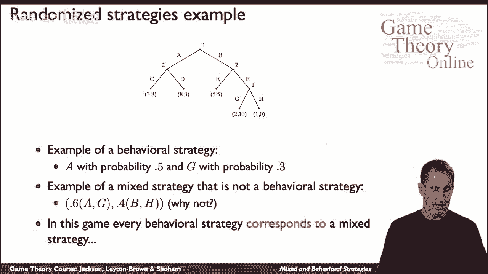

事实上，你是对的。在一个非常著名的结果——库恩1953年的论文中表明，在所有具有**完全信息**的博弈中，混合策略和行为策略可以相互模仿，并且在均衡中产生相同的收益。也就是说，混合策略均衡与行为策略均衡是结果等价的。

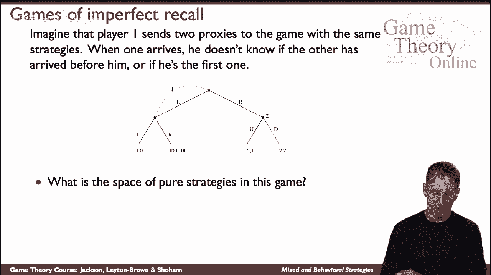

---

## 完美回忆的条件

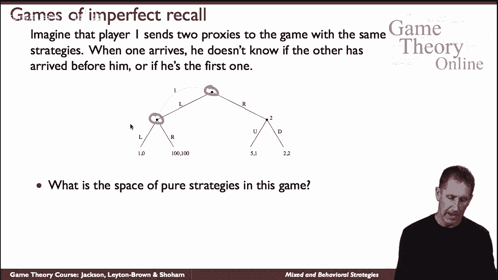

这不仅适用于完全信息博弈，对于**不完全信息**的博弈，只要这些博弈具有所谓的**完美回忆**，上述结论同样成立。

不完全信息博弈具有完美回忆，直观上是指参与者在博弈的每个阶段，都完全记得他们之前的所有经历。这意味着他们在每个信息集中，都知道自己之前访问过的所有信息以及所采取的所有行动。

以下是一个没有完美回忆的博弈例子。

考虑下面的游戏，这里有两个节点（例如节点A和节点B），参与者无法区分它们。你可以将其想象为派两个代理代表你进行游戏，但这两个代理都不知道自己具体处于哪个位置。尤其是，其他参与者所做的选择，他们也可能不完全知晓。

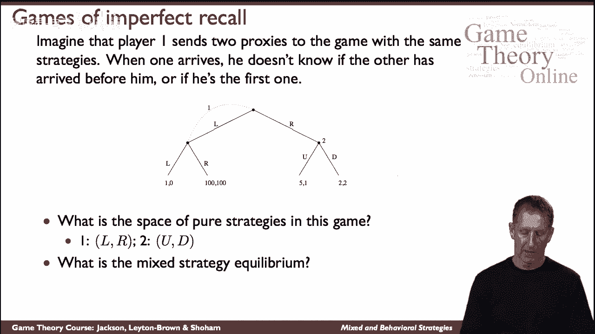

---

## 无完美回忆博弈的分析

首先，在这种情况下，参与者1的纯策略很简单：在无法区分的信息集中，要么选择行动L，要么选择行动R。参与者2也有两种纯策略。

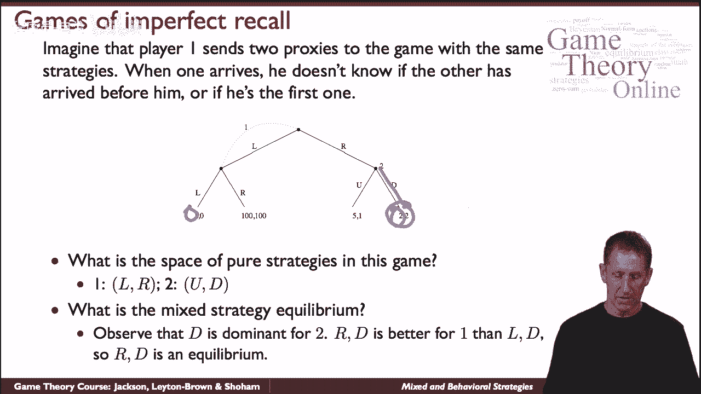

在这个博弈中，什么是混合策略均衡？这相当容易分析。

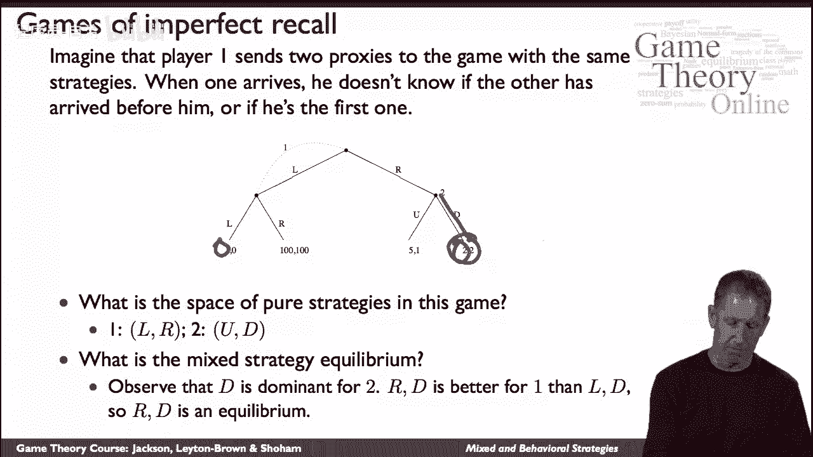

我们首先观察到参与者2有一个占优策略：选择行动D。因为无论另一个参与者做什么，选择D对参与者2来说总是更好或至少不差。因此，参与者1对参与者2选择D的最佳反应是选择R，因为这样他们会得到2的回报，而不是选择L得到1。所以，这个博弈的均衡是（R, D）。

但这里存在一个讽刺或令人不安的事实：存在一个非常高的回报（例如100），在混合策略下实际上是无法获得的。这暗示了纯策略与行为策略之间可能存在的差异。

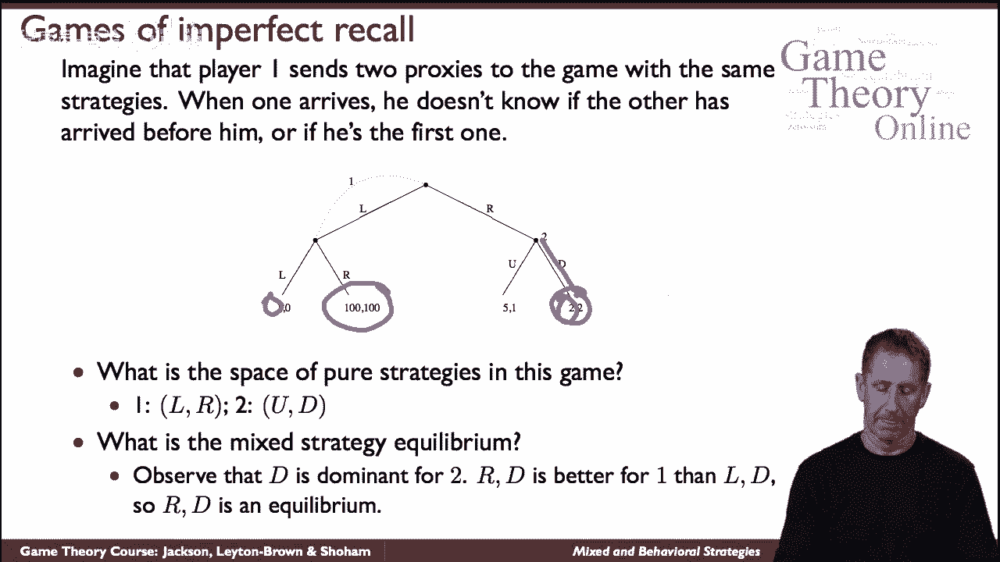

---

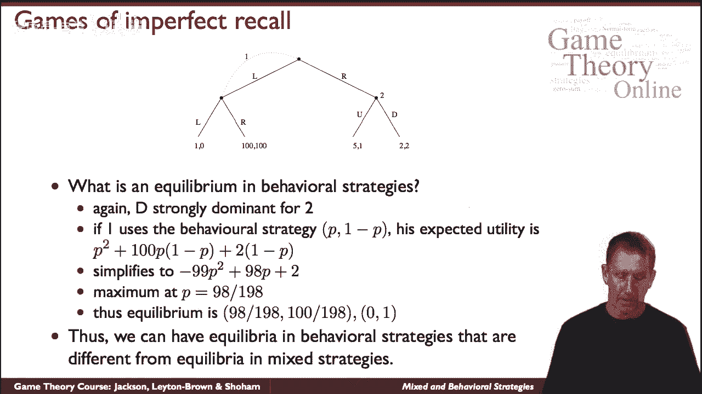

## 行为策略均衡分析

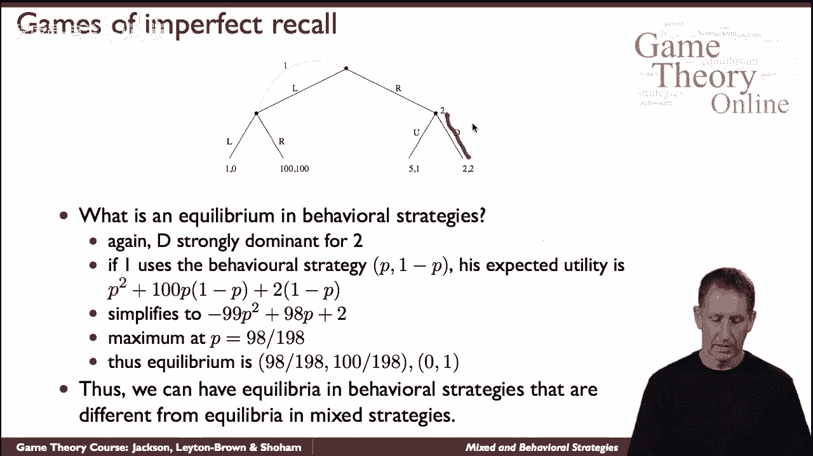

那么，行为策略的均衡是什么样子的呢？

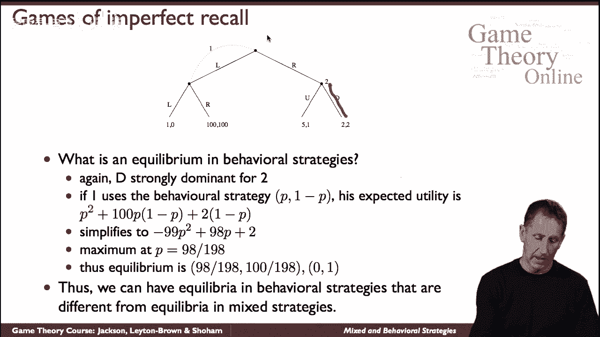

首先注意，参与者2的情况没有变化，他们仍然有一个占优策略D。

假设参与者2选择D，参与者1有机会在其信息集中重新随机化。每次他们发现自己在这个信息集中，都可以独立地随机选择。

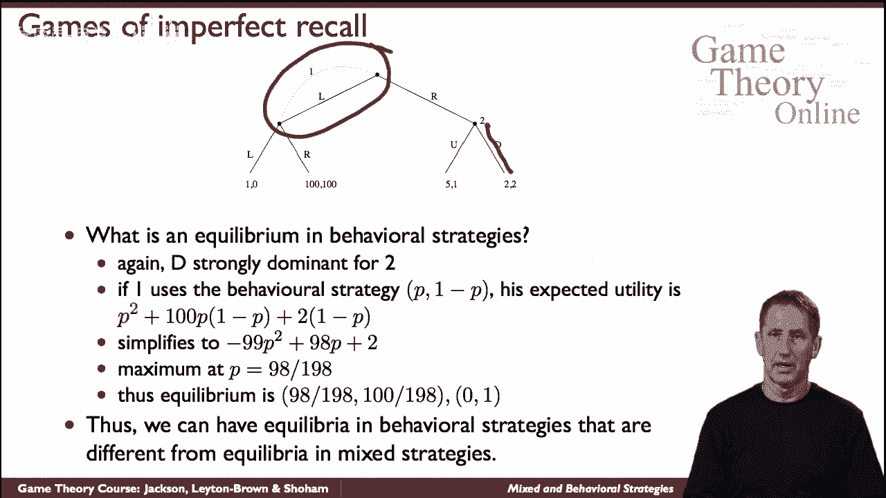

假设参与者1以概率 `p` 选择向左（L），以概率 `1-p` 选择向右（R）。同时假设参与者2选择D。

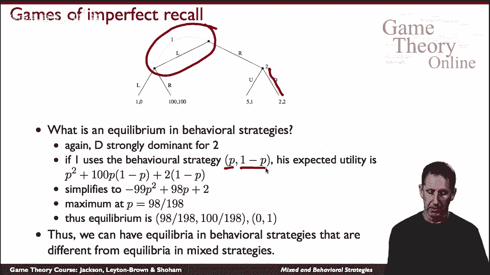

以下是参与者1的期望收益计算：

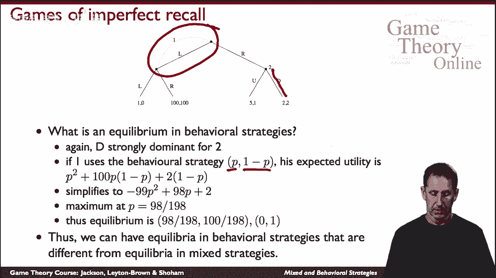

*   以概率 `p` 选择L，然后必然遇到选择D的参与者2，最终获得收益1。所以贡献为 `p * 1`。
*   以概率 `1-p` 选择R。此时：
    *   以概率 `p`，参与者1实际上处于左边路径但选择了R（这对应于博弈树中走到另一个节点的情况），最终获得收益100。贡献为 `(1-p) * p * 100`。
    *   以概率 `1-p`，参与者1处于右边路径并选择了R，最终获得收益2。贡献为 `(1-p) * (1-p) * 2`。

因此，参与者1的总期望收益 `U(p)` 为：
`U(p) = p + 100p(1-p) + 2(1-p)^2`

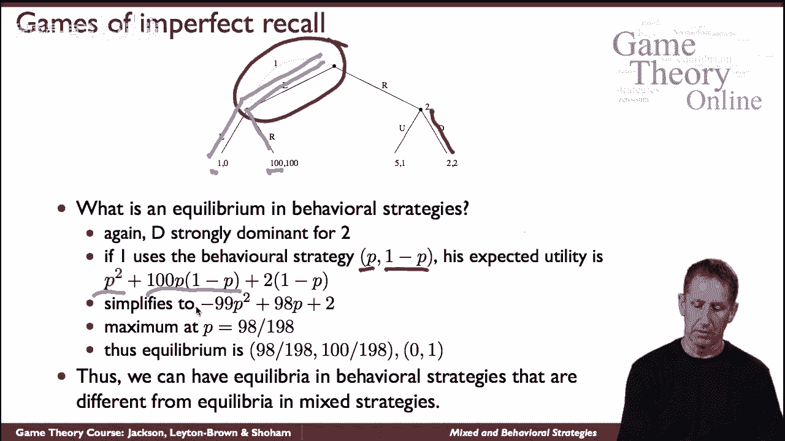

我们可以简化这个表达式并求其最大值。通过计算发现，当概率 `p` 略低于0.5（即略低于一半的概率选择L，略高于一半的概率选择R）时，参与者1的期望收益最大化。

所以我们最终得到的行为策略均衡是：参与者1以最优概率 `p*` 随机化选择L和R，而参与者2选择D。我们可以看到，当博弈**不具有完美回忆**时，行为策略均衡与混合策略均衡是不同的，并且可能实现不同的收益。

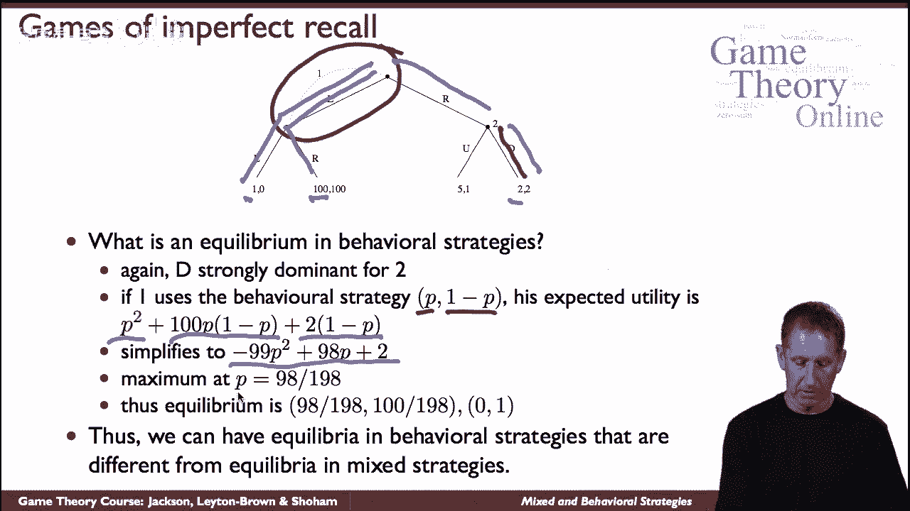

---

## 总结

本节课中我们一起学习了：
1.  **混合策略**是对纯策略集合的概率分布。
2.  **行为策略**是在每个信息集独立进行随机化的规则。
3.  在具有**完全信息**或**不完全信息但具有完美回忆**的博弈中，混合策略与行为策略在均衡意义上是结果等价的。
4.  在**没有完美回忆**的博弈中，两种策略概念会产生不同的均衡结果，行为策略有时能实现混合策略无法达到的收益。我们通过一个具体例子演示了这种差异。

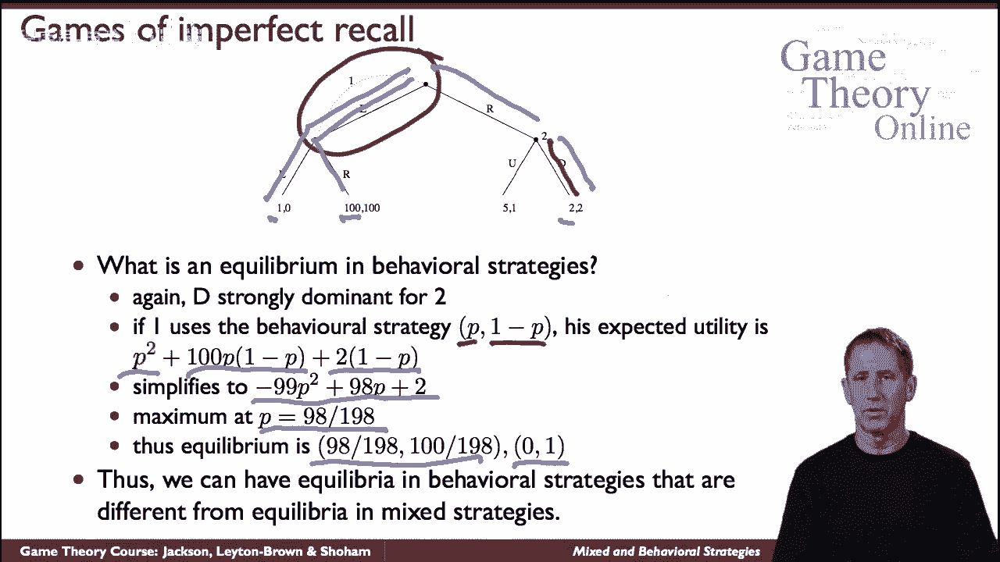

理解这两种策略的异同，对于分析复杂的不完全信息动态博弈至关重要。