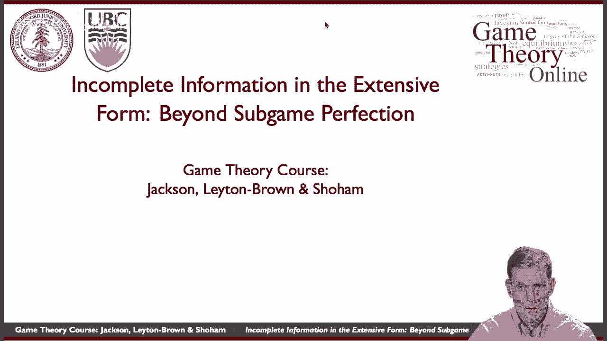
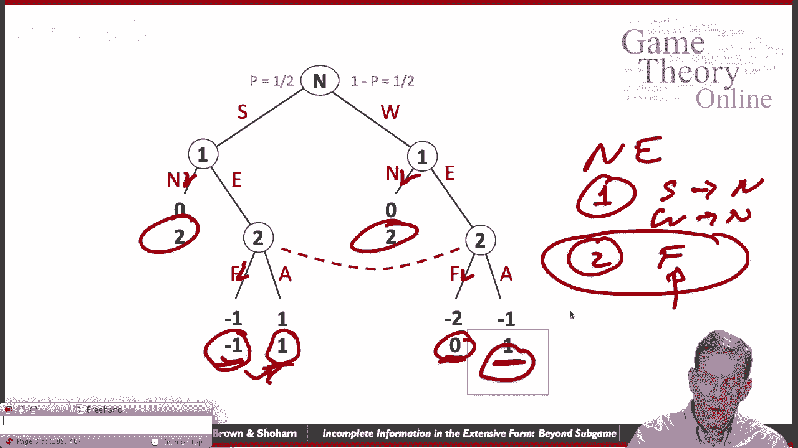
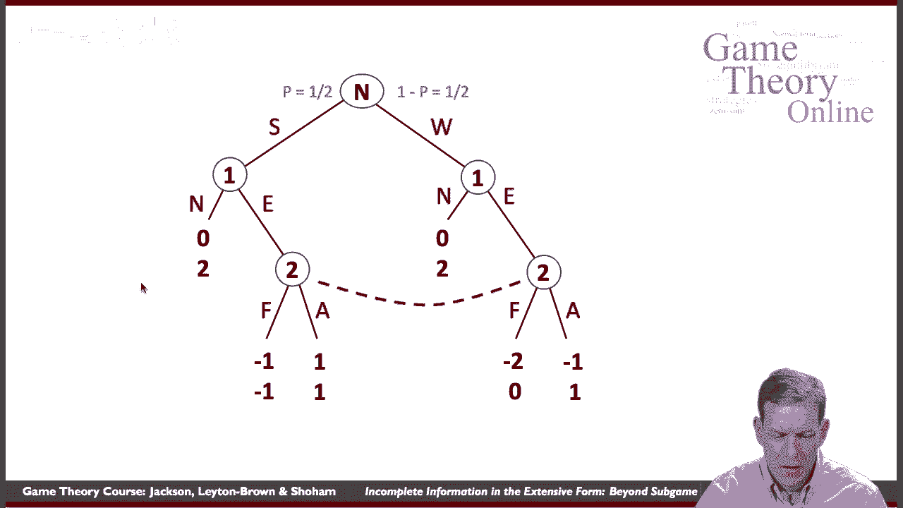
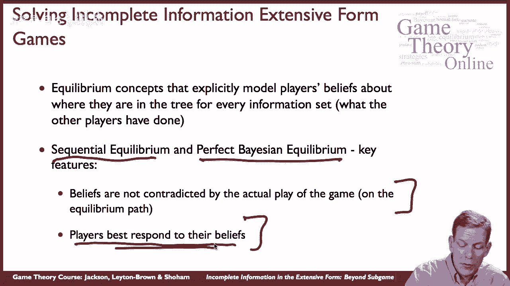
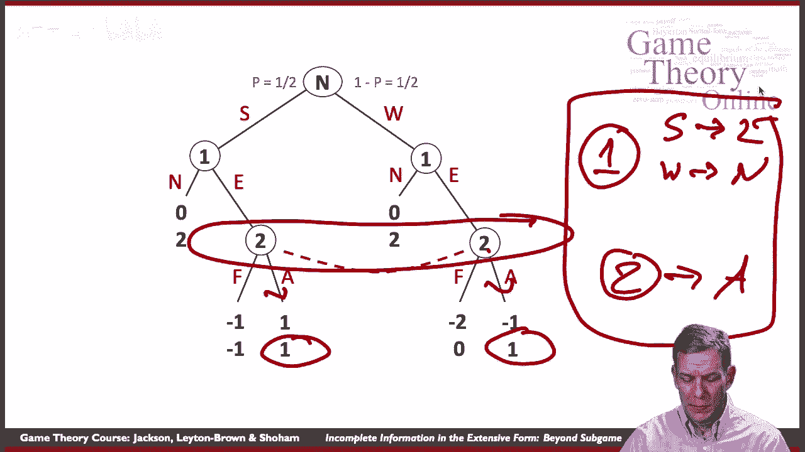
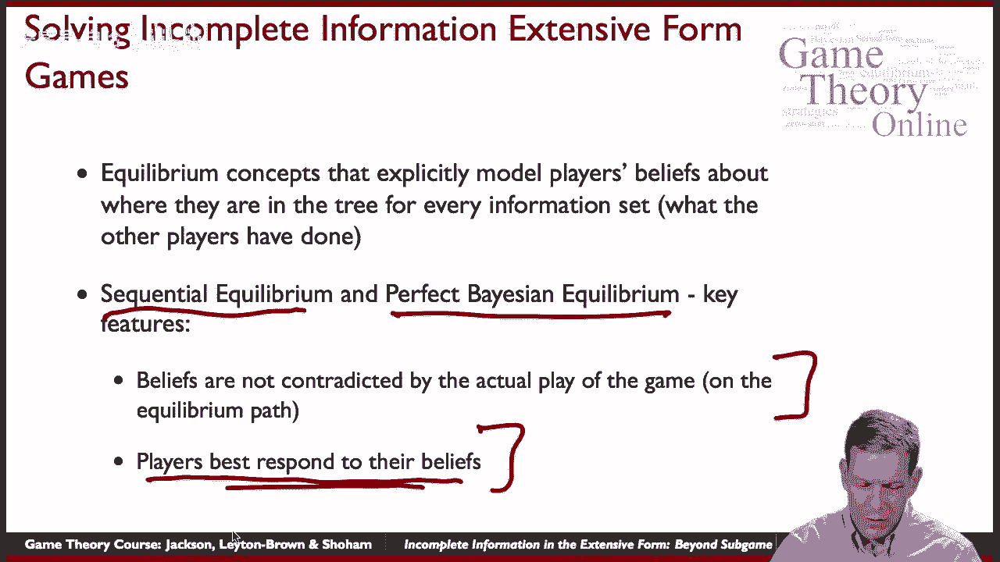
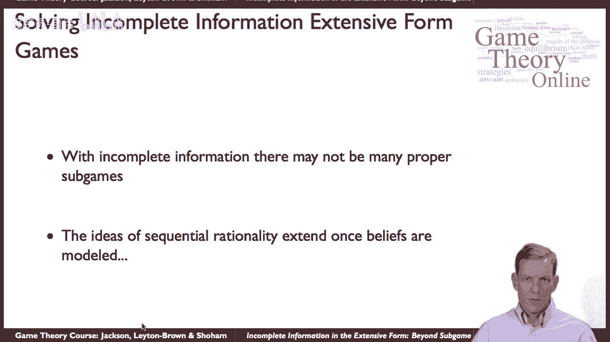

# 34：拓展子博弈完美的推理 🧠

在本节课中，我们将学习如何将子博弈完美均衡的推理思想，拓展到那些没有合适子博弈的、具有不完美信息的扩展式博弈中。我们将通过一个具体的市场进入博弈例子，来理解为什么子博弈完美均衡在此类博弈中“咬合力”不足，并初步了解更高级的均衡概念（如序贯均衡和完美贝叶斯均衡）如何通过引入“信念”来增强预测能力。

---

## 游戏设定与挑战 ☕️

首先，我们来看一个简单的市场进入博弈。这个博弈模拟了一家新公司（玩家1）决定是否进入一个已有公司（玩家2）存在的市场。

*   **玩家1**：潜在进入者。其决策是进入（E）或不进入（N）。
*   **玩家2**：市场在位者。在玩家1进入后，其决策是战斗（F）或默许（A）。
*   **不完美信息**：玩家1可能是“强者”（概率1/2）或“弱者”（概率1/2）。玩家1知道自己的类型，但玩家2不知道。因此，当玩家1进入后，玩家2无法区分自己面对的是强者还是弱者，我们用**信息集**将这两个决策节点连接起来。

以下是该博弈的收益结构：
*   如果玩家1不进入（N），则收益为 (0, 2)。
*   如果玩家1进入（E），则收益取决于玩家2的行动和玩家1的类型：
    *   **强者**：若玩家2战斗（F），收益为 (-1, -1)；若玩家2默许（A），收益为 (1, 1)。
    *   **弱者**：若玩家2战斗（F），收益为 (-2, 0)；若玩家2默许（A），收益为 (-1, 2)。

## 子博弈完美均衡的局限性 🔍

上一节我们介绍了博弈的基本设定，本节中我们来看看如何使用子博弈完美均衡来分析它。

子博弈完美均衡要求均衡策略在每个子博弈（即从任一节点开始，包含其后所有节点的部分博弈树）中构成纳什均衡。然而，在这个博弈中，由于玩家2的信息集连接了两个节点，**整个博弈中唯一的子博弈就是它本身**。

因此，**子博弈完美均衡在此博弈中退化为普通的纳什均衡**。这意味着子博弈完美性无法帮助我们剔除那些在局部（即玩家2的决策点）看起来“不可信”的纳什均衡。

以下是该博弈的一些纳什均衡示例：

*   **均衡A**：玩家1（无论强弱）均选择不进入（N）；玩家2声称将战斗（F）。这是一个纳什均衡，因为给定对方策略，无人愿意单方面偏离。但它“不可信”，因为如果玩家1真的进入，玩家2选择战斗（F）的收益（-1或0）总是低于默许（A）的收益（1或2）。玩家2的威胁只是空谈，因为它永远不会被实际执行。
*   **均衡B**：玩家2选择默许（A）；强者玩家1进入（E），弱者玩家1不进入（N）。这也是一个纳什均衡，并且看起来更“可信”，因为当玩家2被要求行动时（即玩家1进入后），他确实在做最优反应（默许）。

实际上，这个博弈存在许多纳什均衡。子博弈完美性在此无法帮助我们筛选出更合理的那个。

## 引入信念与序贯理性 💡

上一节我们看到子博弈完美均衡的局限性，本节中我们来看看如何通过引入“信念”来拓展推理。

核心思想是：即使在非子博弈的信息集上，我们也要求玩家具有**信念**（即，他对自己处于该信息集中哪个具体节点的概率判断），并且在该信息集上，他的策略必须是**对其信念的最优反应**。这被称为**序贯理性**。

以下是应用此思想的关键步骤：

1.  **指定信念**：对于每个信息集，指定玩家认为自己在各个节点的概率。例如，玩家2必须有一个信念：面对的是强者的概率是 `p`，是弱者的概率是 `1-p`。
2.  **序贯理性**：给定这些信念，玩家在每个信息集上的行动必须是最优的。例如，给定任何信念 `p`，玩家2选择默许（A）的期望收益总是高于选择战斗（F）。计算如下：
    *   选择A的期望收益：`p * 1 + (1-p) * 2 = 2 - p`
    *   选择F的期望收益：`p * (-1) + (1-p) * 0 = -p`
    *   由于 `(2-p) > (-p)` 恒成立，因此**无论信念 `p` 是多少，玩家2的最优选择总是默许（A）**。
3.  **信念的一致性**：在更严格的均衡概念（如完美贝叶斯均衡、序贯均衡）中，还要求玩家的信念必须与均衡策略相一致（例如，通过贝叶斯法则从策略中推导得出）。

将序贯理性应用于本例，我们得到唯一的合理预测：
*   玩家2将总是选择默许（A）。
*   因此，强者玩家1会选择进入（E）（收益1 > 0），弱者玩家1会选择不进入（N）（收益0 > -1）。

## 总结 📚

本节课中我们一起学习了如何将博弈分析拓展到不完美信息的情形。

*   我们首先通过一个市场进入博弈的例子，说明了**子博弈完美均衡**在缺乏合适子博弈的博弈中可能失效，无法剔除不可信的威胁。
*   接着，我们引入了**序贯理性**的核心思想：要求玩家在每个信息集上，基于其在该处的**信念**做出最优决策。
*   通过这一原则，我们能够对博弈做出更强、更合理的预测。在本例中，它唯一地推导出玩家2总会默许，进而决定了玩家1的最优进入决策。
*   更正式的解决方案概念（如**完美贝叶斯均衡**和**序贯均衡**）在此基础上，还增加了对信念与策略一致性的要求，为分析复杂的不完美信息动态博弈提供了强有力的工具。

这种基于信念和序贯理性的分析框架，极大地拓展了我们在信息不完美情况下进行策略推理的能力。