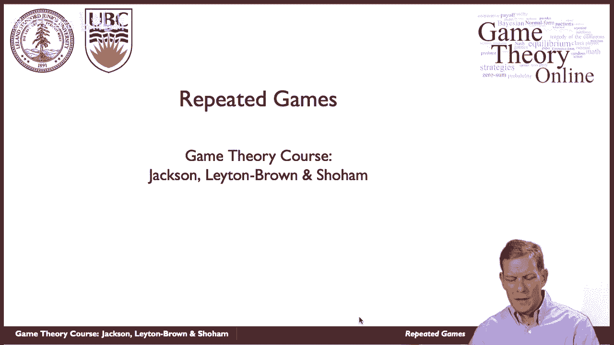
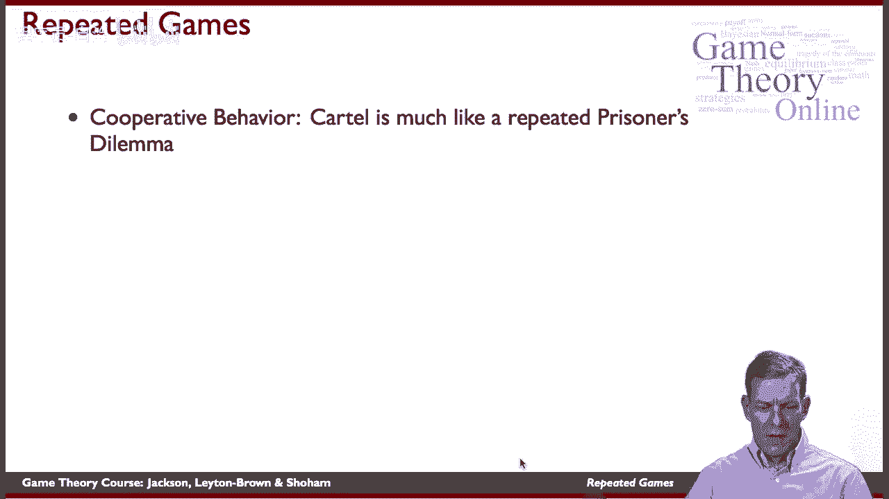
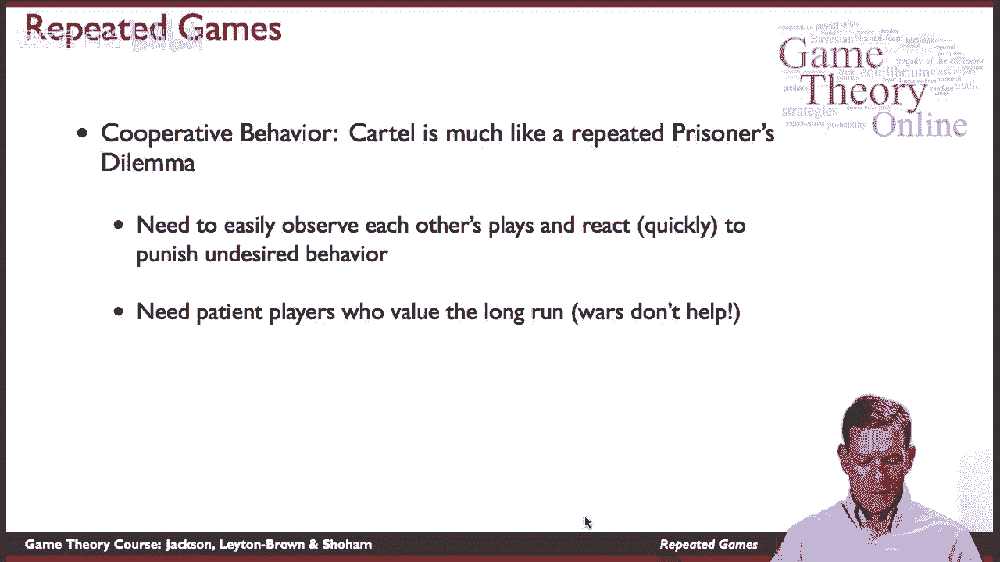
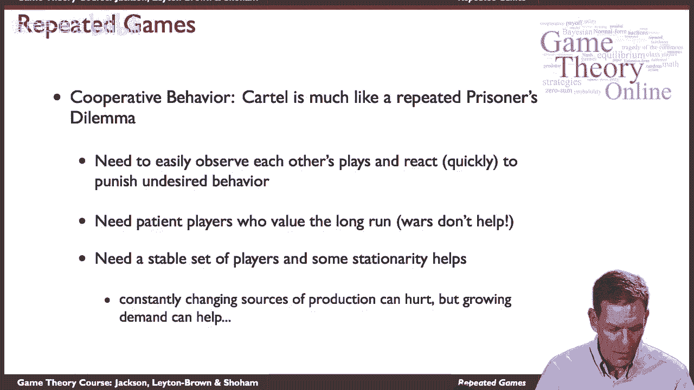

# 35：重复博弈 🎲

在本节课中，我们将要学习**重复博弈**。我们将探讨当玩家们反复进行同一个博弈时，策略、行为和结果会如何变化。理解重复博弈有助于我们分析现实世界中许多长期互动，例如企业竞争、国际关系和个人合作。

---

上一节我们介绍了重复博弈的基本概念及其重要性。本节中，我们来看看一个经典案例：**石油输出国组织（OPEC）**。这个案例展示了重复互动如何影响合作与背叛的动机。

OPEC是一个石油生产国卡特尔，成立于20世纪70年代初。在成立之前，经通货膨胀调整后的石油价格大约为每桶20美元或更低。OPEC的目标是通过限制产量来抬高油价。

然而，这里存在一个根本性的困难：如果其他成员国都遵守协议减产，油价就会上涨。此时，单个国家就有动机**欺骗**协议，私自增加产量以获取更多利润。这本质上是一个巨大的**囚徒困境**。

OPEC在初期取得了成功，将油价推高至每桶约90美元。但随后合作出现裂痕，在1986年至2002年间，油价回落至每桶40美元或更低。之后，由于地区冲突等因素，合作变得更加困难。直到2008年左右，油价才再次回升至每桶100美元以上。

这个案例表明，在重复博弈中维持合作需要满足特定条件。

---

理解了OPEC的案例后，我们来分析在重复的囚徒困境中，维持合作（如卡特尔协议）需要哪些关键要素。

以下是维持合作所需的几个关键条件：

*   **可观察的行动**：玩家必须能够观察到其他玩家的行为。如果无法发现谁在欺骗，就无法实施惩罚。
*   **快速反应能力**：玩家需要有能力对观察到的欺骗行为做出快速反应，例如通过增加产量来进行惩罚。
*   **对未来有足够的重视**：玩家必须足够关心未来的收益。如果玩家只关注眼前利益，那么背叛当期协议总是具有诱惑力的。
*   **环境的稳定性**：稳定的玩家集合和外部环境有助于合作。例如，战争或新生产者的加入会破坏合作的稳定性。
*   **需求增长**：不断增长的需求有助于维持高价，即使存在一定程度的欺骗，也可能使合作更容易维持。

---

上一节我们列出了维持合作的条件。本节中，我们来看看如何用博弈论的工具来形式化分析重复博弈。

**重复博弈**是指同一个基本博弈（称为**阶段博弈**）被重复进行多次。玩家在每一期的收益会累积，并且他们可以根据过去的历史来选择当前的行动。

考虑一个简单的囚徒困境阶段博弈，其收益矩阵如下：

| 玩家1 \ 玩家2 | 合作 (C) | 背叛 (D) |
| :------------ | :------- | :------- |
| **合作 (C)**  | 3, 3     | 0, 5     |
| **背叛 (D)**  | 5, 0     | 1, 1     |

在一次性的博弈中，唯一的纳什均衡是（背叛，背叛），收益为（1, 1）。

然而，如果这个博弈重复进行无限次，并且玩家对未来收益有足够的耐心（用**贴现因子 δ** 表示，0 < δ < 1），那么合作就可能成为均衡结果。一个著名的策略是**触发策略**（或称冷酷策略）：
*   从合作开始。
*   只要对方一直合作，就继续合作。
*   如果对方在任何一期背叛，则从下一期开始永远选择背叛。

对于玩家来说，坚持触发策略（即一直合作）的长期收益是：
`3 + 3δ + 3δ^2 + ... = 3 / (1 - δ)`

如果他在某一期选择背叛，他在当期获得5，但之后每期只能获得1（因为触发惩罚）。其长期收益是：
`5 + 1δ + 1δ^2 + ... = 5 + δ / (1 - δ)`

当合作的收益大于背叛的收益时，合作可以维持：
`3 / (1 - δ) ≥ 5 + δ / (1 - δ)`
解这个不等式，得到 **δ ≥ 1/2**。

这意味着，只要玩家对未来足够重视（δ足够大），合作就可以成为重复博弈的一个均衡。

---

本节课中我们一起学习了**重复博弈**的核心思想。我们通过OPEC的案例看到了现实世界中重复互动的影响，分析了维持合作所需的条件，并用博弈论的模型（以囚徒困境为例）展示了如何通过**触发策略**和**贴现因子**来形式化地理解合作的可能性。重复博弈理论为我们理解长期关系中的合作、惩罚与声誉提供了强大的分析工具。