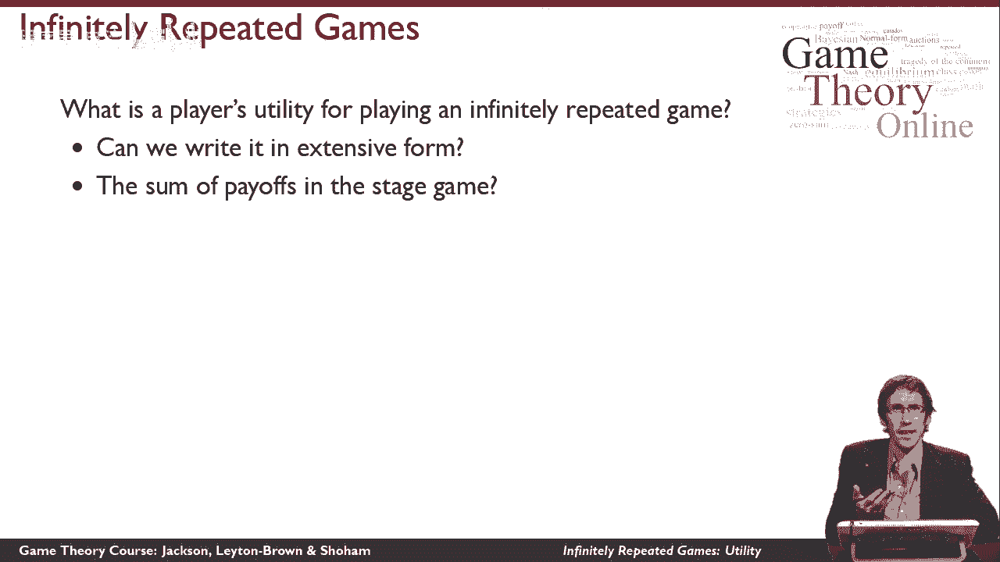
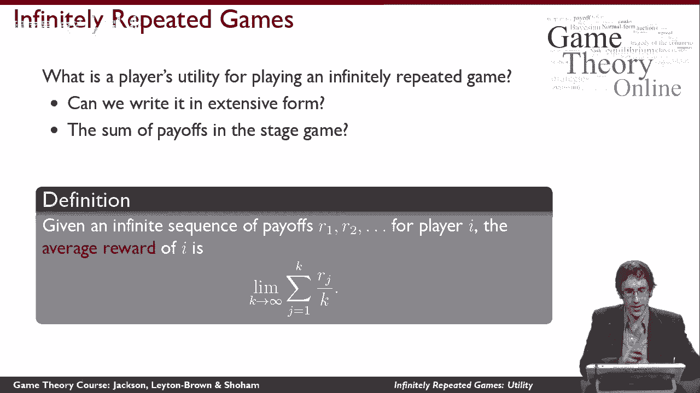
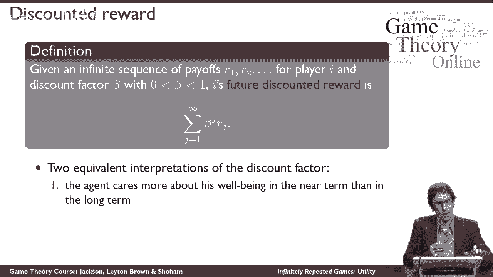
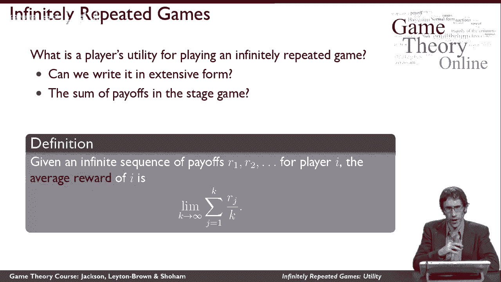
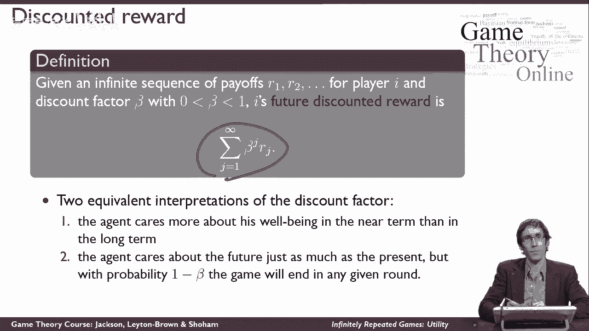

# 36：无限重复博弈的效用定义 🎮

在本节课中，我们将学习如何在无限次重复的博弈中，为玩家定义合理的效用。无限重复博弈是指，同一个“阶段博弈”（一个标准形式的博弈）被玩家们一遍又一遍地重复进行。这意味着每个玩家会获得一个无限的收益序列。为了分析这种博弈，我们必须将这个无限序列转化为一个代表玩家效用的单一数值。

## 问题的挑战与现有方法的不足

上一节我们介绍了无限重复博弈的基本概念。本节中，我们来看看为其定义效用时面临的挑战。

首先，我们之前学到的博弈论工具不足以直接解决这个问题。你可能会想到两种方法，但它们都存在缺陷：

*   **扩展形式表示法**：我们无法用扩展形式（博弈树）来描绘这个博弈，因为博弈树将是无限深的，我们永远无法到达可以标注收益的终端节点。
*   **简单加总法**：我们也不能简单地将所有收益相加作为效用，因为如果收益始终为正，总和将趋于无穷大（`总效用 = ∞`）。我们希望效用是一个有限值。

## 方法一：平均收益法 📊

因此，我们需要新的方法。第一种规范的方法是考察玩家在整个无限序列上的“平均收益”。

然而，直接计算无限序列的平均值（总和除以项数）同样会面临 `∞ / ∞` 的问题。为此，我们采用“有限平均值的极限”来定义。具体来说：

1.  先计算序列前 `k` 项的平均收益。
2.  然后令 `k` 趋向于无穷大，取这个平均值的极限。

用公式表示，玩家 `i` 的效用 `U_i` 定义为：
`U_i = lim (k→∞) ( (r_1 + r_2 + ... + r_k) / k )`

> **技术说明**：这个极限并非总是存在，但对于本课程将讨论的情况，它都是定义良好的。若极限不存在，也有标准的技术方法进行修正。

这种方法给出了一个代表玩家在无限序列中平均表现的数字。

## 方法一的局限性与折现因子的引入

虽然平均收益法在数学上是清晰的，但它有一个反直觉的特性：它完全忽略了收益的时间顺序。根据这个定义，无论多糟糕的收益，只要它发生在**有限**的早期阶段，都会被未来无限多的收益“冲刷”掉，对最终的平均值没有影响。

但在现实中，我们通常认为近期的收益比远期的收益**更重要**。为了建立符合这种直觉的效用模型，我们引入了第二种方法。

## 方法二：折现收益法 ⏳

在折现收益法中，我们引入一个**折现系数 β**，其值严格介于0和1之间（`0 < β < 1`）。玩家的总效用是各期收益的折现值之和。

其核心思想是：距离现在越远的收益，其现值越低。具体计算如下：

*   第1期的收益 `r_1` 的现值为 `β^0 * r_1 = r_1`（即不打折）。
*   第2期的收益 `r_2` 的现值为 `β^1 * r_2`。
*   第3期的收益 `r_3` 的现值为 `β^2 * r_3`。
*   以此类推。

因此，玩家 `i` 的折现效用 `U_i` 公式为：
`U_i = r_1 + β*r_2 + β^2*r_3 + β^3*r_4 + ... = Σ (t=1 to ∞) β^(t-1) * r_t`

由于 `β < 1`，这是一个收敛的几何级数，保证了效用是有限值。

## 折现系数的双重解释

关于折现系数 `β`，有两种在数学上等价但视角不同的有趣解释：

1.  **耐心程度**：玩家缺乏耐心，更看重近期回报。`β` 越小，表示玩家越“短视”。
2.  **继续概率**：在每一轮阶段博弈结束后，游戏会以 `(1-β)` 的概率永久结束，以 `β` 的概率继续下一轮。那么，`β^(t-1)` 就代表了游戏能持续到第 `t` 轮的概率。此时，上述折现效用公式计算的就是玩家的**期望收益**。

这两种解释为我们理解无限重复博弈中的策略行为提供了丰富的洞见。

## 总结

本节课中，我们一起学习了为无限重复博弈定义效用的两种核心方法：

1.  **平均收益法**：通过计算有限平均值的极限来定义效用，关注长期平均表现，但忽略了收益的时间价值。
2.  **折现收益法**：通过引入折现系数 `β`，将未来收益折现后加总，既保证了效用有限，也体现了“近期收益比远期收益更重要”的直觉。折现系数可以解释为玩家的耐心程度或游戏继续的概率。

理解这两种效用定义方式，是分析无限重复博弈中合作、惩罚、声誉等复杂策略现象的基础。