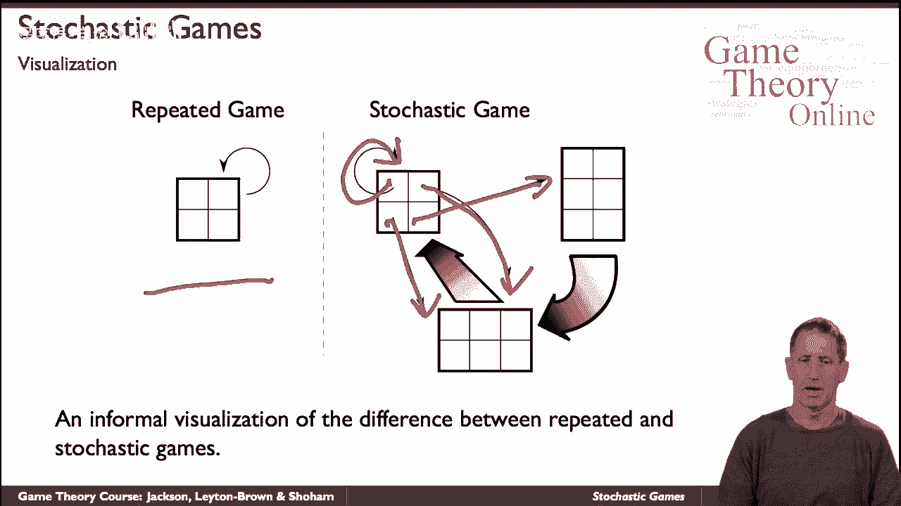
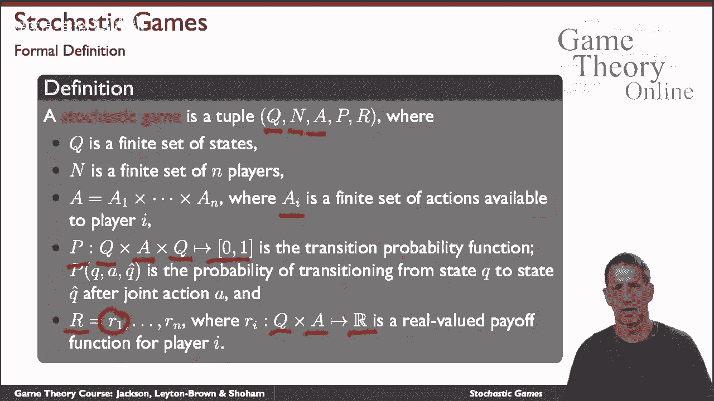
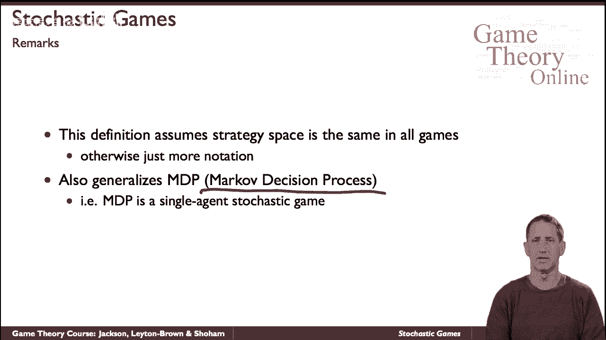

# 37：随机博弈入门 🎲

在本节课中，我们将要学习**随机博弈**的基本概念。随机博弈是重复博弈的推广，它允许玩家在每次互动后，根据行动结果以一定概率转移到另一个不同的博弈中，而不仅仅是重复同一个博弈。我们将从重复博弈出发，理解随机博弈的构成要素和形式化定义，并了解它与马尔可夫决策过程的关系。

---

## 从重复博弈到随机博弈 🔄

上一节我们介绍了重复博弈，它指的是同一个标准形式博弈（如囚徒困境）被重复进行多次。随机博弈则是对这一概念的推广。

在随机博弈中，我们反复进行博弈，但每次进行的博弈可能不同。具体来说，玩家在当前博弈中采取行动并获得收益后，整个系统会根据这些行动，以一定的概率“转移”到另一个（或同一个）博弈中，然后继续在新的博弈中进行决策。

用图形化的方式来看，如果重复博弈是在同一个节点上循环，那么随机博弈则是一个由多个节点（代表不同博弈）和带概率的转移箭头构成的网络。

---

## 随机博弈的形式化定义 📝

本节中我们来看看如何用数学语言精确地描述一个随机博弈。其核心是一个包含多个组件的元组。

一个随机博弈可以形式化地定义为以下元组：
`(Q, N, A_i, P, R_i)`

以下是每个符号的含义：
*   **Q**: 一个有限的状态集合。每个状态 `q ∈ Q` 代表一个可能进行的（标准形式）博弈。
*   **N**: 玩家的集合。
*   **A_i**: 玩家 `i` 可用的行动集合。通常假设所有玩家在所有状态下的行动空间相同，以简化符号。
*   **P**: 状态转移概率函数。`P(q‘ | q, a)` 表示在状态 `q` 下所有玩家采取联合行动 `a` 后，转移到状态 `q‘` 的概率。
*   **R_i**: 玩家 `i` 的收益函数。`R_i(q, a)` 给出了在状态 `q` 下采取联合行动 `a` 后，玩家 `i` 获得的即时收益。

---

## 与其他模型的关系 🤝

理解了随机博弈的定义后，我们可以将其置于更广阔的视野中，看看它与我们已知的其他模型有何联系。

随机博弈是一个相当通用的框架，它概括了两种重要的模型：
1.  **重复博弈**：当状态集合 `Q` 中只包含一个状态时，随机博弈就退化为重复博弈。
2.  **马尔可夫决策过程（MDP）**：当玩家集合 `N` 中只有一个玩家时，随机博弈就变成了一个MDP。在MDP中，一个智能体在状态间转移，获取奖励，其目标是最大化长期收益。

正是因为随机博弈同时概括了博弈论中的重复博弈和强化学习/优化中的MDP，所以它成为了一个连接多个学科、受到广泛研究的强大模型。

从重复博弈中，随机博弈继承了定义长期累积收益（如折扣收益、平均收益）的方式。从MDP中，它继承了关于策略（如马尔可夫策略）和状态可达性等概念的分析工具。

---

## 总结 📚

本节课中我们一起学习了随机博弈的基础知识。我们首先了解到随机博弈是重复博弈的扩展，允许博弈过程在不同游戏之间随机切换。然后，我们学习了其形式化定义 `(Q, N, A_i, P, R_i)`，它通过状态、玩家、行动、转移概率和收益函数来描述整个系统。最后，我们认识到随机博弈是一个通用框架，它既包含了单次重复博弈，也包含了单智能体的马尔可夫决策过程，这为其在理论和应用上的重要性奠定了基础。