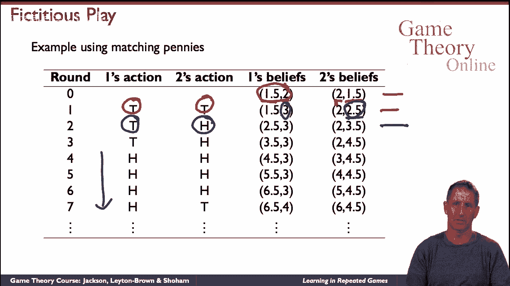
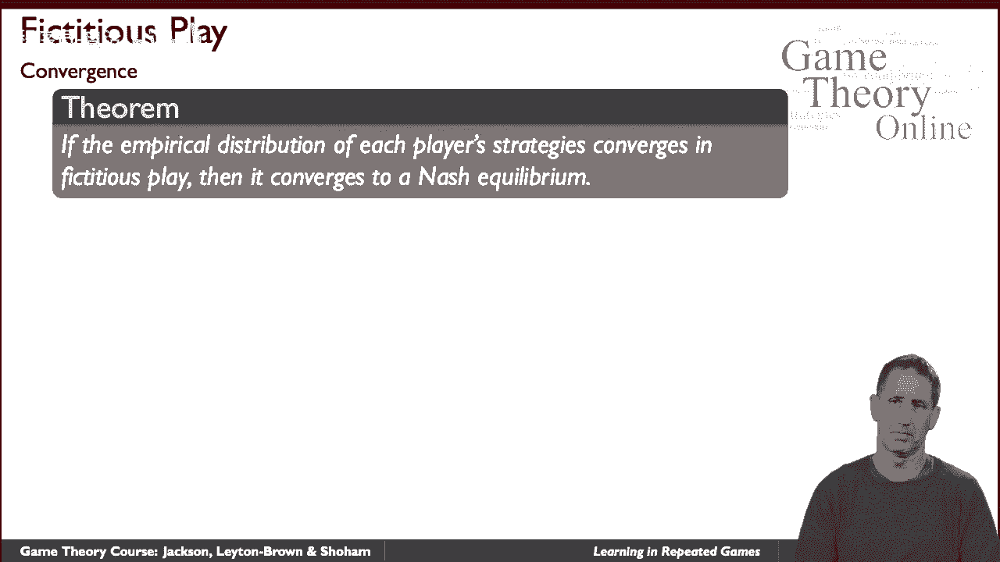
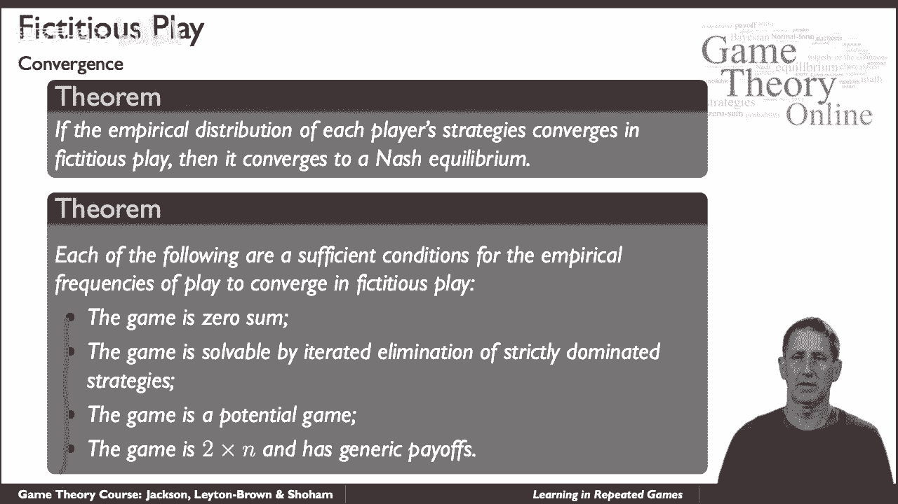
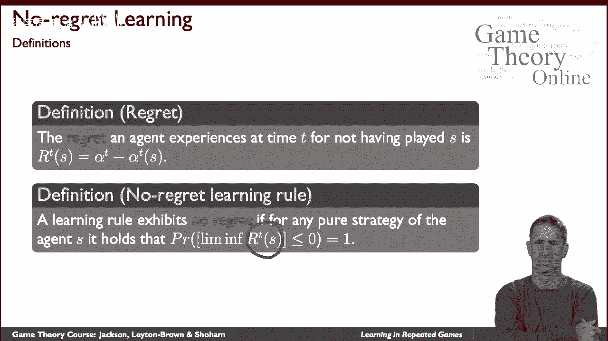
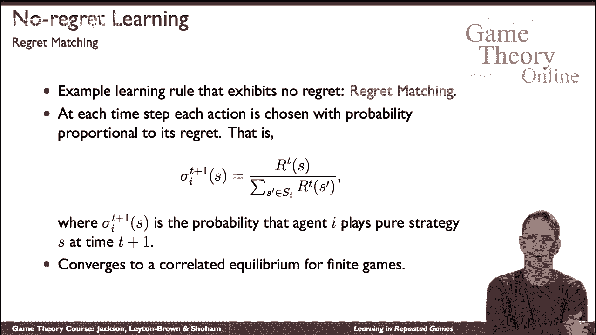

# 38：博弈论中的两种学习形式 🎲

在本节课中，我们将学习博弈论中两种重要的学习形式：**虚拟游戏**和**无悔学习**。我们将探讨它们的基本原理、运作方式以及它们如何帮助智能体在重复博弈中调整策略。

---

## 概述

博弈论中的学习与其他学科（如机器学习或统计学）的学习有根本区别。在博弈论中，环境通常由其他智能体构成，这意味着你的学习过程会直接影响他人的行为，反之亦然。因此，学习与“教学”的概念密不可分。本节我们将聚焦于**重复博弈**场景，并介绍两种经典的学习方法。

---

## 虚拟游戏：基于模型的学习

上一节我们概述了博弈论学习的特殊性，本节中我们来看看第一种具体方法——**虚拟游戏**。这是一种基于模型的学习方法，每个智能体通过观察对手的历史行动来形成信念，并据此做出最佳反应。

虚拟游戏的工作原理很简单：每个智能体记录对手过去选择每个行动的次数，并假设对手在未来会以与历史频率成比例的概率选择行动。然后，智能体针对这个信念分布做出自己的最佳反应。

以下是虚拟游戏算法的步骤描述：

1.  初始化：为每个对手的每个行动设定一个初始计数（通常非零）。
2.  在每一轮中：
    *   根据对手行动的当前历史频率，形成对其策略的信念。
    *   针对这个信念分布，选择能带来最高期望收益的行动（即最佳反应）。
    *   执行行动，并观察对手的实际行动。
    *   更新对手该行动的历史计数。

**需要注意**：智能体自身总是选择纯策略，但他们假设对手在使用混合策略。

### 一个例子：匹配硬币游戏

考虑经典的“匹配硬币”游戏。两个玩家各选择“正面”（H）或“反面”（T）。若选择相同，则玩家1赢；若选择不同，则玩家2赢。

假设初始信念为：玩家1认为玩家2玩H和T的计数分别为1.5和2.5（即更可能玩T）；玩家2认为玩家1玩H和T的计数分别为2和1（即更可能玩H）。

*   **第一轮**：
    *   玩家1想“匹配”对手，因其认为对手更可能出T，故自己选择T。
    *   玩家2想“不匹配”对手，因其认为对手更可能出H，故自己选择T。
    *   结果：双方都出T。玩家1赢（匹配），玩家2输。
    *   更新信念：双方都观察到对手出了T，相应增加T的计数。
*   **第二轮**：
    *   玩家1仍认为对手更可能出T，故继续出T。
    *   玩家2更新信念后，认为对手更可能出T，为求“不匹配”，故选择出H。
    *   结果：（T, H）。玩家2赢。
    *   更新信念：玩家1观察到H，玩家2观察到T。

如此继续，具体行动序列会交替变化。但长期来看，**每个玩家选择H和T的经验频率（平均比例）会趋近于50%**。

### 虚拟游戏与纳什均衡的关系

一个重要的定理揭示了虚拟游戏与纳什均衡的联系：

> **定理**：如果在虚拟游戏中，玩家的**经验频率**收敛，那么它们必然收敛到该博弈的一个**纳什均衡**。

虽然行动序列本身不一定收敛，但在许多条件下，经验频率可以收敛。这些充分条件包括：
*   博弈是**零和博弈**。
*   博弈可通过**迭代严格占优**求解。
*   博弈是**势博弈**。
*   博弈是**2xN** 或 **Mx2** 的“通用”博弈。

虚拟游戏是博弈论学习研究的起点，它虽然不一定高效，但包含了更复杂学习模型的核心思想。

---

## 无悔学习：无模型的学习方法

了解了基于模型的虚拟游戏后，我们转向一种思路截然不同的学习范式——**无悔学习**。这种方法不显式地对其他智能体的策略进行建模，而是从定义我们希望学习规则满足的**性能标准**开始。

这个核心标准就是“无悔”。我们首先定义**遗憾**：在时间点T，智能体对于没有采取某个特定策略S而感到的遗憾，等于 **“如果从第一轮开始就一直采用策略S所能获得的总收益”** 与 **“实际获得的总收益”** 之间的差值。

**公式化定义**：`遗憾_T(S) = (一直采用S的虚拟累积收益) - (实际累积收益)`

如果一个学习规则能确保随着博弈轮次增加，智能体对于**所有**纯策略的遗憾增长率都趋近于零（即平均遗憾趋于零），则该规则被称为**无悔学习规则**。

### 后悔匹配算法

无悔学习家族中一个著名且简单的算法是**后悔匹配**。它的决策规则非常直观：根据过去对于每个纯策略的“正遗憾”的比例，来选择下一轮的行动。

以下是其决策公式：
`下一轮选择策略S的概率 = max(0, 对S的累计遗憾) / (所有策略的正遗憾之和)`

换句话说，你更有可能去尝试那些你“后悔”当初没有多选一些的策略。

### 后悔匹配的性质

后悔匹配算法具有强大的理论保证：
1.  **它是无悔的**：使用该算法，长期来看，对于任何纯策略的遗憾都不会线性增长。
2.  **收敛于相关均衡**：在有限博弈的重复进行中，如果所有玩家都采用后悔匹配算法，那么他们的长期经验分布会收敛到该博弈的一个**相关均衡**（这是比纳什均衡更一般的一个均衡概念）。

---

## 总结

本节课中我们一起学习了博弈论在重复博弈背景下的两种核心学习形式：
1.  **虚拟游戏**：一种基于模型的学习，通过追踪对手历史行动频率形成信念并做出最佳反应。其经验频率的收敛与纳什均衡密切相关。
2.  **无悔学习**：一种无模型的学习，以最小化“遗憾”为目标。其中**后悔匹配**算法通过根据过往遗憾的比例随机化选择，能收敛到相关均衡。

这两种方法为我们理解智能体如何在动态互动中通过经验调整行为提供了基础框架。博弈论中的学习是一个广阔而迷人的领域，本节内容仅为入门之匙。