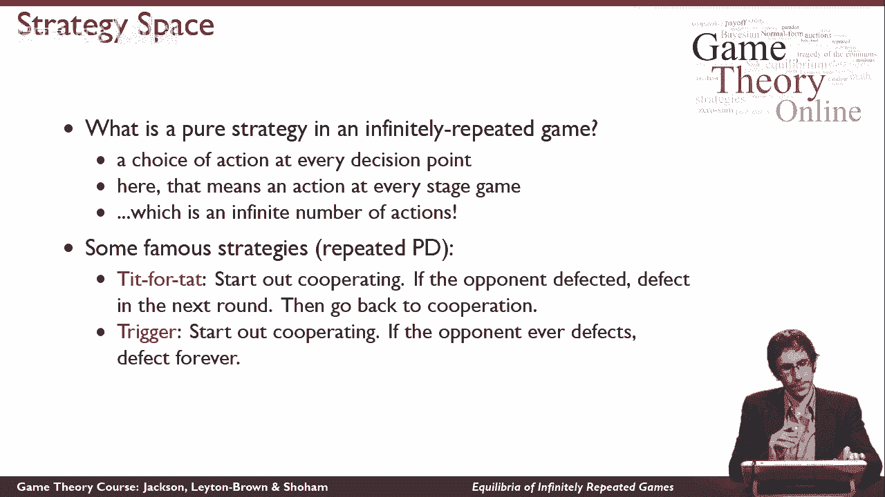
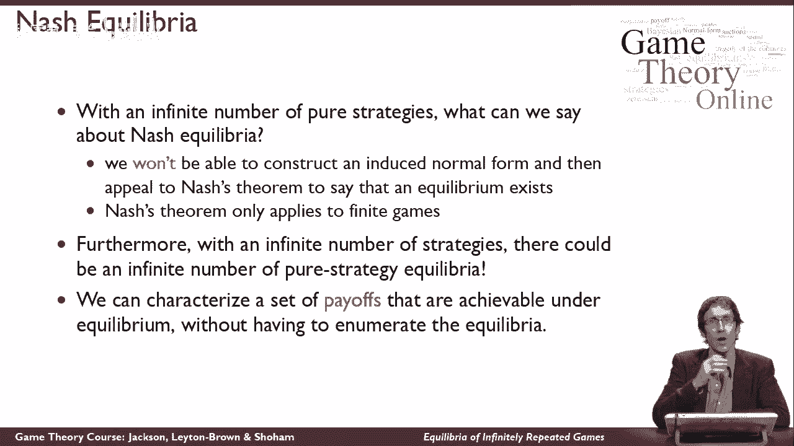
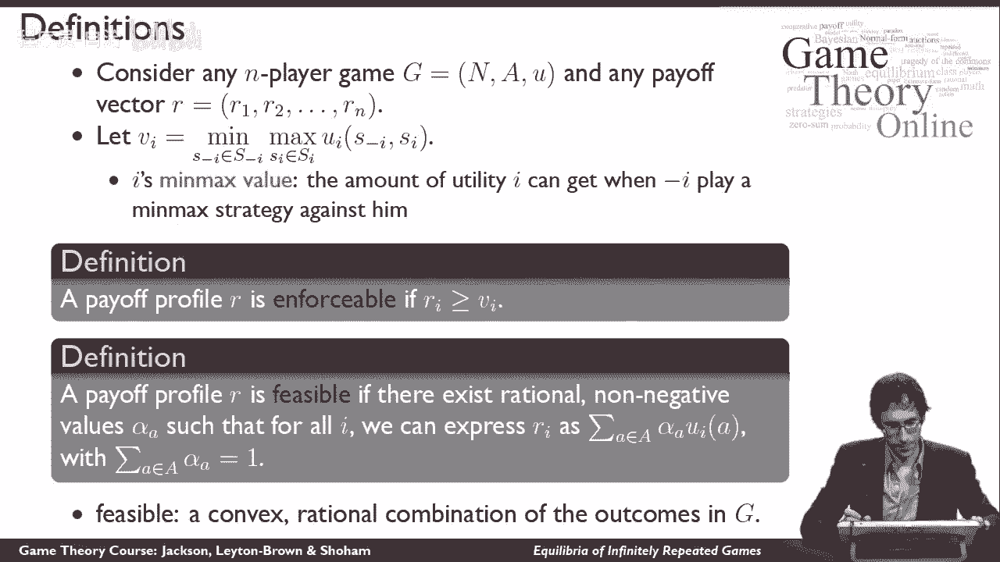
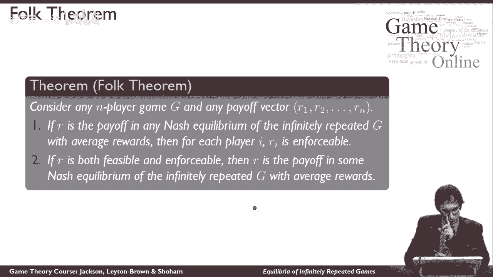
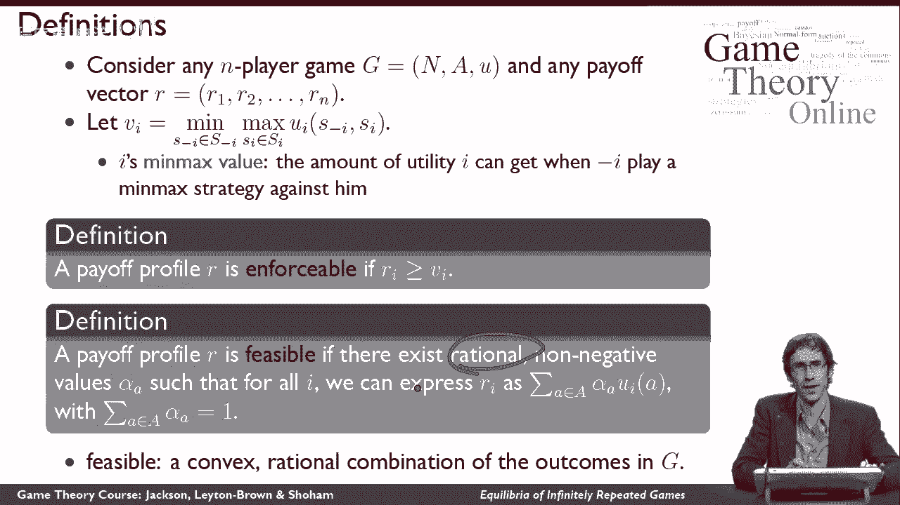
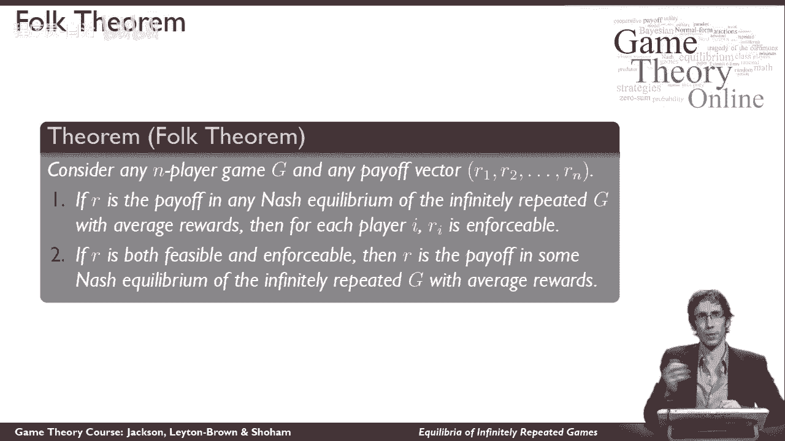
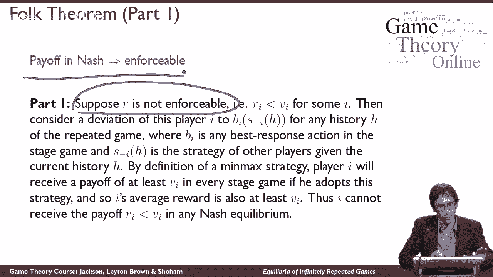
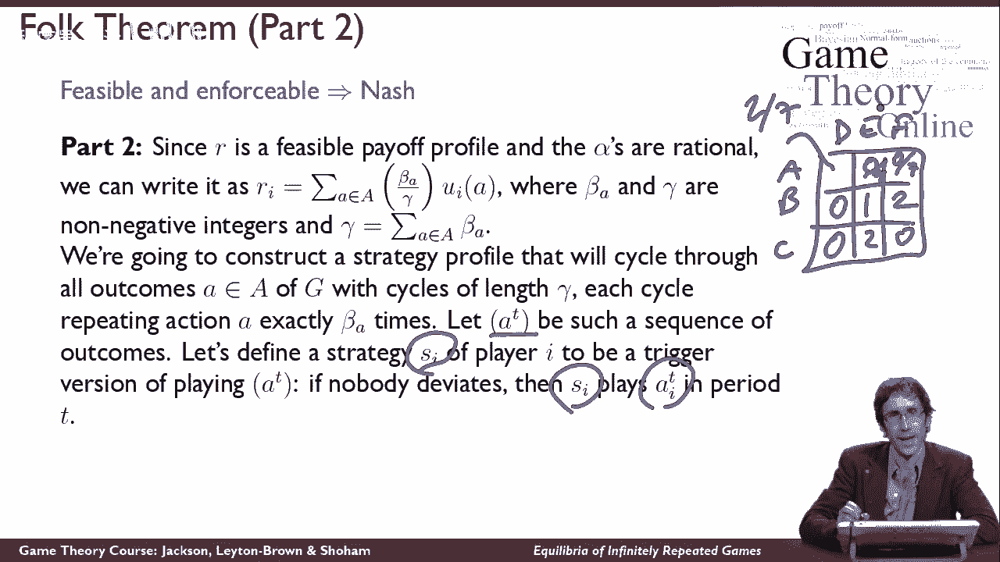
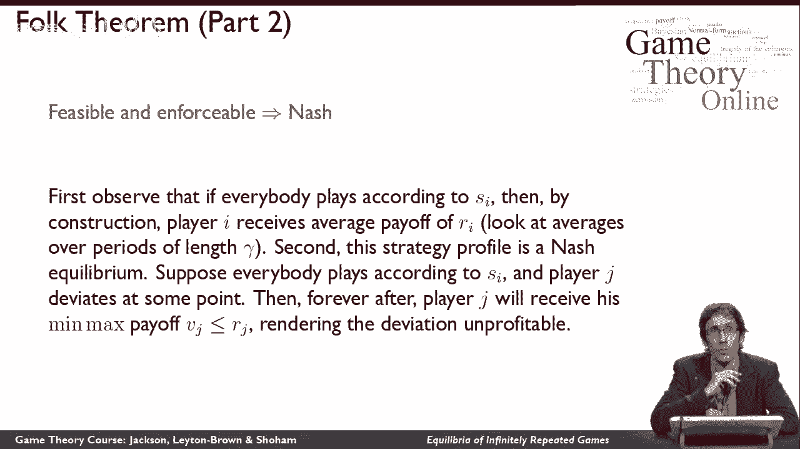

# 39：无限重复博弈中的均衡问题 🎲

在本节课中，我们将学习无限重复博弈的均衡概念。我们将探讨如何定义策略，理解“民间定理”的核心思想，并学习如何描述在均衡条件下可以实现的收益。课程内容将尽可能简单直白，以便初学者能够理解。

## 无限重复博弈中的纯策略定义 📝

上一节我们介绍了课程概述，本节中我们来看看无限重复博弈中纯策略的定义。

在无限重复博弈中，一个纯策略需要告诉你在每个决策点选择什么行动。这意味着你需要为每个阶段博弈指定一个行动。你的决策可以基于整个博弈的历史，包括你自己和对手过去的所有行动。

因此，纯策略空间是一个从所有可能的历史到行动选择的映射。由于历史是无限的，所以纯策略的数量也是无限的。这与有限博弈不同，在有限博弈中，纯策略集是有限的。

以下是无限重复博弈中两个著名的纯策略例子：
*   **以牙还牙**：在重复囚徒困境中，这个策略从合作开始。如果对手上一轮选择背叛，那么本轮它也选择背叛；如果对手上一轮选择合作，那么本轮它也选择合作。
*   **触发策略**：同样从合作开始。一旦对手在任何一轮选择背叛，那么从此以后它将永远选择背叛，永不原谅。

## 均衡的存在性与“民间定理” 🧠

上一节我们了解了纯策略的定义，本节中我们来看看无限重复博弈中均衡的存在性问题。

由于纯策略数量无限，我们无法像处理有限博弈那样，通过构建一个有限维度的诱导标准式并应用纳什存在性定理来保证均衡存在。这意味着，仅凭现有知识，我们甚至无法确定这些博弈中是否存在均衡。

然而，有趣的是，我们仍然可以系统地描述哪些收益结果可以在均衡中实现。这就是著名的“民间定理”。它之所以被称为“民间定理”，是因为在它被正式书写证明之前，其核心思想已在博弈论学者中广为流传。

在进入定理陈述前，我们需要先定义一些关键概念。

## 关键概念与记号 📊

上一节我们引出了“民间定理”，本节中我们来学习理解它所需的关键概念和记号。

我们从一个 **n人阶段博弈** 开始，这是一个标准形式的博弈。我们将讨论 **平均收益** 情况，即每个玩家关心的是其策略在无限重复博弈中带来的长期平均效用。

我们需要理解两个核心概念：

1.  **最小最大值**：玩家i的最小最大值，记作 **minmaxᵢ**，是当其他所有玩家结成联盟，唯一目标就是最小化玩家i的收益时，玩家i通过最佳应对所能保证获得的最低效用。直观上，这是其他玩家能对玩家i施加的最严厉惩罚下，玩家i能为自己争取到的最低收益。
    *   公式：`minmaxᵢ = min_{σ₋ᵢ} max_{aᵢ} uᵢ(aᵢ, σ₋ᵢ)`，其中 `σ₋ᵢ` 代表其他玩家的混合策略组合。

2.  **可行收益**：一个收益向量 **r = (r₁, r₂, ..., rₙ)** 被称为是 **可行** 的，如果它能被表示为阶段博弈中各种行动组合收益的加权平均。具体来说，如果存在一组非负有理数权重 `{αₐ}`（对每个行动组合 `a`），满足 `Σₐ αₐ = 1`，并且对每个玩家i，都有 `rᵢ = Σₐ [αₐ * uᵢ(a)]`。这意味着收益向量 `r` 可以通过在阶段博弈中按特定频率循环不同的行动组合来实现。

3.  **可执行收益**：一个收益向量 **r** 被称为是 **可执行** 的，如果对于其中的每一个收益 `rᵢ`，都满足 `rᵢ ≥ minmaxᵢ`。这意味着在均衡中，没有玩家会接受低于其最小最大值的收益，否则他可以通过偏离来获得至少等于最小最大值的收益。

## “民间定理”的陈述与证明思路 📜

上一节我们定义了可行和可执行收益，本节中我们正式陈述“民间定理”并概述其证明思路。

**民间定理（平均收益版本）**： 在任何n人博弈的无限重复博弈（考虑平均收益）中：
1.  **必要性**：如果一个收益向量 **r** 是某个纳什均衡下的平均收益，那么 **r** 必须是可执行的（即对每个玩家i，`rᵢ ≥ minmaxᵢ`）。
2.  **充分性**：如果一个收益向量 **r** 既是可行的又是可执行的，那么 **r** 就是某个纳什均衡下的平均收益。

**证明思路**：
*   **第一部分证明（必要性）**：采用反证法。假设存在一个均衡，其收益向量 `r` 不可执行，即存在某个玩家i，其收益 `rᵢ < minmaxᵢ`。那么，玩家i可以考虑偏离到这样一个策略：无论历史如何，都针对其他玩家的均衡策略 `s₋ᵢ` 做出最佳反应。根据最小最大值的定义，这样做至少能保证玩家i获得 `minmaxᵢ` 的收益，这高于他原先的收益 `rᵢ`。因此，原先的策略组合不是一个均衡，矛盾。故均衡收益必须可执行。
*   **第二部分证明（充分性）**：通过构造法证明。给定一个可行且可执行的收益向量 `r`，我们可以为所有玩家构造一个特定的策略组合，使得它构成一个纳什均衡，并且实现平均收益 `r`。
    *   **构造均衡策略**：由于 `r` 可行，我们可以找到一组有理数权重 `{αₐ}` 和公共分母 `γ`，使得 `r` 可以表示为阶段博弈中 `γ` 个周期内，按特定次数（由 `βₐ = αₐ * γ` 决定）重复不同行动组合 `a` 的平均结果。我们构造一个行动序列 `A`，它精确地按 `βₐ` 的次数包含每个行动组合 `a`，并无限循环这个序列。
    *   **构造触发策略**：每个玩家i的策略 `sᵢ` 如下：
        *   只要所有玩家在历史上都按照序列 `A` 的规定行动，则继续按 `A` 行动。
        *   如果任何玩家在某一期偏离了序列 `A` 的规定，那么从下一期开始，所有其他玩家将永远对偏离者采取最小最大化惩罚策略（即联合起来使偏离者的收益降至其最小最大值 `minmaxᵢ`）。
    *   **验证均衡**：
        *   如果所有人都遵守策略，那么长期平均收益正好是 `r`。
        *   考虑任何玩家j的单方面偏离。由于收益 `r` 可执行，`rⱼ ≥ minmaxⱼ`。如果玩家j偏离，触发惩罚后，他从那以后每期最多只能得到 `minmaxⱼ`。在无限重复和平均收益的考量下，这次有限期的偏离带来的短期好处，会被之后无限期的低收益（`minmaxⱼ ≤ rⱼ`）所淹没，从而平均收益不会提高。因此，偏离无利可图。
    *   因此，这个构造的策略组合是一个纳什均衡，并实现了收益 `r`。

## 总结 🎯

本节课中我们一起学习了无限重复博弈的均衡问题。我们首先定义了无限重复博弈中的纯策略，并指出了由于策略空间无限，均衡存在性并非显然。然后，我们引入了“民间定理”，它完美地描述了在平均收益框架下，哪些收益结果可以在无限重复博弈的纳什均衡中实现。

定理的核心结论是：**一个收益向量可以在某个纳什均衡中实现，当且仅当它既是可行的（能在阶段博弈中通过混合行动组合实现），又是可执行的（每个玩家的收益不低于其最小最大值）**。我们不仅学习了定理的陈述，还概述了其证明的要点，特别是通过构造“触发策略”来证明充分性的巧妙方法。

“民间定理”揭示了重复博弈中合作得以维持的理论基础：只要未来收益足够重要（在平均收益模型中意味着无限期），并且偏离行为会触发足够的惩罚（使偏离者收益降至最小最大值），那么许多在单次博弈中无法实现的合作结果，在重复博弈中都可以成为均衡。