# 40：折扣重复博弈 💰

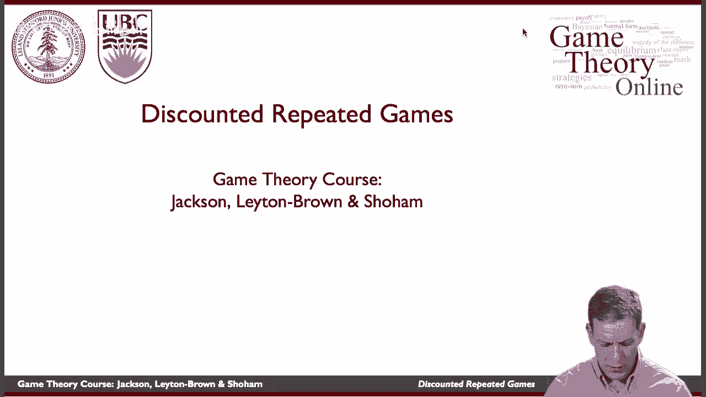

在本节课中，我们将学习**折扣重复博弈**。我们将探讨当玩家对未来收益进行贴现时，如何影响他们在重复互动中的策略选择。核心在于理解玩家如何在“当前收益”与“未来收益”之间进行权衡。

---

## 折扣重复博弈的基本概念

上一节我们介绍了重复博弈的一般框架。本节中，我们来看看当玩家对未来收益进行**贴现**时，情况会发生什么变化。

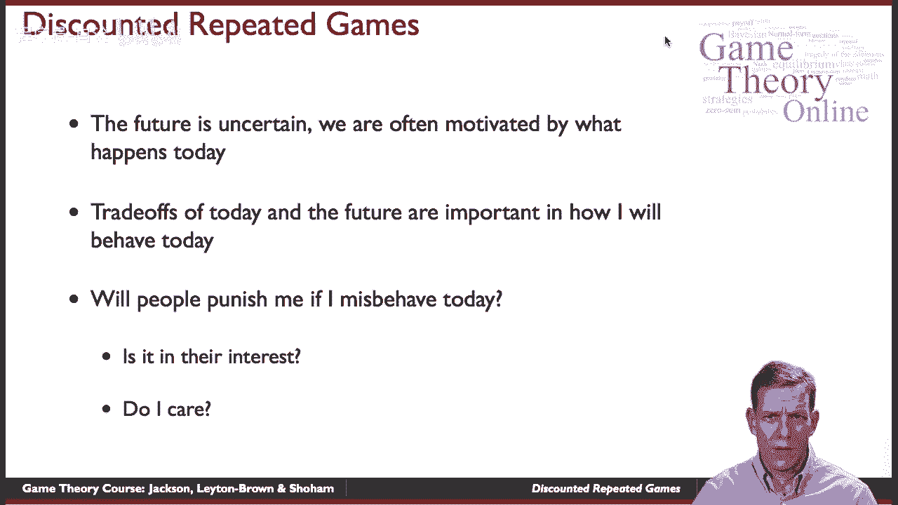

这意味着玩家更看重今天的收益，而明天的收益价值会打一个折扣。例如，如果今天的收益价值为1，明天的收益可能只值0.9，后天的值0.81，以此类推。这种价值随时间呈指数下降。

在折扣重复博弈中，我们考虑玩家反复进行同一个**阶段博弈**。每个玩家都有一个**折扣因子**，记为 **β**（通常 0 < β < 1）。如果β=0，意味着玩家完全不关心未来，博弈就退化成了单次阶段博弈。

玩家从一系列行动中获得的**总收益**，是每一期收益的贴现值之和。具体公式如下：

**总收益 = u₁ + β·u₂ + β²·u₃ + β³·u₄ + ...**

其中，u_t 代表第 t 期的收益。

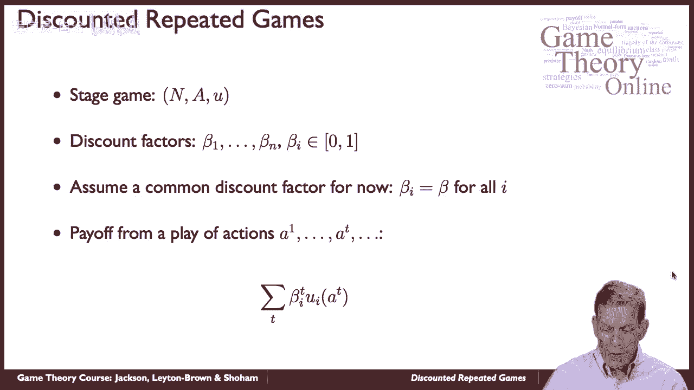

---

## 策略与历史

在无限重复的博弈中，玩家的策略可以根据过去的互动历史来制定。

一段**历史**（History）记录了到某一时刻为止，所有玩家在每一期所做的选择。它是一个行动序列的列表。

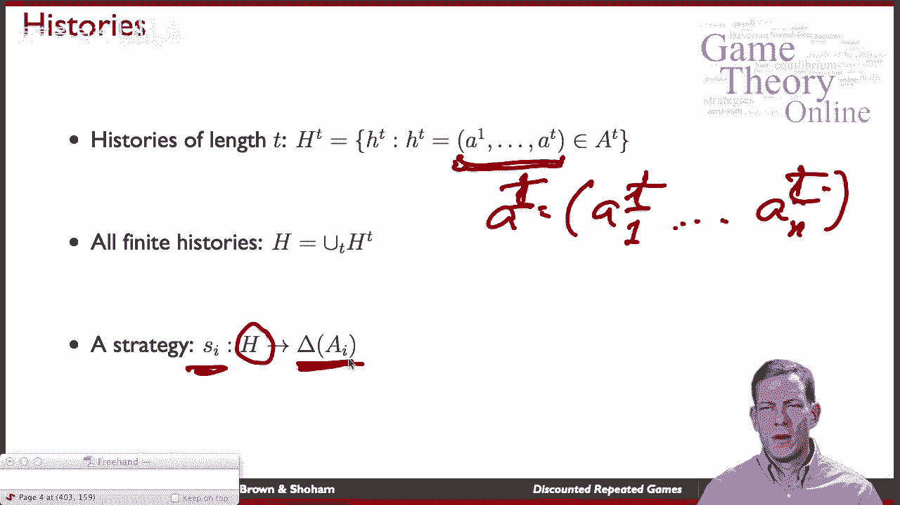

一个**策略**（Strategy）则是一个映射规则：对于每一个可能的历史，它都指定了玩家在当前时期将采取何种（混合）行动。

以下是理解策略与历史关系的关键点：
*   策略决定了玩家在面对任何可能的历史时，将如何行动。
*   例如，在重复囚徒困境中，历史可能是“第一期都合作，第二期对手背叛，第三期都背叛”。策略则需要规定，在看到这个历史后，第四期应该合作还是背叛。

---

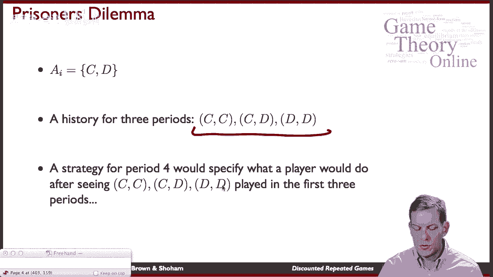

## 子博弈精炼均衡

与之前一样，我们关注**子博弈精炼纳什均衡**（SPNE）。这意味着，从任何一个历史点开始的“子博弈”中，玩家所遵循的策略组合都必须构成纳什均衡。

一个简单的SPNE例子是：无论过去发生了什么，每个玩家在每一期都永远选择阶段博弈的纳什均衡行动（例如，在囚徒困境中永远选择“背叛”）。可以验证，这是一个子博弈精炼均衡。

---

## 应用：折扣重复囚徒困境

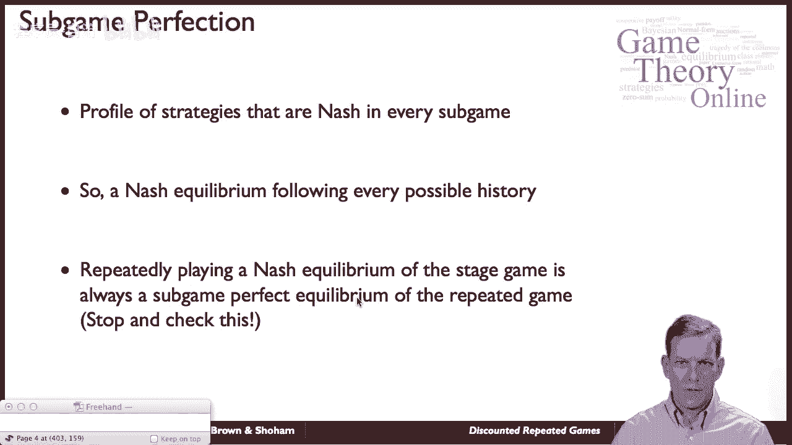

现在，让我们在折扣背景下具体分析重复囚徒困境。假设阶段博弈的收益矩阵如下：

|          | 合作 | 背叛 |
| :------- | :--- | :--- |
| **合作** | 3, 3 | 0, 5 |
| **背叛** | 5, 0 | 1, 1 |

静态博弈的唯一纳什均衡是（背叛，背叛），收益为 (1, 1)。但我们希望维持（合作，合作），收益为 (3, 3)。

我们考虑以下**触发策略**：
*   开始时选择合作。
*   只要历史上所有人都合作，就继续合作。
*   如果任何人曾经背叛，则从下一期开始，永远选择背叛。

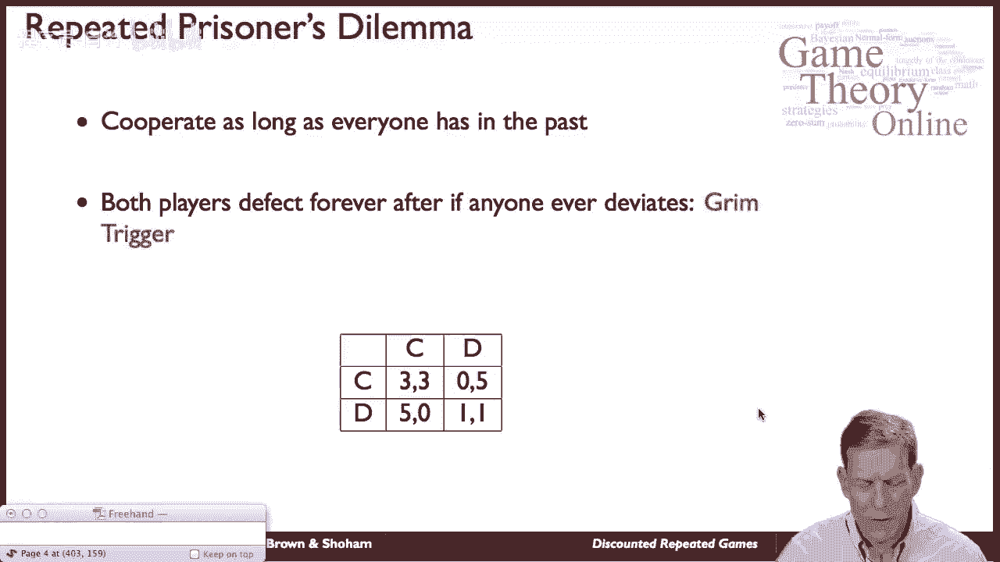

我们需要找到，在什么样的折扣因子 **β** 下，这对触发策略能构成子博弈精炼均衡。

**计算合作与背叛的收益：**

1.  **始终合作的收益**：`3 + β·3 + β²·3 + ... = 3 / (1 - β)`
2.  **当前期背叛的收益**：如果对手本期合作，背叛能获得当期收益5。但触发惩罚，未来每期收益仅为1。
    *   收益为：`5 + β·1 + β²·1 + ... = 5 + β/(1 - β)`

**比较收益：**
玩家愿意合作而不是背叛的条件是：合作的收益 ≥ 背叛的收益。

`3 / (1 - β) ≥ 5 + β/(1 - β)`

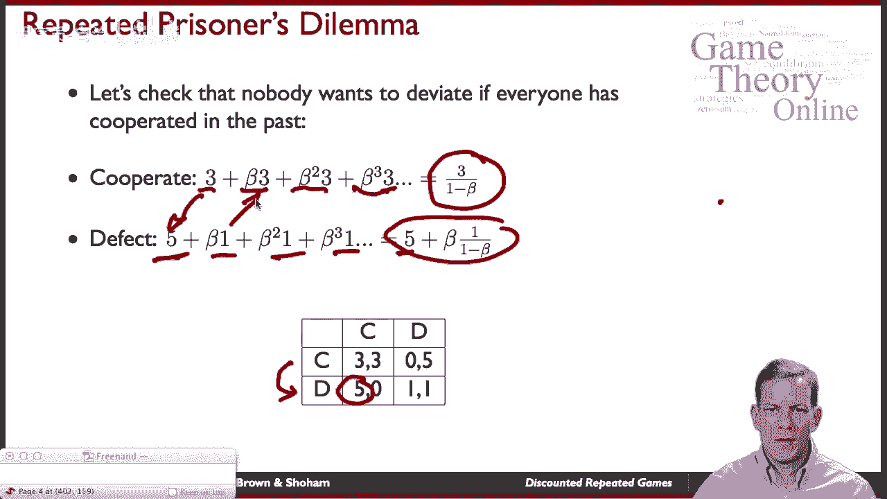

解这个不等式：

`3 ≥ 5(1 - β) + β`
`3 ≥ 5 - 5β + β`
`3 ≥ 5 - 4β`
`4β ≥ 2`
`β ≥ 1/2`

**结论：** 只要折扣因子 **β ≥ 1/2**，即玩家关心明天的程度至少是今天的一半，上述触发策略就能构成子博弈精炼均衡，从而维持合作。

---

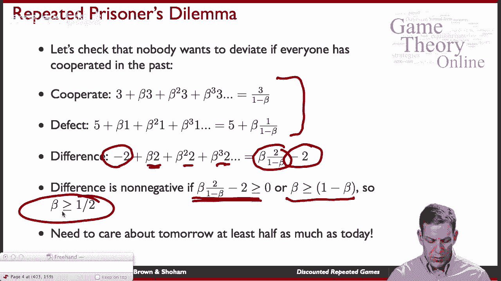

## 参数变化的影响

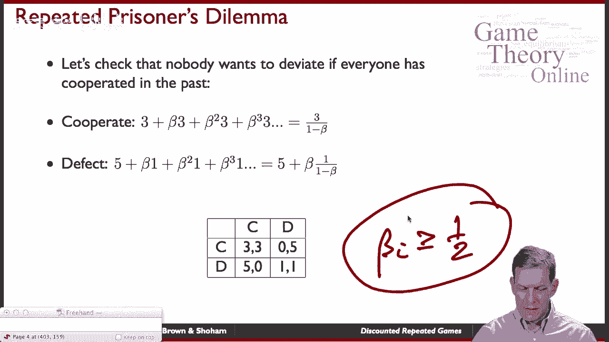

上一节我们计算了特定收益下的合作条件。本节中我们来看看如果改变收益参数，结论会如何变化。

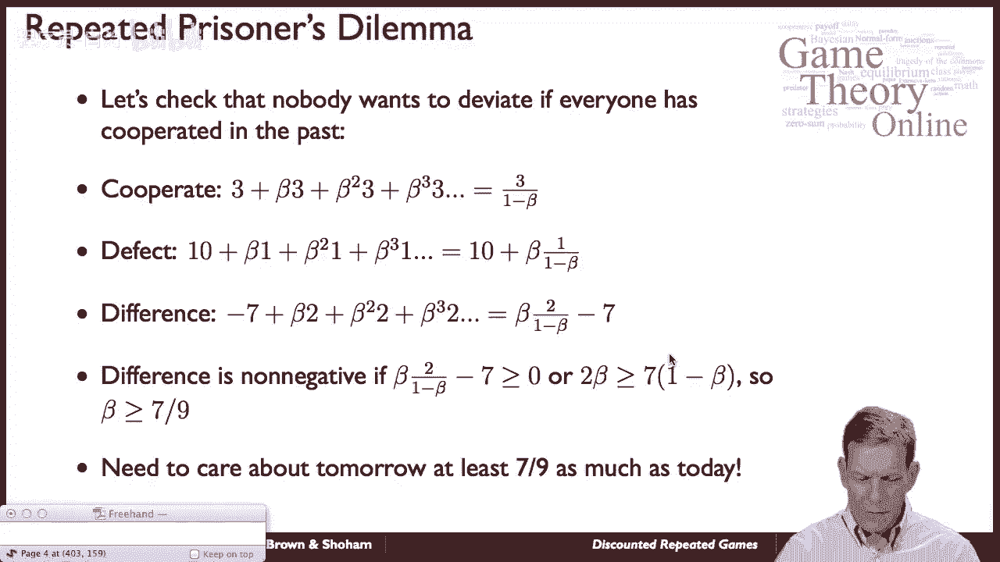

假设背叛的诱惑变得更大，收益矩阵变为：

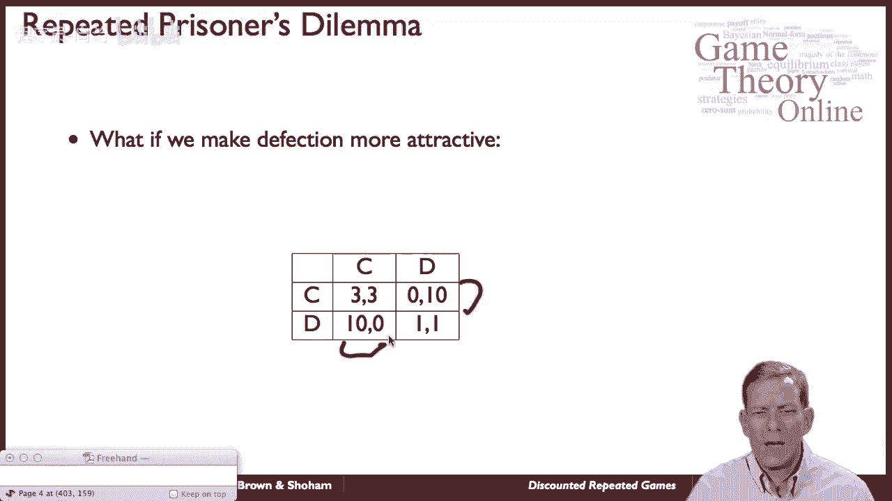

|          | 合作 | 背叛 |
| :------- | :--- | :--- |
| **合作** | 3, 3 | 0, 10|
| **背叛** | 10,0 | 1, 1 |

重复同样的计算：
*   合作收益不变：`3 / (1 - β)`
*   背叛收益：`10 + β/(1 - β)`

合作条件为：
`3 / (1 - β) ≥ 10 + β/(1 - β)`
`3 ≥ 10(1 - β) + β`
`3 ≥ 10 - 10β + β`
`3 ≥ 10 - 9β`
`9β ≥ 7`
`β ≥ 7/9 ≈ 0.778`

**结论：** 当背叛的当期收益更高时，要维持合作，玩家必须更加重视未来（β需要更大，达到约0.778）。这体现了基本权衡：**未来的惩罚必须足够严厉，且玩家必须足够关心未来，才能抵消当期背叛的诱惑。**

---

## 核心逻辑总结

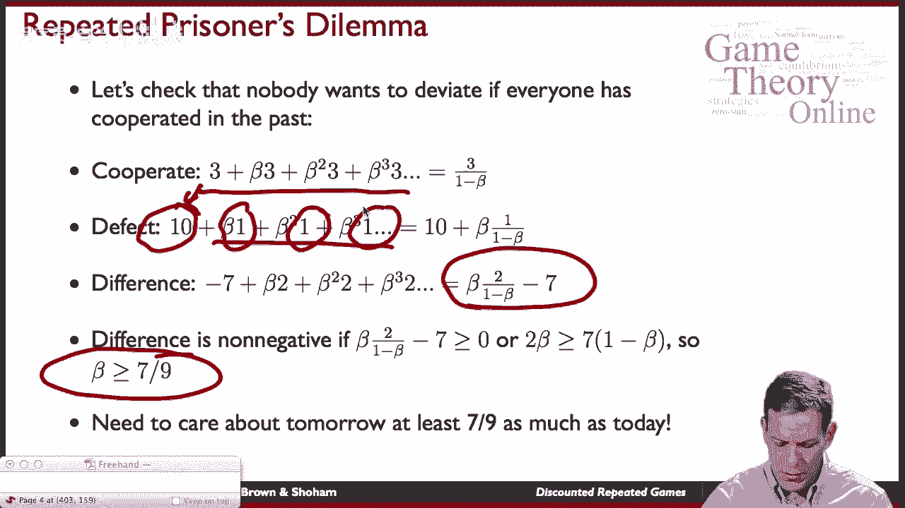

本节课中我们一起学习了折扣重复博弈的分析方法。其核心逻辑可以总结为以下几点：
*   **可持续性条件**：一个高于单次纳什均衡的收益组合能否被维持，取决于三个因素：
    1.  当期偏离的诱惑有多大（当期额外收益）。
    2.  未来惩罚的严重性（惩罚阶段的收益损失）。
    3.  玩家对未来的重视程度（折扣因子β的大小）。
*   **可信威胁**：所承诺的未来惩罚本身，必须在惩罚开始的子博弈中构成均衡（即必须是可信的）。
*   **公式化检查**：通过比较“遵守协议的总贴现值收益”与“偏离协议的总贴现值收益”，可以解出维持合作所需的折扣因子临界值。

---

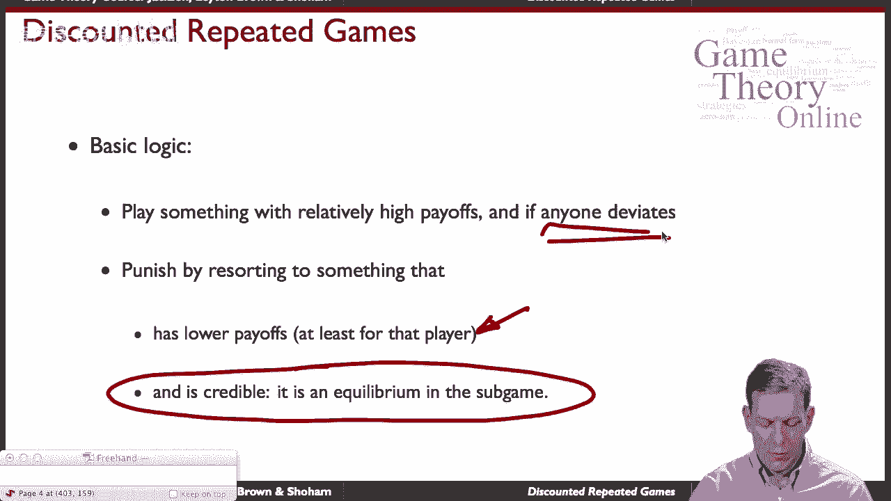

**总结**：在折扣重复博弈中，合作能否出现并维持，关键在于玩家对未来收益的重视程度是否足以让他们为了长远的利益，而克制住当期背叛的短期诱惑。通过设定可信的未来惩罚机制，并满足一定的折扣因子条件，即使是在囚徒困境这类冲突性博弈中，合作也可能成为理性玩家的均衡选择。