# 41：折扣重复博弈的一种民间定理 📜

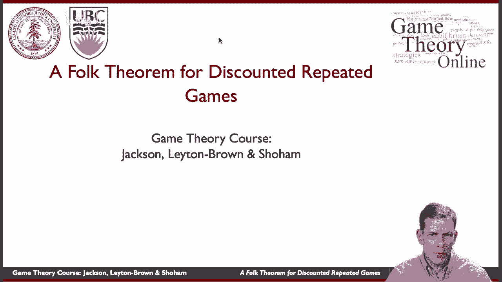

在本节课中，我们将学习重复博弈理论中的一个重要概念——民间定理。我们将探讨在存在未来收益折扣的情况下，博弈参与者如何通过威胁和惩罚机制，在无限重复的博弈中维持比单次博弈纳什均衡更优的合作结果。

---

上一节我们介绍了一些重复博弈的例子，本节中我们来看看如何将这种逻辑推广到一般情况。

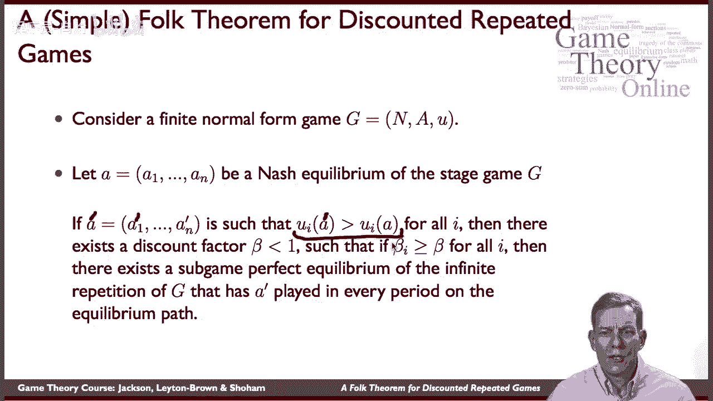

## 定理陈述与核心思想 🎯

民间定理有许多版本，我们将介绍一个特别且证明相对简单的版本。其核心思想如下：

*   首先，考察一个**单阶段博弈**，并找出它的一个**纳什均衡**策略组合。
*   其次，寻找一个**替代策略组合**，使得所有参与者在采用这个替代策略时获得的收益，都**严格高于**他们在纳什均衡中获得的收益。

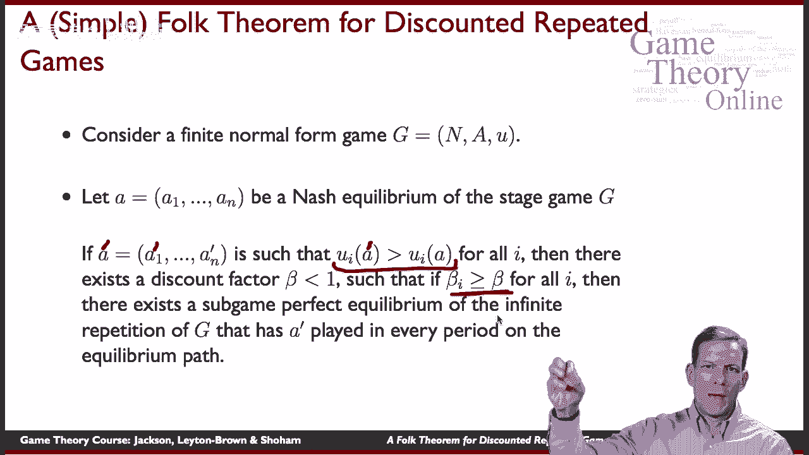

那么，存在一个**折扣系数**的临界值。如果所有参与者的实际折扣系数都高于这个临界值，那么在无限重复的博弈中，就存在一个**子博弈完美均衡**，使得在均衡路径上的每一个阶段，参与者都执行那个更优的替代策略组合。

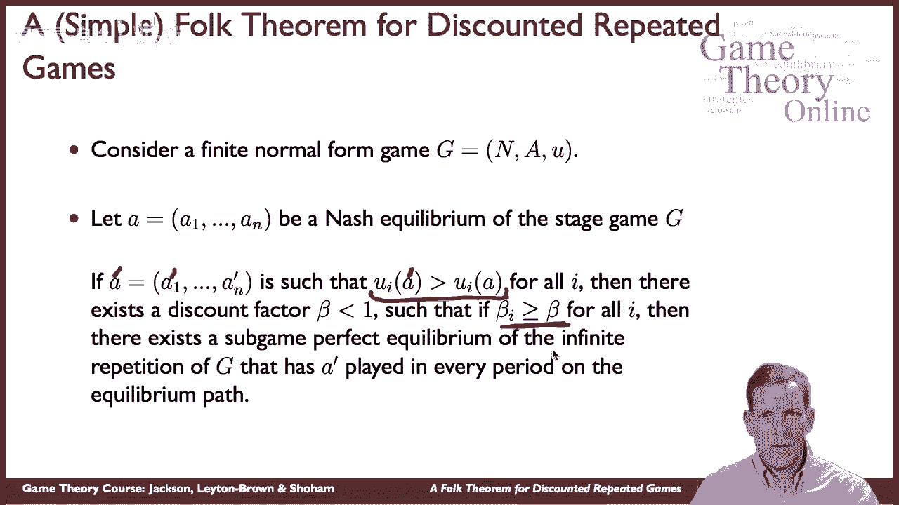

这个定理告诉我们，之前在囚徒困境等例子中使用的逻辑（通过“触发策略”惩罚偏离者以维持合作）具有普遍性。对于任何博弈，只要找到比纳什均衡更优的结果，并且参与者对未来足够有耐心（即折扣系数足够高），就可以在无限重复的博弈中维持这个更优的结果。

## 定理的证明思路 🔍

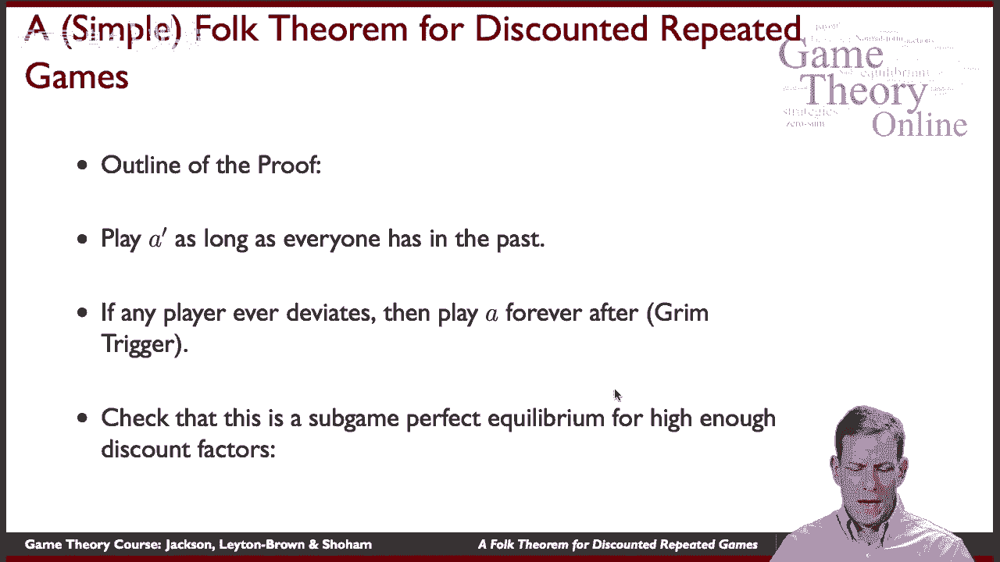

定理的证明思路与我们之前例子中的逻辑非常相似。

以下是构建均衡策略的核心步骤：

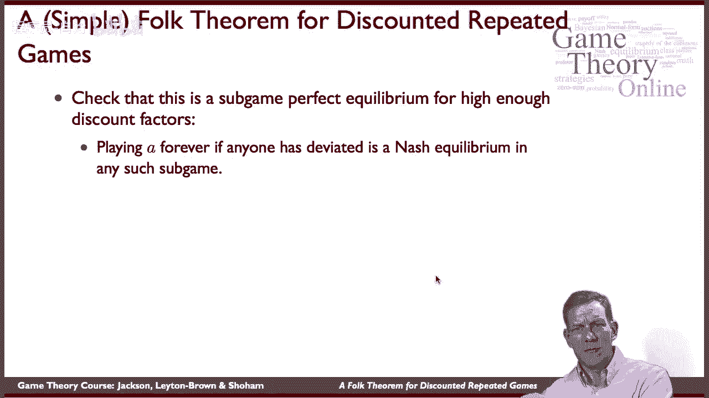

1.  **合作路径**：只要历史上没有人偏离，所有参与者就在每一期都执行那个更优的替代策略组合。
2.  **惩罚机制**：一旦有任何参与者偏离了合作路径，从下一期开始，所有参与者将永久性地转向执行单阶段博弈的纳什均衡。这是一个“冷酷触发”策略。

我们需要确保，参与者因今天偏离而获得的短期收益，不足以弥补其未来因遭受惩罚而带来的长期损失。关键在于，惩罚阶段所执行的纳什均衡，其收益低于合作路径的收益。

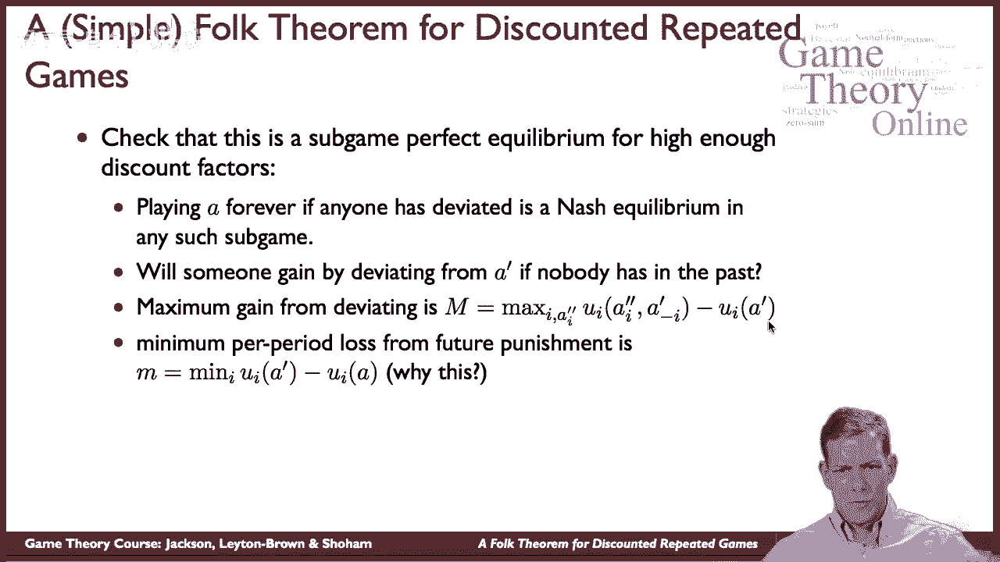

接下来，我们分析参与者是否会想要偏离。

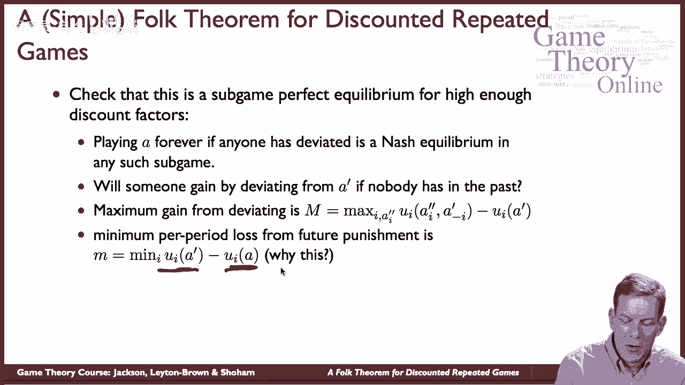

### 偏离的收益与成本分析

我们需要检查，在合作路径上，参与者是否想单方面偏离。

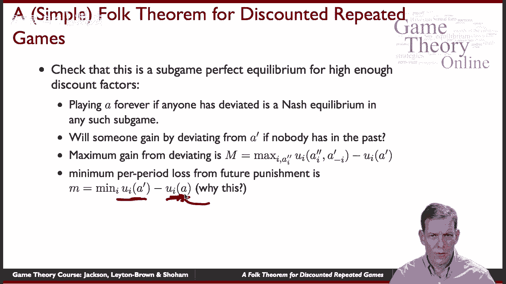

*   **偏离的最大单期收益**：我们计算参与者 `i` 通过偏离可能获得的**最大额外收益**。这等于他通过最佳可能偏离所能获得的最高收益，减去他在合作路径上原本能获得的收益。我们用 **`M_i`** 来表示这个最大值。
    *   **公式**：`M_i = max_{a_i} [u_i(a_i, a'_{-i}) - u_i(a')]`，其中 `a'` 是合作策略组合。
*   **偏离的最小未来损失**：偏离后，参与者 `i` 从下一期开始，每期将损失合作收益与惩罚（纳什均衡）收益之间的差额。我们用 **`m_i`** 来表示这个**最小损失**。
    *   **公式**：`m_i = u_i(a') - u_i(NE)`，其中 `NE` 是纳什均衡策略组合。

为什么惩罚是可信的？因为在惩罚阶段，所有人都执行纳什均衡，这意味着给定其他参与者的策略，任何参与者都无法通过单方面改变自己的行为在惩罚阶段获得更好的收益。

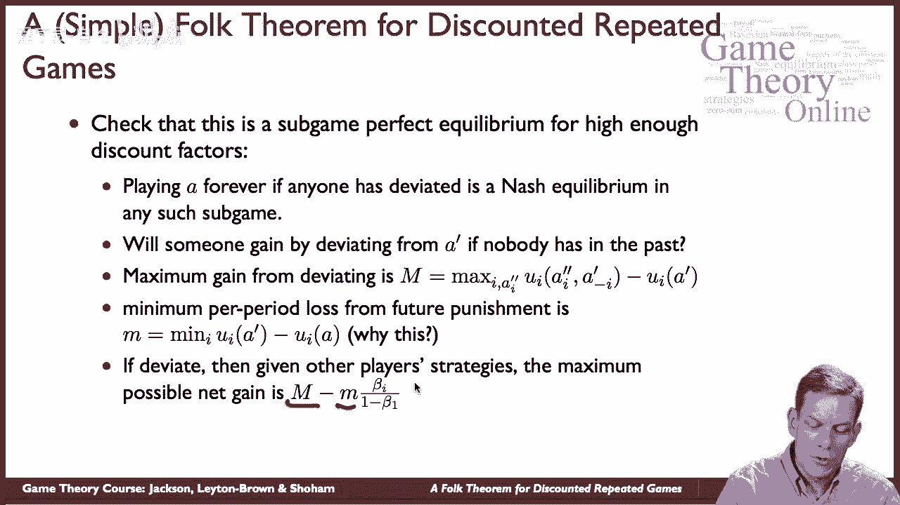

### 可持续合作的条件

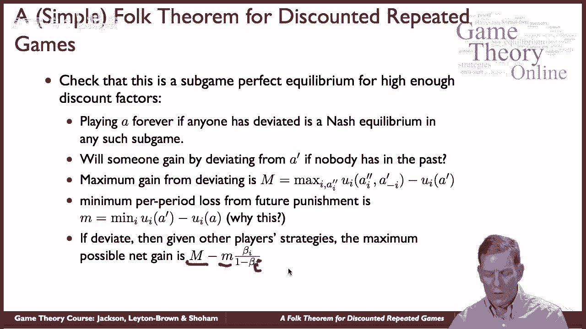

参与者 `i` 不会偏离的条件是：偏离带来的短期收益，小于未来所有期损失的总现值。

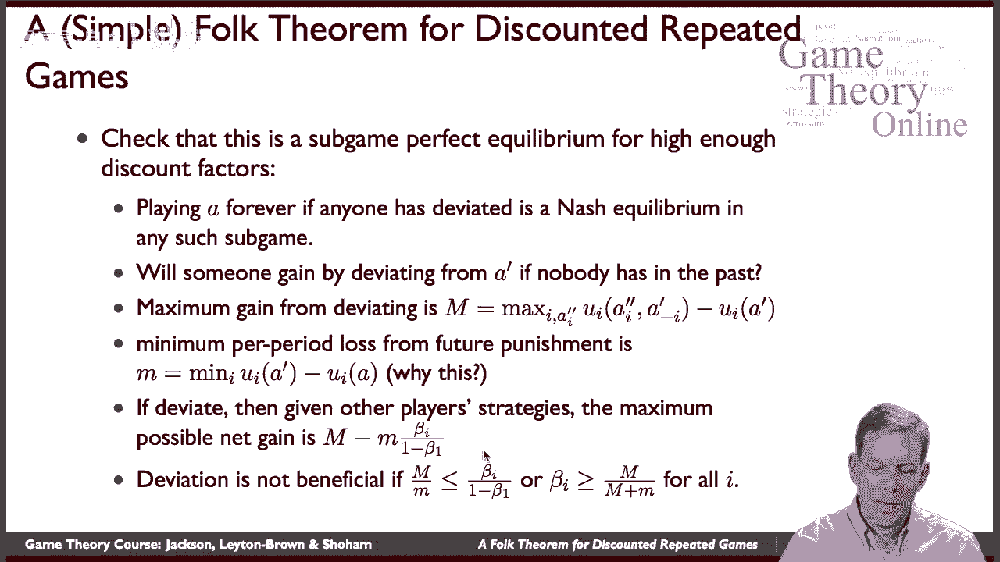

未来每期损失 `m_i`，其总现值为：`m_i * (δ_i + δ_i^2 + δ_i^3 + ...) = m_i * δ_i / (1 - δ_i)`

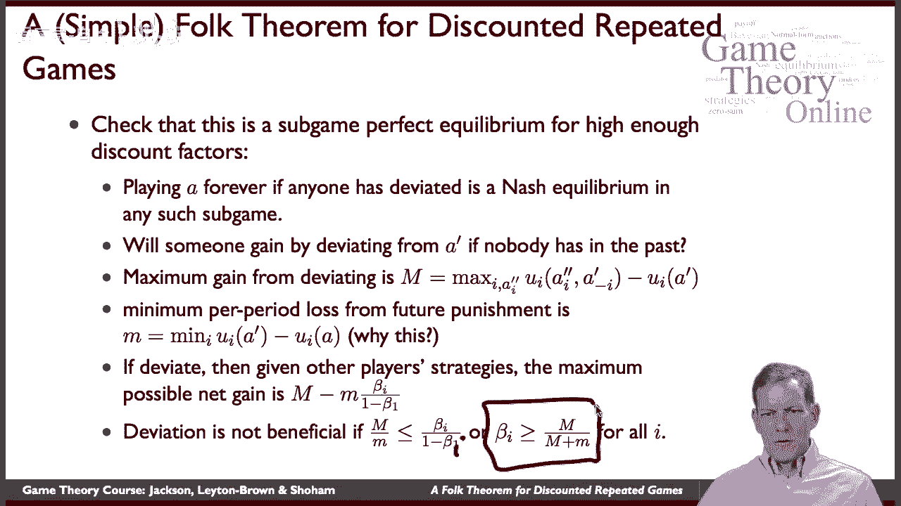

因此，不偏离的条件是：
**`M_i <= m_i * δ_i / (1 - δ_i)`**

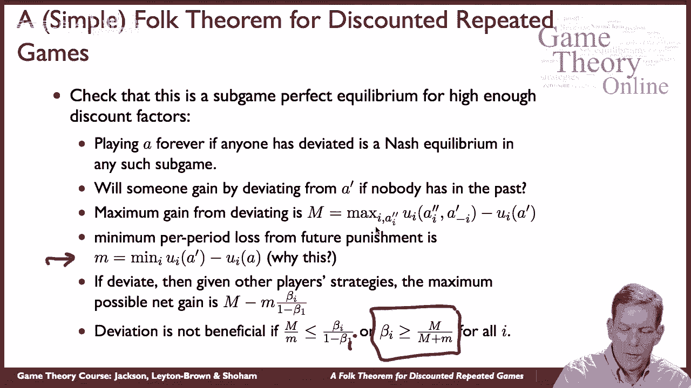

对这个不等式进行变换，我们可以解出参与者 `i` 的折扣系数 `δ_i` 必须满足的下限：
**`δ_i >= M_i / (M_i + m_i)`**

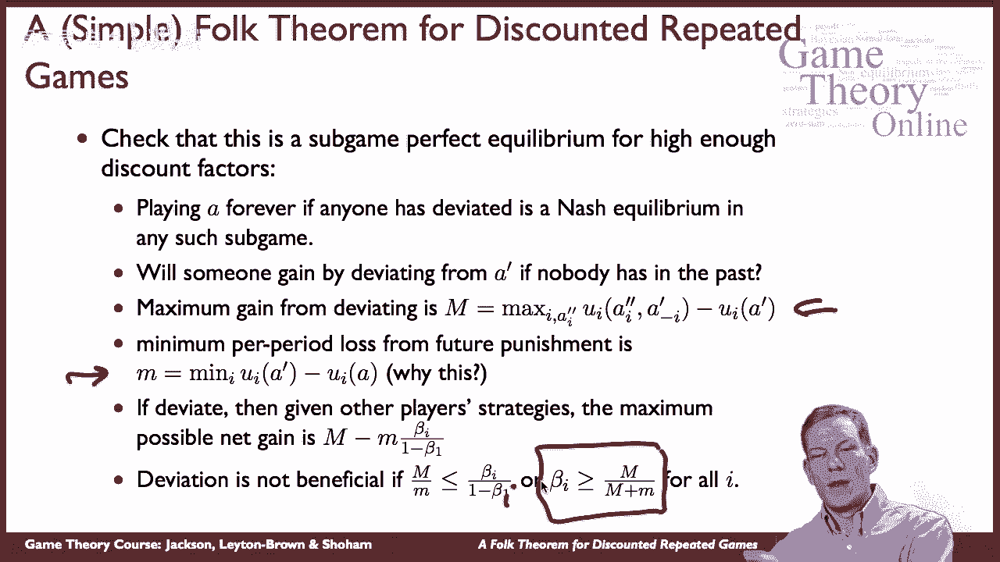

这个条件对每个参与者 `i` 都必须成立。只要所有参与者的折扣系数都足够高（大于各自计算出的临界值），那么合作路径（执行更优的替代策略）就可以作为一个子博弈完美均衡得以维持。

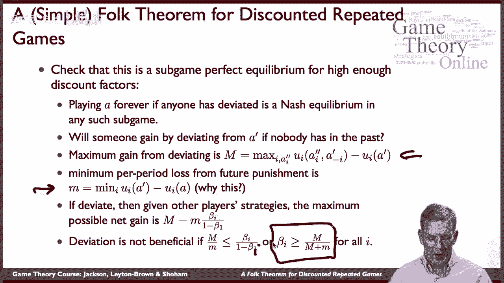

---

上一节我们介绍了维持固定合作策略的定理，本节中我们来看看如何将其扩展以实现更复杂的合作模式。

## 定理的扩展与应用实例 🔄

民间定理不仅限于维持一个固定的策略组合。只要未来价值足够大，参与者可以维持许多复杂的、随时间变化的行动模式。

让我们回顾之前提到的囚徒困境博弈，但其收益矩阵有所不同：

|          | 合作(C) | 背叛(D) |
| :------- | :-----: | :-----: |
| **合作(C)** |  3， 3  |  0， 10  |
| **背叛(D)** | 10， 0  |  1， 1   |

在这个博弈中：
*   纳什均衡 (NE) 是 (D, D)，收益为 (1, 1)。
*   相互合作 (C, C) 的收益是 (3, 3)，优于纳什均衡。
*   但还存在一个非常不均等的结果 (C, D) 或 (D, C)，其收益分别为 (0,10) 和 (10,0)，总和为10。

参与者可以设计一个更复杂的合作计划来获得更高的**平均收益**。例如，他们可以约定：
*   在奇数期（第1、3、5...期），执行 (C, D)，玩家1获得0，玩家2获得10。
*   在偶数期（第2、4、6...期），执行 (D, C)，玩家1获得10，玩家2获得0。

只要双方一直遵守这个轮流“占便宜”的规则，从长期平均来看，每个参与者每期都能获得 `(0+10)/2 = 5` 的收益，这比一直合作 (3,3) 或一直背叛 (1,1) 都要好。

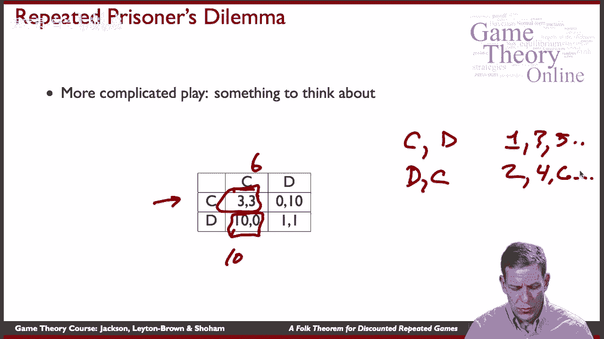

以下是维持这种轮流合作模式的策略：
*   **合作路径**：按照上述规则轮流选择行动。
*   **惩罚机制**：如果任何参与者在任何一期没有按照约定行动（例如，该他合作时却背叛了），那么从下一期开始，双方将永久转向纳什均衡 (D, D)，每期只获得1的收益。

然后，我们可以像之前一样，分别计算两位参与者在不同时期偏离的潜在收益 `M_i` 和未来损失 `m_i`，并求解出维持这种轮流合作模式所需的折扣系数下限。通常，两位参与者所需的最低耐心程度（折扣系数）会不同。

这种逻辑在现实中也有应用。例如，竞争公司轮流中标政府合同，以避免激烈的价格竞争，从而共同维持较高的利润水平。只要它们都看重未来的合作机会，并且有办法监督和惩罚违约者，这种“轮流坐庄”的合谋就可能持续。

---

## 总结与延伸思考 💡

本节课中我们一起学习了重复博弈中的一个核心结论——民间定理。

1.  **核心机制**：在无限重复的博弈中，参与者可以通过**基于历史的策略**（如触发策略）来影响彼此的预期和行为，从而在单阶段博弈的纳什均衡之外，实现更优的合作结果。
2.  **关键条件**：合作得以维持的关键在于参与者**对未来有足够的耐心**，即折扣系数 `δ` 足够高，使得未来惩罚的威胁足以遏制当前的背叛冲动。
3.  **定理内涵**：民间定理揭示了重复博弈中均衡的**多重性**。只要满足耐心条件，许多高于单阶段纳什均衡收益的结果都可以成为均衡。这部分知识在理论被严格形式化之前，就已以“民间传说”的形式在博弈论学者中流传。

重复博弈至今仍是活跃的研究领域，有许多有趣的延伸方向：
*   **不完全信息**：如果参与者不能完全观察到他人的行动（存在噪音），合作如何维持？
*   **不确定收益**：如果博弈的收益结构本身会随时间随机变化，策略该如何调整？
*   **重新谈判**：这是一个深刻的问题。如果偏离真的发生，惩罚开始后，参与者可能会觉得永远惩罚下去对大家都不利，从而想“重新谈判”回到合作。但如果偏离者预期最终会被原谅，那么最初的威慑力就会消失。如何将重新谈判的可能性纳入均衡分析，是一个复杂的课题。

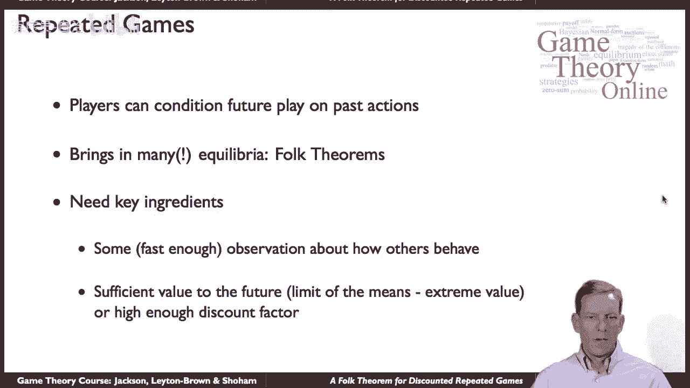

总之，重复博弈模型为我们理解长期互动中的合作、声誉和惩罚提供了强大的框架。它表明，在静态环境中无法达成的合作，在动态的、面向未来的关系中是有可能实现的。