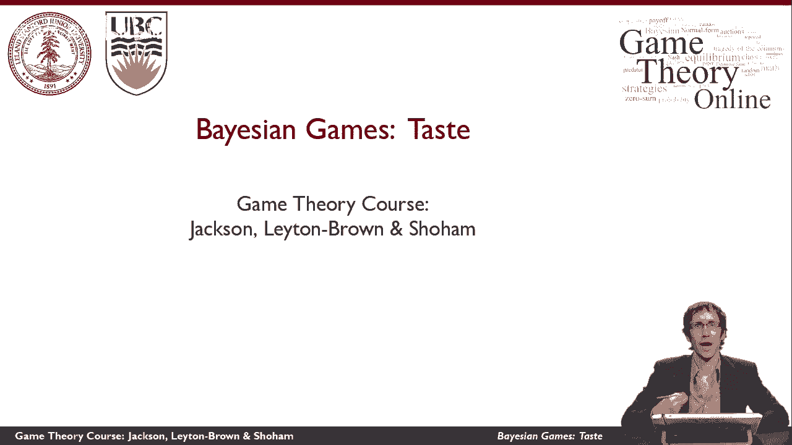
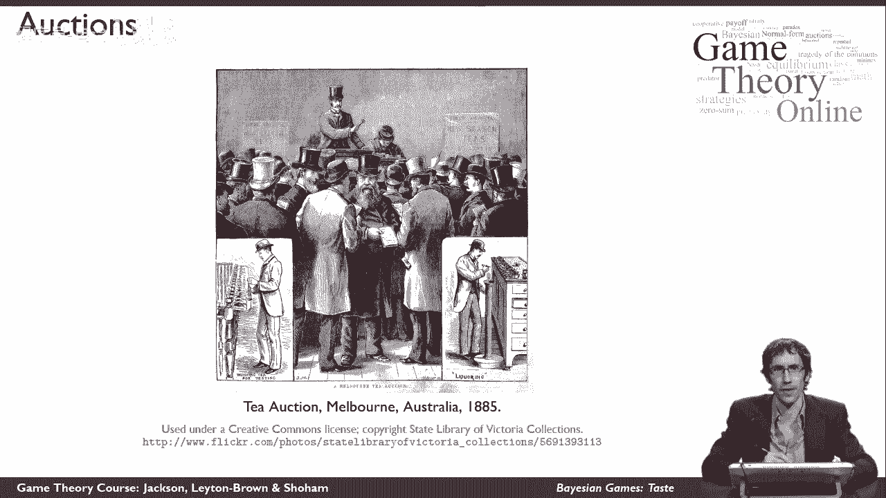
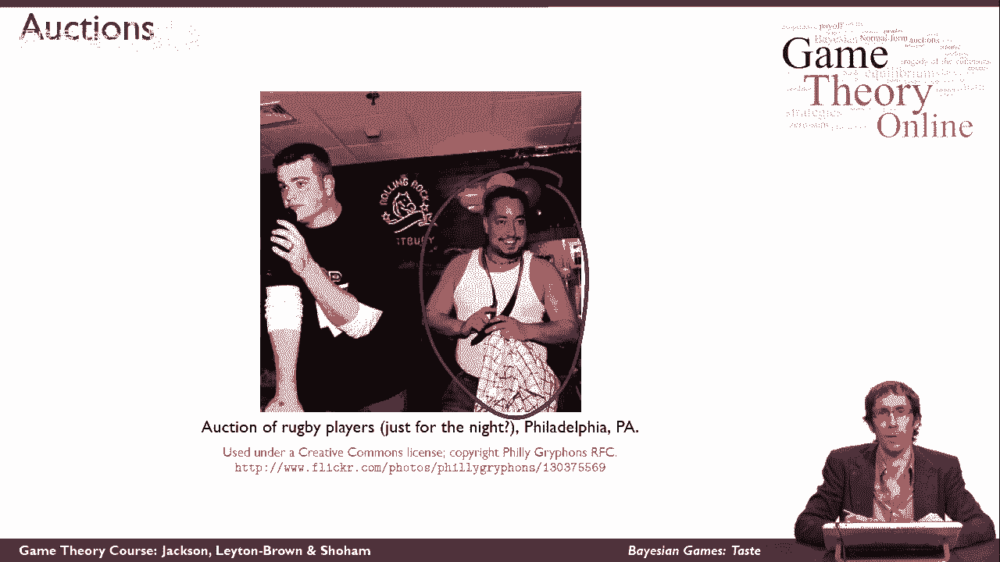
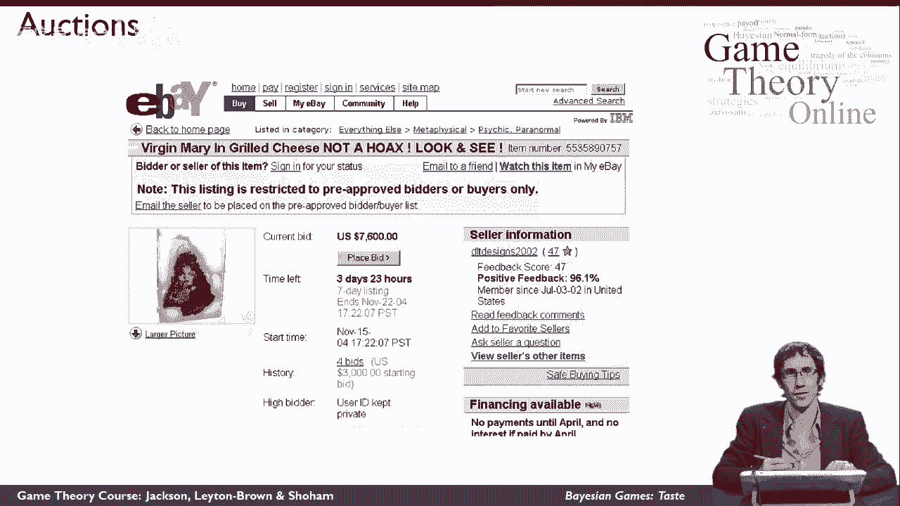
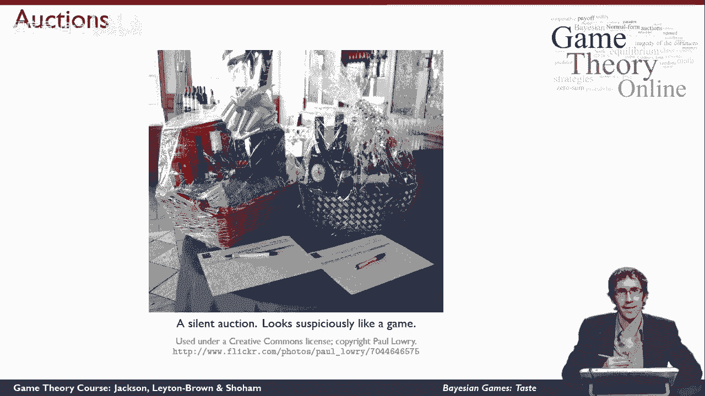

# 42：贝叶斯博弈基本定义 🎲

在本节课中，我们将学习一种新的博弈表示方法——贝叶斯博弈。我们将通过拍卖的例子，理解为什么需要引入这种模型，以及它如何帮助我们分析参与者信息不完全的情况。

---

## 拍卖：一个普遍且重要的现实场景

拍卖是一种非常实际且重要的经济活动，在世界各地被用于多种不同的交易。

例如，1885年的一幅木刻画展示了澳大利亚墨尔本的一场拍卖。画面中，一个戴大礼帽的人站在房间前面，手持木槌，以可能很滑稽的语调说话。在某个时刻，他敲下木槌，意味着有人刚刚赢得了一批茶叶。

---

## 现代拍卖的多样性与必要性

拍卖在现代社会中的应用更加广泛，其形式也多种多样。

一个更现代的例子是2000年用于卖鱼的8场拍卖会。由于鱼容易变质且价值变化快，找到一种方法来确定每日的合理价格至关重要。另一个例子是美国法警服务举办的拍卖会，一群戴着牛仔帽的人围捕并出售某人的马匹，以收回被挪用的资金。拍卖在这里被使用，是因为像马匹这类物品的价值很不明确，它取决于供求关系以及特定时间市场上其他马匹的数量等无形因素。

还有一场橄榄球运动员的拍卖。同样，由于很难确定一名球员的确切价值，拍卖成为一种必要的定价机制。

---

## 互联网催生的新兴拍卖市场

互联网极大地扩展了拍卖的应用范围，甚至在以前不存在的领域创造了市场。

几年前eBay上发生的一场著名拍卖就是一个例子。佛罗里达州的一位女士在吃自制的烤奶酪三明治时，惊讶地发现烤痕的形状酷似圣母玛利亚。她认定这是宗教遗物，于是停止食用，并将其放在eBay上拍卖。当我截取这张截图时，距离拍卖结束还有近四天，最高出价已达到7600美元。这并非骗局，而是真实的新闻报道。这件事展示了拍卖在匹配买家和卖家方面的强大力量。

---

## 无声拍卖：一个直观的博弈模型

无声拍卖为我们提供了一个直观的视角，来理解拍卖如何可以被建模为一个博弈。

在慈善无声拍卖中，一个礼品篮被展出。所有有兴趣购买的人可以上前检查，决定它对自己值多少钱，然后在纸上写下自己的名字和出价金额。这看起来很像一个博弈：
*   我们有定义明确的行动空间：参与者前来，查看纸上的历史出价（其他参与者的行动），然后采取行动——写下自己的出价数字。
*   最终，参与者大概不会写出一个高于礼品篮对其自身价值的数字。
*   如果参与者出价最高，他将赢得礼品篮，并获得一定的效用。这个效用取决于礼品篮对他的价值减去他的出价（即“消费者剩余”）。

因此，我们可以尝试在本课程的框架下为无声拍卖建模。

---

## 从无声拍卖到贝叶斯博弈的关键洞察

然而，无声拍卖案例有一个关键点，使其不同于我们之前讨论过的博弈。

当我试图推理其他参与者在这场比赛中的行为时，我需要思考**他们认为礼品篮对他们自己值多少钱**。这对他们选择如何行动至关重要，因为这直接影响他们的效用函数。

**关键问题在于：我并不知道其他参与者的效用函数。**

即使我能想象到博弈中所有可能的行动，这也是一个与我们之前看过的环境不同的新情况。这对于为拍卖建模是必要的，因为**我不太确定拍卖物品对其他所有参与者值多少钱**，而这个事实对我自己在拍卖中的战略推理至关重要。

这种**对他人效用函数的不确定性**，是引入贝叶斯博弈的核心动机。

---

## 总结

本节课中，我们一起学习了贝叶斯博弈的基本概念。我们通过多个拍卖实例看到，在许多现实情境中，参与者无法完全知晓他人的偏好（效用函数）。这种信息的不完全性，使得传统的博弈模型不足以进行分析。因此，我们需要引入贝叶斯博弈这一新框架，它将参与者的“类型”（代表其私人信息，如对物品的估值）纳入模型，从而能够更准确地描述和分析这类包含不完全信息的战略互动场景。