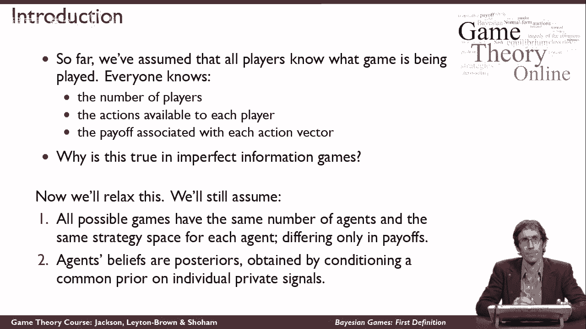
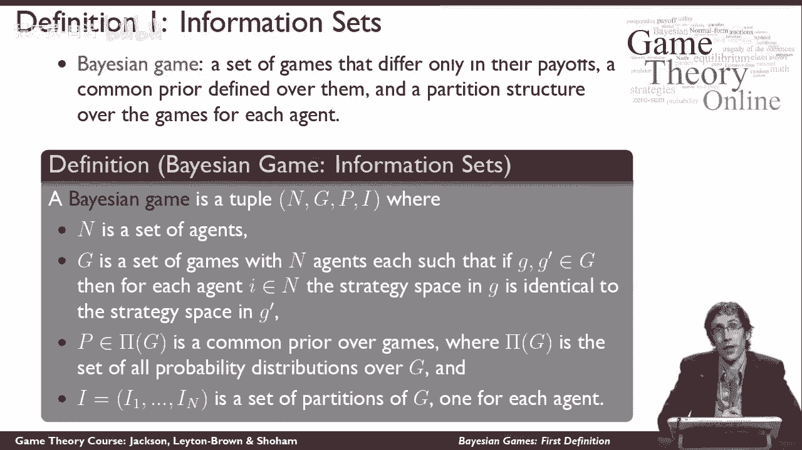
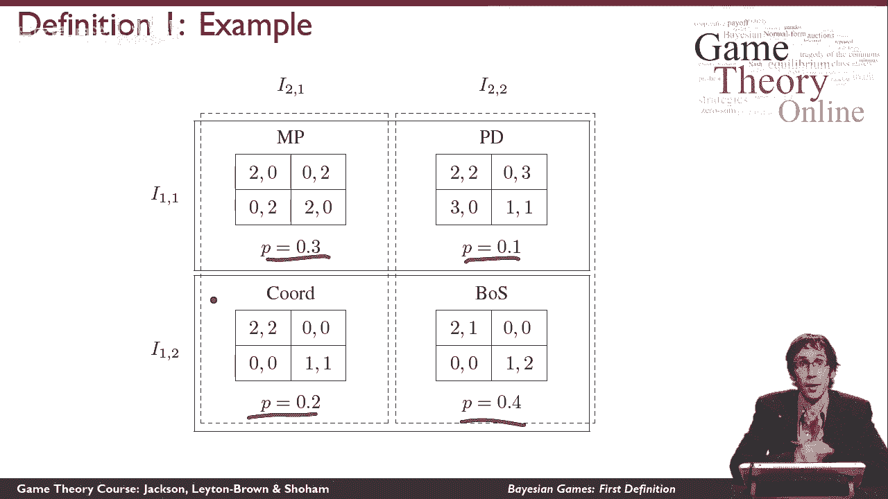

# 43：贝叶斯博弈的第一个定义 🎲

在本节课中，我们将学习贝叶斯博弈的第一个正式定义。我们将探讨当玩家对游戏本身的信息不完全时，如何对博弈进行建模。这包括理解“共同先验”和“信息分区”等核心概念。

---

## 从完全信息到不完全信息

在考虑贝叶斯博弈之前，我们所讨论的博弈都假设所有玩家都完全了解正在进行的游戏。这意味着每个玩家都知道：
*   世界上有多少玩家。
*   每个玩家可以采取什么行动。
*   如果每个人都采取了一组完整的行动，会得到什么回报。

你可能会想，在不完全信息博弈中，这些假设还成立吗？答案是肯定的。在不完全信息博弈中，你不知道的是其他玩家**已经**采取了什么行动。但你仍然知道所有玩家**可以**采取的行动，以及所有可能行动组合带来的回报。

现在，我们来思考那些上述假设不再成立的博弈。我们需要引入新的假设来建模。

---

## 贝叶斯博弈的核心假设

我们放宽了“所有玩家都知道正在玩什么游戏”的假设。现在，玩家会考虑**不止一个可能的游戏**。

在这些可能的游戏中，我们假设它们都具有：
*   相同数量的玩家。
*   每个玩家相同的策略（行动）空间。

游戏之间的唯一区别在于**效用函数**。这个限制很重要，因为如果玩家连自己或他人有什么策略都不确定，将很难进行推理。

> 注：实际上，在这个框架内也可以建模“不确定有哪些其他玩家”的情况。你可以假设每场游戏都有最大数量的玩家在场，但通过设置效用函数，使得某些玩家的存在不影响结果。

我们要做的第二个关键假设，与玩家对这些不同可能游戏的**信念**有关。为了让模型可行，必须假设：
*   玩家对世界可能的状态有明确的信念。
*   玩家从一个**共同的先验**信念开始。即，每个人最初对可能玩哪个游戏有相同的概率判断。
*   随后，玩家可能会收到关于**实际上在玩哪个游戏**的私人信息。
*   玩家会根据私人信息，对共同先验进行**贝叶斯更新**，从而形成各自的事后信念。

我们假设玩家有共同的先验。虽然可以建模不同的先验信念，但在标准的贝叶斯博弈定义中，我们通常采用共同先验的假设。

---

## 贝叶斯博弈的形式化定义 🧮

一个贝叶斯博弈由以下四个元素定义：

1.  **玩家集合**：`I = {1, 2, ..., n}`
2.  **博弈集合**：`G = {G1, G2, ..., Gk}`
    *   其中每个博弈 `Gθ` 本身包含：玩家集合、每个玩家的行动集、每个玩家的效用函数。
    *   我们限制集合 `G` 中的所有博弈都有相同的玩家集合和相同的行动集。因此，这些博弈仅在效用函数上不同。
3.  **共同先验**：`P`
    *   `P` 是定义在博弈集合 `G` 上的一个概率分布。它告诉我们每个游戏 `Gθ` 被“自然”选中的先验概率。
4.  **信息分区**：对于每个玩家 `i`，在集合 `G` 上有一个分区 `ℐ_i`。
    *   这个分区将 `G` 划分为若干个等价类。对于玩家 `i` 来说，落在同一个等价类中的游戏是**无法区分**的。这代表了玩家 `i` 的私人信息。

---

## 一个具体的例子 📊

让我们通过一个例子来理解这个定义。假设有四种可能的游戏：匹配硬币、囚徒困境、协调博弈和性别之战。

我们有一个共同的先验概率分布：
*   玩“匹配硬币”的概率是 30%。
*   玩“囚徒困境”的概率是 10%。
*   玩“协调博弈”的概率是 20%。
*   玩“性别之战”的概率是 40%。

假设所有游戏中，玩家1的行动集都是 {上， 下}，玩家2的行动集都是 {左， 右}。

现在，有趣的部分在于信息分区：
*   **玩家1** 认为“匹配硬币”和“囚徒困境”无法区分（属于一个等价类），同时认为“协调博弈”和“性别之战”无法区分（属于另一个等价类）。
*   **玩家2** 认为“匹配硬币”和“协调博弈”无法区分，同时认为“囚徒困境”和“性别之战”无法区分。

假设自然根据先验概率随机选择，实际进行的游戏是“性别之战”（概率40%）。那么：
*   玩家1会发现自己处于第二个等价类（协调博弈/性别之战）。他知道游戏不是匹配硬币或囚徒困境，但无法区分到底是协调博弈还是性别之战。
*   玩家2会发现自己处于第二个等价类（囚徒困境/性别之战）。他知道游戏不是匹配硬币或协调博弈，但无法区分到底是囚徒困境还是性别之战。

这意味着，当玩家决定采取什么行动时，他们必须在**不完全知道正在进行哪个游戏**的情况下做出选择。他们必须推理对手的行为，而对手同样在不完全信息下进行推理。

整个设定是玩家所知道的全部：他们知道共同先验 `P`，知道自己的信息分区（即自己看到了哪个等价类），也知道对手的信息分区结构。

---

## 总结

本节课中，我们一起学习了贝叶斯博弈的第一个正式定义。我们了解到，贝叶斯博弈用于建模玩家对**游戏规则本身**信息不完全的情景。其核心要素包括：
1.  一组可能的不同博弈（仅在收益上不同）。
2.  一个所有玩家共享的共同先验概率分布。
3.  每个玩家的私人信息，由其在可能博弈集合上的**信息分区**表示。

这个框架为我们分析玩家如何在不确定性下进行策略互动奠定了基础。在接下来的课程中，我们将探讨如何在这种贝叶斯博弈中寻找均衡解。