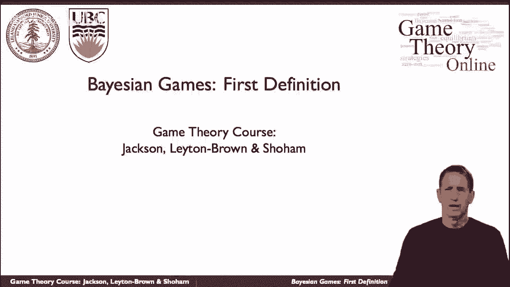
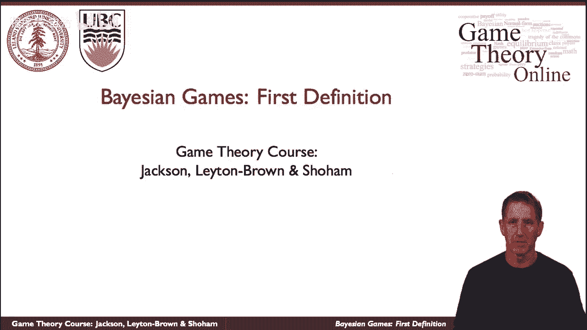
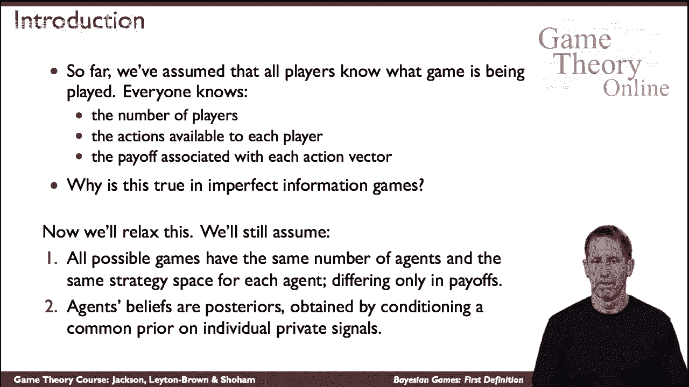
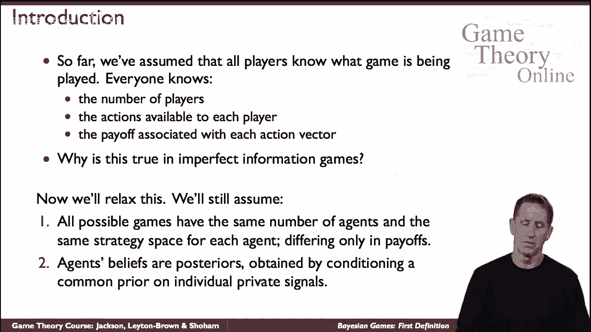
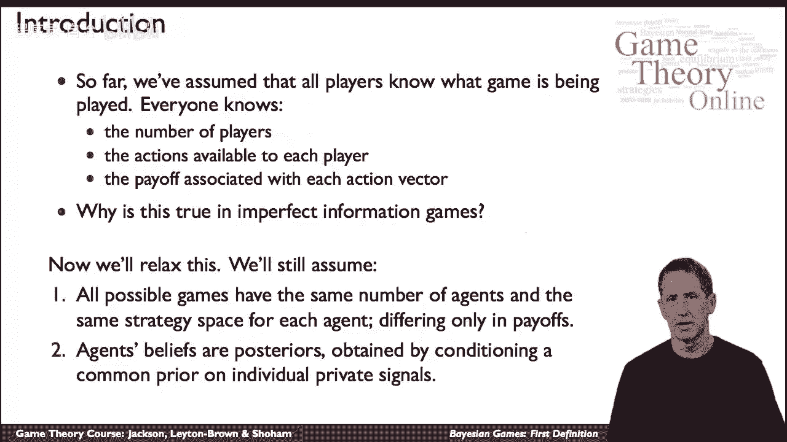
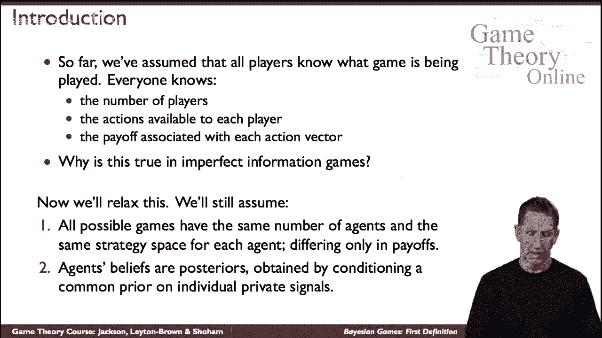
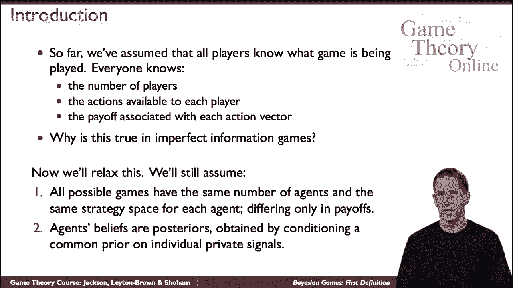
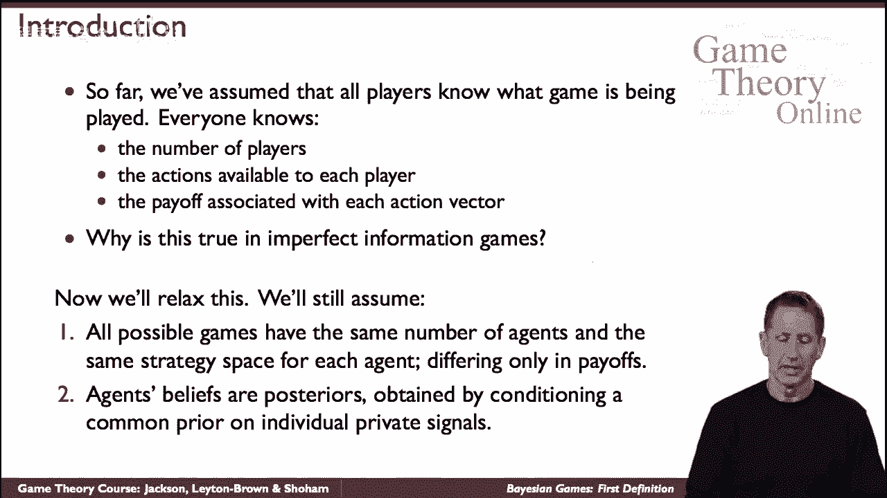
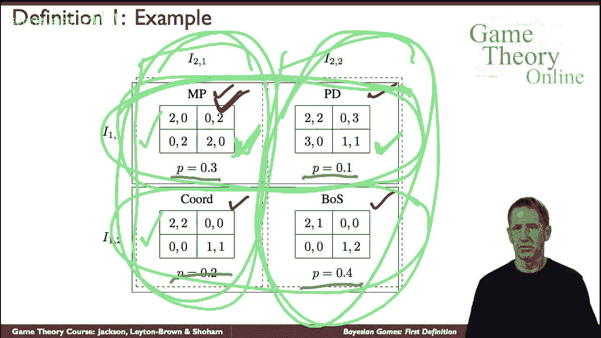

# 44：贝叶斯博弈的第一个定义 🎲

在本节课中，我们将学习一种新的博弈类型——贝叶斯博弈。这类博弈有时也被称为“不完全信息博弈”，但请注意，它不同于我们之前讨论的“不完美信息博弈”。我们将从基本定义开始，逐步理解其核心概念，并通过一个具体例子来阐明其运作方式。

---

## 博弈论基础回顾

到目前为止，我们接触的博弈都假设所有参与者（或称“智能体”）对博弈的基本设置拥有共同知识。具体而言，每个参与者都知道：
*   参与者是谁。
*   每个参与者可以采取哪些行动。
*   与每一个可能的行动组合（策略组合）相关联的收益是多少。

换句话说，尽管参与者可能不知道博弈最终会处于哪个具体状态，但他们完全清楚在所有参与者选定策略后，各种结果会带来什么收益。现在，我们将要放松其中一个关键假设。

## 引入不确定性：贝叶斯博弈的核心

我们将不再假设博弈的所有方面都是参与者的共同知识。原则上，我们可以放松多种假设，例如参与者可能不知道对手的数量，或者对手有哪些可用的行动选项。

然而，从非正式的角度理解，所有这些形式的不确定性，最终都可以归结为对博弈收益的不确定性。因此，在贝叶斯博弈中，我们做出如下设定：
*   参与者对博弈的其他一切（如参与者集合、行动空间）拥有完美的共同知识。
*   唯一的不确定性在于博弈的收益具体是什么。
*   存在一个所有参与者共享的**先验信念**，即关于可能收益分布的共同认知。
*   每个参与者会收到一个私人信号，基于这个共同的先验，他们会更新形成自己独特的**后验信念**。

这听起来可能有些抽象，接下来我们将通过正式定义和具体例子来使其变得清晰。

## 贝叶斯博弈的正式定义 📝

一个贝叶斯博弈由以下要素构成一个元组：

*   **参与者集合**：`N`，表示所有参与博弈的个体。
*   **可能世界集合**：`G`。这是一组常规形式的博弈（例如标准式博弈）。集合中的每一个游戏`g ∈ G`在其他方面都相同（参与者相同，策略空间相同），唯独**收益函数不同**。
*   **先验分布**：`P`。这是对集合`G`中各个游戏的一个概率分布。可以理解为“大自然”会根据这个分布随机决定实际进行哪一个游戏`g`。
*   **信号函数（或等价关系）**：对于每一个参与者`i ∈ N`，在集合`G`上定义了一个划分（等价类）。当大自然选择了某个游戏`g`后，参与者`i`不会直接知道是哪个`g`，而是被告知`g`属于他个人划分中的哪一个等价类。这个信息就是他的**私人信号**。

基于收到的私人信号，参与者会更新对实际进行哪个游戏的信念（即计算后验概率），然后在这个不确定性的背景下选择行动。

## 实例解析：理解信号与信念更新 🧩

假设我们有四个可能的游戏（`G`包含四个元素），它们都是我们熟悉的2x2博弈，仅收益不同：
1.  匹配硬币（Matching Pennies）
2.  囚徒困境（Prisoner‘s Dilemma）
3.  纯协调博弈（Pure Coordination）
4.  斗鸡博弈（Chicken）

大自然根据以下先验概率`P`选择游戏：
*   `P(游戏1) = 0.3`
*   `P(游戏2) = 0.1`
*   `P(游戏3) = 0.2`
*   `P(游戏4) = 0.4`

现在，定义两位参与者（行参与者Row和列参与者Col）的信号划分：

*   **行参与者 (Row)** 的划分：`{{游戏1, 游戏3}, {游戏2, 游戏4}}`
    *   这意味着，如果实际游戏是游戏1或游戏3，Row会收到同一个信号（比如信号A）。
    *   如果实际游戏是游戏2或游戏4，Row会收到另一个信号（比如信号B）。
*   **列参与者 (Col)** 的划分：`{{游戏1, 游戏2}, {游戏3, 游戏4}}`
    *   同理，游戏1或2对应Col的一个信号（信号C）。
    *   游戏3或4对应Col的另一个信号（信号D）。

**情景推演**：假设大自然实际选择的是**游戏1（匹配硬币）**。
*   Row会知道：游戏要么是1，要么是3（因为他收到了信号A）。他**不知道**具体是哪一个。
*   基于先验概率，Row会计算他的**后验信念**：他正在玩游戏1的概率是 `0.3/(0.3+0.2)=0.6`，正在玩游戏3的概率是 `0.2/(0.3+0.2)=0.4`。
*   Col会知道：游戏要么是1，要么是2（因为她收到了信号C）。
*   Col的后验信念：她正在玩游戏1的概率是 `0.3/(0.3+0.1)=0.75`，正在玩游戏2的概率是 `0.1/(0.3+0.1)=0.25`。

此外，每个参与者还会对对方持有何种信念进行推断。例如，Row知道Col要么收到了信号C（如果实际是游戏1），要么收到了信号D（如果实际是游戏3）。这种对他人信念的信念，使得分析变得多层且复杂。

## 另一种视角：贝叶斯博弈的等价表述

正是由于上述多层信念的复杂性，在分析贝叶斯博弈时，我们通常会采用一种等价的、更易于处理的表述方式。这将在后续课程中详细展开，其核心思想是将每个参与者的**类型**（由其私人信号决定）直接纳入一个更大的扩展式博弈中进行分析。

---

## 本节总结

在本节课中，我们一起学习了贝叶斯博弈的第一个定义。我们了解到：

1.  **核心区别**：贝叶斯博弈放松了“收益是共同知识”的假设，引入了收益的不确定性。
2.  **模型要素**：一个贝叶斯博弈由参与者集合、一组可能世界（收益不同的游戏）、一个先验概率分布以及为每个参与者定义的信号函数（划分）共同构成。
3.  **决策过程**：参与者根据私人信号更新对真实世界的信念（形成后验），并在这种不确定性下做出决策。
4.  **复杂性来源**：参与者的信念不仅关乎世界状态，还关乎其他参与者的信念，形成信念的层级结构。

理解这个基本框架是分析更复杂的贝叶斯博弈及其均衡概念的基础。在下一节中，我们将探讨如何为贝叶斯博弈寻找均衡解。