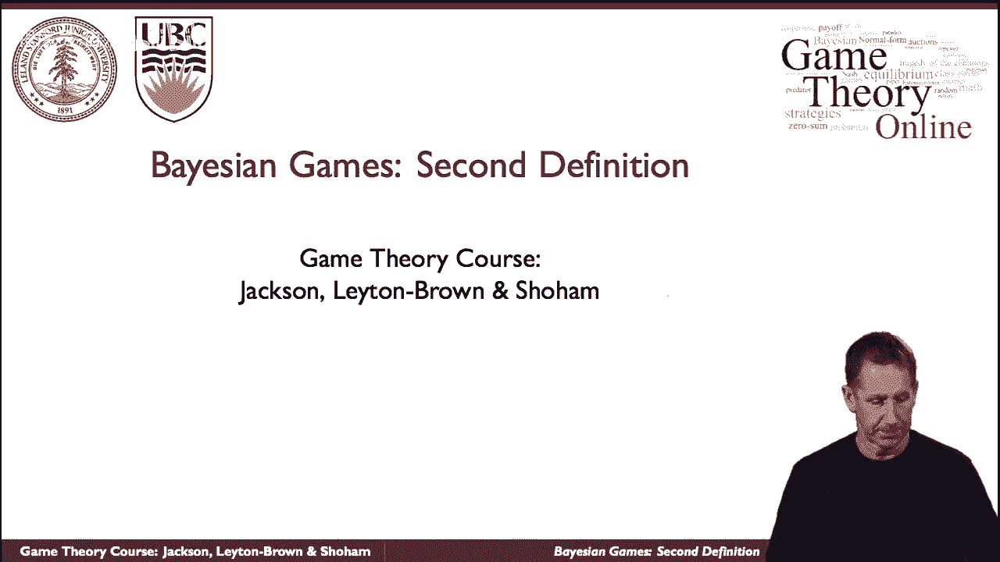
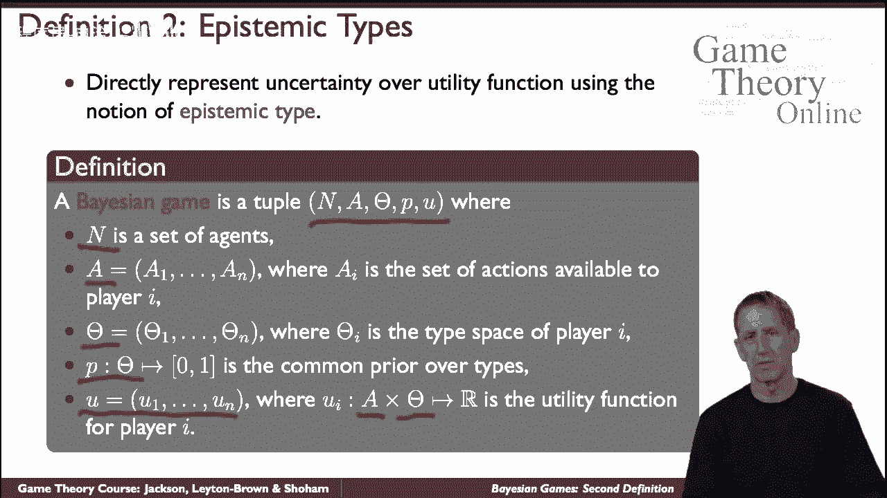
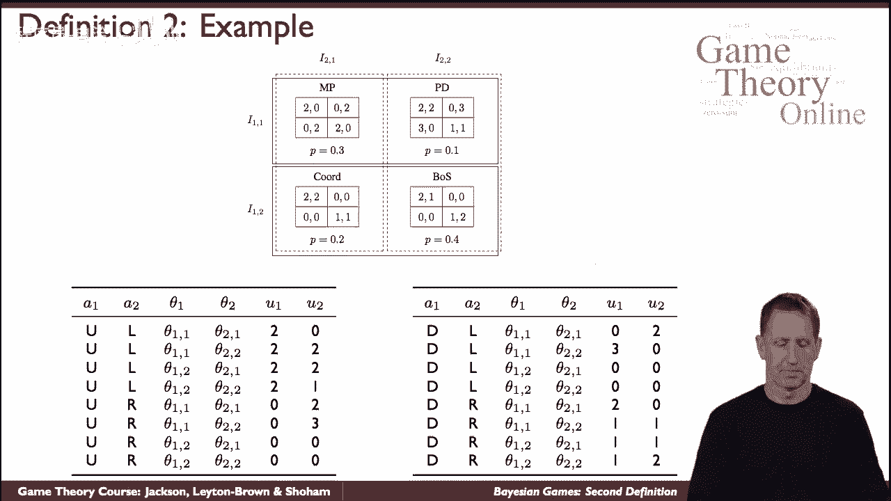

# 45：贝叶斯博弈：第二个定义 🎲

在本节课中，我们将学习贝叶斯博弈的第二个定义。这个定义在数学上与第一个定义本质相同，但采用了基于“类型”的视角，将代理人的所有私人信息打包到一个抽象概念中，从而使模型在形式上更为简洁。

上一节我们介绍了基于博弈列表和共同先验的第一个定义。本节中，我们来看看这个基于“类型”的替代定义。

## 定义的核心要素 📝

贝叶斯博弈的第二个定义包含以下几个核心部分：

*   **代理人集合**：用 `N` 表示所有参与博弈的代理人。
*   **行动集合**：每个代理人 `i` 有一个可用的行动集合 `A_i`。注意，这里没有“博弈列表”，代理人直接选择行动。
*   **类型集合**：每个代理人 `i` 有一个类型集合 `T_i`。**类型**是一个抽象的数学对象，旨在捕捉代理人的**一切私人信息**。这包括其收到的信号、对其他代理人可能信息的信念，以及其他代理人关于其自身信息的信念等。所有信息都被“折叠”进类型的概念中。
*   **共同先验**：存在一个所有代理人都知道的概率分布 `P`，用于从所有可能的类型组合 `(t_1, t_2, ..., t_n)` 中抽取一个具体的类型剖面。这对应于第一个定义中选择具体博弈的随机过程。
*   **效用函数**：每个代理人 `i` 的收益不仅取决于所有代理人采取的行动组合 `(a_1, a_2, ..., a_n)`，还取决于所有代理人的类型组合 `(t_1, t_2, ..., t_n)`。效用函数的形式为 `u_i(a_1, ..., a_n; t_1, ..., t_n)`。

从数学形式上看，这个定义非常简单。但其直觉理解较为复杂，因为“类型”这个概念承载了大量信息。

## 通过示例理解定义 🧩

让我们通过一个具体例子来理解这个定义如何运作。回顾第一个定义中讨论的博弈，有四种可能的收益矩阵，并根据一个共同先验随机选择其一。代理人会收到私人信号（信息集），告知他们处于哪个博弈中。

在类型视角下：

*   行代理人的行动是 **{上， 下}**。
*   列代理人的行动是 **{左， 右}**。
*   代理人的**类型** 就对应他们收到的**私人信息**（即他们知道自己处于哪个信息集中）。
*   收益则取决于代理人采取的行动组合以及他们的类型组合。

以下是具体分析：

假设行代理人的类型是 `t_row = “信息集1”`，列代理人的类型是 `t_col = “信息集A”`。这共同决定了实际进行的是哪一个具体的收益矩阵（例如，左上角的博弈）。如果此时行代理人选择“上”，列代理人选择“左”，那么收益就由该特定矩阵中（上，左）对应的单元格决定，例如 `(2, 0)`。

再举一例，如果行代理人类型为 `t_row = “信息集2”`，列代理人类型为 `t_col = “信息集B”`，这决定了另一个收益矩阵。若行代理人选择“下”，列代理人选择“左”，则收益对应到该矩阵的（下，左）单元格，可能是 `(0, 0)`。

你可以检查其他类型与行动的组合，来验证基于类型的公式如何对应到具体的收益。

## 两种定义的关系与总结 🔄

最后需要说明的是，在这个特定的例子中，固定一组类型后，你最终会得到一个非常具体的博弈。然而，将类型视角映射回“具有不确定性的博弈”视角是一个复杂的话题。你可能无法得到一个唯一的博弈，而需要查看整个博弈集合及其上的期望。但本节所讨论的内容，已经为我们处理贝叶斯博弈的两种公式提供了良好的基础：

1.  **显式博弈列表公式**：明确列出所有可能的博弈，并附带共同先验和代理人的信息划分结构。
2.  **基于类型的公式**：将私人信息抽象为类型，直接定义行动、类型和收益函数。

本节课中，我们一起学习了贝叶斯博弈的第二个定义——基于类型的公式。我们了解了其核心构成要素（代理人、行动、类型、共同先验、效用函数），并通过例子加深了理解，最后探讨了它与第一种定义的内在联系。掌握这两种等价的视角，将帮助我们更灵活地建模和分析信息不对称的博弈情境。