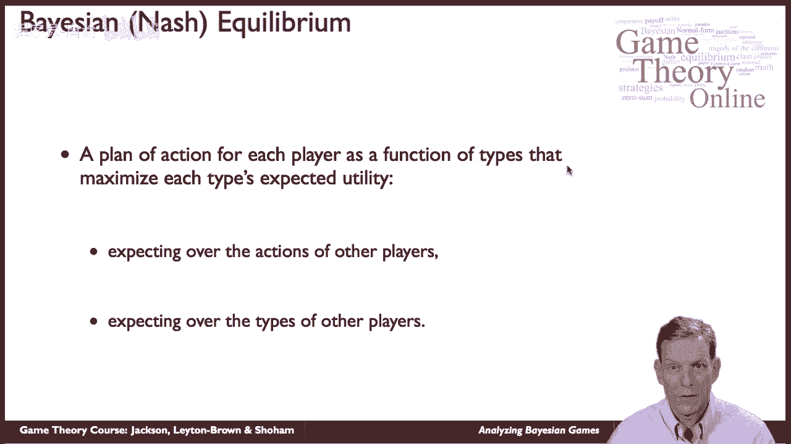
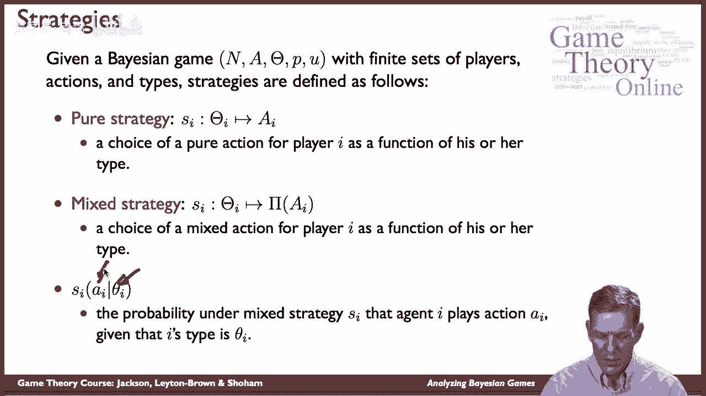
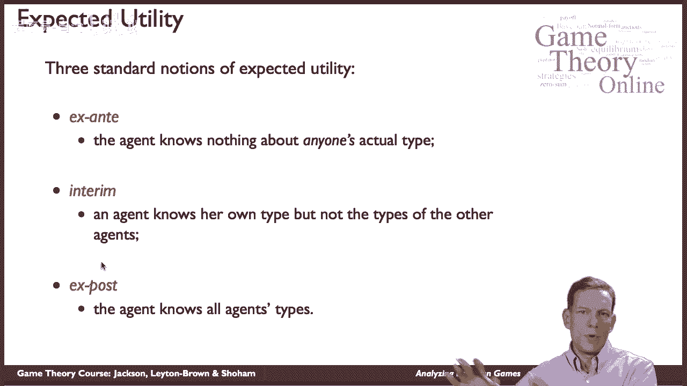
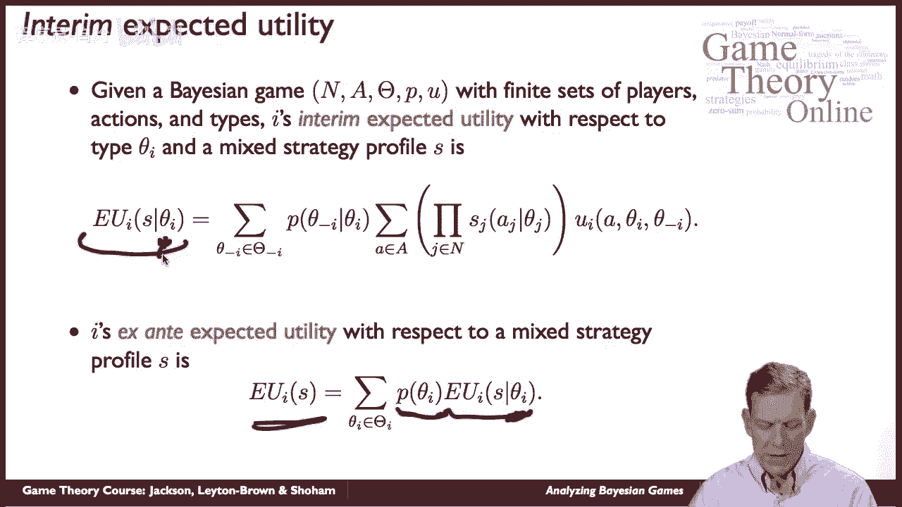
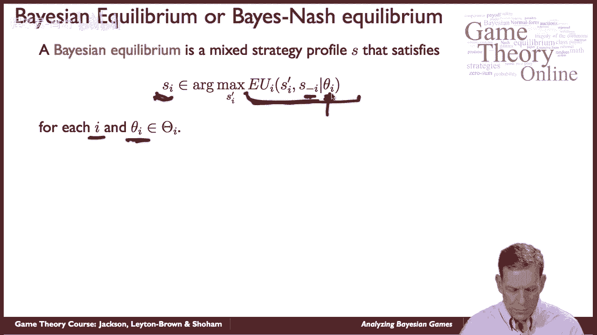
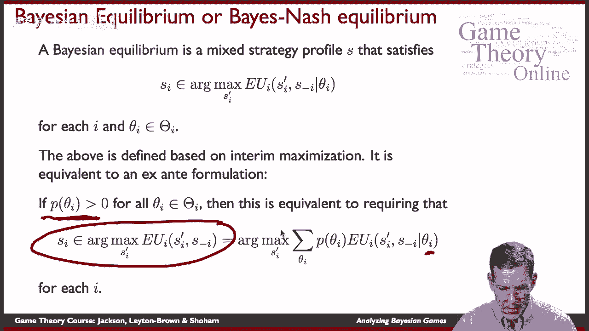
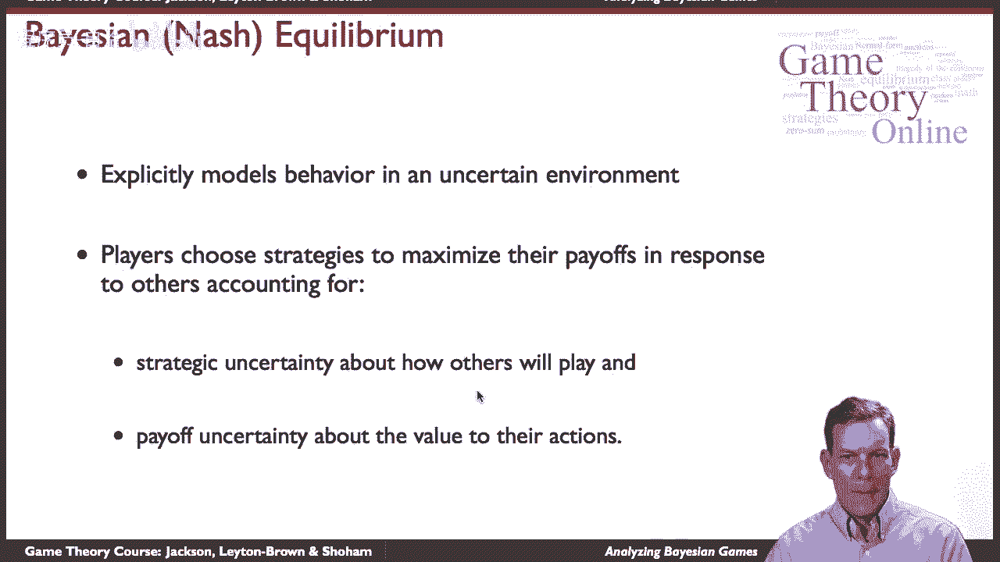

# 46：贝叶斯博弈分析 🎲

在本节课中，我们将学习贝叶斯博弈的核心解决方案概念——贝叶斯纳什均衡。我们将了解其定义、计算方式以及它与标准纳什均衡的区别。

## 概述 📋

贝叶斯博弈是包含不完全信息的博弈模型。为了分析这类博弈，我们需要一个合适的均衡概念。本节将介绍由约翰·哈桑尼在20世纪60年代提出的贝叶斯纳什均衡。其核心思想是，每个玩家根据自己观察到的“类型”来选择行动，以最大化其期望效用，同时考虑其他玩家的策略和类型分布。

## 贝叶斯博弈的基本设定 ⚙️



上一节我们介绍了贝叶斯博弈的基本概念，本节中我们来看看其形式化定义。

一个贝叶斯博弈包含以下基本要素：
*   **玩家集合**：有限的玩家。
*   **行动集合**：每个玩家可选的行动是有限的。
*   **类型空间**：每个玩家可能的类型是有限的。
*   **概率分布**：定义在所有玩家类型组合上的先验概率分布。
*   **效用函数**：每个玩家的收益取决于所有玩家的行动和类型。

为了简化理解，我们在此讨论有限集合的情况。扩展到无限集合时需要考虑更多技术细节。

## 策略与期望效用 📊

在贝叶斯博弈中，策略的定义与完全信息博弈不同。以下是关键概念：



### 策略的定义

一个玩家的**纯策略**是一个从自身类型到行动的映射函数 `s_i(θ_i) -> a_i`。它明确规定了当玩家观察到自己是某种类型时，会采取什么行动。

**混合策略**则是纯策略的推广，它为每种类型指定一个行动上的概率分布。

### 期望效用的计算阶段

玩家在不同信息阶段计算期望效用：



1.  **事前阶段**：玩家尚未得知任何类型信息（包括自己的）。此时制定的是“无条件”的行动计划。
2.  **事中阶段**：玩家已知自己的类型 `θ_i`，但不知道其他玩家的类型。这是分析均衡时最关键的阶段。
3.  **事后阶段**：所有玩家的类型都已公开。此时博弈退化为完全信息博弈。

### 事中期望效用公式

在事中阶段，已知自己类型为 `θ_i` 的玩家 `i`，在策略组合 `s` 下的期望效用计算公式如下：

```
E[u_i | θ_i, s] = Σ_{θ_{-i}} p(θ_{-i} | θ_i) * [ Σ_{a} ( Π_{j≠i} Prob(s_j(θ_j) = a_j) ) * u_i(a, θ) ]
```

其中：
*   `θ_{-i}` 表示除 `i` 外所有其他玩家的类型组合。
*   `p(θ_{-i} | θ_i)` 是玩家 `i` 在已知自己类型时，对其他玩家类型分布的信念。
*   内层求和是对所有可能行动组合 `a` 的期望，计算基于其他玩家策略 `s_j` 所导出的行动概率分布。

事前期望效用则是事中期望效用在所有可能自身类型上的加权平均。



## 贝叶斯纳什均衡 ⚖️

理解了策略和期望效用后，我们现在可以定义贝叶斯博弈的均衡概念。

贝叶斯纳什均衡是一个混合策略组合 `s* = (s*_1, s*_2, ..., s*n)`。它要求对于每一个玩家 `i` 和该玩家的每一种可能的类型 `θ_i`，玩家 `i` 所选择的策略 `s*_i` 都能最大化他在事中阶段的期望效用。



用数学语言描述，对于所有 `i` 和所有 `θ_i`，有：
```
s*_i(θ_i) ∈ argmax_{s_i} E[u_i | θ_i, (s_i, s*_{-i})]
```
其中 `s*_{-i}` 表示其他所有玩家的均衡策略。

这个定义本质上是纳什均衡思想在贝叶斯博弈中的延伸：每个玩家的策略都是对其他玩家策略的最佳反应，只不过这里的“最佳反应”是在已知自身类型的条件下做出的。

## 重要说明与总结 🎯



最后，我们对贝叶斯纳什均衡的关键点进行总结。

*   只要所有类型都以正概率出现，从事前角度（要求策略最大化整体事前期望效用）和从事中角度定义的均衡是等价的。
*   贝叶斯纳什均衡将纳什均衡扩展到了包含不确定性的环境。它同时考虑了两种不确定性：
    1.  **策略不确定性**：对其他玩家行动的信念。
    2.  **收益不确定性**：对其他玩家类型的信念，这些类型可能直接影响自身的收益函数。



本节课中，我们一起学习了贝叶斯博弈的核心均衡概念——贝叶斯纳什均衡。我们明确了其定义，理解了如何在不同信息阶段计算期望效用，并看到了它是如何将标准纳什均衡的思想自然扩展到不完全信息场景的。掌握这个概念是分析众多现实世界策略互动（如拍卖、信号传递等）的基础。