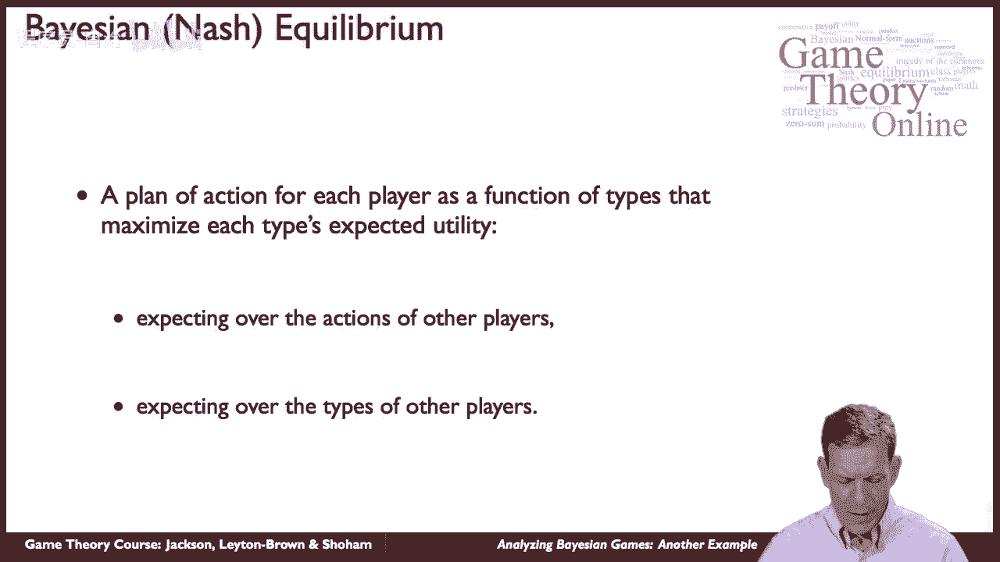
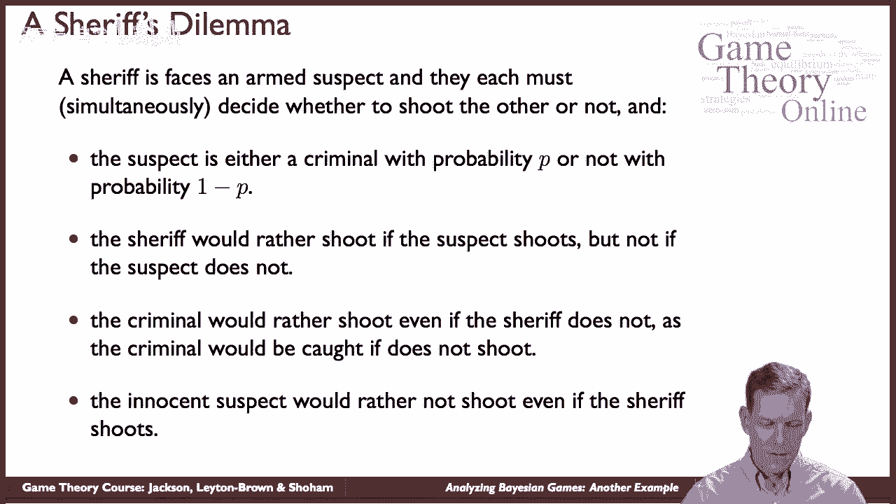
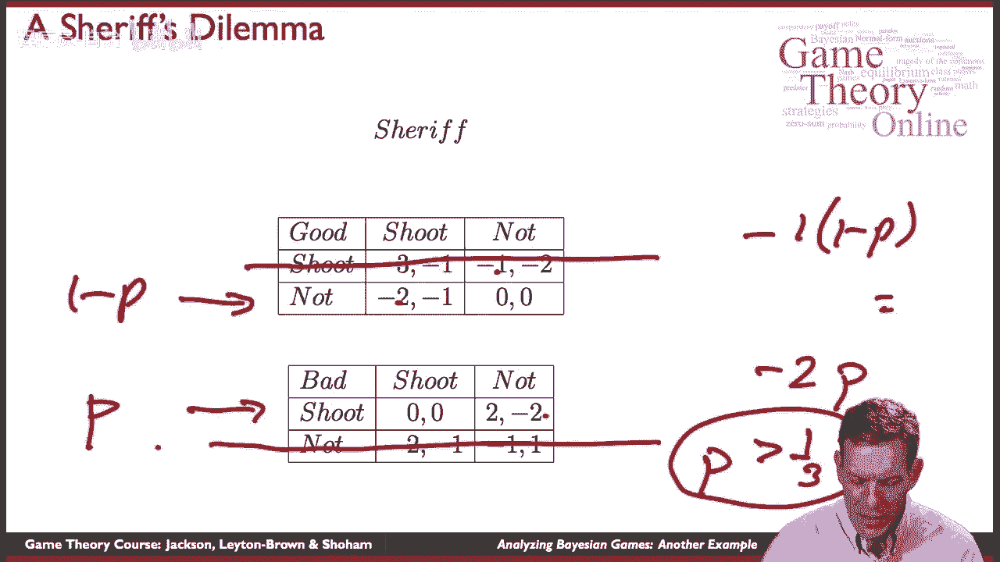
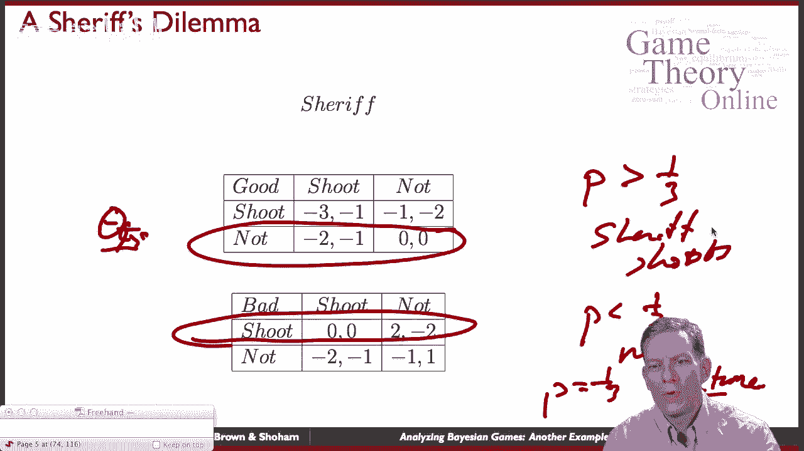
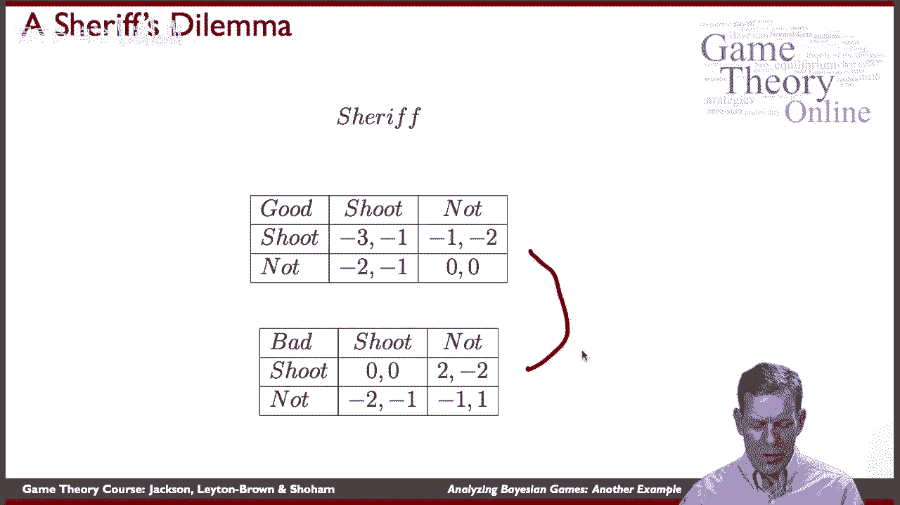
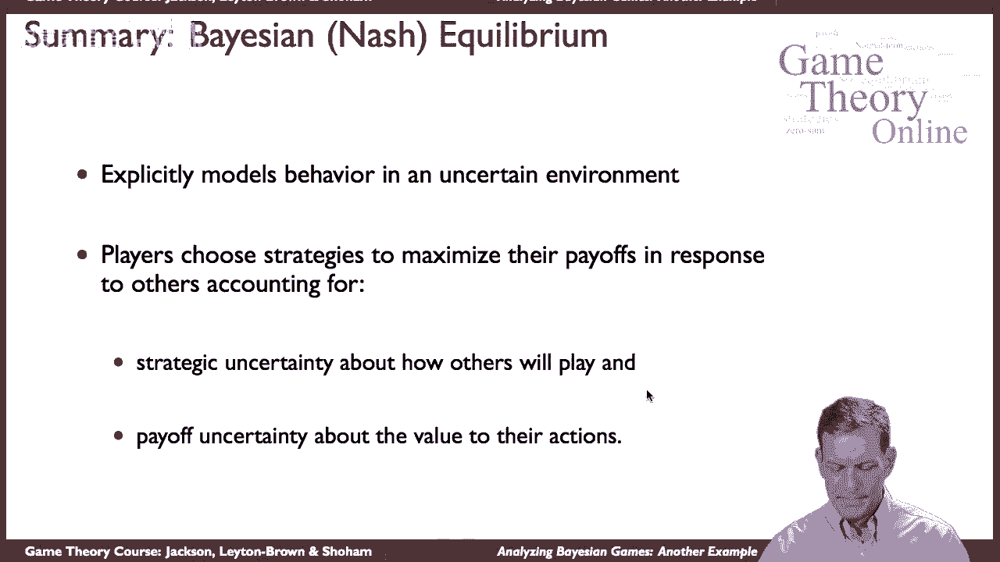

# 47：贝叶斯博弈分析样例 👮♂️🔫

在本节课中，我们将通过一个名为“治安官的困境”的简单例子，学习如何分析并求解一个贝叶斯博弈。我们将理解贝叶斯纳什均衡的核心概念，并看到玩家如何在信息不完全的情况下做出最优决策。

---

## 博弈设定与概念回顾

上一节我们介绍了贝叶斯博弈的基本框架。本节中我们来看看一个具体的应用实例。

贝叶斯纳什均衡为每个玩家规定了一个行动计划，该计划是玩家所拥有的私人信息（即其“类型”）的函数。每个玩家的策略都旨在最大化其**期望效用**，这个期望同时考虑了其他玩家可能采取的行动以及其他玩家的类型（这会影响收益）。

**核心公式**：玩家 *i* 的策略 *s_i(θ_i)* 需满足：
> 对于所有可能的类型 *θ_i* 和所有可选行动 *a_i‘*，有 *E[u_i(s_i(θ_i), s_{-i}(θ_{-i}), θ_i, θ_{-i})] ≥ E[u_i(a_i‘, s_{-i}(θ_{-i}), θ_i, θ_{-i})]*。

---

## 案例：治安官的困境

这是一个简化的场景。一位治安官面对一名武装嫌疑人，双方持枪对峙，必须决定是否向对方开枪。

嫌疑人的类型是不确定的：
*   以概率 **p**，嫌疑人是**罪犯**。
*   以概率 **1-p**，嫌疑人是**无辜者**。

治安官不知道嫌疑人的具体类型。双方的偏好如下：
*   **治安官**：如果嫌疑人不开枪，治安官宁愿不开枪（无论对方是罪犯还是无辜者）。如果嫌疑人开枪，治安官则宁愿开枪自卫。
*   **嫌疑人**：
    *   **罪犯**：倾向于开枪（即使治安官不开枪），因为他知道自己会被捕。
    *   **无辜者**：即使治安官开枪，也倾向于不开枪（例如，避免背负杀害执法人员的罪名）。

---

## 收益矩阵与策略分析

以下是该博弈的收益结构。行代表嫌疑人的行动（开枪/不开枪），列代表治安官的行动。收益顺序为（嫌疑人收益，治安官收益）。

**当嫌疑人为无辜者时（概率 1-p）：**

| | 治安官：开枪 | 治安官：不开枪 |
| :--- | :--- | :--- |
| **嫌疑人：开枪** | (-2, -1) | (1, -3) |
| **嫌疑人：不开枪** | (-3, 0) | (0, 0) |

**当嫌疑人为罪犯时（概率 p）：**

| | 治安官：开枪 | 治安官：不开枪 |
| :--- | :--- | :--- |
| **嫌疑人：开枪** | (-1, -1) | (2, -2) |
| **嫌疑人：不开枪** | (-2, 0) | (0, 1) |

现在，我们开始分析玩家的最优策略。

首先分析嫌疑人的策略，这取决于他的类型：
*   **无辜型嫌疑人**：比较收益可知，“不开枪”严格优于“开枪”（例如，当治安官开枪时，-3 > -2；当治安官不开枪时，0 > 1）。因此，无辜者的**严格占优策略**是**不开枪**。
*   **罪犯型嫌疑人**：比较收益可知，“开枪”严格优于“不开枪”（例如，当治安官开枪时，-1 > -2；当治安官不开枪时，2 > 0）。因此，罪犯的**严格占优策略**是**开枪**。

因此，在贝叶斯均衡中，嫌疑人的策略已确定：无辜者不开枪，罪犯开枪。

---

## 治安官的最优反应与均衡求解

接下来，我们分析治安官的最优策略。治安官不知道嫌疑人的真实类型，但他知道嫌疑人会遵循上述类型依赖策略，且罪犯出现的概率为 *p*。

治安官需要计算“开枪”与“不开枪”哪个能带来更高的期望收益。

*   如果治安官选择**开枪**：
    *   遇到罪犯（概率 *p*）：收益为 -1。
    *   遇到无辜者（概率 *1-p*）：收益为 0。
    *   **期望收益** = *p × (-1) + (1-p) × 0 = -p*

*   如果治安官选择**不开枪**：
    *   遇到罪犯（概率 *p*）：收益为 -2（因为罪犯会开枪）。
    *   遇到无辜者（概率 *1-p*）：收益为 0。
    *   **期望收益** = *p × (-2) + (1-p) × 0 = -2p*

治安官会比较这两个期望收益。通过解不等式 **-p > -2p**，我们可以找到“开枪”更优的条件。

以下是推导过程：
1.  -p > -2p
2.  两边同时加上 2p： p > 0
3.  更严谨的比较是看差值：开枪的期望收益 (-p) 减去不开枪的期望收益 (-2p) 等于 **p**。
4.  因此，当 **p > 0** 时，开枪的期望收益始终高于不开枪。但我们需要检查临界点。令两者相等：*-p = -2p*，解得 *p = 0*。
5.  重新审视收益：当 *p=1*（肯定是罪犯）时，开枪收益-1，不开枪收益-2，开枪更好。当 *p=0*（肯定无辜）时，开枪收益0，不开枪收益0，无差异。
6.  **结论**：只要 *p > 0*（即存在罪犯的可能性），治安官选择“开枪”的期望收益就严格高于“不开枪”。在 *p = 0* 时，两者无差异。

因此，治安官的均衡策略是：**只要认为嫌疑人有可能是罪犯（p > 0），就选择开枪**。

---

## 贝叶斯纳什均衡总结

本节课中我们一起学习了如何求解“治安官的困境”这个贝叶斯博弈。

该博弈的**贝叶斯纳什均衡**如下：
*   **嫌疑人**的策略（依类型而定）：
    *   如果类型是“无辜者”，则选择**不开枪**。
    *   如果类型是“罪犯”，则选择**开枪**。
*   **治安官**的策略：
    *   如果认为嫌疑人是罪犯的概率 **p > 0**，则选择**开枪**。
    *   如果 **p = 0**（确信无辜），则在“开枪”与“不开枪”之间无差异。

这个简单的例子抓住了贝叶斯均衡的核心要素：
1.  玩家的收益取决于类型（治安官面对不同嫌疑人的收益不同）。
2.  其他玩家的策略也取决于其类型（无辜者和罪犯的行为不同）。
3.  决策者（治安官）需要同时考虑**策略不确定性**（对方会怎么做）和**状态不确定性**（对方是什么类型），并最大化自己的期望收益。

贝叶斯纳什均衡是一个强大的工具，它允许我们在信息不完全的现实世界情境（如拍卖、商业竞争、信号传递等）中建模和分析玩家的策略互动。