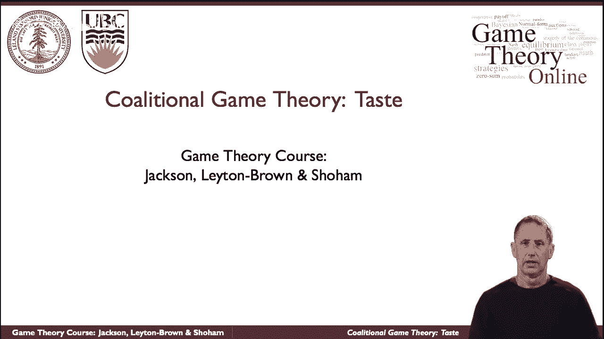

# 48：合作博弈论入门 🎲

在本节课中，我们将学习合作博弈论（或称联盟博弈论）的基本概念。我们将了解它如何模拟群体合作与竞争并存的情境，并探讨其与非合作博弈论的核心区别。

## 什么是联盟博弈论？🤝

联盟博弈论是一种模拟战略形势的方法，这与通常所说的非合作博弈论形成鲜明对比。事实上，联合博弈论常被称为合作博弈论，这个名字有点误导性，我们稍后会解释。首先，让我们谈谈联盟博弈论试图模拟什么情况。

你可能认识这两位先生。左边的人是大卫·卡梅隆，英国首相。在他的右边（就他们当时的座位而言，是他的左边）是尼古拉斯·克莱格，他的联合执政伙伴。他们走到一起，想必是有原因的：他们可以一起完成一些独自无法完成的事情。特别是在议会政治中，这是一个联盟形成的经典例子。

## 联盟的广泛存在 🌐

事实上，我们通常想到联盟时会思考政党。但联盟的形成不仅在政治中，当然也以商业的形式存在。例如，“风力联盟”是美国许多公司的联合，旨在共同推动风能议程。这些公司虽然是竞争对手，但它们觉得在一起可以完成独自做不到的事情，比如游说政府或制定行业标准。

联盟并不总是存在于组织、政党或公司之间。我们作为个人也经常聚集在一起共同完成事情，不管是结婚，还是盖房子。当你有一个木匠、一个电工和一个油漆工时，他们一起可以完成他们无法独自完成的事情。

## 合作中的竞争 ⚖️

现在，人们走到一起并不意味着他们的利益完全一致，或者他们给联盟带来了同样多的价值。可能施工队的木匠是不可替代的，但电工很容易被找到和取代。当他们为建造的房子得到报酬时，这应该反映在他们如何分配付款上。所以这里既有合作的成分，也有竞争的成分。

因此，将这些博弈统称为“合作博弈”就像将非合作博弈论统称为“非合作”一样具有误导性。例如，如果你看一个标准形式的博弈（非合作博弈的标准表示），你可以很容易地描述所谓“团队博弈”或“共同回报博弈”这种利益完全一致的情况。

## 核心建模差异 🔧

非合作博弈论和联盟（合作）博弈论都模型化了竞争与协调。本质区别在于，联盟博弈论的基本建模单元是**组**、**团队**以及**他们能共同完成的事情**。

---

### 总结 📝

本节课中，我们一起学习了合作博弈论的基本思想。我们了解到，合作博弈论关注的是群体（联盟）如何形成，以及他们如何分配合作产生的收益。其核心在于，联盟的整体价值可能大于成员单独行动价值之和，但联盟内部依然存在关于如何分配收益的竞争。下一节，我们将开始学习如何用数学语言来形式化描述这些联盟博弈。