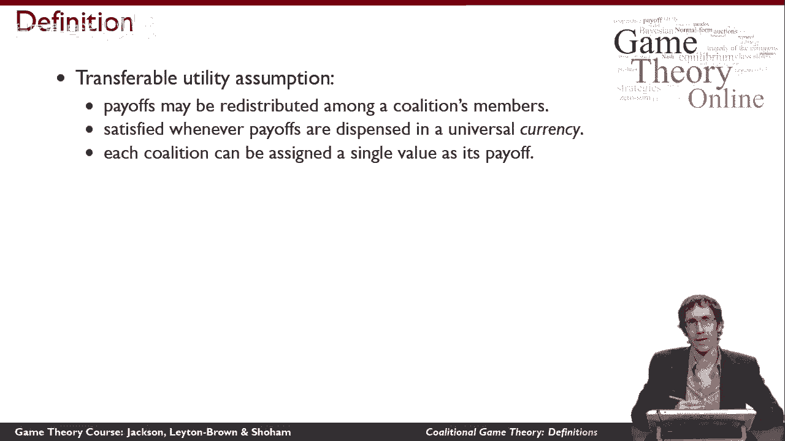
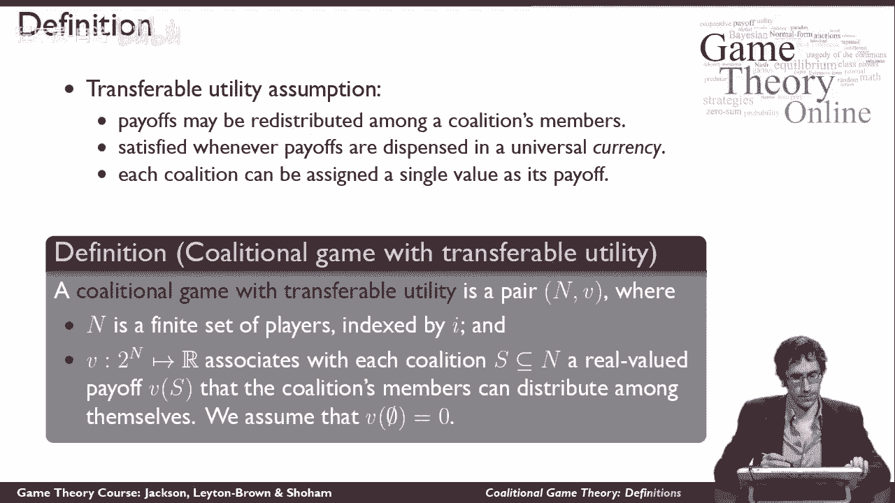
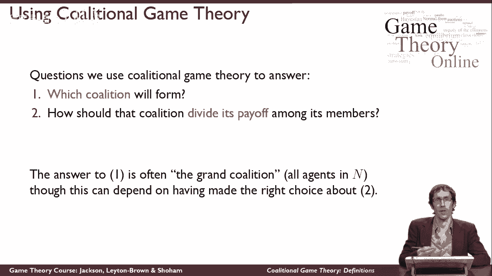
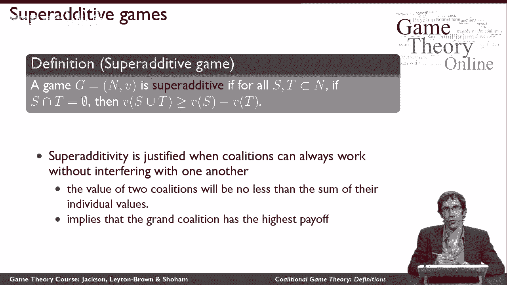
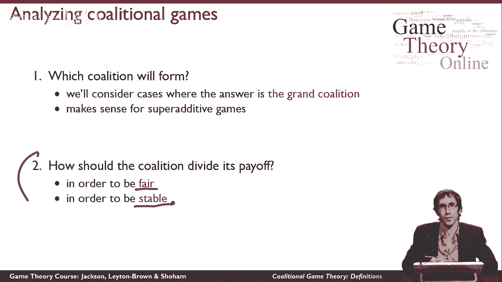

# 49：合作博弈定义 🎯

在本节课中，我们将学习合作博弈（或称联盟博弈）的基本定义。与之前讨论的非合作博弈不同，合作博弈的核心是研究一组参与者如何通过结成联盟来共同行动并分配收益。

## 什么是联盟博弈？🤝

上一节我们介绍了非合作博弈关注个体行动者，本节中我们来看看合作博弈的视角。合作博弈不对采取行动的单个代理人进行建模，而是考虑一群代理人一起行动。其核心思想是，我们考虑一组代理人，并探讨可以形成哪些联盟，即哪些代理人群体可以选择一起工作。

为了实现这一点，我们需要定义每一组不同的代理人能为自己争取到多大的利益。特别需要注意的是，在联盟博弈中，我们**不**考虑代理人如何在联盟内部划分工作，或者他们如何相互协调以组成联盟。我们将所有这些内部运作视为既定条件。相反，我们关注的是联盟作为一个整体能获得什么样的回报。

## 可转移效用假设 💰

为了分析联盟，我们从一个称为“可转移效用”的假设开始。这个假设意味着，联盟有可能在其成员之间任意地重新分配其获得的价值。

例如，如果一个联盟获得了一笔金钱收益，那么就有可能以任何方式在成员之间分配这笔钱，包括支付额外费用。这个假设使我们能够将联盟的回报视为一个单一的、可分配的总价值，并相信它可以被任意分配给成员。

在这个假设下，联盟博弈的定义如下：

一个联盟博弈由两部分组成：`n` 和 `v`。
*   `n`：一个有限的参与者集合。我们用 `i` 来索引集合中的单个玩家。
*   `v`：一个函数，类似于联盟博弈的效用函数。它定义了对于玩家的每一个子集（即每一个可能形成的联盟，包括所有玩家组成的“大联盟”），该联盟能实现的价值 `V` 是多少。这个价值允许联盟在其成员之间进行分割。

我们通常做一个归一化假设：空集联盟的价值为零。
`v(∅) = 0`

## 联盟博弈的核心问题 ❓

我们通常用联盟博弈论来探讨两个基本问题：
1.  在这场博弈中，组建哪个联盟是有意义的？
2.  一旦我们知道哪个联盟会形成，这个联盟应该如何将其收益分配给所有成员？

我们不会花太多精力去思考第一个问题。通常情况下，答案是所谓的“大联盟”，即所有参与者都同意一起工作。然而，有时为了保证大联盟能够形成，我们必须仔细考虑联盟将如何分配其收益。

## 超可加性：大联盟形成的基础 🔗

以下是一个有助于我们思考第一个问题的博弈性质。我们说一个联盟博弈对所有联盟对 `S` 和 `T` 都是**超可加**的，如果 `S` 和 `T` 都是参与者集合 `N` 的严格子集，并且这两个联盟的交集为空（即涉及完全不同的代理人）。

那么，如果我们把这两个联盟合并成一个更大的联盟 `S ∪ T`，这个更大联盟的价值至少等于两个独立联盟价值之和。
`v(S ∪ T) ≥ v(S) + v(T)， 当 S ∩ T = ∅`

换句话说，如果我用两个独立的联盟组成一个更大的联盟，那个更大联盟的价值总是至少和这两个独立联盟靠自己实现的价值之和一样大。如果联盟有可能在不相互干扰的情况下工作，这个假设通常是合理的。这也是我们在联盟博弈中常做的假设。

> 注意：超可加性假设意味着所有可能的收益中，最高的收益（至少是每周最高的收益）是由大联盟实现的。因此，当我们考虑一个超可加博弈时，很自然地会认为大联盟将希望组建。

在回答我之前谈到的第一个问题时，我们倾向于假设大联盟会形成。因此，本课程后续将集中讨论第二个问题：**联盟应该如何分配其回报？**

## 分配回报的两种视角 ⚖️

有理由问，当我说“应该如何分配回报”时，具体取决于联盟试图实现什么目标。我们将考虑两种不同的方法来回答这个问题：

1.  **基于公平的分配**：如果联盟关心的是公平，它应该如何分配回报？
2.  **基于稳定的分配**：相反，我们可能想知道，如果联盟关心的是稳定性（即每个人都愿意留在大联盟中，而不是脱离出去组成能为自己实现更高价值的小联盟），它应该如何分配回报？

---

**本节课总结**：本节课我们一起学习了合作博弈（联盟博弈）的基本框架。我们了解了它与非合作博弈的区别，掌握了其核心定义（参与者集合 `n` 和价值函数 `v`），并引入了“可转移效用”的关键假设。我们探讨了联盟博弈关心的两个核心问题（组建哪个联盟、如何分配收益），并解释了“超可加性”这一促使大联盟形成的性质。最后，我们指出了分析收益分配的两种主要视角：公平与稳定，为后续课程内容奠定了基础。