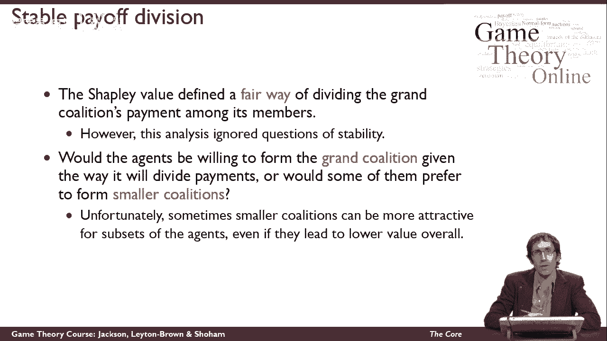
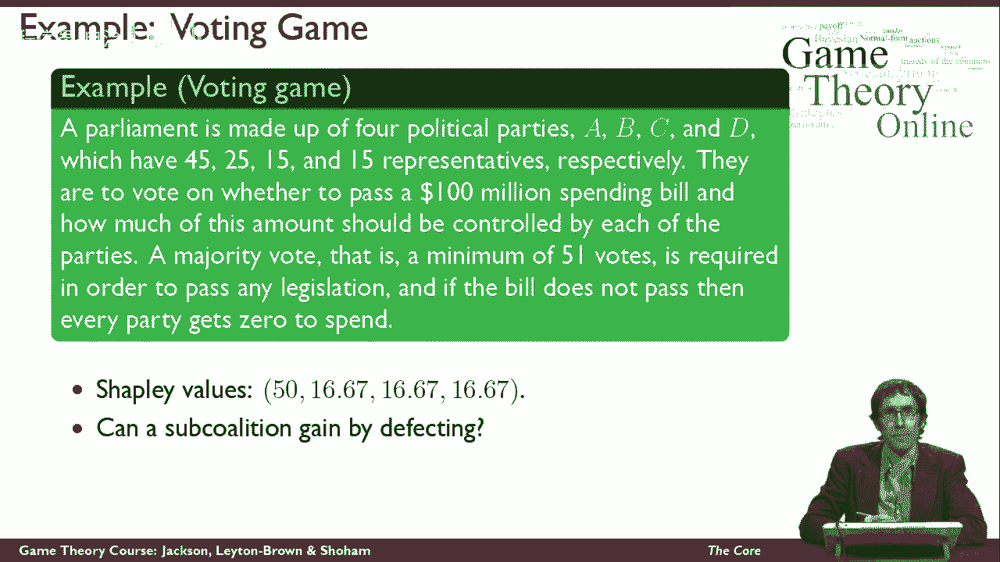
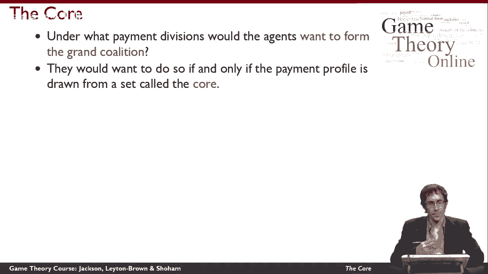
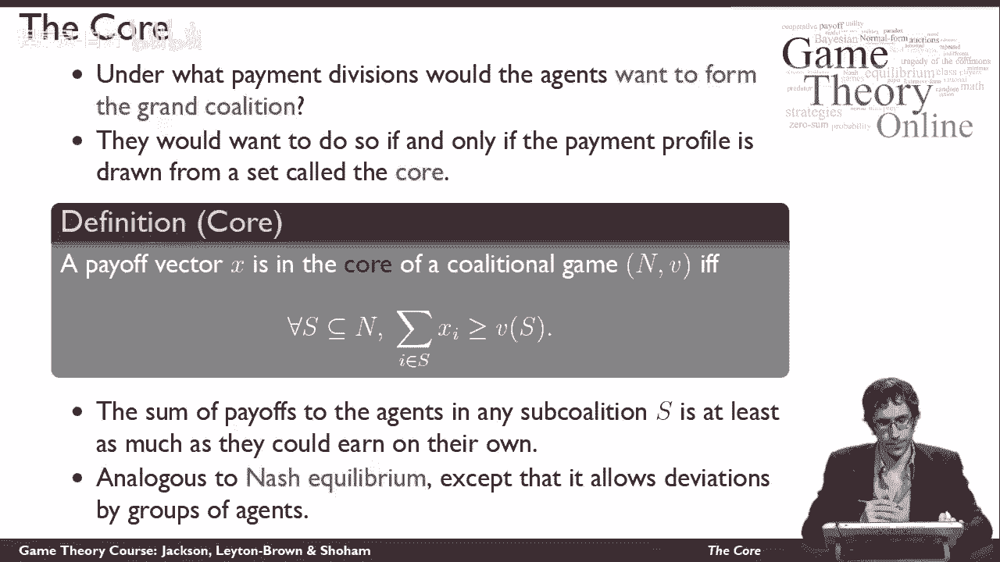
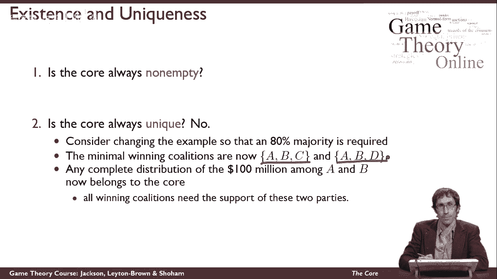
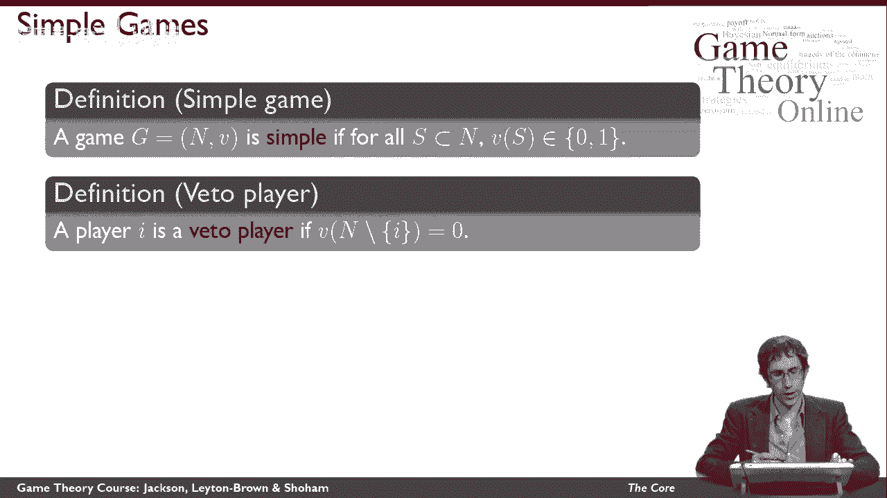
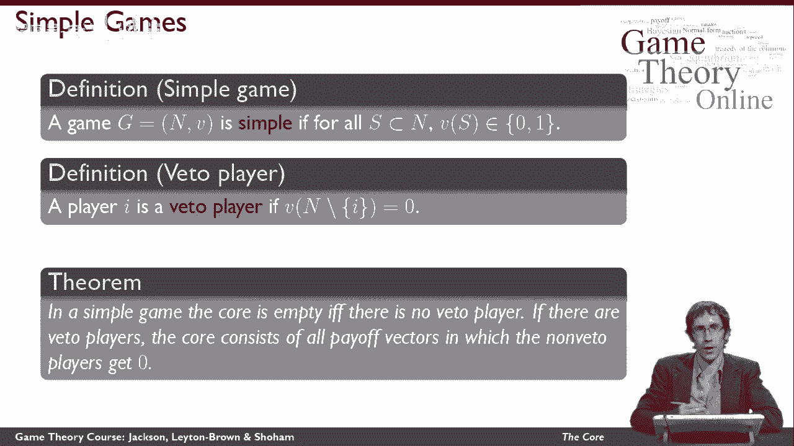
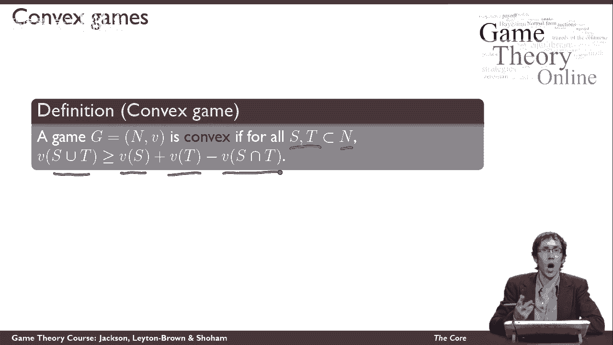
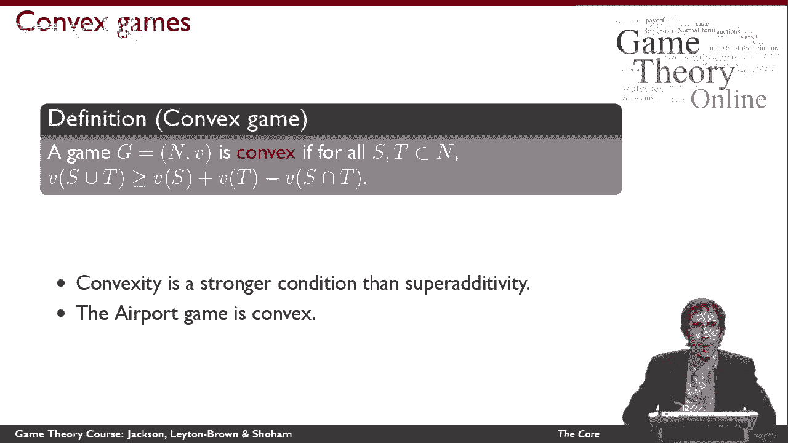
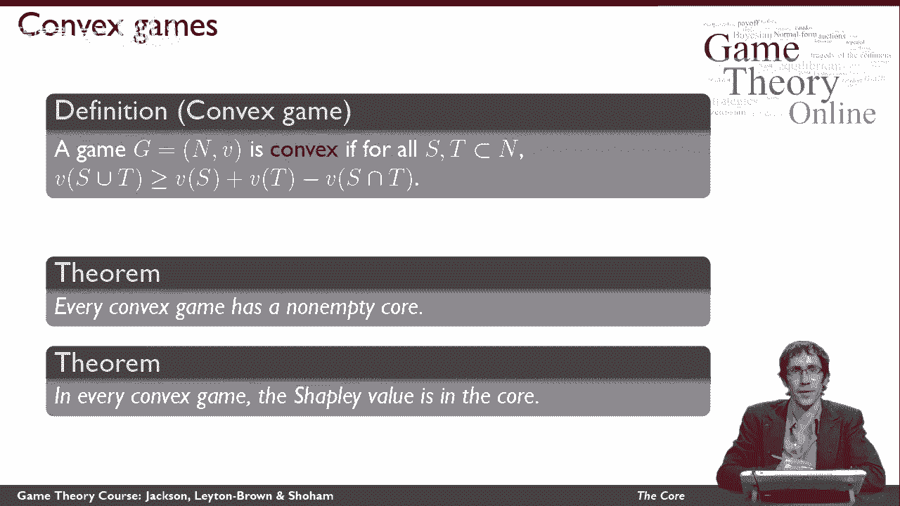

# 51：合作博弈的核心概念 🎯

在本节课中，我们将学习合作博弈论中的一个核心解决方案概念——“核心”。我们将探讨在何种条件下，代理人愿意组成一个大联盟，而不是分裂成更小的联盟。核心概念帮助我们理解支付分配如何影响联盟的稳定性。

---

## 从沙普利值到联盟稳定性

上一节我们介绍了沙普利值作为一种公平的分配方式。本节中我们来看看，代理人是否总是愿意组成大联盟。

考虑一个由四个政党（A、B、C、D）组成的议会投票游戏。各党席位分别为：A（4席）、B（5席）、C（15席）、D（15席）。通过一项一亿美元的支出法案需要至少51票（简单多数）。如果法案未通过，所有政党都得不到资金。

计算得到的沙普利值分配如下：
*   A: 2500万
*   B: 2500万
*   C: 2500万
*   D: 2500万

值得注意的是，尽管B、C、D的票数不同，它们在沙普利值下获得了相同的份额。

现在，思考一个问题：是否存在一个次级联盟，可以通过脱离大联盟而获得更多收益？

答案是肯定的。例如，政党A和B可以组成一个次级联盟。他们共有9票，足以通过法案。如果他们两人瓜分一亿美元（例如A得7500万，B得2500万），双方所得均高于沙普利值下的分配。这表明，虽然沙普利值可能是公平的，但它不一定能为所有政党提供加入大联盟的正确激励。

因此，我们需要寻找一种支付分配方式，使得代理人愿意组成大联盟。这种分配需要属于一个名为“核心”的集合。

---

## “核心”的定义与理解

“核心”是一组支付向量的集合，在这些支付下，没有任何代理人子集愿意脱离大联盟。

**核心的正式定义如下：**

对于一个给定的支付向量 **x** = (x₁, x₂, ..., xₙ)，我们说 **x** 属于联盟博弈的**核心**，当且仅当对于大联盟 **N** 的**每一个**可能子集 **S**（包括 **S = N**），以下条件成立：

**公式：** ∑_{i ∈ S} x_i ≥ v(S)

其中：
*   **∑_{i ∈ S} x_i** 表示支付向量 **x** 分配给子集 **S** 中所有代理人的报酬总和。
*   **v(S)** 表示子集 **S** 作为独立联盟时所能获得的总价值。

**直观理解：** 这个条件保证了，对于任何可能的次级联盟 **S**，其成员在大联盟中获得的报酬总和，至少不低于他们自己组成联盟 **S** 所能获得的价值。如果存在某个联盟 **S** 能通过偏离获得更多，那么当前的支付向量就不在核心中。

在投票游戏的例子中，沙普利值分配就不在核心内，因为A和B组成的联盟（v({A, B}) = 1亿）所能获得的，大于他们按沙普利值分配所得的总和（2500万 + 2500万 = 5000万）。

这个概念类似于纳什均衡，因为它要求“没有有利可图的偏离”。不同之处在于，核心考虑的是**一组代理人**的联合偏离，因此是一个比纳什均衡更强的稳定性概念。

---

## 核心的存在性与唯一性

引入一个新的解决方案概念时，我们通常关心两个问题：它是否总是存在？它是否唯一？

### 1. 核心是否总是非空？
**答案是否定的。** 有些博弈中，不存在任何能使大联盟稳定的支付分配。我们最初的投票游戏（51%多数）就是一个例子。

**分析如下：**
在该游戏中，最小的获胜联盟是 {A, B}, {A, C}, {A, D}, {B, C, D}。
*   如果支付给 {B, C, D} 的总和小于1亿，那么这三方有动机脱离并组成联盟。
*   如果支付给 {B, C, D} 的总和等于1亿（即A得到0），那么A可以与B、C、D中的任意一方组成新联盟（如{A, B}），并提议一个对双方都有利的分配（例如给B少量报酬，自己获得大部分），从而偏离。
因此，无论如何分配，总存在一个次级联盟可以通过偏离获利。**该博弈的核心是空的。**

### 2. 核心是否唯一？
**答案也是否定的。** 核心并不总是给出唯一的分配方案。

考虑修改投票游戏规则，将通过门槛从简单多数（51%）提高到绝对多数（80%）。此时，唯一的最小获胜联盟是 {A, B, C, D} 这个大联盟本身，因为任何缺少A或B的联盟都无法达到80%的席位。

在这种情况下，A和B成为了**关键参与者（否决者）**。只要A和B两人瓜分全部1亿美元（无论比例如何），支付向量就属于核心。因为C和D即使报酬为0，也无法通过组成其他联盟（如{C, D}）获得任何收益（因为他们达不到80%多数）。因此，核心包含了**所有**满足 `x_A + x_B = 1亿` 且 `x_C = 0, x_D = 0` 的支付向量，它不是唯一的。

---

## 关于核心的正面结论

尽管核心可能为空或不唯一，但在某些特定类型的博弈中，我们可以得到更明确的结论。

首先定义两种博弈：

1.  **简单博弈**：所有联盟的价值 **v(S)** 只能是 **0** 或 **1**。投票游戏就是简单博弈（1代表通过法案获得1亿，0代表不通过）。
2.  **否决者**：玩家 **i** 是**否决者**，当且仅当**所有**不包含 **i** 的联盟 **S**，其价值 **v(S) = 0**。即，**i** 的参与是联盟产生任何价值的必要条件。

**关于简单博弈的核心，有一个重要结论：**
*   如果一个简单博弈中**没有否决者**，那么其**核心一定是空的**（如51%多数的投票游戏）。
*   如果一个简单博弈中**存在否决者**，那么其核心由**所有**满足“非否决者获得0报酬，而所有报酬在否决者之间任意分配”的支付向量组成（如80%多数的投票游戏）。

---

## 凸博弈与核心的稳定性

为了进一步探讨核心的积极性质，我们引入“机场博弈”的例子。

**机场博弈描述：**
几个城市需要建造机场。每个城市需要的跑道长度不同（对应不同规模的飞机）。它们可以选择各自建造机场，或者合资建造一个区域性机场。区域性机场的成本取决于所有参与城市中所需的最大跑道长度。联盟的价值定义为：各城市单独建造成本之和，减去建造区域性机场（满足最大需求）的成本。

**公式：** v(S) = ∑_{i ∈ S} c_i - max_{i ∈ S} c_i
其中 `c_i` 是城市 **i** 单独建造机场的成本。

接下来定义**凸博弈**：
一个博弈是凸的，如果对于大联盟 **N** 的任意两个子集 **S** 和 **T**，满足以下条件：

**公式：** v(S ∪ T) ≥ v(S) + v(T) - v(S ∩ T)

这比“超可加性”（要求 S ∩ T = ∅）条件更强。它意味着合并联盟的收益至少等于各自收益之和减去重叠部分的收益。**机场博弈是一个凸博弈。**

关于凸博弈，有两个非常积极的结论：

1.  **在凸博弈中，核心总是非空的。** 总存在至少一种支付分配方式，可以稳定地支持大联盟。
2.  **在凸博弈中，沙普利值属于核心。** 这意味着对于这类博弈，**公平分配**（沙普利值）与**稳定分配**（核心）的目标是一致的，并不矛盾。

---

## 总结

本节课中我们一起学习了合作博弈中的“核心”概念。
*   **核心**是一组支付分配，确保没有任何代理人子集愿意脱离大联盟去组建自己的小联盟。
*   核心**不一定存在**（如无否决者的简单博弈），也**不一定唯一**（如存在多个否决者时）。
*   在**凸博弈**（如机场博弈）中，核心总是非空的，并且**沙普利值**作为一种公平的分配方法，本身就位于核心之内，完美地兼顾了公平与稳定。

理解核心帮助我们分析在合作场景中，如何设计激励相容的分配机制，以促进大规模、稳定的合作。