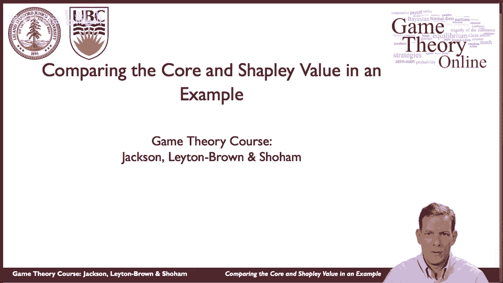
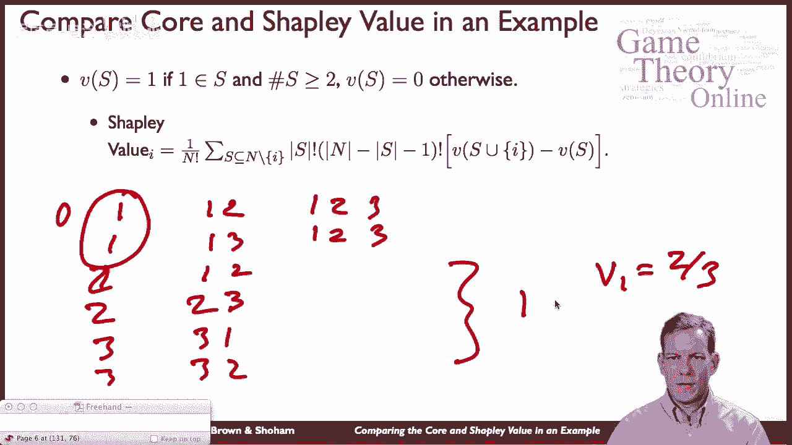
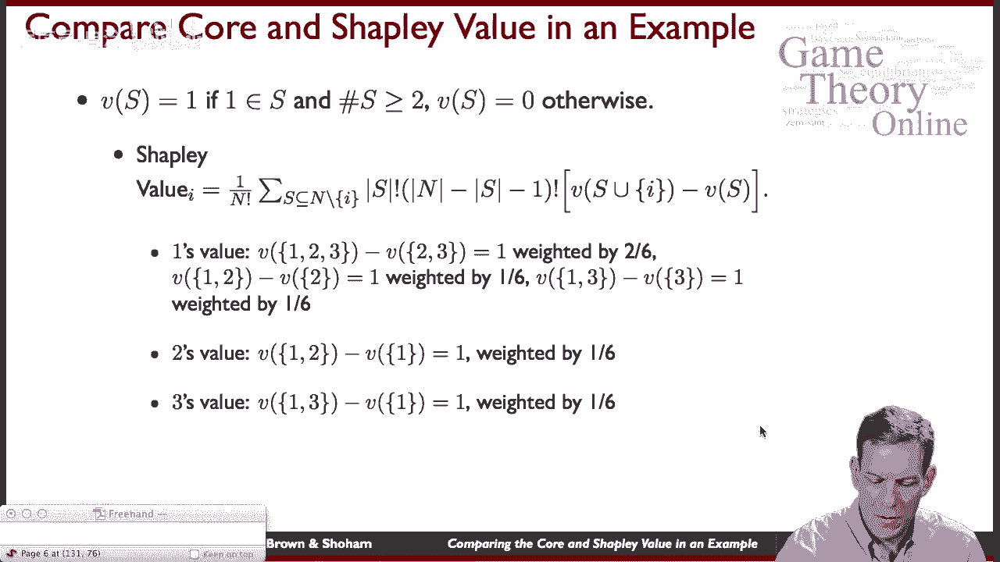
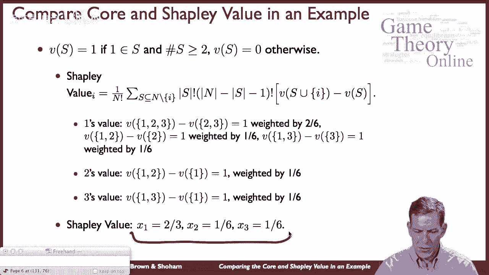
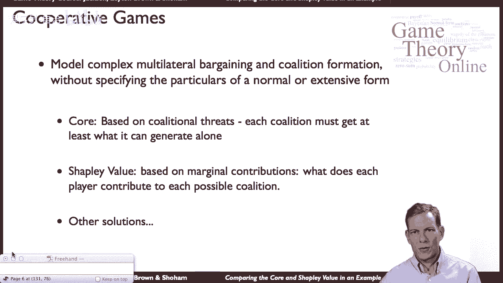

# 52：博弈论核心与沙普利值计算实例 🎲

在本节课中，我们将通过一个具体的联盟博弈实例，分别计算其**核心**与**沙普利值**。我们将以联合国安全理事会的简化模型为例，分析不同分配规则下的结果差异，并理解这两种解决方案概念背后的逻辑。



---

## 实例背景：联合国安理会投票模型

联合国安理会负责通过各项决议。其组成包括五个拥有否决权的常任理事国（中国、法国、俄罗斯、英国、美国）以及十个无否决权的非常任理事国。决议通过需要满足两个条件：第一，所有常任理事国同意（或至少不反对）；第二，获得多数票（即至少8票）。

为了简化分析，我们首先构建一个具有类似结构的三人博弈模型。

---

## 构建简化三人博弈模型

上一节我们介绍了安理会的基本规则。本节中，我们来看看一个简化的三人版本，以便清晰地计算和比较。

我们假设存在一个拥有否决权的“常任理事国”（玩家1）和两个“非常任理事国”（玩家2和玩家3）。决议通过规则采用简单多数决，且玩家1拥有否决权。因此，一个联盟能获得价值1（即通过决议）的条件是：
*   联盟必须包含玩家1。
*   联盟总人数至少为2（即简单多数）。

用合作博弈的特征函数 `v(S)` 表示如下：

```math
v(S) = 
\begin{cases} 
1 & \text{如果 } 1 \in S \text{ 且 } |S| \geq 2 \\
0 & \text{其他情况}
\end{cases}
```

其中，`S` 代表任意玩家联盟，`|S|` 代表联盟 `S` 中的玩家数量。

---

## 计算博弈的“核心”

“核心”是一种分配方案，要求没有任何联盟能通过脱离大联盟而获得更高的总收益。这意味着，核心分配必须满足：对于任何可能的联盟 `S`，其成员所得收益之和不低于该联盟独立行动可获得的价值 `v(S)`。

以下是核心分配必须满足的条件：

1.  **个体理性**：每个玩家所得 `x_i ≥ 0`，因为单人联盟最多只能获得0。
2.  **联盟理性**：对于联盟 {1, 2}，有 `x1 + x2 ≥ v({1,2}) = 1`。对于联盟 {1, 3}，有 `x1 + x3 ≥ 1`。
3.  **整体理性**：所有玩家收益之和等于大联盟价值，即 `x1 + x2 + x3 = v({1,2,3}) = 1`。

结合这些条件进行推导：
*   由 `x1 + x2 ≥ 1` 和 `x1 + x2 + x3 = 1`，可推出 `x3 ≤ 0`。
*   又因个体理性要求 `x3 ≥ 0`，所以 **`x3 = 0`**。
*   同理，由 `x1 + x3 ≥ 1` 可推出 **`x2 = 0`**。
*   最后，将 `x2 = 0` 和 `x3 = 0` 代入总和公式，得到 **`x1 = 1`**。

因此，该博弈的**核心**是唯一的分配方案：**(x1, x2, x3) = (1, 0, 0)**。这意味着全部价值都分配给拥有否决权的关键玩家1。

如果将此逻辑扩展回完整的15人安理会模型，核心预测所有价值将在五个常任理事国之间分配，而十个非常任理事国获得零收益。

---

## 计算博弈的“沙普利值”

上一节我们看到了核心分配的结果。本节中，我们来看看基于边际贡献的另一种分配方案——沙普利值。

沙普利值根据每个玩家对所有可能联盟的**边际贡献**的平均值来分配总价值。玩家 `i` 的沙普利值 `φ_i(v)` 计算公式为：

```math
φ_i(v) = \sum_{S \subseteq N \setminus \{i\}} \frac{|S|! (|N|-|S|-1)!}{|N|!} [v(S \cup \{i\}) - v(S)]
```



其中，`N` 是全体玩家集合，`S` 是不包含玩家 `i` 的联盟。

对于我们的三人博弈（N={1,2,3}），我们计算玩家1的沙普利值。玩家1的边际贡献 `v(S∪{1}) - v(S)` 仅在联盟 `S` 本身不包含玩家1且 `|S| ≥ 1` 时为1（因为他加入后满足了“包含1”和“人数≥2”两个条件），否则为0。



考虑所有玩家加入联盟的等可能顺序（共3! = 6种）：
*   顺序 (1,2,3): 玩家1第一个加入，此时 `S={}`，边际贡献为0。
*   顺序 (1,3,2): 同上，边际贡献为0。
*   顺序 (2,1,3): 玩家1第二个加入，此时 `S={2}`，边际贡献为 `v({2,1}) - v({2}) = 1 - 0 = 1`。
*   顺序 (3,1,2): 玩家1第二个加入，此时 `S={3}`，边际贡献为 `v({3,1}) - v({3}) = 1 - 0 = 1`。
*   顺序 (2,3,1): 玩家1最后加入，此时 `S={2,3}`，边际贡献为 `v({2,3,1}) - v({2,3}) = 1 - 0 = 1`。
*   顺序 (3,2,1): 同上，边际贡献为1。

玩家1在6种顺序中的4种里做出了边际贡献1，因此其沙普利值为 `4/6 = 2/3`。

由于玩家2和3对称，他们将平分剩余的价值 `1 - 2/3 = 1/3`，即各得 `1/6`。

因此，该博弈的**沙普利值**为：**(φ1, φ2, φ3) = (2/3, 1/6, 1/6)**。



---

## 核心与沙普利值的比较与总结

本节课中，我们一起学习了如何为一个具体的联盟博弈计算核心与沙普利值。

通过对比，我们得到了两种截然不同的分配预测：
*   **核心 (Core)**: **(1, 0, 0)**。这反映了“没有关键玩家1，其他联盟一事无成”的强谈判地位。核心关注的是联盟的稳定性，防止任何子联盟有动机脱离。
*   **沙普利值 (Shapley Value)**: **(2/3, 1/6, 1/6)**。这反映了每个玩家对所有可能联盟的**平均边际贡献**。尽管玩家2和3没有否决权，但他们在半数情况下（当与玩家1结合时）对创造价值有贡献，因此也获得了部分收益。

这个例子清晰地展示了合作博弈论中不同解概念背后的逻辑：
*   **核心**源于联盟的**稳定性**和**阻止偏离**的思想。
*   **沙普利值**源于**公平分配**和**边际贡献**的思想。



合作博弈论提供了一套简洁的公理化工具（如核心、沙普利值等）来建模复杂的多方谈判与分配问题，避免了构建庞大非合作博弈扩展式的复杂性，直接对可能的合作结果做出预测。在实际应用中，可以根据具体情境和关注的公平或稳定性标准，选择合适的解概念进行分析。