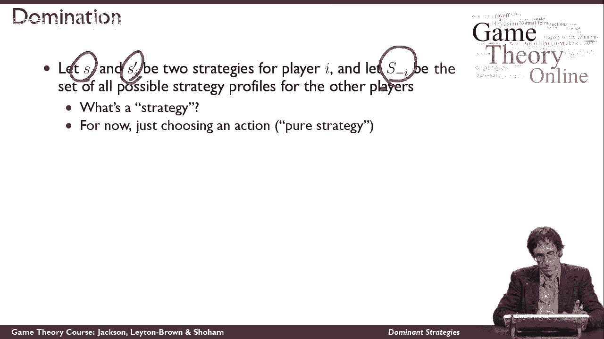
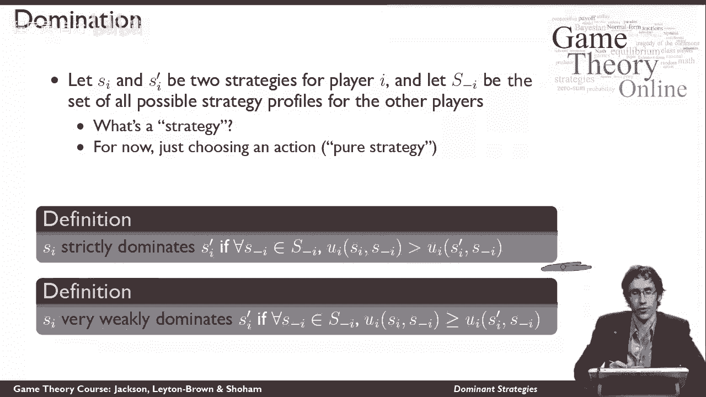
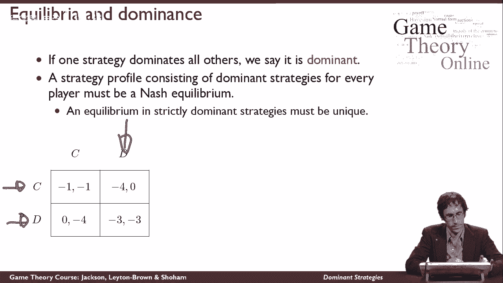

# 【斯坦福大学】博弈论 （全） - P10：【斯坦福大学】博弈论（9）占优策略 - 自洽音梦 - BV1644y1D7dD

这段视频将描述一些游戏的一个重要属性，这就是所谓的优势战略，首先，我将开始使用这个词策略，我们还没有定义，事实上，你暂时不会得到一个定义，所以首先，当我使用策略这个词时，我想让你明白这一点。

只是为了选择一些行动，这个名字最终将是我们所说的纯粹策略，结果会是，还有一种策略我还没有告诉你，这堂课的所有内容也将适用于这种策略，但现在对你来说无关紧要，所以让我们把策略理解为行动的选择。

让si和si质数成为我可以采用的两种不同策略，让资本为负，我是其他人能做的所有其他事情的集合。

我要定义两种不同的定义，所以首先我们有严格优势的概念，在这里我要说，s i严格地支配s质数i，如果是这样，对于其他代理的每一个其他策略配置文件，换句话说，他们能做的每一件事，每一组其他联合行动。

他们可以拿走，玩家我得到的效用，当他玩SI时，我得到的效用更大，当他演奏的时候，s Prime I，所以换句话说，玩可能很重要，或i，其他人做什么，这可能会影响他的效用，他玩si的时候总是更快乐。

比他打全盛时期还要好，我和事实上他更快乐，因为我们这里有一个严格的不平等，所以他玩i会比玩s质数得到更多的效用，这意味着si严格地支配s质数，我现在我们有了另一个支配的概念，我称之为非常弱的优势。

这几乎是你会注意到的相同的定义，这里唯一的区别是我有一个弱不等式，而不是严格的不平等，所以这意味着，不管别人怎么做，我总是至少和SI一样快乐，因为我是最好的我，当那是真的，我说SI非常微弱地支配S素数。

我现在你可能会想为什么我有这个名字很弱，那是因为这个条件甚至允许平等，所以即使SI和S是素数，我总是一模一样，我仍然可以说si支配si质数，这听起来像是一个关于平等的强有力的说法，所以我们软化了它。

说它现在的优势非常弱，事实上，也有一些其他类型的优势生活在这两者之间，没有严格的统治那么强大，不像非常弱的优势那样弱，但他们现在对我们不重要，所以我就不提他们了。

支配地位的重要之处，直觉上，当一个策略，当一种策略支配另一种策略时，那我就不用考虑其他探员会怎么做了，为了决定我更喜欢玩si而不是si Prime，因为我知道我的效用永远不会因为玩SI而变得更糟。

所以不管是哪种优势，对你来说，玩si是个好主意，现在这可以变得更强，如果一种策略支配所有其他策略，那样的话，那么这个策略比其他任何策略都好，在这种情况下，我可以说它不仅仅主导了一些东西。

但我可以说它占主导地位，这是最好的办法，如果我有一个优势策略，然后呢，基本上我不用担心其他探员在做什么，在游戏中，我可以用我的优势策略，这对我来说是最好的事情，将这是最好的事情的概念正式化。

我可以注意到我可以向你索赔，不难看出这是真的，每个人都在玩主导策略的策略简介，必须是纳什均衡，所以如果每个人都在玩主导策略，那么我们就达到了火山灰平衡，因为我们谁也不想改变我们正在做的事情。

我们已经从战略占主导地位的事实中知道，此外，我没有更好的事情可做，如果我们都有严格的优势策略，那么这个平衡必须是唯一的，因为不可能有两种均衡和严格占优策略，因为这意味着我们更喜欢这些策略。

那是不可能发生的，所以最后我想想想囚徒困境游戏，我想告诉你在这场比赛中玩家有一个主导策略，所以我想告诉你们1号博弈者的主导策略是D，我将通过案例分析来做到这一点，让我们开始考虑2号博弈者玩c的情况。

如果2号博弈者玩c，那么一号玩家真的在考虑矩阵的这一列，他知道他在这个专栏里，这意味着他面临着一个选择要么得到负1的回报，得到零的回报，0比-1大，所以一号玩家更愿意得到零。

这意味着他对C的最佳反应是弹D，另一方面，让我们考虑一下2号博弈者玩d的情况，在这种情况下，一号玩家发现自己在这个绿色的柱子里，那对他来说太糟糕了，因为现在他面临着一个选择。

在负4的收益和负3的收益之间，这两个数字都比他之前选择的数字小，所以他喜欢蓝色的柱子，比他喜欢绿柱好，但如果他在绿柱里，他还是喜欢零下3分，然后得到负4，这意味着在这种情况下，他再次更喜欢玩D。

所以我们可以看到，不管2号玩家做什么，一号玩家最好的回应是玩D，在这两种情况下，他的偏好都是严格的，这意味着在这种情况下他有一个严格的主导策略，这里的主导策略也是如此，我让你来看看同样的事情是真的。

如果我认为2号博弈者有D的优势策略，我做了一个案例分析关于玩家一号能做什么，但游戏是对称的。

