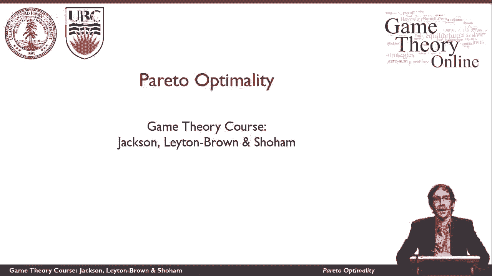
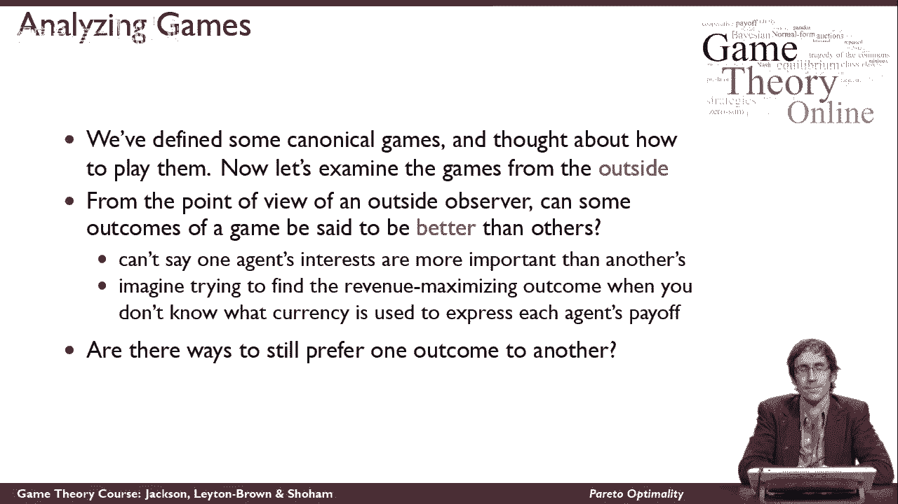
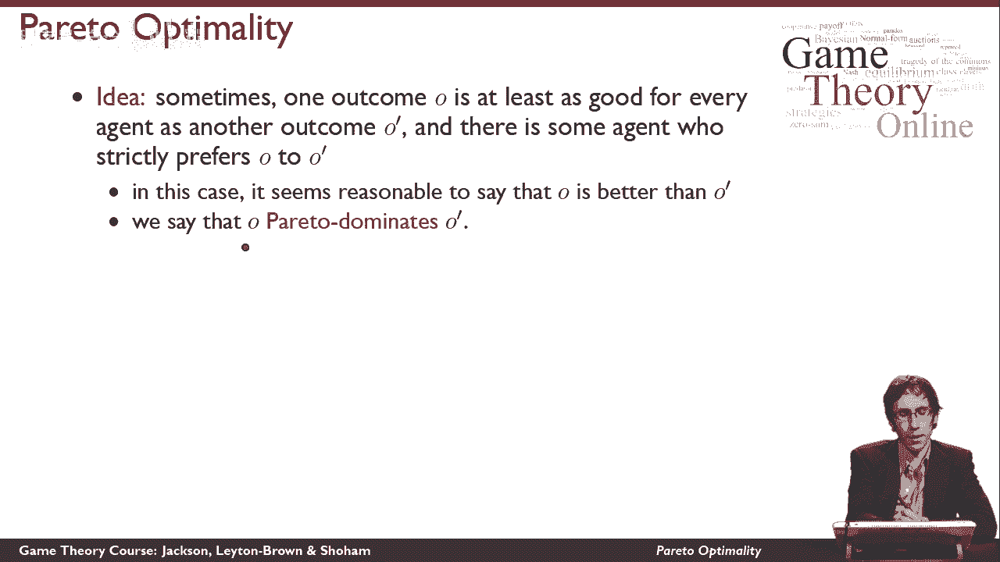
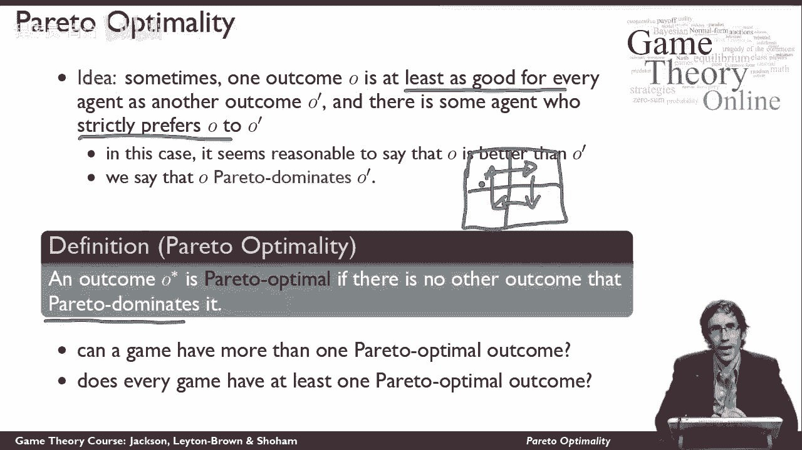
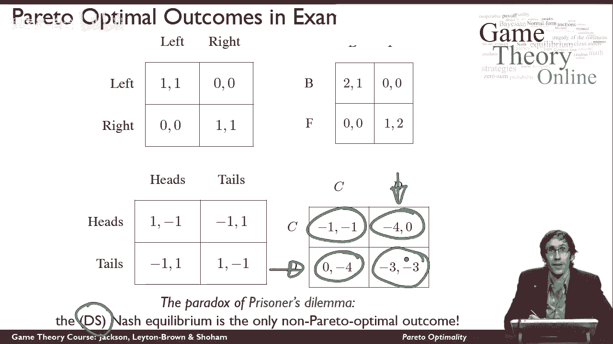

# 【斯坦福大学】博弈论 （全） - P11：【斯坦福大学】博弈论（10）帕累托最优 - 自洽音梦 - BV1644y1D7dD

这个视频将告诉你帕累托最优性的概念，到目前为止，我们已经从博弈论中思考了一些规范的博弈，我们想了想怎么玩，我们真的一直在从玩家的角度出发，我们一直在思考在游戏中做什么是正确的，现在，我想退一步想想比赛。

从一个外部观察者的角度来看，试图判断发生了什么，我想问的问题是，有没有一种感觉，我可以说一场比赛的某些结果比其他结果更好，我其实喜欢，我想鼓励你在这一点上暂停视频，你自己想想吧，在我告诉你我的答案之前。

看看你能不能想出一个答案，好吧，让我给你一点提示，你不能说一个代理人的利益，比另一个代理人的利益更重要，因为我不知道不同的代理人有多重要，实际上，事实证明，我甚至不能说他们的效用是用什么尺度来表示的。

不同代理之间的效用不一定有共同的尺度，所以在某种意义上，的，评估比赛结果的问题是，有点像试图找到回报最大化的结果，当我将得到不同货币的报酬时，我不知道这些货币是什么。

所以你可以把游戏的结果想象成一个外部观察者，只是对参与者的社会利益感兴趣，就像，我是一个结果，在那里我得到了第一对玩家的第一货币的回报，我得到2号玩家以2号货币支付的报酬。

没有人能告诉我货币一和货币二之间的汇率是多少，现在我已经把它做得更具体了一点，让我再来一次，邀请你思考是否有一种方法可以让我识别结果，我更喜欢一个而不是另一个。

嗯，这里是，我们有一个办法可以让这件事成功，我们不能一直这样做，有时会有一个结果，至少对每个人都像其他主要结果一样好，记住一个结果就像矩阵游戏的一个细胞，所以我有一个矩阵游戏，有一些结果。

这至少和其他主要结果一样对每个人都有好处，此外，有一个经纪人非常喜欢O而不是O，那样的话，我就应该如此，让我举个例子，所以1号博弈者得到7个效用单位2号博弈者得到8个效用单位。

1号博弈者可能得到7个效用单位，二号玩家得到两个效用单位，在这种情况下，至少对每个人都一样好，这是因为对一号玩家来说是平等的，严格来说，这对某人更好，严格地说，对二号玩家来说更好，所以在这种情况下。

似乎有理由说，外部观察者应该感受到这种结果，O比结果好，o素数，从技术上讲，我们说的是结果o帕累托支配o质数。

现在我可以定义这个前最优性的概念，结果o星是帕累托最优，如果不是帕累托被任何东西支配，所以这是一个很难的定义，因为它是用否定的术语定义的，我再说一遍，结果O星是相当最优的。

如果它不是被其他任何东西所支配，所以没有什么比这更让我喜欢的了，所以让我们通过问几个问题来测试我们对这个定义的理解，一个游戏是否有可能像往常一样有不止一个前最佳结果，让我鼓励你考虑一下这个问题。

在我回答之前，当然啦，这是因为两种结果都不可能相互支配，如果，比如说，游戏中的所有收益都是一样的，如果我有一个游戏，每个人都得到一个回报，无论发生什么，那么没有什么能支配其他任何东西。

因为统治要求某人严格地喜欢某样东西而不是其他东西，所以这个游戏有不止一个前最佳结果，我还可以问的是，每场比赛是否至少有一个预最优结果，或者有没有可能没有什么是最好的，我让你考虑一下，但答案是肯定的。

每场比赛都必须有至少一个前最佳结果，这很容易看到，为了使某件事不是最优的，它必须被其他东西所支配，为了在游戏中没有最优的结果，我们需要在优势之前有一个循环，我们需要让一切都被不同的东西所支配。

说服自己是很容易的，我们不能有统治前的循环，我们不能有循环的原因只是优势的定义方式，为了使某物占优势，它必须至少对每个人都有好处，而且严格地说是有人喜欢的，我把这件事留给你去考虑，但是。

但这一定义意味着优势关系中不可能有循环。

最后让我们看看我们的示例游戏，我们已经考虑并确定了最佳结果前，在每种情况下，我不会每次都这么说，但我鼓励你在我发布游戏后暂停视频，自己想想什么是最佳结果，然后我帮你辨认，首先我们有一个协调博弈，在这里。

这两个结果都是预最优的，在性别之战游戏中，这两个结果也是前最优的，这里收益的变化没有，没有区别，在配对便士游戏中，这个有点棘手，我让你考虑一下，每个结果都是前最优的，因为没有一对结果是每个人都喜欢的。

同样喜欢这两种结果，总是有一种严格的权衡，因为游戏是零和的，这在零和博弈中通常是正确的，零和博弈中的每一个结果都将是最优前，最后我们有囚徒困境游戏，让我也让你想想这个，原来这里，除了一个结果之外。

所有的结果都是最优的，这个结果不是最优的，因为它是由这个结果主导的，现在我准备给你一个妙语，关于囚徒困境游戏，我们已经建立了一段时间，这就是为什么囚徒困境是如此的困境，囚徒困境的纳什均衡是。

实际上是主导策略中的纳什均衡，所以这是最强的纳什均衡，在这个博弈中有一个纳什均衡，事实上，每个人都应该玩这个平衡，甚至不假思索，即使不知道对方要做什么，2。我可以肯定地说。

在这场比赛中我必须采取强硬的策略，得到这个结果，这是这场比赛中唯一的非最佳结果，所以从社会的角度来看，这个游戏中几乎所有的东西都是好的，游戏中唯一的另一件事是我们强烈预测的，应该发生。

