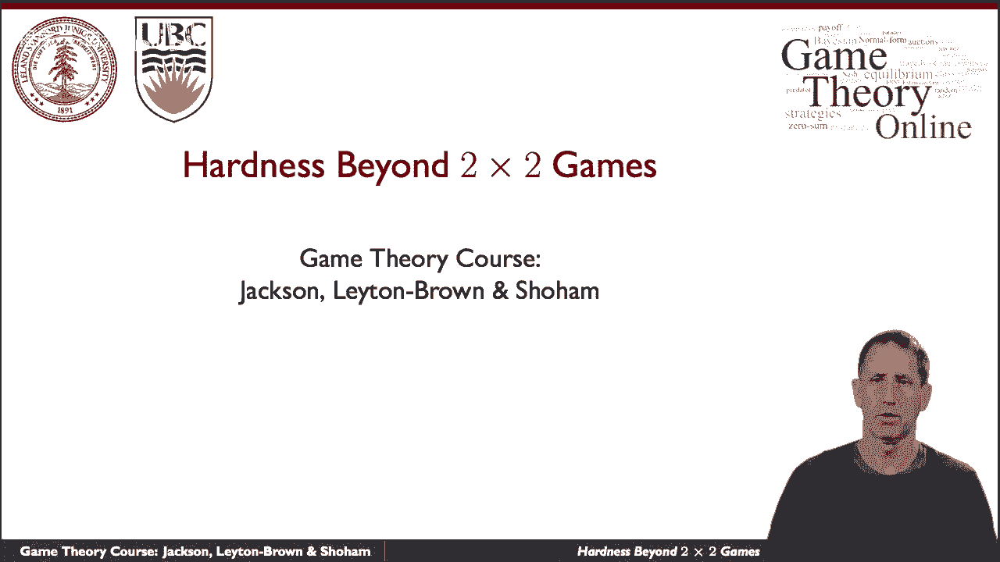
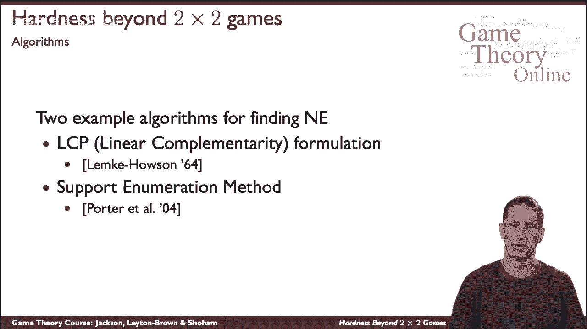
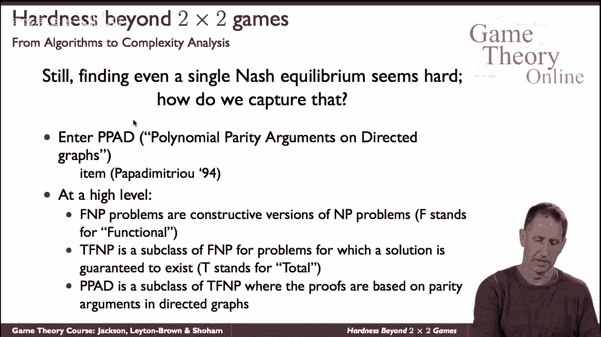
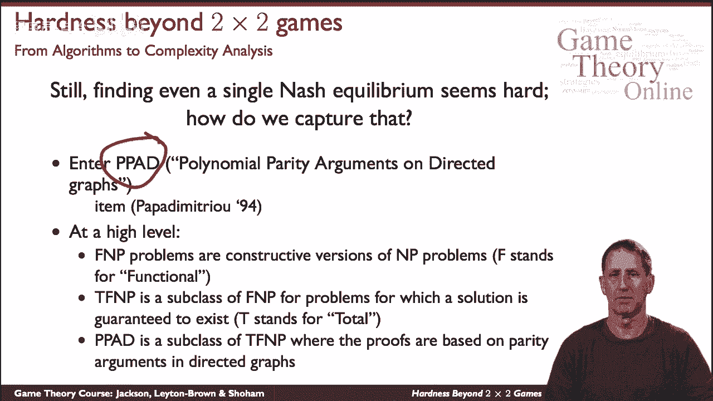
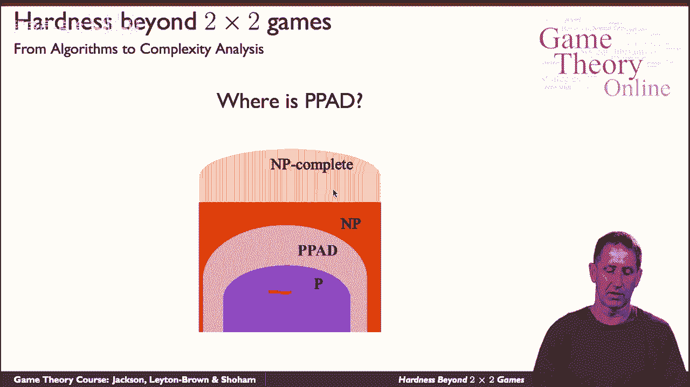
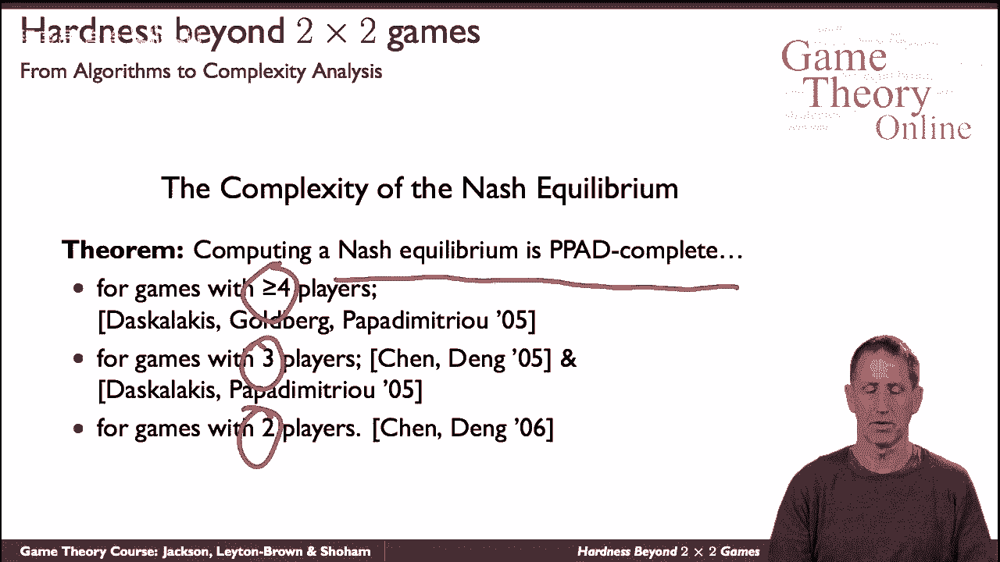

# P15：【斯坦福大学】博弈论（14）Hardness Beyond 2x2 Games - Basic - 自洽音梦 - BV1644y1D7dD

所以说，让我们来谈谈，在普通的手机游戏中计算纳什均衡有多难。

这是一个复杂的话题，我就让你尝尝，让我提请您注意计算样本的两种特定算法，博弈中的自然均衡，这是已经研究过的一长串算法中的两个，这是两个极端，其中一个从问题的数学公式开始，称为线性互补问题。

一旦你把它设置成一个数学优化问题，你可以应用各种算法，最著名的双人游戏是由于莱姆克和哈尔，展示了对游戏的数学结构的深刻理解，纳什均衡的性质也许在另一个极端是，呃，所谓的支持枚举方法，啊嗯，最近的手术。

对问题的结构没有那么深刻的洞察力，它简单地说，上面写着，如果您修复，呃，呃，玩家的策略，策略参与者的支持是那些以非零概率玩的动作，如果你修复了那个支持，那么问题就变得很容易了。

你可以把它设置成一个线性程序，有效地解决它，这将是它的结束，如果不是因为那个案子，事实上，有指数级的支持需要探索，所以这个过程的诀窍是巧妙地探索它们，使用巧妙的启发式，这叫做支持枚举。

对于如何列举这些支持，有一个聪明的启发式工作，一个一个检查，虽然后一个程序没有呃，聪明或像莱姆克豪森一样有洞察力，事实证明，在实践中，它往往跑得很快。

所以我们已经看到了算法，人们非常努力地寻找计算样本纳什均衡的算法，似乎很难问题是，为此我们需要引入一些新概念，基本概念是称为PPA D的新一类问题的概念。

对于多项式奇偶校验参数，1994年由christos papdmitri介绍的有向图，我们就不细说了，但你要知道，年表PPD是一个名为TF NP的类的专门化，这反过来又是。

是一个叫做f和p的问题的特殊化，这里的一个细节是超出了我们想要谈论的范围。

但是呃，它确实帮助我们定位找到样本的复杂性，复杂性层次中的自然平衡，我们又有了多项式时间类，可以在多项式时间内验证的问题的问题，这些是其中最难的，假设PPD位于这个类的某个地方，现在再来一次。

我们不知道整个班是否会崩溃，一切都合二为一，它是，你为什么相信它没有，但是呃，证据不存在，然而，我们知道ppd位于p和np之间，这和计算自然平衡有什么关系。

这就是以下定理的用武之地，最初，它表明计算自然平衡的问题对这一类来说是完整的，PPD就是，这是该班所有问题中最难的，最初证明了四名球员，那么对于有三个或更多球员的所有四场比赛，最后在所有级别的游戏中。

所以我们普遍认为问题不是多项式的，无法证明。

