# 【斯坦福大学】博弈论 （全） - P16：【斯坦福大学】博弈论（15）Hardness Beyond 2x2 Games Advanced - 自洽音梦 - BV1644y1D7dD

所以说，让我们来谈谈，在普通的手机游戏中计算纳什均衡有多难。

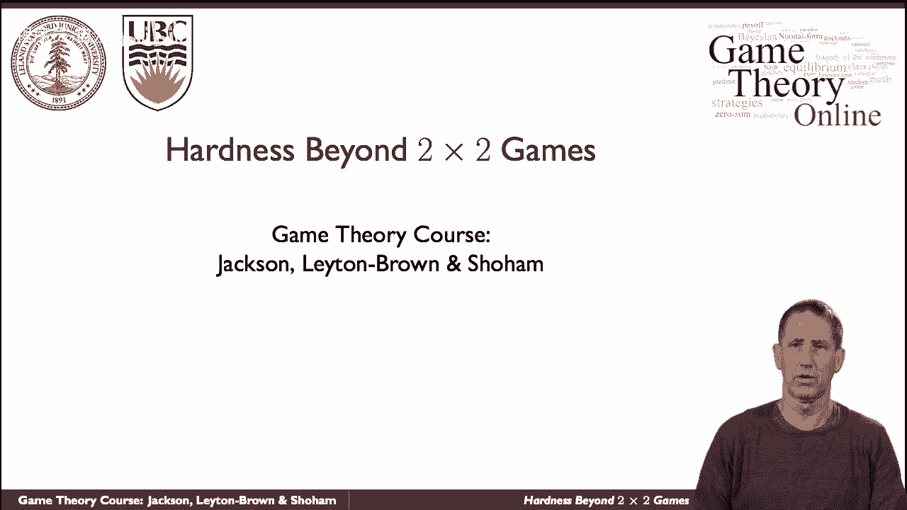

所以让我们，让我们从一点历史开始，呃，约翰·冯·诺依曼，呃，现代博弈论的创始人之一，当他调查一个零和游戏时，我们证明了那里平衡的存在，他用了布劳尔不动点定理。

这直接导致了在这样的线性规划中计算不动点的算法，这实际上相当于现代所说的LP对偶性，这是一个指数级的过程，尽管在实践中被广泛使用，求解线性规划的多项式时间法，尽管在实践中，它是，它没有被广泛使用，它是。

呃不是实际的程序。

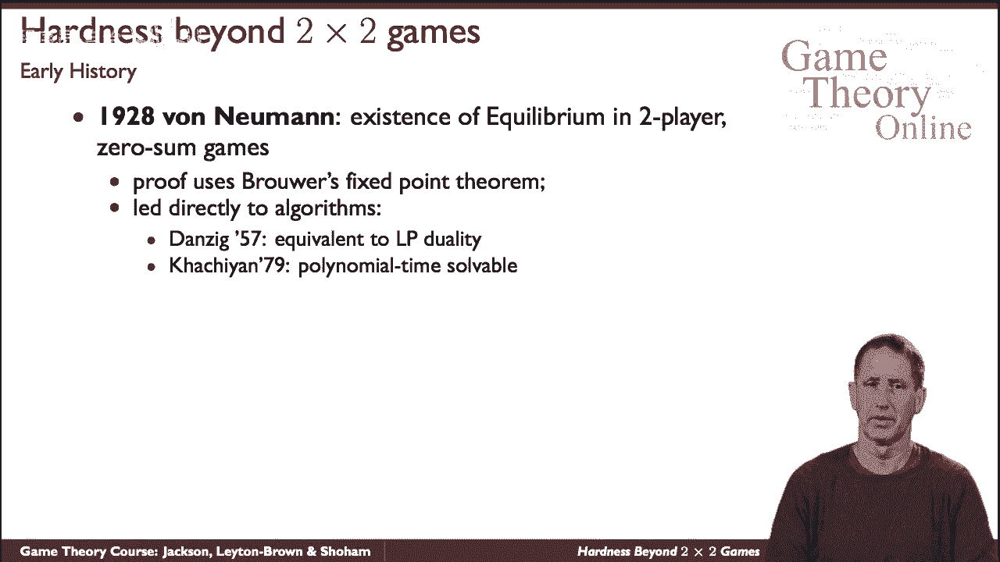

当你超越零和游戏时，所以当约翰，纳什批准了一般和游戏的加勒比海的存在，他用同样的布劳尔不动点定理，这也为一系列算法提供了信息，他们在幻灯片上被注意到了，我们将看到其中的两个，莱姆克·豪森算法。

和瑞安·波特等人的一个更近的算法，我会注意到，在最坏的情况下，所有这些都是指数级的，我稍后再讨论这个问题。

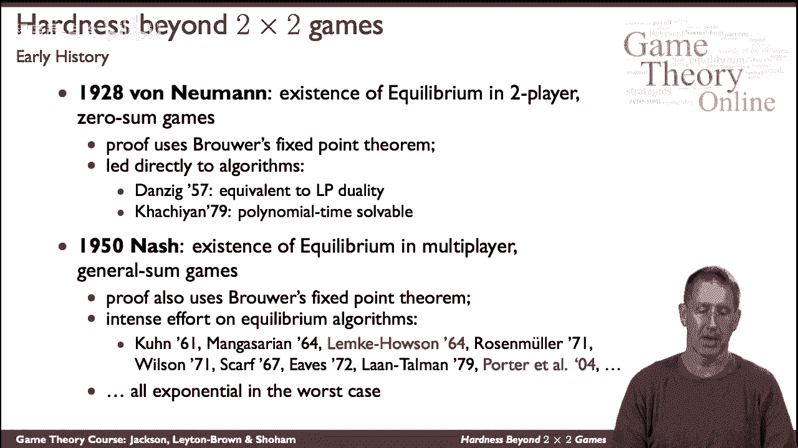

让我们从Lemke住房算法开始，让我们从自然平衡的公式开始，双人游戏，看起来它看起来如下，嗯，这是一个繁忙的幻灯片，但我会带你走过，一切都会在心里变得清晰，是两组变量，字母s和r。

文章将表示将捕捉两个玩家使用的混合策略，一号玩家和二号玩家，It’只有一个，例如a s s 2k，例如，就是嗯重量，或者2号博弈者在混合策略中加入动作k的概率，所以S 1和S 2是捕获。

一号玩家和二号玩家，我们的是所谓的松弛变量，并了解他们的角色，让我们来看看，比如说，这个等式，所以这适用于任何，一号玩家的动作，对于一号玩家的任何动作，我们看它的价值，呃，呃，的，我给出的关于，的战略。

另一个球员的，所以我们会看看二号玩家可用的所有动作，考虑到他在玩一个特定的动作，j，看着玩家的动作，另外两个中的一个玩家，将其标准化为玩家附加到该策略的概率为2，所以如果我们把这个总和作为一个整体来看。

这是一号玩家在玩策略时的预期收益，考虑到玩家2在玩某种混合策略，It’两点，它就是它，和一般情况下，呃，如果你看看玩家的所有动作，呃，一号玩家，他们会给出不同的收益。

我们想要的是一号玩家最好地响应二号玩家的策略，因为在均衡状态下，每个参与者对另一个参与者的反应最好，所以我们称你为一号玩家作为二号玩家的收益，纳什均衡中的一号玩家，所以总的来说。

1号博弈者玩a时的收益不会大于，一般来说要少一些，所以我们要加上这个松弛变量，就像它所说的那样，会说，这是相对于他们的最佳反应，一个人缺少了多少护理，当他们玩策略的时候，这些是松弛变量。

所以现在这也会让我们对这里的情况有一个感觉，所以松弛变量总是非负的，在纳什均衡中，它们将正好为零，除非你说的策略实际上是玩家以零概率玩的，所以现在我们来谈谈S，S的，就像我们说的，他们的每一个动作。

在他们玩的混合策略中，所以，非零概率，最好是他的上级最好的回应，即松弛变量为零，当他们玩的概率为零的时候，你不在乎松弛变量是什么，因为他们根本没有玩那个策略，你通过要求乘积为零来捕捉这一点，这正是条件。

这就是线性互补问题的原因。

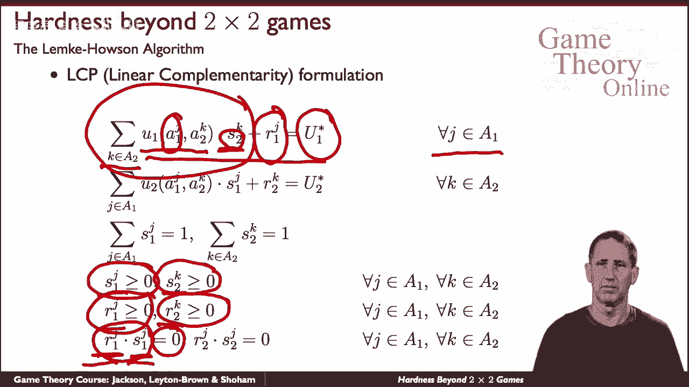

所以我希望这很清楚，你现在可以看到，二号玩家也是如此，对于二号玩家，我们采取他们的每一个行动，我们说如果他们要玩它，不是和，有一定的概率，然后我们看看他们在这里的最佳反应，给任何玩家。

一个要玩他们的混合策略，我们将一次又一次地研究松弛变量，我们将要求乘积为零，换句话说，他们玩J的概率不为零，以防万一，所以呃，这是呃，这个数学优化程序的性质，当然我忘了提。

但是我们当然希望s是一个概率分布，所以它们加起来就是一个，他们都不是零，所有的权利，这是我们的线性评论程序，现在来看看勒海伦她建议用一种特殊的方法，我们不会再重复了，但它的味道是。

以一种特殊的方式初始化S和R，事实上，人为地将它们都初始化为零，然后一个接一个地拿着，这叫做旋转过程，依次取an s和an r，在两者之间交替，将它们从具有当前值的集合中取出，带有互补变量。

如果是用s代替r，用熵和r，直到你得到一个平衡，这是它的普遍优点，然后嗯，在这次讲座中，我们就不详细讨论弱智之家和程序了，但这是一个非常深入地研究什么是纳什均衡的过程，把它设置成一个数学程序。

然后以知情的方式搜索变量空间。

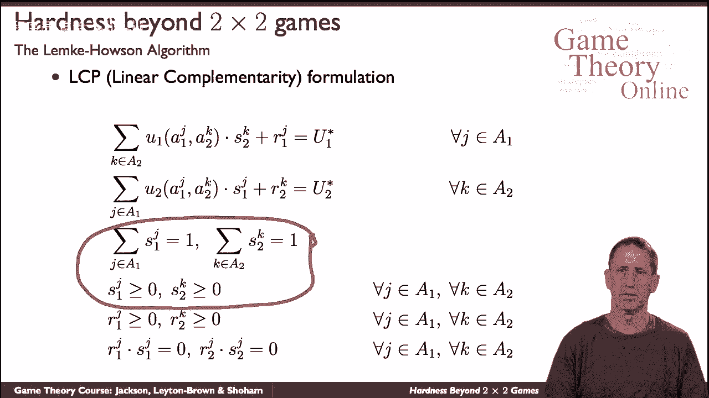

现在让我们来看看一个非常不同的过程，一个不像平衡结构那样详细的问题，但补偿方式是，呃，通过以某种方式执行启发式搜索，所以嗯，所以让我们来看看它，我们将从两个阶段来看看它，第一步是注意。

当您修复策略配置文件的支持时，找出支撑是否存在纳什均衡是一个简单的问题，记住一个策略的支持是，呃，由玩家在混合策略中给出非零概率的所有动作组成，所以让我们来看看这个配方，让我们看看，这将仅限于两名球员。

所以让我们依次看看所有的玩家，例如一号玩家，让我们看看那个球员的每一个动作，例如潜艇，i，我们将寻找一些混合策略P混合ID，配置文件，呃，每个球员一个，嗯，给我们，呃一个平衡，即每个代理都将响应，因此。

对于我们正在考虑的所有支持行动，我们希望代理商能做出最好的反应，所以让我们假设最佳响应值是v subi，我们就叫它我们想要的那个号码吧，事实上是对其余的最好回应，我们想要的是其他行动中的所有其他行动。

无，它的支持给了我们一个价值，这并不比最佳反应大，我们每个人都想要，两个球员的每一个和他们在支持中的每一个动作，所以这是有道理的，我们希望这些是一个概率，所以我们希望支撑中的概率不为零，我们想要，呃。

支撑外的概率为零，我们希望它确实是一个概率分布，这一切都有道理，所以这是一个线性程序，它可以在多项式时间内解，理论上有一个多项式时间过程，在实践中，所用的程序不是多项式，最坏的情况，但仍然有效。

顺便说一句，请注意，我们实际上使用的假设是，我们正在修复这里的支撑，从表面上看，你可能会看着它说，哦，我也可以做同样的事，但简单地忽略支撑部分，我们在哪里用那个，真的很好，我们用它来假设。

当我们内部反应最好，没有有利可图的偏差时，这些带有正概率概率的PI，因为如果我们以零概率玩剩下的策略，事实上，我们是否对它做出最好的反应并不重要，所以这就是这个假设隐藏的地方。

所以现在我们知道当我们修复支架时，我们可以有效地解决这个问题，飞药膏，事实上，有指数级的支持需要探索。

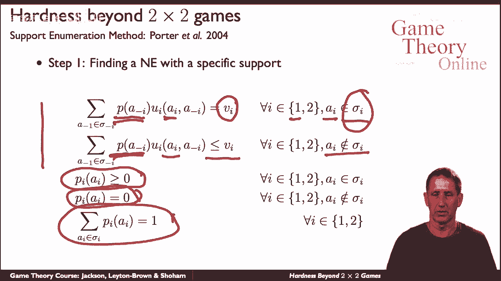

这是第二部分，我们现在只需要开始探索，支持的集合，我不会详述我们如何做到这一点，但基本思想如下，我们会将支撑物偏向于大小相近的支撑物，也就是说，我们不会从考虑一个代理开始，只考虑两种策略。

其中是他的随机化和另一个代理看17个策略，我们将研究一个战略深奥者，呃相似，呃，它的支撑物大小相似，如果我们这样做我们参与进来我们使用另一种技巧叫做条件支配，那就是看看我们一路上不能忽视的某些事情。

那么结果是，尽管这个过程在最坏的情况下是指数的，嗯，软脚屋也是，和，呃，事实上，它在实践中表现得很好，然后呃，事实上，呃，比所有其他尝试过的程序都好，这些程序确实有指数级的最坏情况，所以问题是。

我们能做得更好吗，在最坏的情况下，是否有低于指数的程序。

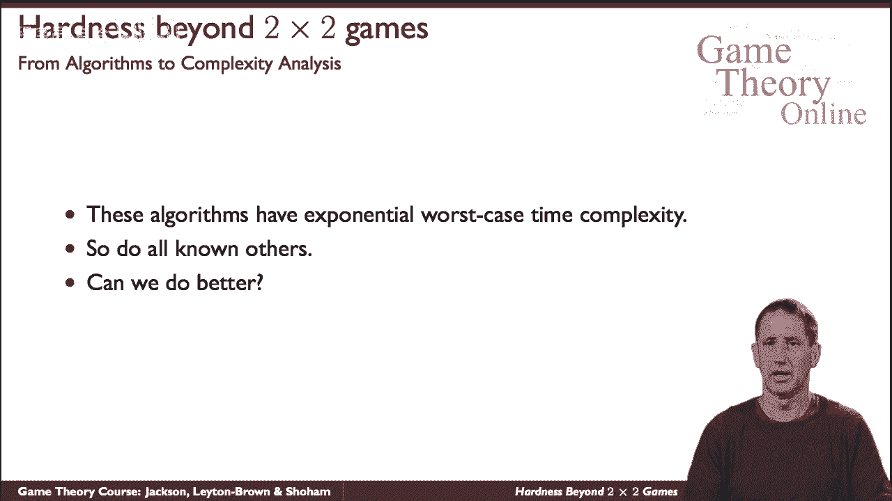

这让我们从复杂性算法的领域，到复杂性分析领域，所以让我们先提醒自己，关于复杂性分析是什么样子的，我们在看课程，整类问题，比如所有游戏的类，以及在这些博弈中确定样本纳什均衡的问题，我们看着，呃。

这门课作为一个整体有多难，所以这里是复杂性层次结构的一小部分，类p，众所周知，是已知多项式时间解的一类问题，是一类问题，解决方案，可以在多项式时间内验证，但不一定在多项式时间内找到。

是所有NP课中最难的，这就是所有NP问题都可以归约到的类，也许理论计算机科学中最大的未解决的问题是，NP是否不同于P的问题，人们普遍认为，但尚未得到证实，所以这是我们需要记住的一般背景。

现在我们可以好好问。

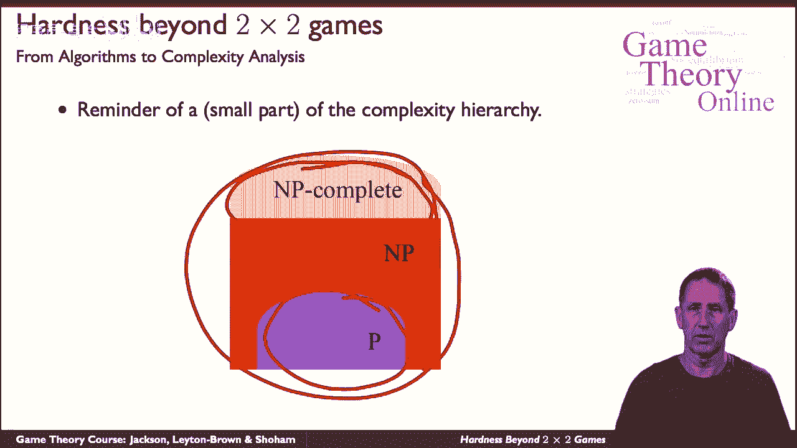

嗯在哪里，哪里呃，在np中求p中的纳什均衡问题，我们能说什么好呢，首先呢，严格来说，我们不能很好地谈论它在呃p o p，因为我们从纳什定理中知道自然平衡总是存在的。

所以它是否存在于自然平衡中的问题是微不足道的，答案是肯定的，所以我们需要用不同的眼光来看待，一种不同的看待方式，就是求具有特定素数性质的纳什均衡，例如，我们可以说呃，它有独特的自然平衡吗。

还是存在于严格有效的，是否有一个自然的协议，保证给定的玩家有一些最低的回报，是否存在实际的程序，嗯，其中玩家的一些动作，或者反过来，这确实排除了它，所有这些和其他都是，这告诉了我们一些关于硬度的事情。

但还是嗯，我们还在问这件事，只是找到一个样本纳什均衡，这有多难，所以我们已经看到了算法，人们非常努力地寻找算法，计算样本纳什均衡，看起来确实很难，问题是，为此，我们需要介绍一些，你知道新的新概念。

基本概念是称为PPA D的新一类问题的概念，对于有向图上的多项式奇偶校验参数，由克里斯托斯·帕德米特里于1994年介绍，我们就不细说了，但你要知道，年表PPD是一个名为TF NP的类的专门化。

这反过来又是，是一个叫做f和p a的问题的专门化，这超出了我们想要谈论的范围。

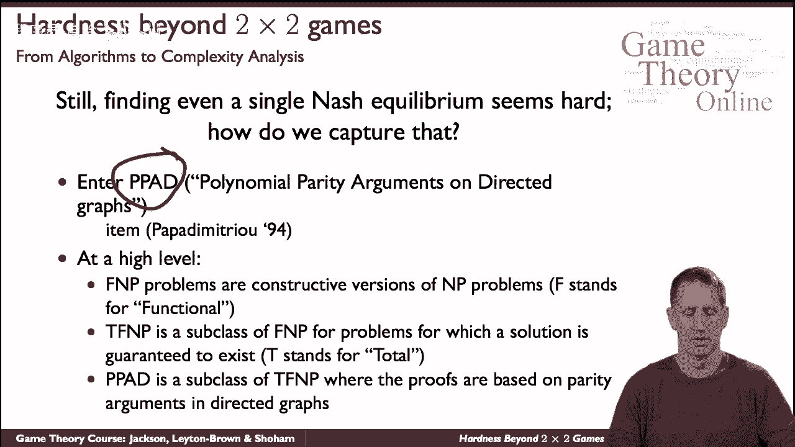

但是呃，它确实帮助我们定位找到样本的复杂性，复杂性层次中的自然平衡，我们又有了多项式时间类，可以在多项式时间内验证的问题的问题，这些是其中最难的，假设PPD位于这个类的某个地方。

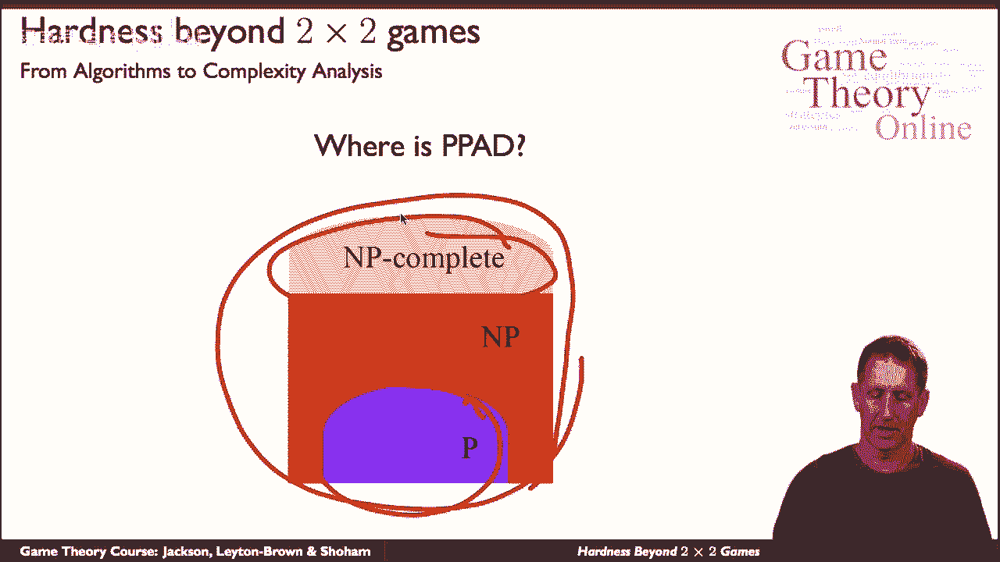

现在再来一次，我们不知道这整个班是否会崩溃，一切都合二为一，这就是为什么你相信它没有，但证据不存在，然而，我们知道PPD位于P和NP之间的某个地方，这和计算自然平衡有什么关系。

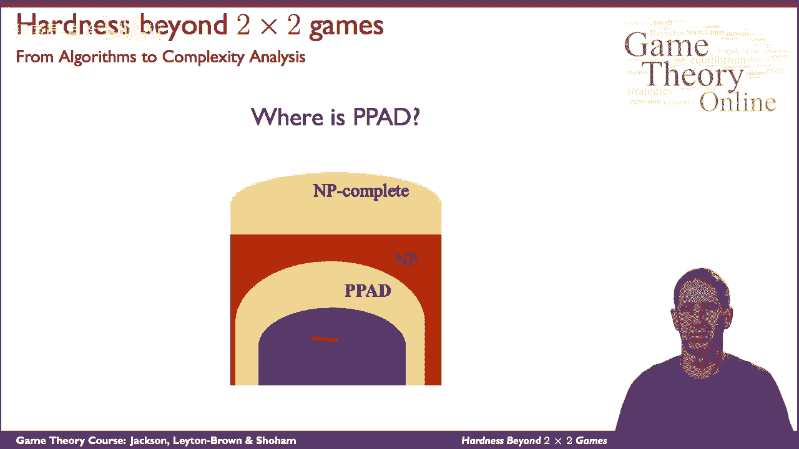

这就是以下定理的用武之地，最初，它表明计算自然平衡的问题对这一类来说是完整的，ppd，也就是，这是该班所有问题中最难的，最初证明了四名球员，那么对于有三个或更多球员的所有四场比赛。

最后在所有级别的游戏中，所以我们普遍认为问题不是多项式不能证明的。

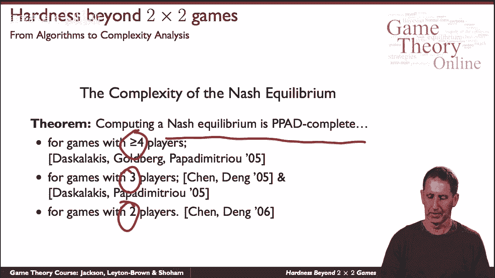