# P17：【斯坦福大学】博弈论（16）混合策略纳什均衡示例 - 自洽音梦 - BV1644y1D7dD

嗨，伙计们，我是马特·杰克逊，现在让我们来看看混合策略。

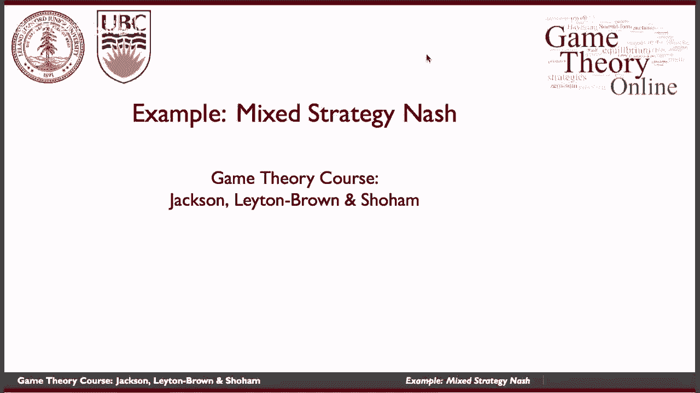

实践中的纳什均衡，试图理解它能告诉我们什么，关于我们应该期待看到的。

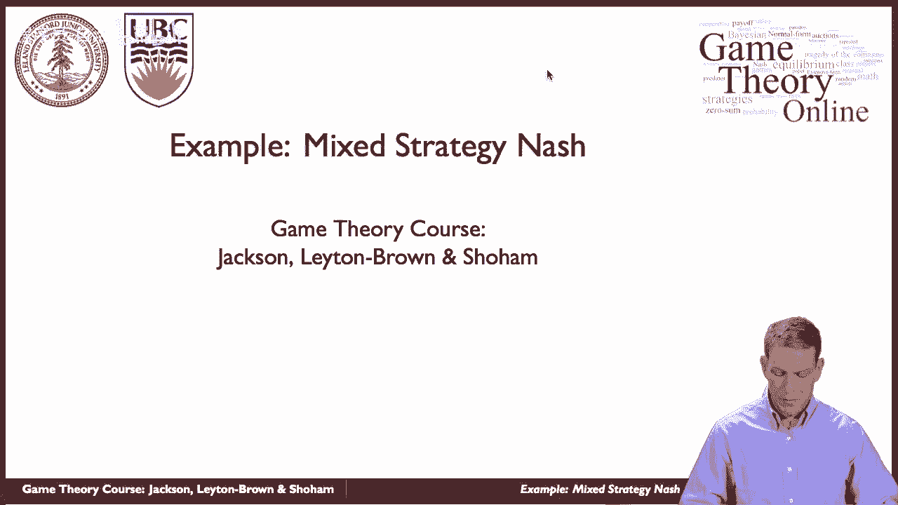

所以让我们从足球点球的情况开始，这是混合策略均衡的一个很自然的应用，因为它们在体育和竞技游戏中无处不在，所以在这种情况下，不可预测实际上是值得的，所以不知道对方是什么，反对派会做的。

这让你更难在这些游戏中选择最佳策略，一个玩家赢，另一个玩家输了，嗯和嗯，特别是，在足球点球中，嗯，我们在看一个情况，踢球的人必须试着把球踢进球门，守门员可以尝试移动来偏转球，这种情况发生得很快。

所以它本质上是一个同时移动的游戏，踢球的人选择去，在他们的简化版本中，说向右还是向左，然后守门员会扑向一边或另一边，试着让球偏转，如果守门员猜对了，它最终与踢腿的方向相同，那么他们就有更高的机会拯救它。

如果他们往相反的方向走，他们拯救它的机会更低，好的，所以嗯，平衡如何适应玩家的技能，所以让我们假设，例如，作为一个踢球的人，我可能会有偏见，我也许能把球踢向一个方向比另一个方向更准确。

所以如果你让我把球踢向球门的左侧，可能是我打得很准确，如果你告诉我我必须把球踢向球门的右侧，可能是我不太准确，我有更大的机会完全错过目标，那么平衡将如何调整，当我们改变其中一名球员时。

根据他们的技术进行调整，所以让我们来看看这个，如果一个踢球的人把点球踢向右边而不是左边，向左踢的次数多于向右踢的次数，所以如果我，如果我更糟，踢向右边，那是不是意味着我应该更经常地踢相反的方向，嗯。

让我们看一下。

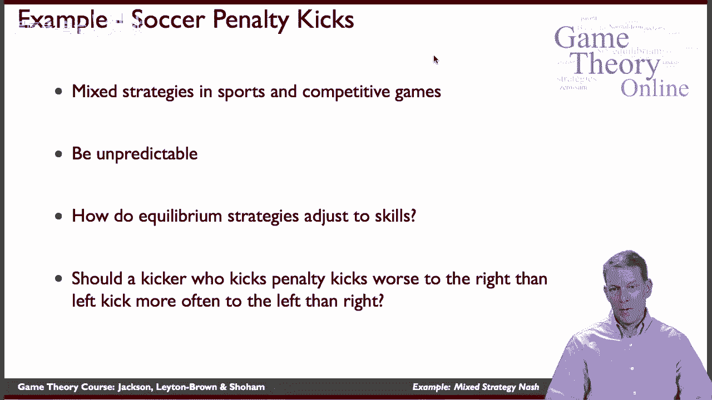

所以让我们从一个简单的版本开始，只是为了让我们的想法固定下来，所以想象一下这个场景是踢球的人和守门员，如果他们是这样，让我们把踢球的放在这边，所以踢球的人是划船的人，守门员是纵队球员，如果他们最后踢了。

如果踢球的人走到左边，守门员也碰巧走到左边，然后守门员扑救，守门员得到一个回报，踢球者得到零的回报，嗯，如果我们的情况是说踢球的人向左，守门员向右，然后踢球的人得分，得到一个回报，以此类推，好的。

所以这只是匹配便士的一个简单变体，在这种情况下，嗯，平衡是什么，平衡会很简单，只是踢球者在左边和右边之间平均随机，守门员左右开弓，每个人都有一半的概率从左向右踢，从左到右，所以这是一个非常简单的游戏。

我们对如何解决这个问题有一个很好的想法，好的，那么现在我们该怎么办，让我们改变事情，现在我们有了一个有时会错过的踢球者，当他们往右边走的时候，所以特别是，如果守门员碰巧走到左边，球门向右敞开。

踢球的人有75%的时间得分，但实际上有2。5%的时间完全错过了，好的，所以这是一个仍然做得很好的踢球者，如果他们向左而守门员向相反的方向走，但现在他们踢对了，获胜的可能性就低了，他们有一个大开的目标。

好的，那么这个应该怎么调整呢，新的均衡应该是什么样子，所以说，让我们假设，呃，让我们首先试着让踢球的人无动于衷，让我们假设守门员向左的概率为p，右，概率为1-p，让踢球的人无动于衷，什么必须是真的，嗯。

他们的报酬是多少？如果他们向左，他们向左的收益是1乘以1减去他们的开球，他们向右的回报是7分，五倍p，这两件事必须相等，为了拥有这个，踢球的人无动于衷，那么我们最终会得到什么，我们以七点结束。

5 p等于1减去p，所以我们最终得到了，等于1除以1。75，等于四比七，好的，这告诉我们守门员应该以4的概率向左，七和，所以我们知道守门员应该做什么，所以现在，我们改变守门员收益的事实并没有改变。

但事实上，我们改变了踢球者的收益，意味着守门员实际上必须调整正确，所以即使守门员的收益在这场比赛中没有任何变化，对于守门员来说，新的均衡有一组不同的概率，为了让踢球的人现在无动于衷。

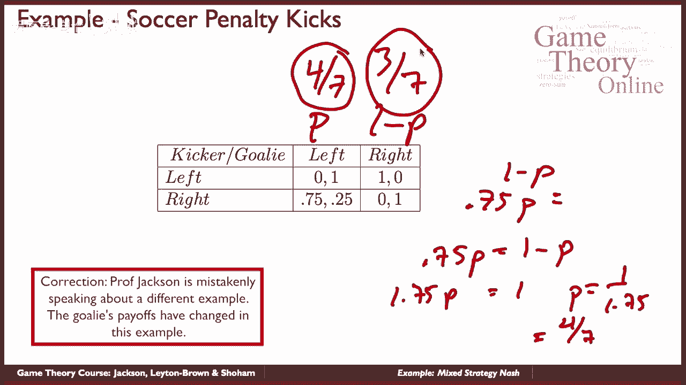

好的，现在让我们看看踢球者要做什么，我们怎么才能看到什么是如此，让我们假设踢球者以概率q向左，右，概率为1-q，让我们来解Q井，守门员无动于衷，他们的回报是什么，如果他们向左，如果他们向左走。

他们得到了，呃，他们得到了一个Q，它们匹配的概率，所以他们得到Q加2点，五乘一减q，如果他们向左走，如果他们向右走，他们得到了什么，他们只是答对了一个负Q，所以这两件事必须相等，所以我们最终得到了一个。

点7 5乘以1减q，所以q除以1减去q等于7。5，这告诉我们关于q的什么告诉我们q等于，好的，那么当我们解决这个问题时会发生什么，踢球者向左的概率是3个7，7代表踢球的人走对路的概率。

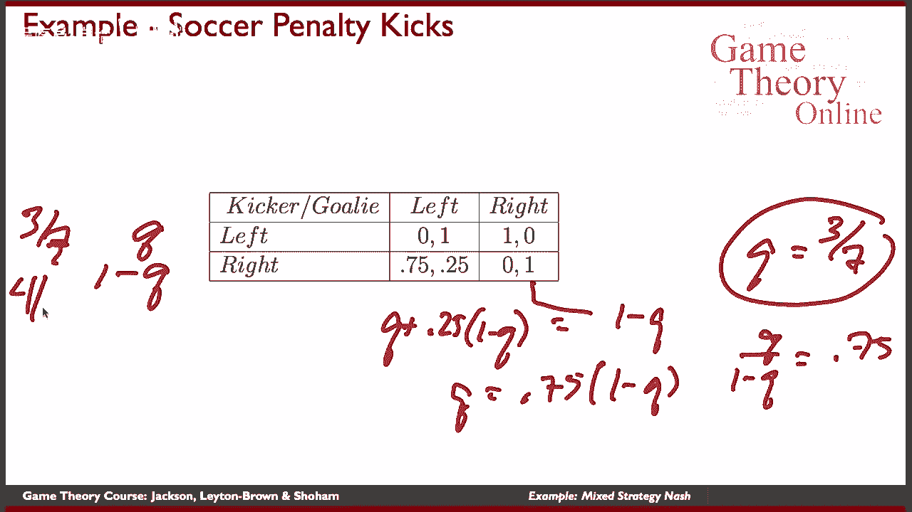

所以总的来说，我们有什么，现在我们的策略是这样的，当我们做这个调整的时候。

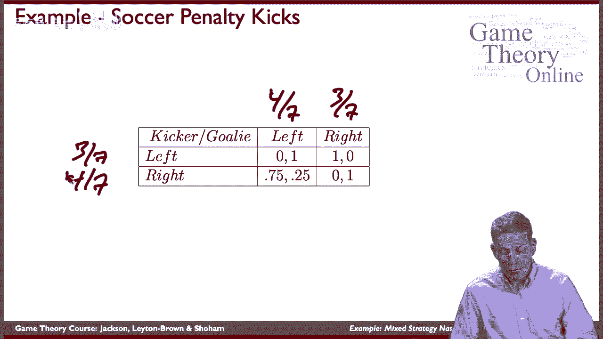

我们注意到了两个有趣的事情，一个是守门员的收益没有改变，但他们还是要调整策略，第二个是踢球的人踢得更频繁。

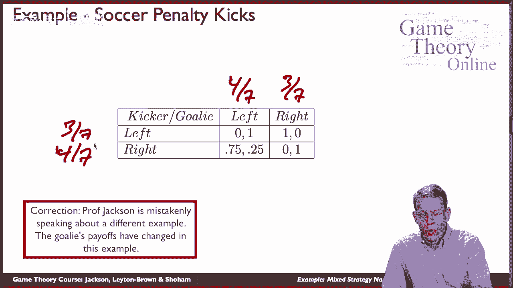

向右边较弱的一侧，所以他们的右脚比以前更糟了，他们实际上更经常地朝着那个方向前进，嗯，为什么是因为踢球者。

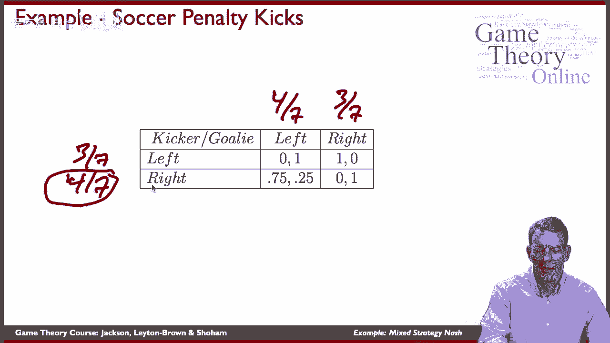

守门员在这场比赛中也做出了调整，所以比较静态和混合策略，纳什均衡实际上是非常微妙的，有点违反直觉，就你可能期望你的，你会有偏见，这样就变成了一个比较弱的方向，平衡调整，这样玩家就更经常地往那个方向走。

所以让我们再一次通过直觉来看看，守门员的策略必须让踢球的人无动于衷。

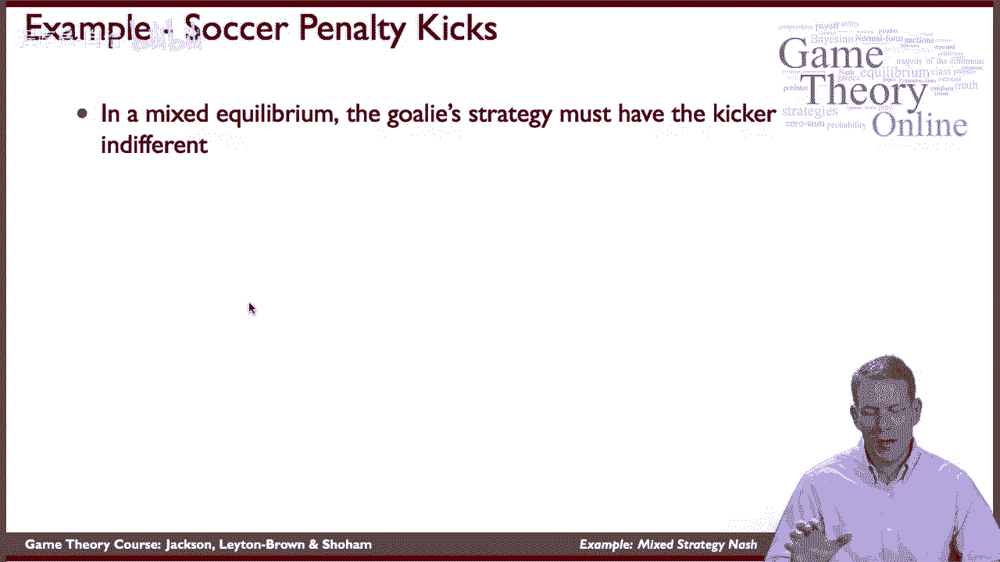

所以当我们经历这些收益时，踢球者，守门员向左走的次数多于向右走的次数，嗯，踢球者实际上很抱歉是这里的一个错别字，踢球的人实际上更频繁地向右移动，对呀，现在符合概率。

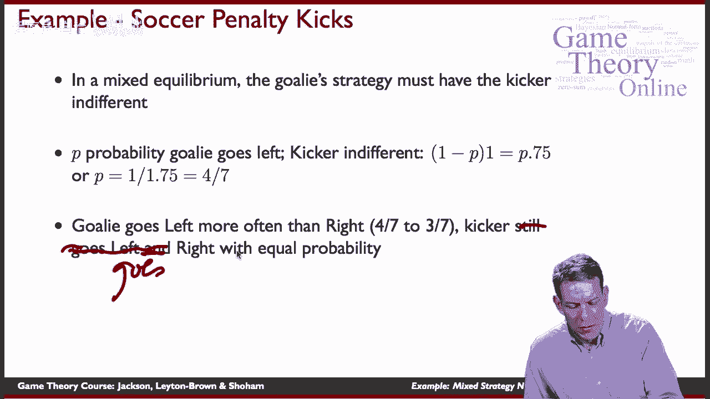

嗯四七，所以他们增加了这样做的可能性。

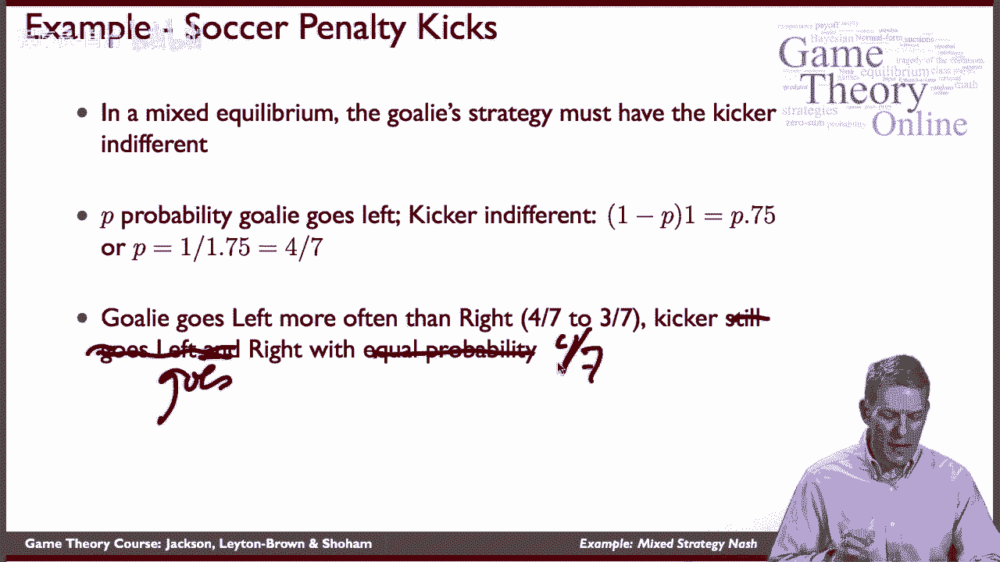

当我们最终，我们看到的是守门员的策略正在调整，但我们也看到踢球的人适应踢更多的球，向他们薄弱的一面。

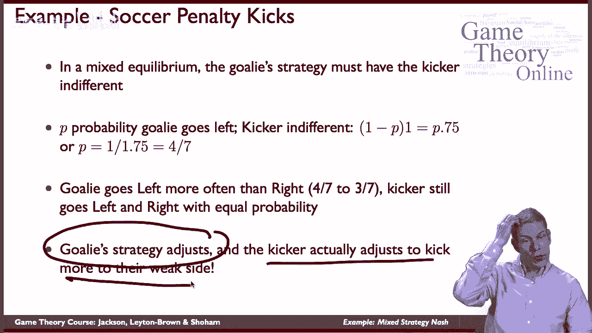

所以守门员现在有一点优势，所以如果你通过并计算守门员获胜的概率，在这场比赛中，他们将赢得七分之四的时间。

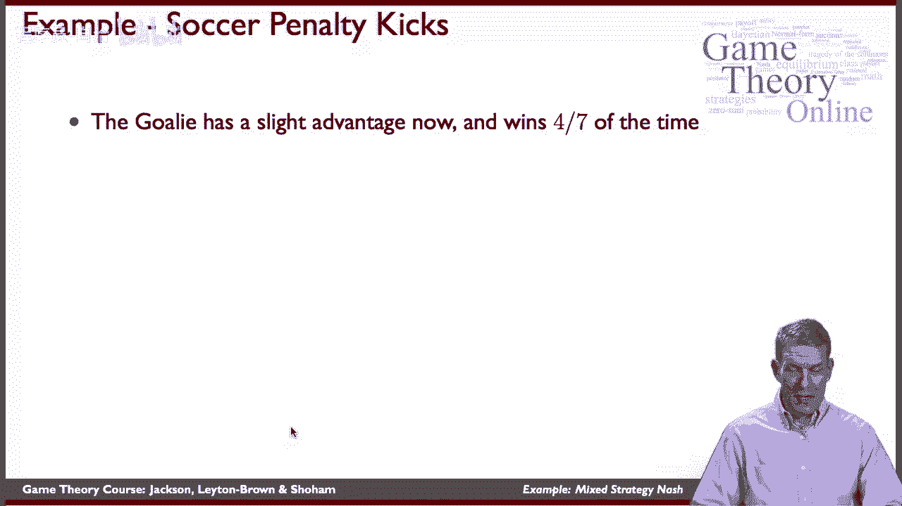

我们可以认为你知道会发生什么，如果守门员真的坚持她的老策略仍然五五分成，那么踢球的人总是可以向左走，赢得一半的时间，而不是三个7，所以这个，守门员必须做出调整的事实，是因为他们必须防守更多的左边来推迟。

因为现在踢球者在那边获胜的机会更大了，所以守门员更倾向于那个方向，这将踢球的人推向他们较弱的一侧，为了确保守门员愿意去，嗯，向左边折，呃，以更高的频率，所以通过调整策略让踢球的人无动于衷。

守门员实际上利用了踢球手微弱的右踢，而且赢的次数更多。

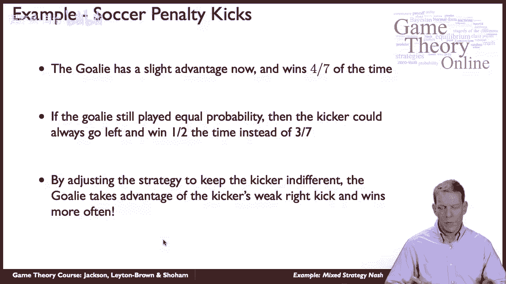

所以就总结和混合策略以及足球点球而言，玩家必须对他们随机选择的东西漠不关心，嗯，这产生了非常有趣和微妙的比较静态，你知道你可能会想到一个问题，你知道的，人们真的这么做吗，我是说，这是相当复杂的，对呀。

所以你知道，五五分帐我们一拿到这些就能算出来，这些游戏中玩家有这样或那样的优势，那么实际的混合物就变得相当复杂，玩家真的会这么做并不明显，嗯，所以我们就，我们会看看这个，看看这是否真的证明了。

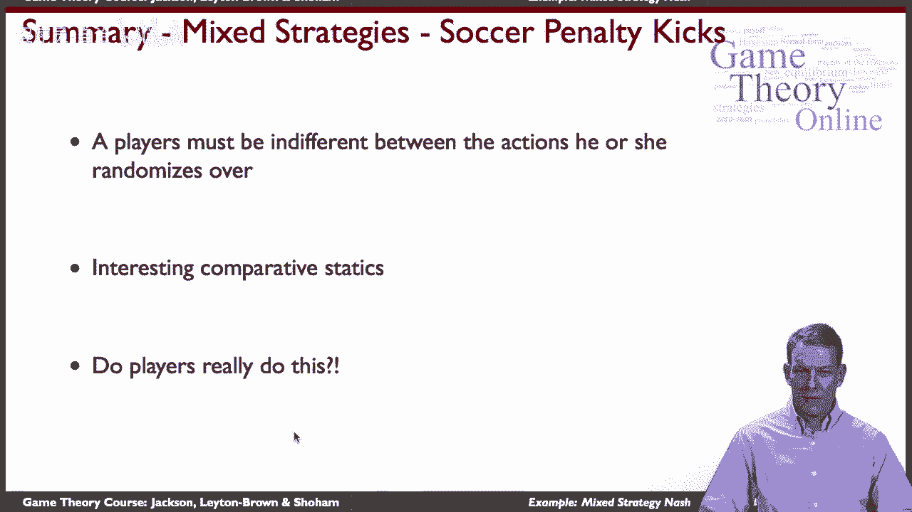