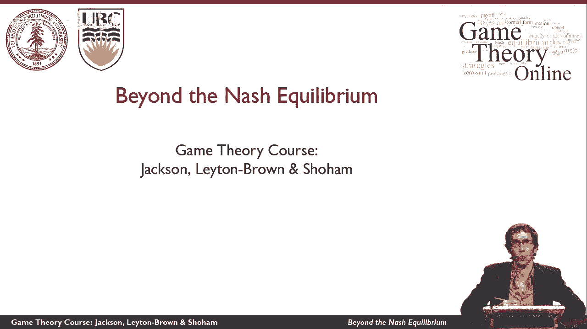
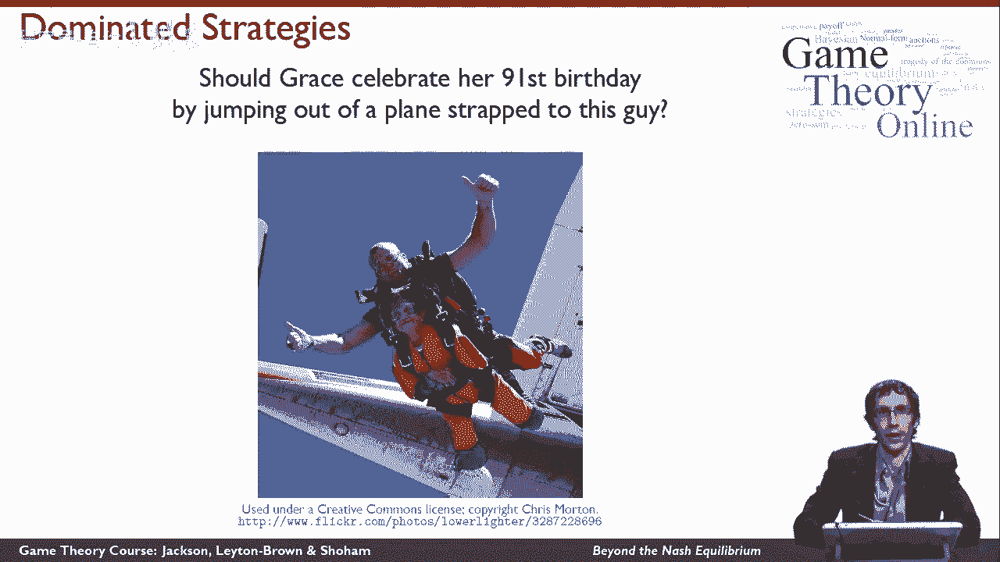

# P19：【斯坦福大学】博弈论（18）超越纳什均衡 - 自洽音梦 - BV1644y1D7dD

在这个视频里，我们将研究一些除纳什均衡之外的其他解概念，所以这些是不同的方式来讨论游戏的结果是有意义的。

从博弈论的角度，首先呢，我想谈谈一个解决方案的概念，叫做迭代去除劣势策略，我想通过这张照片中展示的恩典的例子来说明这一点，这里，她决定从飞机上跳下来庆祝她的91岁生日，所以我想考虑格蕾丝和。

她选择把自己绑在一起的男人，你也可以在照片中特别看到他，我想考虑他是否安全地打包降落伞的决定，以及她是否跳出飞机的决定，原则上，她可能会担心他会选择不安全地打包降落伞，她会选择跳下飞机。

如果发生这种情况，那她就永远不能庆祝她的92岁生日了，但你可以看到，事实上，她确实选择了，她确实安全着陆了，她的选择很好，那么她怎么能推理出这是明智的呢，如果她看了游戏的收益。

她会看到这家伙让我们叫他布鲁斯，没有安全地包装降落伞的行为是非常糟糕的，不仅仅是为了恩典，也是为了他自己，事实上，这是一种占优势的策略，知道他是理性的恩典，理由是他永远不会玩劣势策略。

所以她能够通过消除这种劣势策略来改变游戏，取而代之的是，她只需要关心剩下的比赛，他的劣势策略并不存在，这就是迭代去除劣势策略的思想。

你以后会更正式地听到，其次，我想重新讨论一下足球射门的问题，我想问一下，当一名球员准备罚点球时，他真的在解纳什均衡，现在，我们确实看到了实验证据，这说明，纳什均衡很好地描述了在这些情况下实际发生的事情。

但是，玩家真的在思考纳什均衡吗，这似乎不对，球员们似乎在考虑如何最好地把球踢进球门，为了尽可能地伤害对方，或者为了尽可能为自己做得更好，事实证明，在零和博弈的情况下，这不是意外。

这三个想法尽可能为自己做好，尽可能地伤害对方，和处于纳什均衡都是一致的，最后，我想重温性别之战，并问，真的是这样吗，就像我们之前看到的，用这个博弈的纳什均衡，2。我们要么注定要有一个不公平的结局。

夫妇中的一个成员总是得到他们喜欢的活动，或者协调不当，有时这对夫妇的两个成员最终会做不同的活动，好像不是这样的，是一个很好的模式，展示了人们如何真正解决他们之间的纠纷，所以我想考虑一个新的解决方案概念。

叫做相关均衡，我们没有这个问题。