# 【斯坦福大学】博弈论 （全） - P20：【斯坦福大学】博弈论（19）严格支配策略和迭代去除 - 自洽音梦 - BV1644y1D7dD

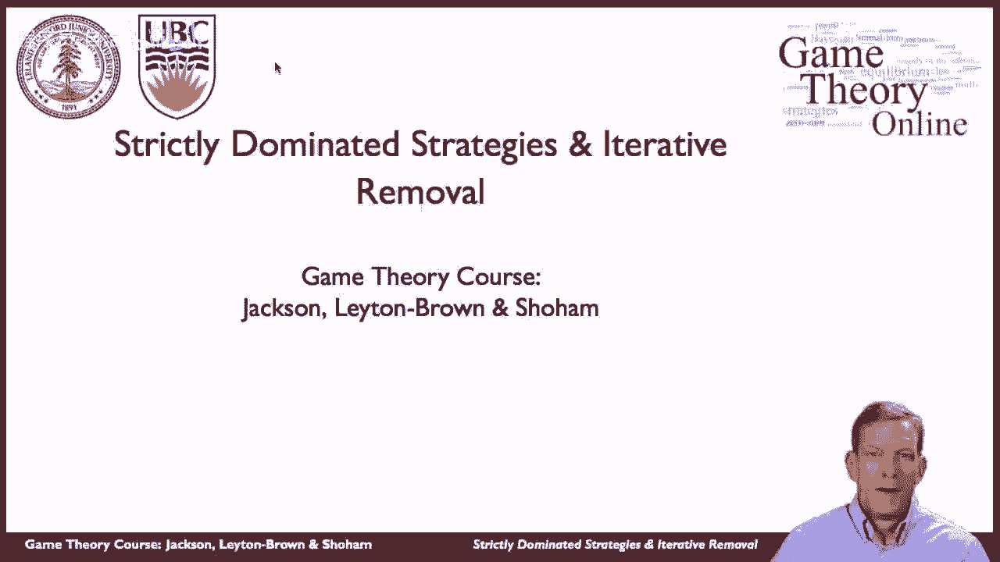

我伙计们，它又疯了，所以我们一直在研究纳什均衡和理解博弈，在我们做出这种预测的环境中，我们也在研究支配关系，现在让我们来讨论严格占优策略和迭代去除这些，这是分析游戏的另一种方法，所以你知道，当你。

当你谈论博弈论时，人们可以用许多不同的方式来思考，从稳定性的角度分析博弈，在预测人们会做什么方面，什么逻辑可以应用，这是看待游戏的另一个重要方式。

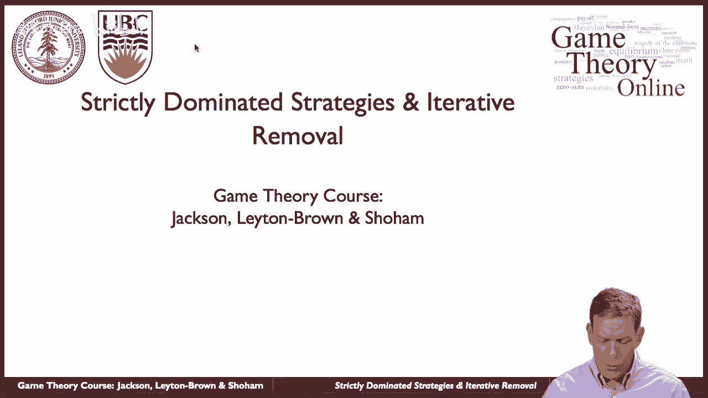

他们给了我们一些见解，所以当我们开始思考博弈论中的理性时，这里的基本前提是玩家最大化他们的收益，所以他们基本上是想最大化他们的回报，一次又一次，这并不一定意味着他们只是贪婪的回报，可能是他们。

你知道他们是利他主义的，公众意识，等，但这里的前提是有一些东西，人们的一些客观功能，他们倾向于做一些会给他们更高回报的事情，而不是列出更低的回报，好的，所以就这个逻辑的迭代而言，我们要考虑的是。

如果所有玩家都知道其他玩家最大化他们的收益，我们对游戏的结构有了一个想法，那么这对游戏意味着什么，我们能推断出游戏中应该玩什么吗，如果所有玩家都知道所有玩家都知道玩家是理性的，从这个意义上说。

这样你就可以，你知道的，拿着这个，如果我知道你知道我知道，等等，你可以把这个广告荒谬，嗯，但这是一个重要的，呃，概念，了解它所产生的东西让我们对游戏有了一些了解，并给了我们一些可预测性，现在你知道。

经历了非常，很高的水平是值得怀疑的，但尽管如此，这里的逻辑，所做的预测将让我们对游戏有一些理解，所以你知道我们可以把这个逻辑完全理解为它的完全逻辑结论。

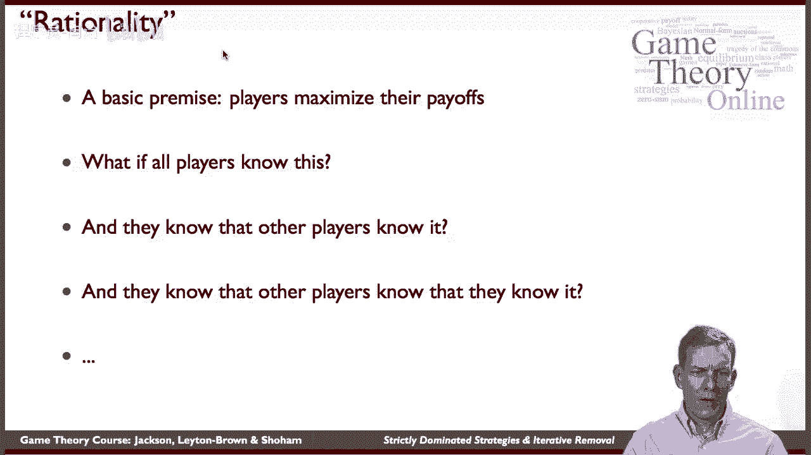

好的，所以就严格劣势策略而言，这意味着一个策略，有一些其他的策略总是比它做得更好，它永远不可能是最好的回答，所以我们一会儿就说清楚，嗯。

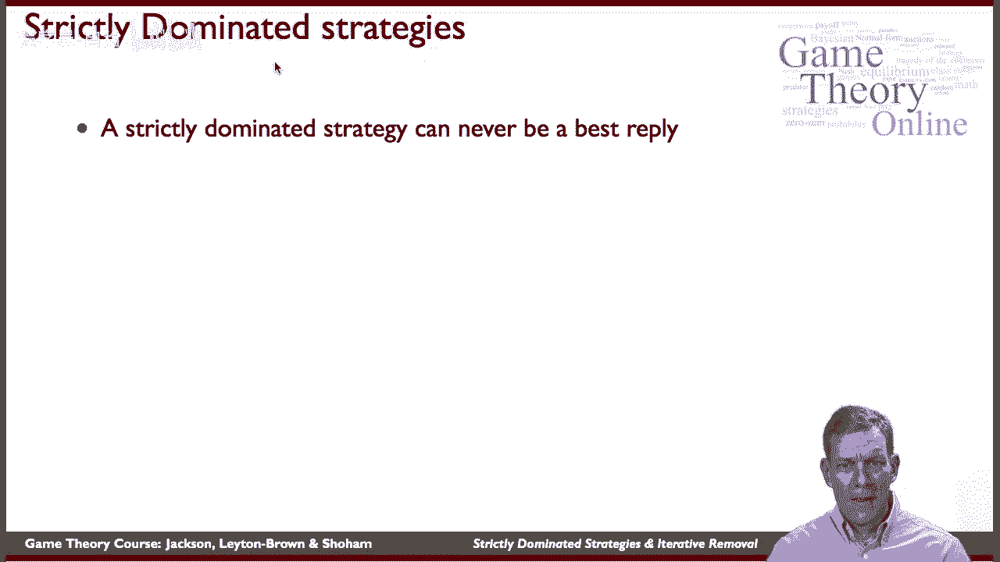

所以基本上这意味着如果这是一种永远不会成功的策略，总有比这更好的东西，对抗其他玩家的任何策略，然后，基本上它永远不会被播放，所以这基本上是一个我们可以安全地忽略的策略，如果我们认为玩家是理性的。

绝对不应该采取严格的劣势策略，还有别的东西在任何情况下对他们都更好，所以我们把那些从游戏中移除，迭代的想法是我们把这些去掉，现在我们有了一个更简单的游戏，现在让我们做同样的事情。

所以可能有一些东西现在在这个东西中被严格支配，所以玩家绝对不应该玩这个，一旦我们到了这个缩小的游戏，然后我们把这些去掉，我们得到了一个进一步缩小的游戏，等等，我们只是不断地迭代，它给我们留下了一些预测。

然后我们认为唯一合乎逻辑的事情，如果有理性的玩家，他们明白其他玩家是理性的，等等，他们会被留在那个子游戏里。

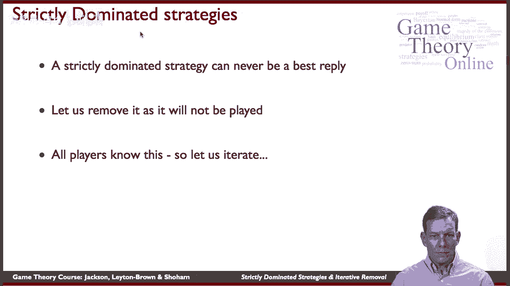

好的，因此，将此进程运行到其终端称为迭代迭代，严格占优策略的去除。

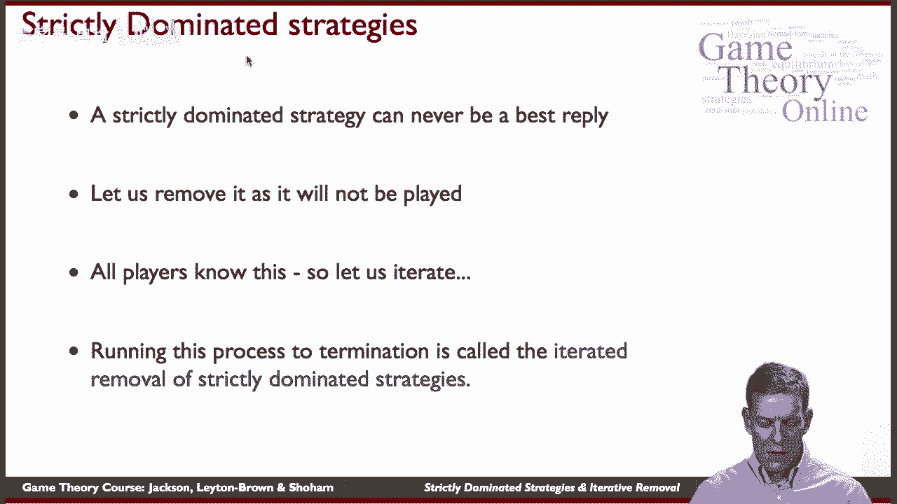

所以就形式符号而言，呃我们在说什么，某个玩家的策略，我严格地被同一玩家的其他策略所支配，如果什么是真的，人从玩人工智能中获得的回报，被严格支配的那个更糟，严格降低，好的，重要的是，这是一个严格的不等式。

那么他们通过玩质数得到的回报，不管其他玩家怎么做。

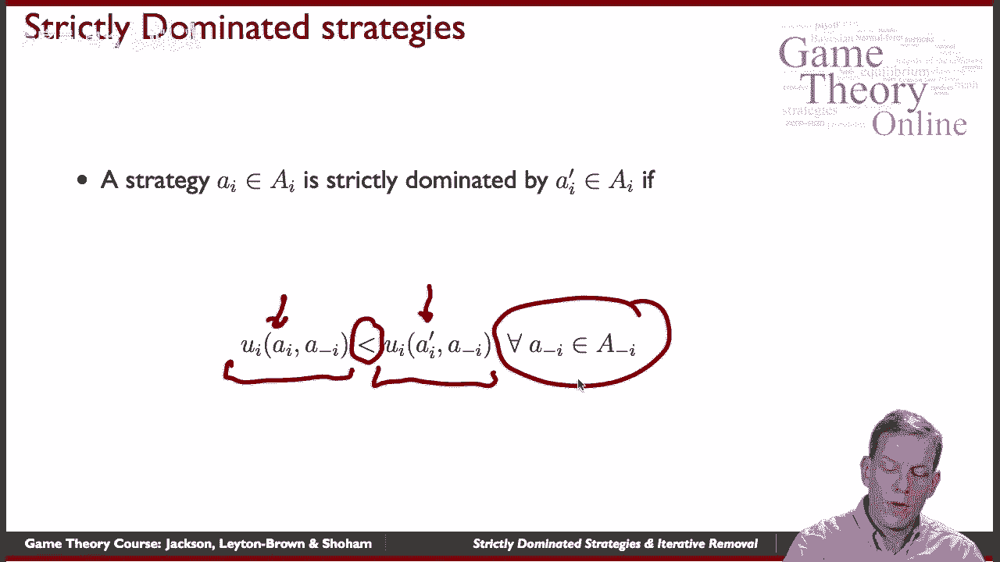

这对其他玩家的每一个可能策略都是一个全面的标志，无论他们做什么，这个AI比AI Prime的收益还差，好的，所以没有，在任何情况下它都不能做得那么好，它总是做得更糟，这意味着它是一个，这是一种策略。

你只是严格地过得更好，演奏质数I，这就是严格统治的概念，好的，所以让我们现在有一个迭代的想法，严格占优策略的迭代去除，这是场三对三的比赛，它有一堆不同的收益，我们看着它，我们开始想好吧。

让我们假设你想在这个博弈中找到纳什均衡，嗯，它变得有点复杂，因为你必须，你知道的，如果你在考虑混合策略或纯策略，你必须考虑所有可能的组合，我们可以开始寻找严格劣势策略，把那些扔掉，例如。

在这个游戏中什么是真的，如果我们看看这个游戏，我们注意到r严格由c右支配，所以纵队玩家在每一个条目中都得到了严格较低的回报，然后他们进入这些条目中的每一个，所以你玩C比R更好，不管对方怎么做。

无论另一个球员上中锋还是下中锋，总是比R做得更好，或者即使另一个玩家混合了，所以不管其他玩家做什么，你从中心得到的收益严格高于R。

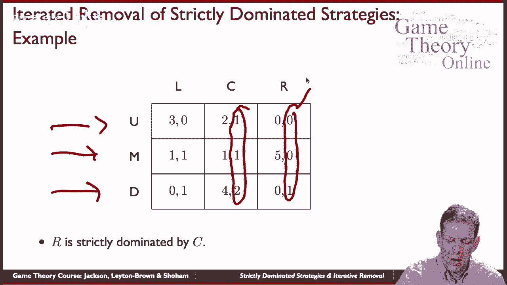

所以我们应该把我们的，现在我们有了一个更简单的游戏，对呀，所以这个想法是嘣，我们完全摆脱了我们的，现在我们有了一个更简单的游戏，好的，所以让我们重复一下这个逻辑，所以现在没有统治，之间不再有严格的统治。

对于列播放器，因为纵队球员实际上在左和中之间无关紧要，如果对方打中间，但我们在这里注意到一件事，角色扮演者现在被支配了对吧，所以对角色扮演者来说中间策略比向上策略更糟糕对吧，所以三个总比一个好。

两个总比一个好。

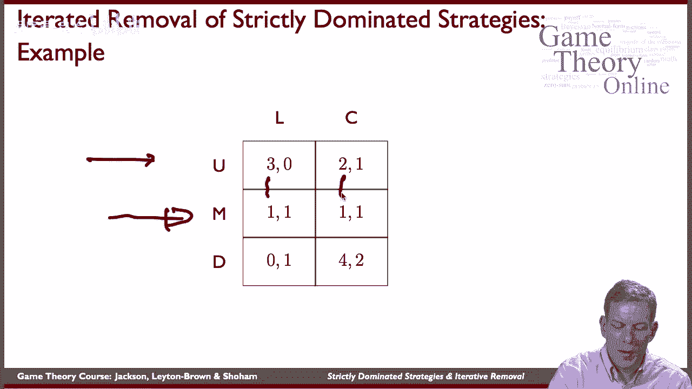

无论发生什么，你最好装腔作势，在这种情况下，我们可以一起摆脱他们，使游戏进一步崩溃，所以现在我们正在迭代，我们现在有了一个更简单的游戏，我们看到，在这种情况下，一旦我们完成了这个移除。

现在看是由l主导的对，所以纵队球员在这个游戏中玩L总是会变得更好，那么在这个游戏中，对不起总是比L更好，所以这个收益总是更高，嗯弹c而不是弹l所以l被c控制，我们可以摆脱我，进一步简化游戏。

你可以看到这是怎么回事，我们到了一个非常简单的游戏，如果这是剩下的游戏，角色扮演者最好低调行事，而不是高高在上，嘣，那么我们最终会得到什么。

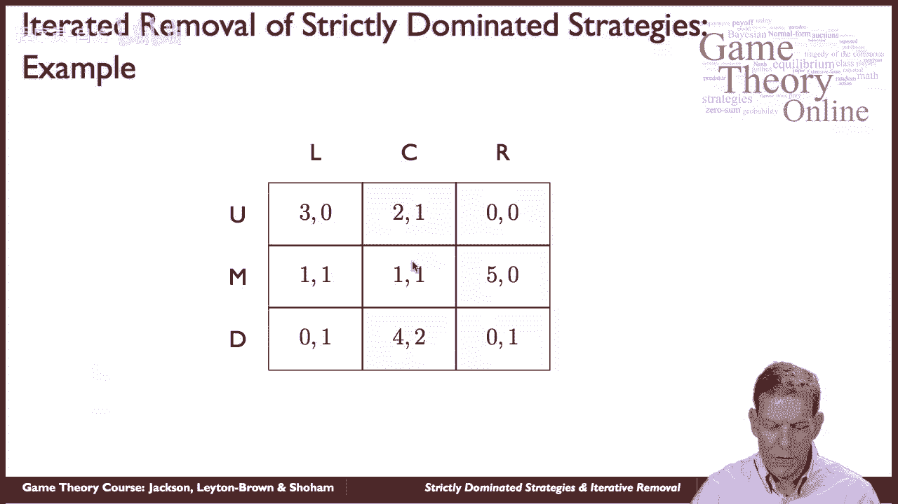

我们最终只剩下向下和中间。

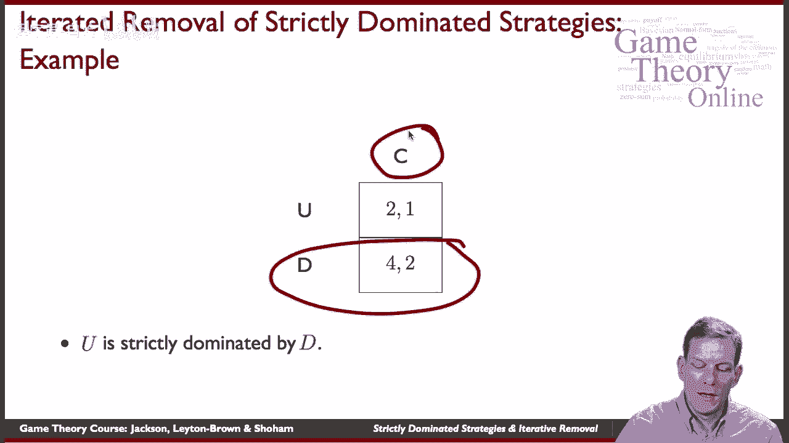

我们已经做了完整的迭代，所以我们从一个相当复杂的游戏开始，我们最终做出了一个非常简单的预测，唯一剩下的东西，迭代消除严格占优策略后，是为角色扮演者准备的，纵队球员的中心，球员。

如果我们在那里寻找纳什均衡，事情必须是最好的，答复，我们知道他们永远不可能玩严格劣势策略，所以我们可以排除这些，他们不可能真的在玩。

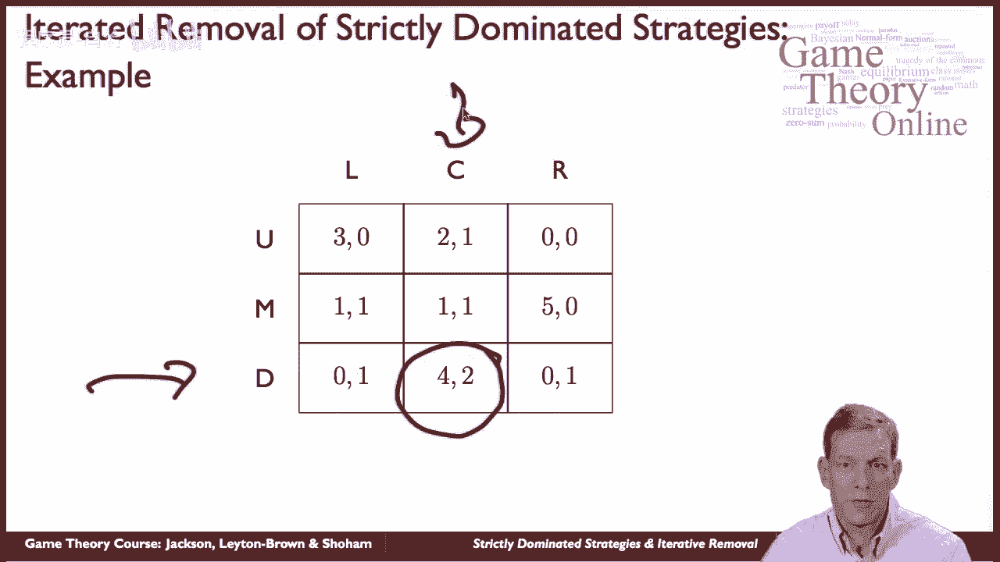

你可以说服自己，他们不能演奏被严格控制的东西，剩下的是什么等等，所以事实上，我们在这里得到了一个独特的预测，实际上告诉我们这个博弈有一个独特的纳什均衡，唯一的纳什均衡是球员在低位和中位。

所以在这种情况下，它实际上识别了一个独特的预测游戏，这与这个博弈中唯一的纳什均衡相吻合，好的，所以我们得到了唯一的纳什平衡直流，所以在那场比赛中效果很好，让我们看看另一个游戏。

我稍微改变了这个矩阵的收益，我们再试一次，嗯，在这种情况下，嗯，你知道吗，r仍然占优，所以在这种情况下，r总是导致列的零，球员，嗯中心，左或中，给出更高的收益，所以在这种情况下，嗯，r由l或c支配。

我们可以去掉r，然后再来一次，在这种特殊情况下，有一件很有趣的事，所以现在纵队球员在两者之间是无关紧要的，但是当我们看划船运动员的时候，我们注意到行玩家，所以呃，你知道球员在这里得到三个，与零比零。

所以这两个都不严格地支配另一个，他们总是打中间得到一个，所以在这种情况下，嗯，如果他们打中间，他们有时比向下做得更好，如果他们打中间，有时会比向上做得更好，所以当我们只看纯粹的策略时，没有严格的控制。

但如果玩家愿意随机选择在这个游戏中要注意的一件事是，让我们假设你在上面玩了一半，在下面玩了一半，你的预期收益是多少，如果另一个球员向左，而你打了一半，对折，你得到一个点的路径，五个，如果你这么做。

另一个玩家在玩C，你会得到0的一半和4的一半，你会得到两个，所以当我们看到打半场的时候，那么我们最终会得到什么，如果我们考虑到这种混合物，对呀，我们把混合物，我们最终会有，呃，哎呀，怎么会这样？嗯。

我们最终会得到一分，五一和二一，所以我们最终得到了严格控制中间的东西，所以说，使角色扮演者获得比扮演中间角色更高的回报。

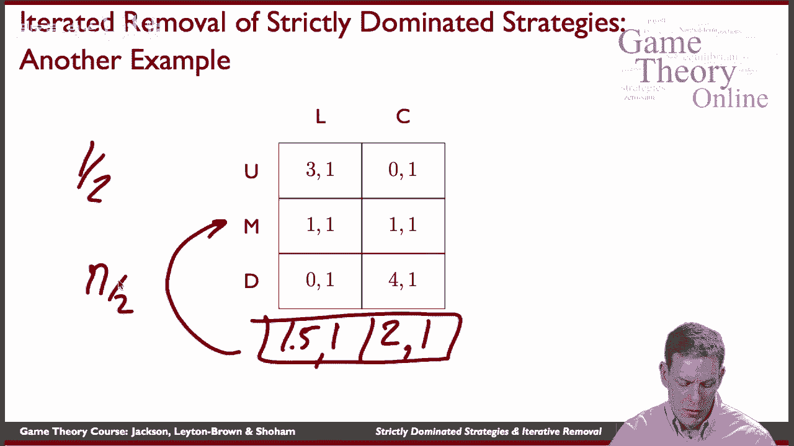

所以在这种情况下，嗯，m由混合策略支配，该策略以相等的概率选择u和d，所以在这种情况下，我们仍然可以摆脱M。

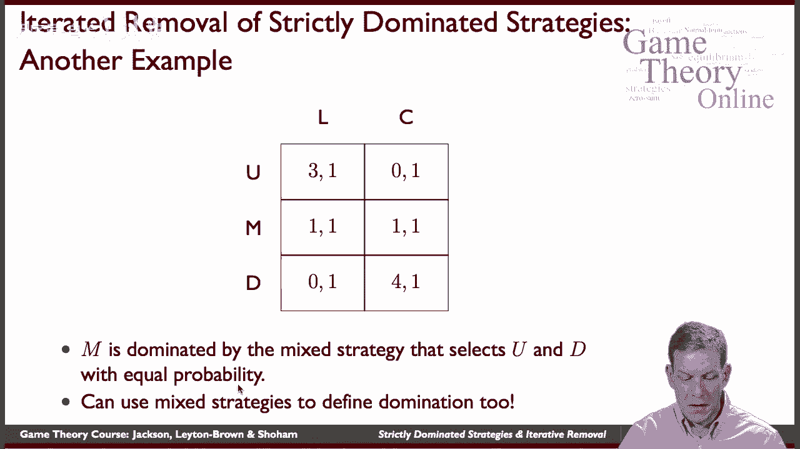

所以我们减少了游戏，现在这个游戏并没有进一步减少，纵队球员无动于衷，角色扮演者更喜欢，如果纵队球员向左向下更好，如果顺利的话，那么这场比赛会发生什么，现在你得做进一步的分析，实际上。

如果你想解决这个博弈的纳什均衡，有很多对吧，所以事实上有无限个纳什均衡，考虑到纵队玩家在这个游戏中完全漠不关心，所以如果你想的话，你可以通过并分析所有的纳什均衡，但是，严格占优策略的迭代消除。

仍然给了我们很大的预测能力，从某种意义上说，它将游戏分解为一个简单得多的游戏。

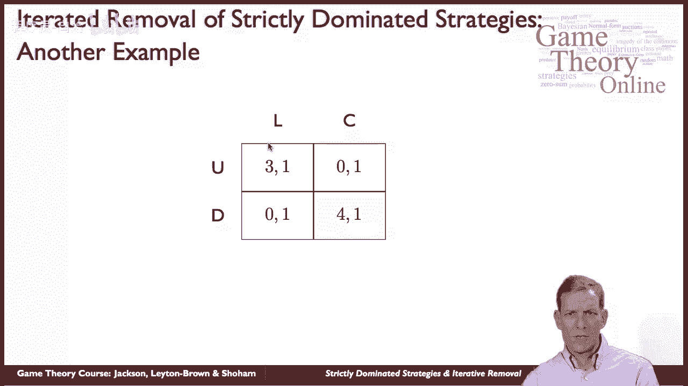

然后分析剩下的东西就容易多了。

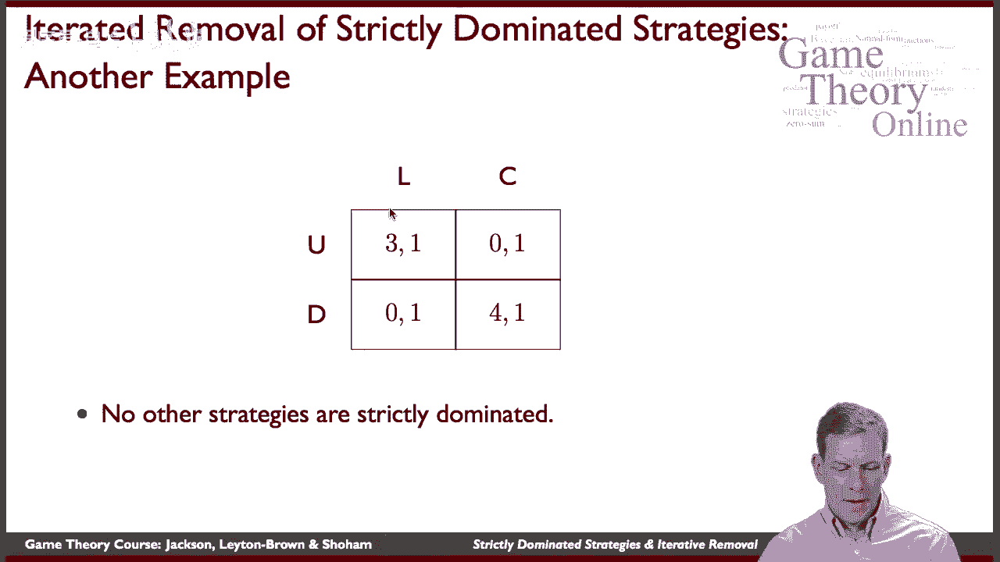

严格占优策略的迭代去除，其中一个好处是它保持了纳什均衡，所以你可以用它，如果，即使你只是想，分析纳什均衡，你可以把它作为预处理步骤，在你尝试计算纳什均衡之前，去掉所有严格占优的策略，并在上面迭代。

有些游戏，比如我们看到的第一个，往往是可解的，使用这种叫做优势可解性的技术，如果它真的坍缩到一个点，你可以通过使用优势论点来解决这个游戏，有些游戏不会，但分析这些东西对你仍然有用。

嗯，驱逐的顺序呢，所以你知道我们，我们做事的顺序很特别，所以注意到纵队球员有一个，你知道正确的游戏是严格控制的，如果我们从不同的玩家开始呢，或者会有什么不同，嗯，如果我们在处理严格劣势策略。

那顺序就不重要了，所以说，不管你怎么做，无论你按什么顺序做，你最终会得到同样的解决方案，嗯，你可以花点时间说服自己，呃仔细想想，嗯，所以这是你可以做的，你得证明，但事实上，在消除严格劣势策略时。

顺序并不重要，所以在这方面逻辑非常严密。

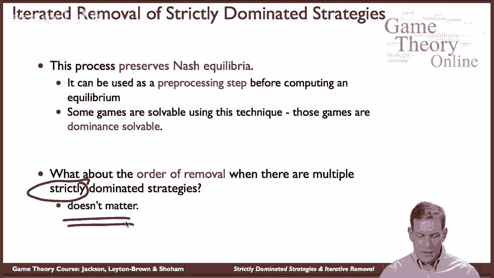

还有另一种类型的统治，这也有一些直观的感觉，人们在游戏中使用，这是为了削弱统治关系，而不是严格的统治，我们可以考虑弱劣势策略，每周统治是什么意思，和我们以前的很相似，而是没有严格的不平等。

抓住每一个地方，所以不是把这个保持在所有的负，i，它只是有时需要容纳一些，你只需要削弱其他所有策略的平等，所以弱劣势策略的思想是它总是做一个素数，总是做得至少和嗯和呃一样好，有时严格地说更好。

所以这仍然是一种策略，你可以说，好的，素数，只是你知道，真的，它支配着一个，因为它总是至少做得一样好，有时严格来说也是如此，所以如果我不确定，我还不如选那个总是做得一样好，有时做得更好的。

所以周劣势策略也可以被消除，你可以通过，你可以迭代，你。

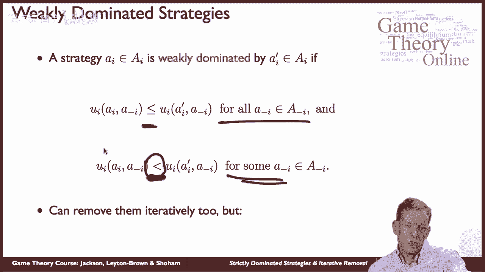

只是通过游戏，就像我们以前做的那样，同样的事情，关于周的一件事是真的，我们主导的策略是，有时它们可能是最好的回应，对呀，所以一个策略可能是啊，周支配，但仍然是最好的回答，嗯，怎么会这样，让我们假设。

例如，呃，你知道，我们看一个非常简单的游戏，嗯，行玩家可以向上或向下的地方，如果他们上升，他们对纵队的左边和右边得到一个回报，你知道的，在这里他们得到了，这里，他们得到了三个，嗯。

所以在这种情况下每周向下主导向上，你总是得到至少同样高的回报，有时甚至更高，但尽管如此，它可能是，例如，如果左边是，策略实际上是由列玩家选择的，那么向上仍然是最好的回答，对吧，例如。

如果我们把1的收益放在这里，所以纵队球员在这两种策略之间是完全无关的，那么这实际上是一个纳什均衡。

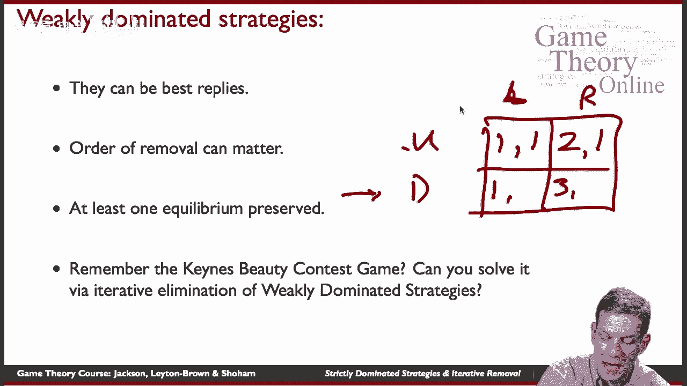

这样就消除了，这实际上消除了游戏的纳什均衡之一，对所以，取决于这些收益是什么，我们最终可能会消除游戏的纳什均衡，和，你知道吗，呃，所以这是一种你知道的情况，我们最终消除了一些可能是平衡的一部分。

什么是真的，至少有一个平衡总是保持，什么是不幸的。

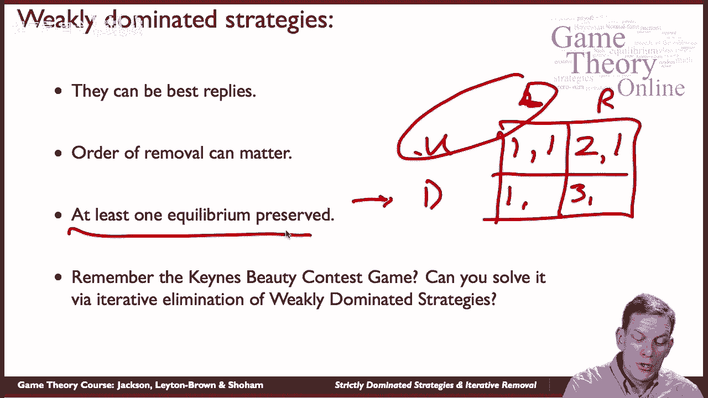

驱逐的顺序可能很重要，所以你移除东西的顺序开始变得重要，嗯，有一些游戏是有用的，所以说，例如，如果你还记得我们之前谈到的凯恩斯选美比赛，人们在零到一百人之间命名受伤的人，嗯，想想解决这个问题。

通过迭代消除周劣势策略，你最终会得到什么，所以它仍然可以是一个有用的逻辑，这种逻辑可以帮助你分析一些游戏，但你必须，它是，它不像严格的统治那样严格，因为在某些情况下，你可能想玩每周劣势策略。

如果你确定另一个玩家会，你知道的，往某个方向走，例如，这里，如果我们把，说二一，然后呢，如果我们把这个柱，玩家先占弱劣势策略，对呀，所以他们左弱右弱，我们摆脱的权利，那我们还剩下什么，我们面临的情况是。

纵队球员，那就对不起了，然后，行玩家在两种策略之间漠不关心，对呀，所以如果我们说好吧听着，这个左边压着右边，所以我们把这个处理掉，然后我们最终会遇到向上和向左仍然是向左的情况。

但是如果我们先去掉行玩家的东西，我们会先把它取出来，然后我们就会以左下角结束所以所以，取决于你是如何经历的，你变得不一样了，剩下的不同的东西，所以有些事情你知道顺序在哪里很重要，这有点问题。

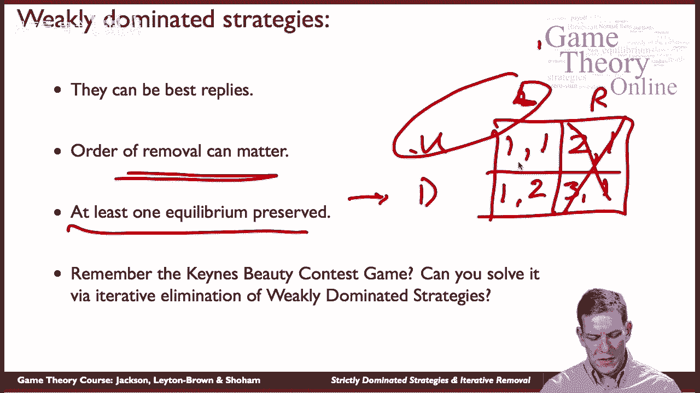

好的，嗯，迭代，严格理性的玩家收益最大化，他们不玩严格劣势策略。

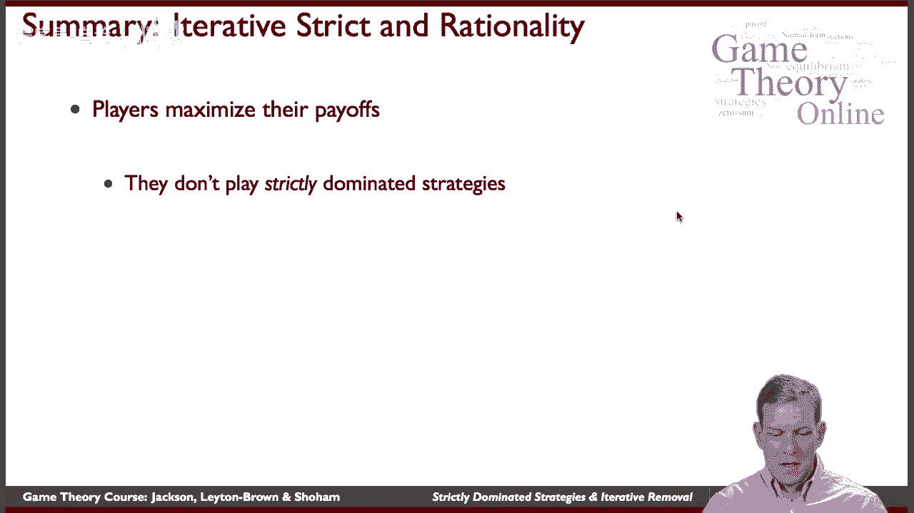

他们不玩严格劣势策略，考虑到剩下的，嗯，我们迭代纳什均衡是剩余的子集，所以说，这是一个很好的简单的解决方案概念，帮助我们把事情扔出游戏，并简化我们所看到的，但我们也可以问，我们是否看到这样的行为。

在现实中，人们的行为方式是否与消除严格劣势策略一致，而且。

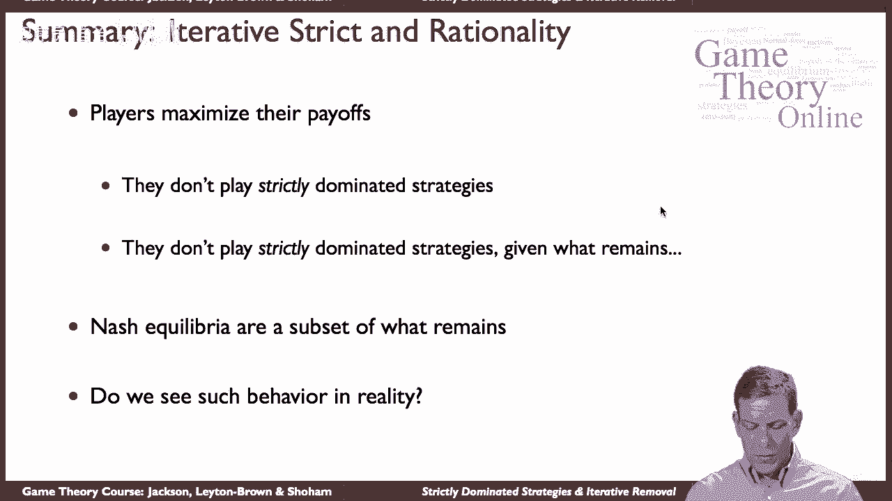