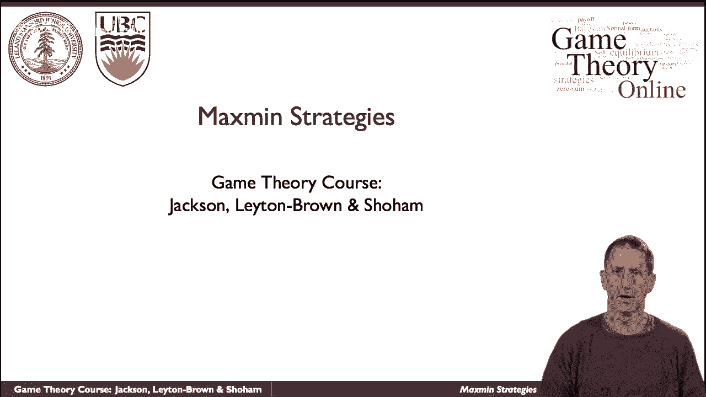
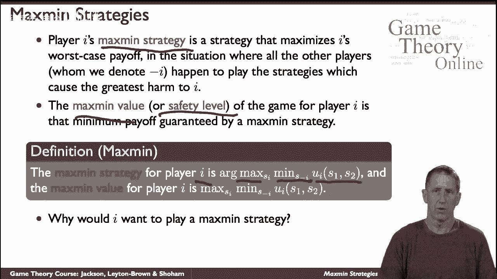
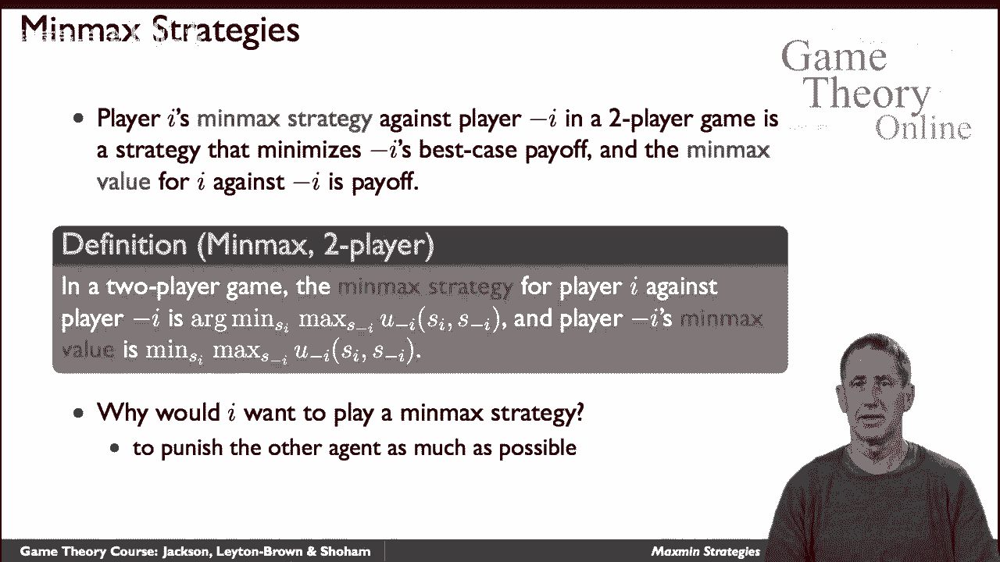
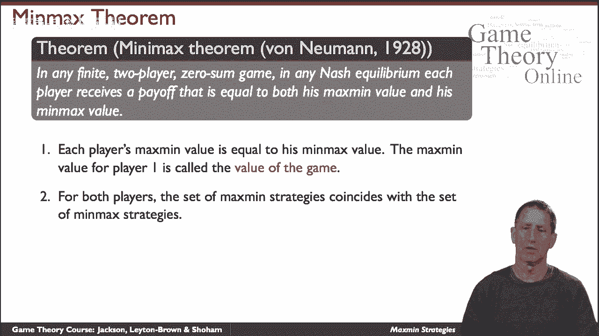
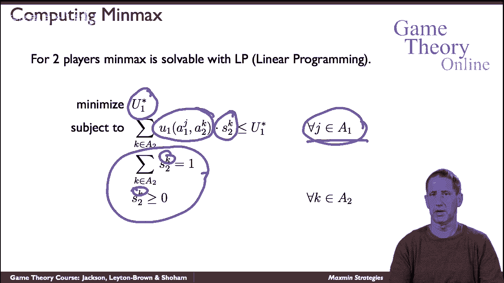

# 【斯坦福大学】博弈论 （全） - P22：【斯坦福大学】博弈论（21）最大最小策略 - 自洽音梦 - BV1644y1D7dD

我们现在来谈谈，呃，最大策略，这些在零和游戏的背景下特别有意义，但实际上适用于所有游戏。

什么是最大最小策略，它只是把玩家的策略最大化他们的回报，假设另一个玩家出去抓他们，我们就会，我们将主要集中在这里的两名球员的情况下，因为当我们进行零和博弈时，他们并不真的只理解两个玩家的情况，嗯。

但请记住，人们可以更普遍地定义这种，呃，当我们谈到最大策略时，所以呃，最大化策略是一种最大化我最坏情况结果的策略，收益是由最大策略保证的吗，这里定义了，正式，玩家的最大策略，我是一个最大化的策略。

另一个玩家记得的最小值，我是我以外的球员，会呃，保持嗯，把一个放下来，最大值的定义类似于该最大值策略的值，为什么我们要考虑最大策略。

人们可以把它看作是一种简单的警告，也许其他人会犯错，不为自己的最大利益行事，也许我不确定他们的收益到底是多少，很多解释，或者你可以简单地，呃，偏执狂，想着他们是来抓你的，你知道，你知道俗话说，你知道。

呃，甚至是，呃，偏执狂，已经，这是最大最小策略，只是为了混淆事情，我们还将讨论最小最大策略，最小最大策略是针对，如果你希望双人游戏中的另一个玩家，是使他们的回报最小化的策略，假设他们试图最大化它。

这是正式的定义，玩家I的最小最大策略是与另一个预先拥有的人比赛，减，I是最小化最大收益的策略，作为回报的另一个人的尝试，给另一个人，最小最大值就是最小最大值策略的值，现在玩一个的价值，为什么呃。

为什么会，呃，一号玩家，呃，想伤害另一个人，嗯，嗯，你可以，你可以出去找他，那个。

有这种可能，或者他们可能在玩零和游戏，在零和游戏中，伤害别人就等于提高自己的收益，所以嗯，在你的一些游戏的设置中，最大人和最小最大策略很有意义，事实上，在约翰·冯·诺依曼的一个非常著名的定理中，嗯。

它证明了呃，在零和游戏中，根据定义，我们认为只有两个玩家这样的游戏，任何纳什BM，玩家收到回报，等于他的最大值和最小最大值，就是说，呃，所以我们称之为游戏的价值，一号玩家的值称为游戏的值，这意味着。

最大策略的集合实际上是一样的。

一套最小最大策略，试图改善你最坏的情况，和试图最小化其他人最好的诅咒情况是一样的，和任何最大策略配置文件或最小最大策略配置文件，因为他们是一样的，构成纳什均衡，此外，这些都是存在的自然查询。

所以所有自然平衡的收益都是一样的，即游戏的价值，一种获得具体感觉的方法是图形化，这是一个匹配便士的游戏，这是一个你，我们每个人都选择头尾，有一定的概率，如果它出现了。

呃如果我们如果如果如果如果是我们的andomization的结果，我最终选择了头，你是，你最终扮演尾巴，你赢了，反之亦然，如果我选尾巴你选脑袋，但如果我们都选择了一个刚刚被跟踪的头，我赢了。

这是你在这里看到的收益，策略空间，我是二号玩家，增加了玩人头的概率，这是呃，一号玩家，在这个维度上，你有游戏的价值，玩一个的PF，唯一的纳什均衡是双方随机对半，就在这里，这是一种你看起来通过切片。

这样的三维结构，你会看到，它必须是一个平衡，因为，这个呃，这条曲线，但如果像他那样做，他的泄漏只会下降，所以他试图最大化价值，你会这么做，反过来，玩家2只能沿着这个，但如果他那样做了，收益只会增加。

他试图最小化价值，所以你得到了一个稳定的点，由于显而易见的原因，它被称为鞍点，一般来说，我们可以用最小最大定理来计算零的平衡点，求和小游戏，我们通过简单地设计一个线性程序来捕捉游戏，就在这里。

所以你的一星将是游戏的价值，这是1号参与者在均衡状态下的收益，所以我们将从玩家的角度来指定，我们也可以反过来做所以2号玩家说的是，对于玩家的每一个动作，玩家可能考虑的每一个动作，我想找一个混合策略。

所以这是我的混合策略的两个，它会看着我所有的纯策略K，并确保这种可能性，这是它们和为1的概率分布，它们不是阴性的，所以我想做的是，玩家对我的策略的最佳反应，一个。

因为这些动作中的任何一个都不会超过游戏的这个价值，因为我想把它最小化，所以我要去找，具有属性的最低U，那个玩家一号没有任何有利可图的偏差，他的纯策略，所以当我看到回报时，当我玩2K的时候。

他用我现在正在考虑的那个J弹了一个1 J，在我的混合策略中，我乘以玩2K的概率，我想，我不想那样，呃，另一个玩家有一个有利可图的偏差，所以一定是这样，他的预期收益将不超过U的价值，一星，所以呃，很明显。

这是游戏的正确表述，它是一个线性规划，我们都知道，线性规划是有效可解的，最坏情况下是指数级的。

