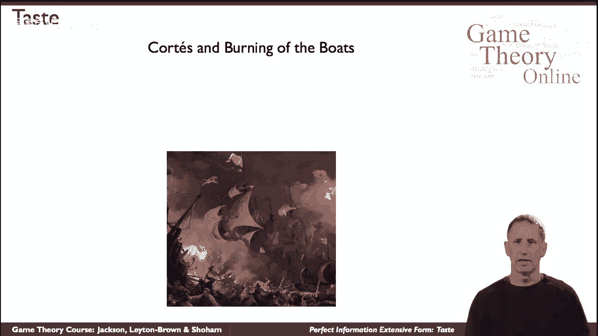
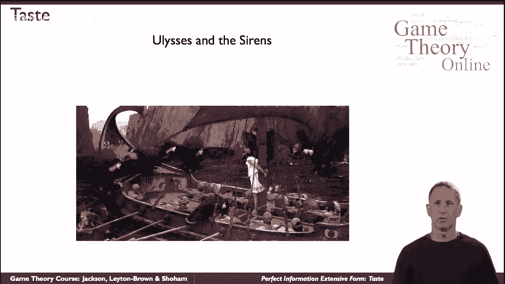

# 【斯坦福大学】博弈论 （全） - P25：【斯坦福大学】博弈论（24）完美的信息广泛的形式品味 - 自洽音梦 - BV1644y1D7dD

有时在战略形势下，时间起着重要的作用，事情是一步一步来的，他们不仅这样做，但演员们知道他们会。

这影响了他们的行为，所以这一年是十五，十九，南科尔特斯西班牙人带领着一支由11艘船组成的船队，大约六百人即将入侵一个大陆，被称为美国，他们寡不敌众，很清楚他们面临的巨大困难，和，呃，众所周知。

当他们着陆时，科尔特斯下令把这两个都烧掉，这是否是在与这些人完全协调和同意的情况下进行的，还有一些争议，或者是突然出现在他们身上的，但不管怎样，很明显这背后的逻辑是什么，当他们面对这些令人生畏的困难时。

男人们会想回头，呃，上船逃走，通过取消增加他们战斗决心的选择，前进，同样，不仅时间在行动之间流逝，但这是一个关于这一事实的原因，并影响到战略形势的发展，我们不仅在有多个代理参与的情况下看到它。

不仅仅是科尔特斯和他的人，两位演员，或者布景，两组行为者以某种方式交织在一起，但即使只有一个演员，时间展开的事实会影响情况。

这是另一个著名的历史故事《尤利西斯与塞壬》，尤利西斯在给他的船做字幕，即将穿过海妖的海峡，和，呃，众所周知，塞壬的歌声是如此诱人，以至于它们会让任何人特别，尤利西斯做他自己的事情，呃。

不符合他自己的最大利益，他就会跳进海里，他会把船撞到岩石上，所以他所做的，嗯，根据传说，他命令他所有的人先在耳朵里打蜡，他自己实际上想听这首歌，是用来绑在桅杆上的，他岂能从十分之一中解脱出来呢。

用剑约束他，等等，等等，就这样发生了，他们驶过海峡，当他们听到海妖的歌声，他一时精神失常，并试图逃离束缚，但失败了，一切都很好，所以这里又是一个单一的动作，在这种情况下，尤利西斯对未来的推理。

思考会是什么情况，现在就采取行动影响未来的战略形势，模拟这种情况，我们转向广泛形式的游戏，正如这个术语所说。

