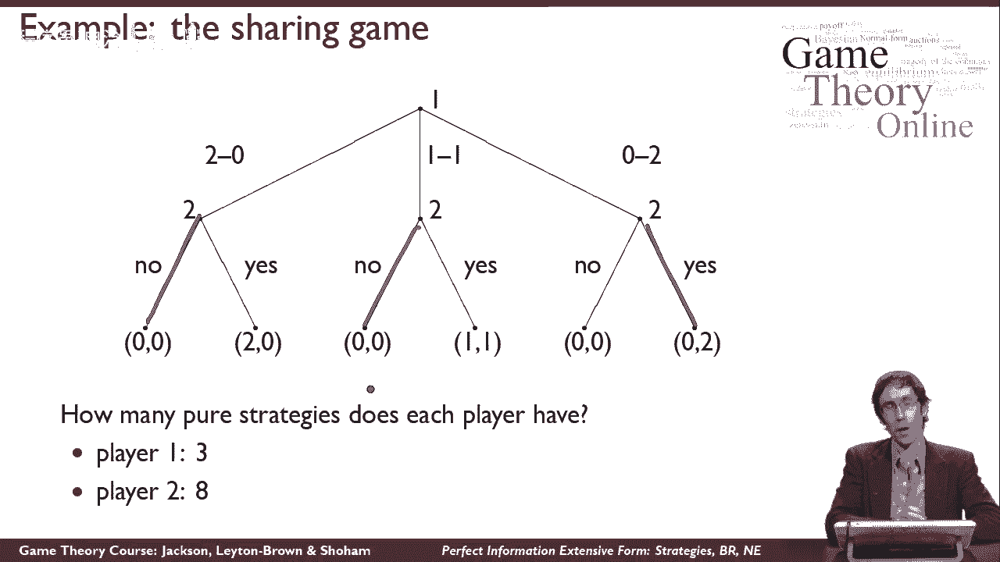
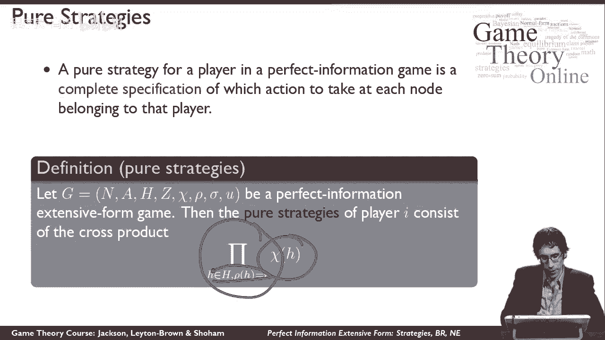
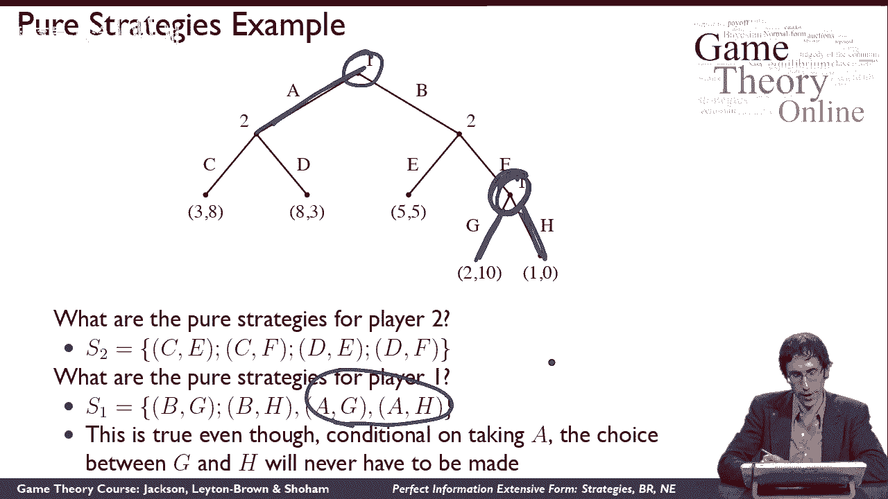
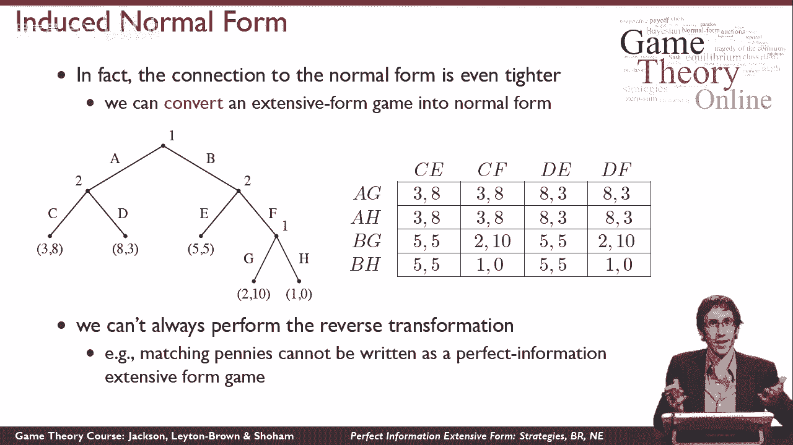
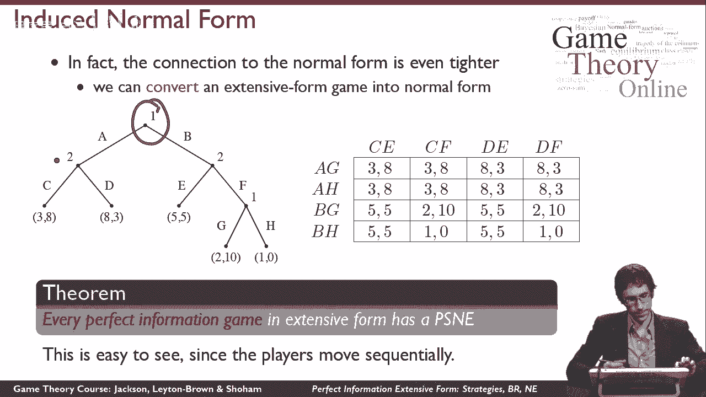
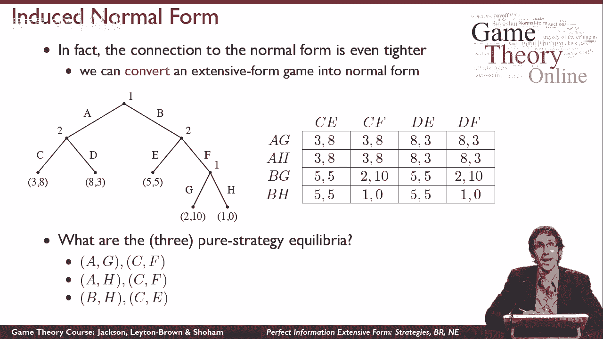

# 【斯坦福大学】博弈论 （全） - P27：【斯坦福大学】博弈论（26）完善信息泛化形式策略，BR, NE - 自洽音梦 - BV1644y1D7dD

这个视频是关于完美信息中策略的最佳反应和纳什均衡，广泛形式，让我们再来看看分享游戏，你现在在这里看到的，而不仅仅是思考这个游戏的模型，我想从策略的角度来考虑，所以在正常形式的游戏中。

谈论纯粹的策略很容易，纯粹的策略只是行动，但你可以在一个广泛的形式游戏中看到，嗯，有很多地方玩家可以选择不同的动作，所以策略需要更复杂一点，所以我想让你们想想每个玩家有多少纯策略，在这个游戏中。

你可能想在这一点上暂停视频，自己解决这个问题，在我告诉你答案之前，一号玩家很容易，因为一号玩家只有一个选择节点，所以一号博弈者有三个纯策略你会期望采取这个行动，这个动作和这个动作对二号玩家来说有点复杂。

因为2号博弈者有三个选择，1号玩家的纯策略数实际上是8个而不是6个，一号玩家有六个不同的动作，但是有八个纯策略的原因是一个纯策略，玩家二能做出的所有选择组合，所以如果2号博弈者，如果2号玩家像这样选择。

所以二号玩家要做决定，在这种情况下，他会拒绝这个提议，在这种情况下，他会接受的，在这种情况下，他会拒绝，这是一种对等策略，与这里的对等策略不同，所以这种纯策略的数量是八个。

所以现在让我们试着把它说得更笼统一点，一般来说，完美信息博弈中玩家的纯策略，完全指定该玩家将如何玩游戏，为了游戏中可能发生的任何事情，具体来说，它说明了在每个选择节点上采取什么行动。

玩家可以如此直观地做出决定，我喜欢思考的方式，广泛形式的纯战略，游戏就是指示另一个人为你玩游戏，假设2号玩家想让她的朋友去玩游戏，嗯，她需要把一切都告诉她的朋友，为了正确地玩游戏，她的朋友可能需要知道。

具体地说，她必须说每一个选择节点，她的朋友可能会遇到，一个朋友需要这样做，把纯粹的策略看作代理指令，你给别人帮你玩游戏，那么当我们计算纯策略的数量时，我们真的在问，有多少组不同的代理指令集是可能的。

如果我们用数学正式地说这个，在给定的完全信息中玩家的纯策略，广泛形式游戏是该玩家动作集的叉积，所以说，如果我们看看玩家在每个选择节点上可用的动作集，纯策略的集合是，那么这些集合在所有选择节点上的叉积。

玩家可以在其中做出决定，让我们举一个例子，这比我们在分享游戏中看到的要复杂一点，所以首先我想请你们在这里思考，2号玩家的纯策略是什么，我不是要你数数，但我要求你说出它们是什么，你可能会再次暂停视频。

为两个玩家考虑这一点，在我给你答案之前，所以我们从二号玩家开始，二号玩家有两个选择节点，这边这个这边这个，所以，2号玩家的纯策略将是动作集的交叉积，在每一个不同的选择节点上，所以在这里它们被写出来了。

比如说，纯策略cf是说，在这个选择节点中，参与者2将扮演c，在这个选择节点中，2号玩家将扮演F，因为有两套2号的，一号玩家现在总共有四种纯策略，事情更有趣一点，1号玩家的纯策略是什么。

一号玩家有两个选择节点，这一个，这一个，等等，一号玩家的纯策略是这两组的乘积，所以再一次，一号玩家有四种纯策略，为什么这口井很有趣，如果1号博弈者采取这个动作。

那么一号玩家知道他永远不会到达这个选择节点，因为他自己的行为使他不可能做出选择，然而，我们对纯战略的定义是，纯战略AG不同于纯战略A，h，所以一号玩家仍然有四种纯策略。

而不是三个同伴策略，所以纯策略在广泛形式的游戏中和在正常形式的游戏中有点不同，然而，有一些伟大的东西，一旦我们有了纯策略的新定义，我们实际上可以利用它，为了使用我们对各种其他概念的所有旧定义。

所以在正规博弈中，我们将混合策略定义为纯策略上的概率分布，在一个扩展形式的游戏中我们可以逐字逐句地使用完全相同的定义，广义形式博弈中的混合策略是混合策略上的概率分布。

所有的变化都是潜在的纯策略本身是不同的，它们现在是在游戏中的每个选择节点上做什么的策略，同样地，广泛形式博弈中的最佳对策是最大化预期效用的混合策略，给定其他代理的混合策略配置文件，同样。

这与我们在正常形式中的定义完全相同，最后又是纳什均衡，一个策略配置文件，其中每个代理对每个其他代理都有最好的响应，所以这三个概念都和以前一样，我们可能会想知道纳什均衡是否存在，我们如何对他们进行推理。

只是有定义，不会，当然给我们，但与正常形式有更紧密的联系，这给了我们更多，那就是我们可以把一个广泛的形式游戏转换成正常的形式，这有几个有趣的原因，首先是因为存在一个正规形式的博弈，我们可以利用结果。

我们有关于正常形式的，就像平衡的存在，仅仅是因为有一个相应的游戏，如果我们发现正常形式的博弈更容易推理，我们可以建造它并观察它，而不是看广泛的形式，所以我要向你们展示如何进行转换。

这是一个广泛的形式游戏，我们只是想转换实际上真的很简单，下面是相应的范式博弈，你会看到的是，我们刚刚列出了每个代理的所有纯策略，作为正常形式游戏中的动作，所以你会记得这些，因为我们以前看过。

在这个游戏中，这里已经有了一号玩家的四种纯策略，下面是2号玩家的四个纯策略，现在填写回报值，我们所做的是，我们只是模拟游戏，例如，如果，我想知道如何把数字放在游戏的单元格里，我会看一号玩家的纯策略BG。

和2号玩家的纯策略CF，所以BG的意思是这样玩，CF的意思是那样玩，然后我看看我会在游戏中到达哪个节点，我会来到这里，我会像那样跟着树，所以我把数字写到十，所以这整张桌子都是这样填满的。

这就是我们所说的这个广泛形式博弈的诱导范式，现在，关于这个归纳范式需要注意的一点是它有更多的数，比叶子节点，以广泛的形式，你会注意到有重复，例如，三八在这里重复四次，即使它只对应于一个回报值，同样。

八三重复四次，即使它只对应于一个回报值，那不是意外，那是，因为有四个纯策略配置文件导致树中的同一个叶节点，所以这可能是个问题，因为这个爆炸实际上是指数级的，这里看起来还不错，因为我们看到的游戏很小。

但是随着游戏树的大小增长，这个爆炸可能真的很深刻，这可能意味着在实践中，我们可能很难写出这个归纳范式，另一件需要注意的重要事情是，我们不能总是进行转换，反过来，所以你可能会好奇和想知道。

如果你给我一个正常形式的游戏，我能用它做一个完美的信息扩展形式游戏吗，答案一般是否定的，你看到的这种特殊的结构，对于重复收益的游戏来说是很重要的，和一般扩展形式游戏。

一般形式的游戏不能变成广泛形式的游戏，一个例子是在匹配的便士中直观地匹配便士，这两个球员同时比赛真的很重要，我们真的没有办法谈论两个球员同时比赛，在一个完美的信息游戏中，因为其中一个球员必须先动。

第二个玩家就会看到这个动作，没有办法代表一个同时移动的游戏，就像这样匹配便士，所以直觉上，我们不应该期待转变，从匹配便士到完美的信息游戏，似乎有什么东西会在那里丢失。

的确，有一个定理说每一个完美的信息，广义形式博弈总是至少有一个纯策略纳什均衡，在一般形式的游戏中，这不是真的，匹配的便士，我们刚才说到的，不存在纯策略均衡，很容易看出为什么这个定理是正确的，直觉上。

随机化常常起到迷惑对方的作用，在一个完美的信息游戏中，真的没有理由这样做，如果一号玩家随机选择，2号玩家仍然可以看到1号玩家做了什么，所以在游戏中随机化对我们没有任何好处。

这可以为以前没有的平衡创造机会。

所以最后我想看看这个游戏，以及关于它的三个纯策略均衡是什么的理性，现在，并试图思考在这个游戏中什么是有意义的均衡，但在某种程度上，这可能有点难做到，因为我们不能很容易地从游戏树上读出纯粹的策略，而是。

小游戏有什么更方便的，像这样构建它的纯策略，它在这里的诱导范式，直接列出了纯策略，然后直接对这个游戏中的纯策略进行推理，所以我们就这么做吧，我让你在这里再次暂停视频，如果你愿意，试着为自己找到这些平衡。

然后我会告诉你它们是什么，所以三个纯策略均衡是a g cf a hcf，所以让我们来谈谈如何，我们可以看到这些是平衡，召回，总是我们测试纯策略均衡的方式，在正常形式的游戏中，对每个玩家来说。

检查是否有任何偏差会给玩家更大的效用，所以让我们举个例子，看BHC，如果一号玩家在这里偏离，你可以看到他没有其他行动可以采取，这将使他超过五个，同样，如果2号玩家偏离这里。

你可以看到她没有其他行动可以采取，这将使她超过五个，在这两种情况下都有一些联系，不过没关系，因为最佳反应只是说没有比这更好的了，所以这证实了这是一个均衡，相比之下，如果我看着这样的东西。

我说过这是不平衡的，你可以通过检查每个参与者来看到它不平衡，所以2号博弈者确实不会比10号做得更好，所以这是一个最佳反应，cf是2号博弈者对bg的最佳响应，但另一方面，一号玩家可以从BG到AG。

得到3英镑的回报而不是2英镑的回报，所以BG不是一号玩家对CF的最佳反应，所以这不是火山灰平衡，本期视频就到这里。

