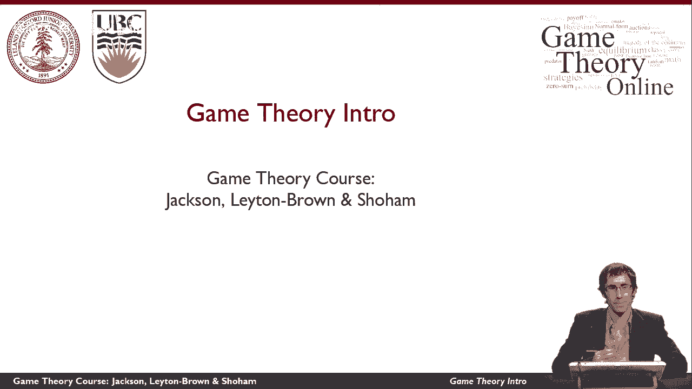
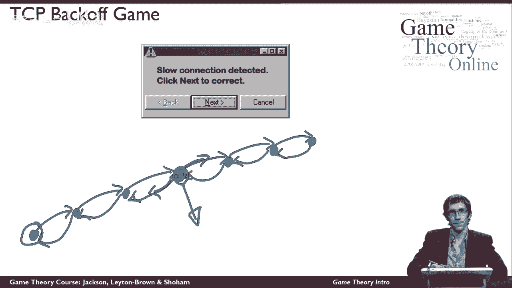
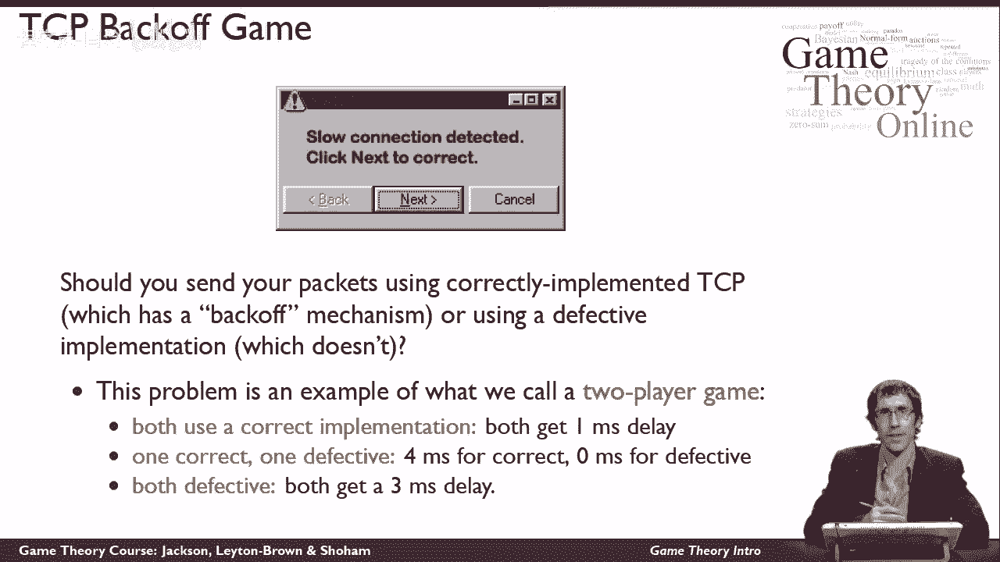
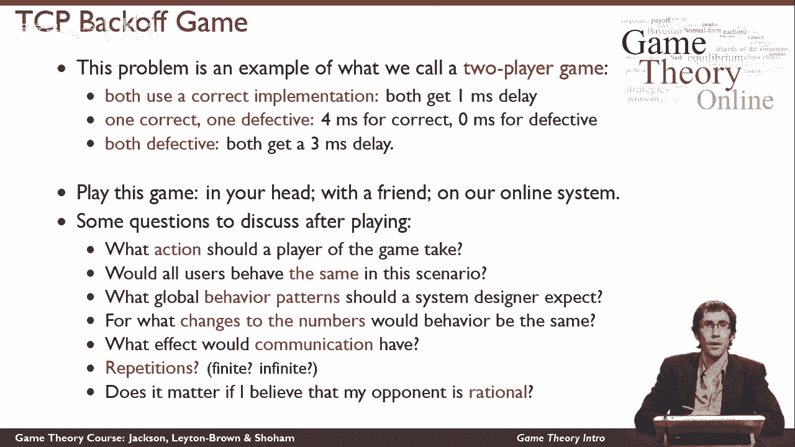

# P2：【斯坦福大学】博弈论（1）博弈论简介 - 自洽音梦 - BV1644y1D7dD

欢迎来到博弈论在线，我是凯文·莱顿·布朗，我是这门课的三位导师之一，另外两个是马特·杰克逊和乔夫·肖汉姆，两人都来自斯坦福大学，都会在后面的视频里看到，这段视频将让你对博弈论有一个高水平的了解。

以及我们将要思考的概念，在剩下的课程中，首先，在我继续之前，让我告诉你更多关于博弈论不是什么，博弈论，不使用文字游戏，以我们大多数人在日常生活中习惯的方式，它当然不会特别考虑电脑游戏，而是。

博弈论是一种思考自私自利的人之间战略互动的方式，因此，这对经济学是非常重要的，也适用于计算机科学，政治学，心理学和其他各种学科，是什么把所有这些学科联系在一起。

是一个思考自我利益的参与者在战略互动中如何表现的问题，并思考这些交互应该如何构建，比如说，由政府或计算机系统的设计者，以导致良好的结果，我将从计算机科学中的一个这样的例子开始思考。

这是一个涉及网络的例子，但不要被计算机科学吓跑了，内容不能代表课程其余部分的内容，在任何情况下，我并不认为你对计算机的工作原理有什么特别的了解，在本例中。

我要从思考这个弹出窗口开始，您以前可能在浏览器中见过，如果你和大多数人一样，您意识到浏览器中弹出的一个承诺连接缓慢的窗口，检测到，单击下一步更正，也许你不该被信任。

它可能会安装病毒或以其他方式损害您的计算机，所以你可能不会点击这个，但有趣的是，如果你做了这个特殊的弹出可能会帮助你，我想考虑一下它是如何工作的，我们可以用这个例子来说明博弈论的一些有趣的东西。

在我这么做之前，我需要告诉你一点关于TCP协议是如何工作的，这是互联网的支柱之一，所以你可能知道，如果你在互联网上，你想和其他计算机通信，在这边，发生的事情是你的通信被分成一堆不同的数据包。

从概念上来说有点像信封，里面有一条消息，通过网络传递给你的收件人，当我说通过互联网交付时，我是说，您的计算机和您想要的收件人之间实际上没有直接连接，取而代之的是，一路上有一系列不同的计算机，谁传递信息。

一个到下一个把它从你那里送到你的收件人那里，所以你通过网络，沿着网络发送到某台计算机的消息，你与它相连，将其传递给另一台计算机，以此类推，直到它到达你的收件人手中，在这一点上。

您的收件人看到邮件是写给它的，它会向你发回一个确认，告诉你它收到了消息，这种确认同样会通过整个计算机序列，直到它回到你身边，这么好，关键是，有时互联网上的计算机被信息淹没，让我们假设这个就在这里。

当这种情况发生时，它以一种非常令人惊讶的方式处理这种拥堵，它收到的一些消息，它只是把它们扔掉，它不会告诉任何人，它只是删除消息，直到它下降到它可以再次处理的水平，然后它又能处理的东西。

它继续像它应该的那样行事，适当地传递信息，你可能会想为什么你最终会在互联网上进行可靠的通信，考虑到互联网上时不时会有一些电脑扔掉你的信息，它的工作方式是你的计算机等待一定的时间。

在发送消息后查看是否得到确认，如果没有，它假设消息从未收到并再次发送，这是对我们讨论博弈论很重要的部分，在这种情况下，您的计算机还做了其他事情，它会减慢它在未来继续发送信息的速度。

假设网络中的某个地方有拥塞，这种拥塞可以通过轰炸网络来减少，每单位时间的消息较少，同样地，互联网上的其他计算机也在做同样的事情，这就是为什么我们没有让网络完全饱和。

这就是为什么大多数时候我们在互联网上获得相当合理的吞吐量，因为每个人都在平衡发送信息的速度，使用tcp协议中所谓的后退机制。

好的，关于后退机制，你只需要知道这些，我想考虑一下你们在谈判中所面临的战略问题。决定是否安装这个看起来有点可疑的软件，我想问一下，您应该在网络连接上发送数据包吗，使用正确实现的TCP协议版本。

它里面确实有后退机制，或者你应该运行这个程序，而是使用有缺陷的实现，它关闭了后退机制一直在破坏网络，不关心拥堵，它会导致其他人，还是你，嗯，这是一个有点令人惊讶的语言使用。

但是像这样的问题是博弈论者所说的游戏，游戏一般是两个或两个以上的人之间的任何互动，互动的结果取决于每个人的所作所为，每个人对不同的结果有不同程度的快乐，所以让我们考虑一下这种交互的双人版本。

博弈论家称之为两人博弈，你可能会顺便担心互联网有不止两个人在使用它，所以这两个玩家的限制将是一个问题，你得相信我，但是这个例子很自然地扩展到更多的玩家，关于它的一切有趣的事情都将是真实的。

所以在两个玩家的情况下，我们有一个问题，是否每个参与者都应该使用正确的实现，其中一个是否会使用正确的实现，另一个是有缺陷的实现，或者它们是否都将使用有缺陷的实现，在这种情况下，所以我们，所以说。

我们需要说出发生了什么才能分析这一点，假设当两个玩家都使用正确的实现时，它们都经历了一毫秒的延迟，假设如果一个人使用了正确的实现，而另一个人用的是有缺陷的，然后，具有缺陷实现的人设法用数据包淹没网络。

以一种导致另一个人严重后退的方式，导致后退的人经历更长的延迟，和有缺陷实现的人几乎立即通过他们的数据包，最后，假设两个人都使用了有缺陷的tcp实现，那么我们又处于一个对称的情况，它们都经历了相同的延迟。

它们都经历了比以前更大的延迟，因为现在他们的数据包在每个阶段都丢失的可能性更大，在链条中，所以他们需要更长的时间来发送信息。

我想鼓励你和一个朋友一起玩这个游戏，或者只是在你的脑海中播放，或者最好是在我们提供的在线系统上播放，在那里你可以和班上的其他学生互动，我玩游戏是什么意思，嗯，这个游戏可能看起来不太刺激。

与其他你称之为足球或国际象棋的游戏相比，原则上，所有这些游戏都是一样的，玩家可以采取一系列行动，在每个人都选择了他们要在游戏中做什么之后，有一些结果，每个人都感受到不同程度的快乐。

这个非常简单的游戏让每个玩家选择使用正确的实现，或者使用有缺陷的实现，一旦我们知道两个玩家会做什么，我们可以看看我在这里给出的这些规则，并决定有多快乐，两个玩家都是，当然没人喜欢拖延。

所以玩家们试图将他们经历的延迟减少到最低限度，在网络中，所以如果你想最大限度地减少你经历的延迟，你会怎么玩这个游戏，这是最自然的问题，当你在考虑博弈论的设置时，但我想请你想想其他一些。

更抽象和哲学的问题，我们也将在整个课程中讨论，首先呢，你觉得，在这种情况下，应该期望所有用户的行为都是一样的，在这种情况下，如果你不是游戏的参与者之一，而是你是一个从外部关心整个系统如何工作的人。

比如说，网络的设计者，你希望看到什么样的全球行为模式，出现，你会注意到我在这里想出来的这些数字，有点武断，它们不是很精确，我们有理由怀疑我们能对这些预测做出多少预测，游戏应该怎么玩。

会发生什么行为取决于这些数字，是这样吗对于稍微不同的数字我们会看到非常不同的行为，会有什么影响，如果玩家能在玩游戏前以非绑定的方式相互交流，如果玩家可以反复玩这个游戏，会有什么影响，对于有限次数的重复。

或者无限的最后，它有多重要，我如何塑造我的对手，不一样吗，如果我认为我的对手是理性的，做一些符合他或她自己最大利益的事情，还是我会用同样的方式玩这个游戏，不管我相信我的对手是怎么想的。

这些是本课程将帮助你思考的问题的例子，并将为您提供一些TCP的答案，后退游戏只是现实世界情况的一个例子，我们可以检查，在整个课程中使用博弈论。

我们将描述更多现实世界的例子，博弈论可以用来思考，感谢您的加入，在本课程中，我们希望你有一个伟大的经验，我们期待着在接下来的比赛中见到你。

