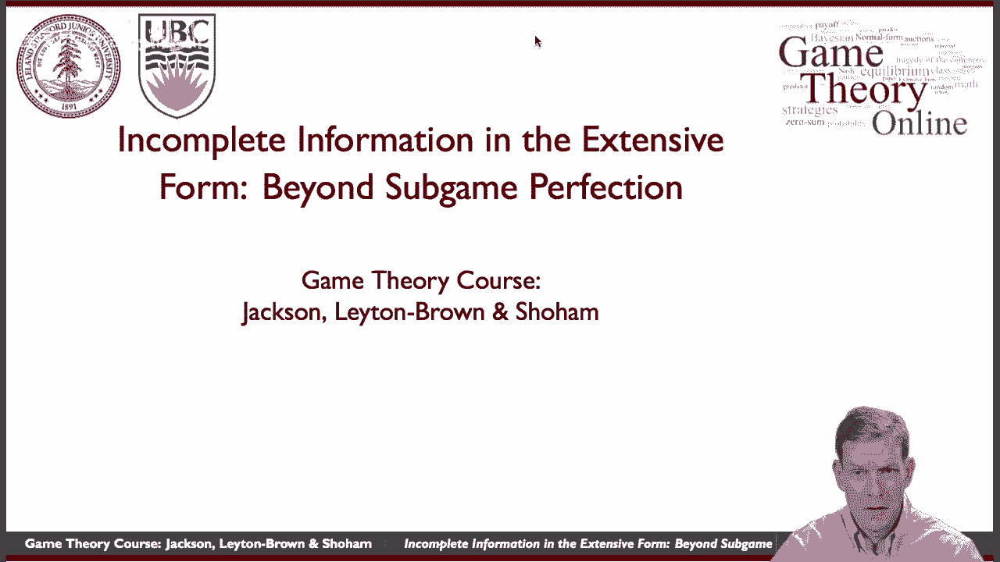
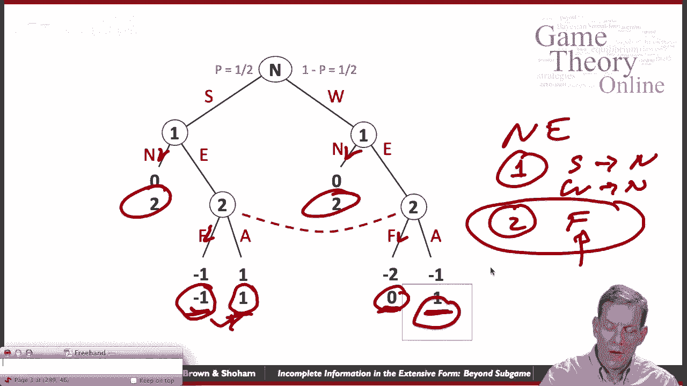
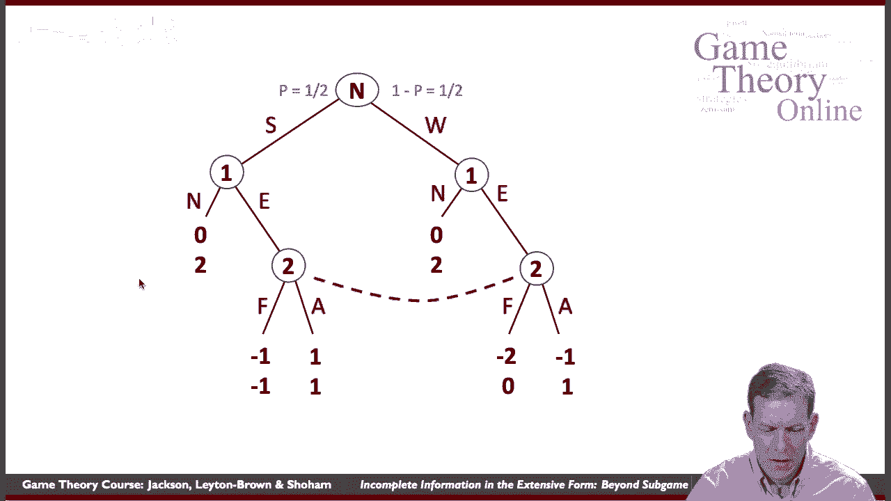
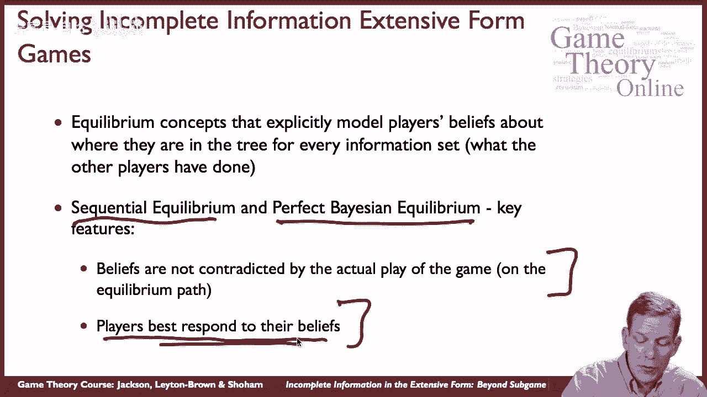
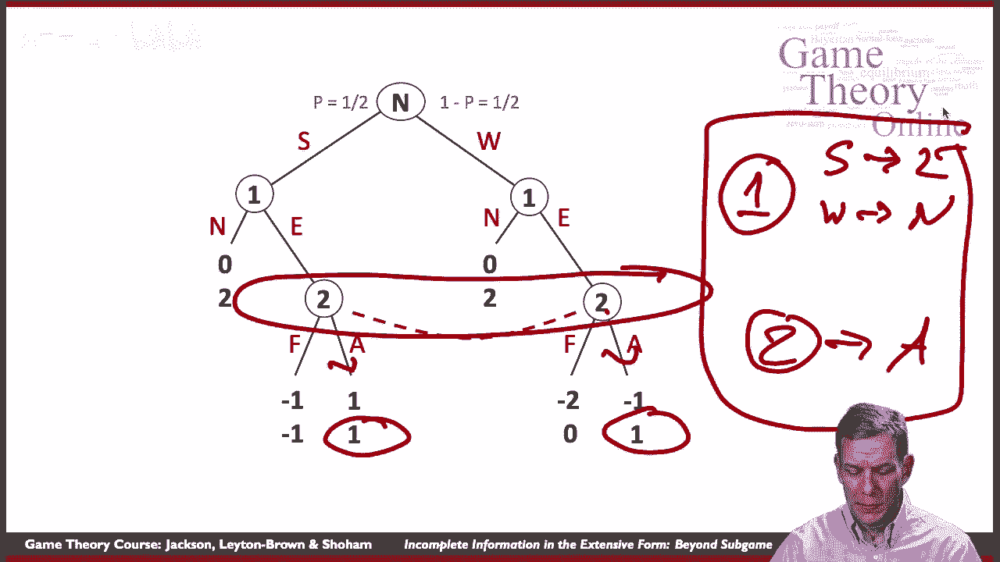
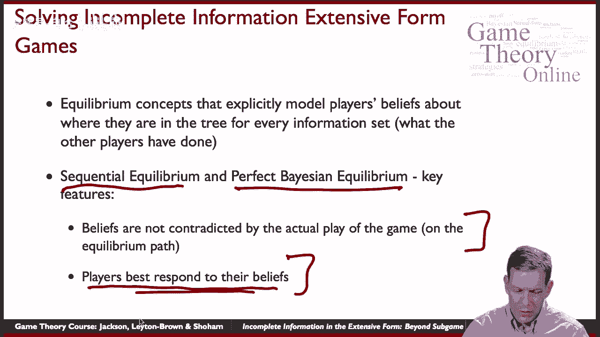
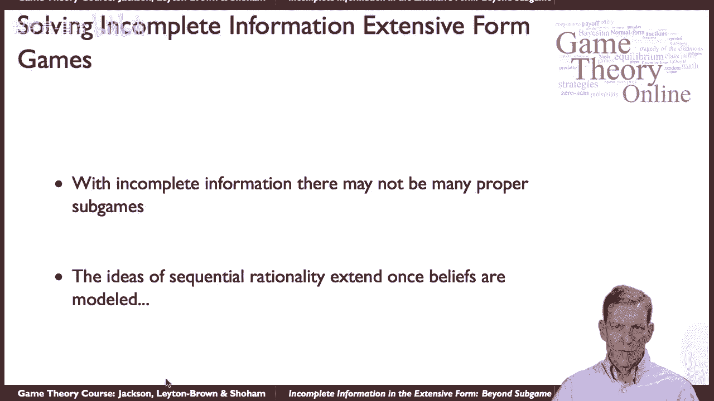

# 【斯坦福大学】博弈论 （全） - P34：【斯坦福大学】博弈论（33）拓展子博弈完美的推理 - 自洽音梦 - BV1644y1D7dD

嗨，伙计们，所以它又相遇了，我们现在要谈谈，嗯，具有完整信息的广泛形式游戏，并超越子游戏的完美，这只是为了给你一些关于外面的东西的印象，在博弈论中，我们不会在这上面花太多时间，但我会给你一个味道。

你知道的，解决这类游戏的想法是这让事情变得困难，就是，你知道的，子游戏的完美和向后归纳在游戏中有很大的作用，资料齐全，因为我们可以分析树的部分，有很多子游戏，弄清楚里面发生了什么，这将告诉我们。

然后我们可以简化，这让我们对将要发生的事情有了一个想法，在游戏的其他部分有完整的信息，没有合适的子游戏，所以玩家并不确切地知道他们在游戏中的哪个节点，这可能很难，所以可能没有很多合适的子游戏。

基本的推理并不适用，子游戏的完美并不直接适用于很多游戏，它的咬合力不大，但是有一些方法可以扩展推理，所以有一些方法可以把背后的同样的可信度想法，子游戏的完善，并将其应用于这类游戏中，所以我们就看一眼。

让你尝一尝，但我们不打算深入探讨，好的，所以让我们来看看一个简单的游戏，然后呃，这个游戏是一个，这是一个人的参赛决定，比如说一家公司，一号玩家，嗯，所以他们有一个e或n的决定。

所以把e看作Enter n不是，二号玩家是另一家公司，在市场上说，所以他们已经在市场上了，销售某一特定商品，从一个人的决定，3。我该不该进入这个市场与其它公司竞争呢？好的，所以我提出，你知道吗。

在一个特定的拐角处开了一家咖啡店，还有别人，思考，好的，我是不是该穿过马路进一家竞争激烈的咖啡店？所以公司现在正在考虑进入，从两个已经在那里了，问题是一旦他们，他们确认有一个人进去了，所以说。

如果就这里的收益而言，如果呃，坚定的一个不进入，如果这个玩家没有进入，一号玩家得0，二号玩家得2，2号博弈者的收益是2，如果公司没有进入，这是真的，不管怎样，它发生了，坚定的那个不进去，然后呃。

那么如果公司进入，那么收益取决于，现任咖啡店是否会说是一家会战斗的咖啡店，嗯，所以F代表战斗，或者表示默许的A，所以基本上他们可以说，好的听着，我们会活下来，也会让别人活下来，我们会有两家咖啡店。

我们会失去一些生意，或者我们可以通过提供特别优惠券来面对面，折扣，我们要让另一个人痛苦，对于另一家公司，所以收益实际上取决于公司两次战斗是否，而且这里不完整的信息是关于强度的，有多好，呃，一号玩家是。

所以他们可以成为一个强大的球员，概率一半，或者他们可能是一个软弱的球员，所以这里的节点是自然的移动，所以自然先动，随机挑选，一号选手是强是弱，所以概率是一半，他们以一半的概率挑选一个强壮的球员。

他们会选一个弱玩家一号玩家会看到结果，一号玩家，这家新咖啡店，我知道我是否有很好的咖啡，嗯，玩家2不知道一个坚定的质量是什么，当公司一进入，所以坚定的就是坚强的，或者坚定的是软弱的。

2号玩家无法区分这两种不同的情况，这就是为什么我们把这个信息集连接在这里，好的，这就是游戏的结构，基本上，强者和弱者在收益方面表现在哪里，嗯，它表现在，例如，一场坚定的两场战斗会发生什么。

所以一场坚定的两场战斗，强有力的坚定的，他们都得了负1分，所以他们都输了，如果坚定的一个是强大的，从两场比赛中，这对他们两人来说都是昂贵的，坚定的。

公司每周打两场比赛参赛者从第二场开始得零分公司第一场得负两分，所以弱点意味着它们在战斗中表现不佳，嗯，我们也可以在这个特殊的游戏中，这里有一种情况，你知道，公司一，公司一号的弱版，即使公司2通融。

最终会倒闭，他们只是你知道他们有很糟糕的咖啡，他们不会让它好起来的，所以让我们试着用子游戏的完美来分析这个游戏，嗯，很好的子游戏完美，实际上呃，这个博弈的许多均衡，部分问题是当我们试图研究子游戏时。

我们不能就这样把这部分切掉，说这是一个子游戏，因为它不是这个节点连接到第二个玩家的这个节点，他们不知道他们是在这里还是在这里，所以我们不能切掉小块，基本上唯一的子游戏是整个游戏。

所以这个游戏中唯一的子游戏是整个游戏，所以在这个博弈中，子博弈的完美性和纳什均衡是一样的，所以如果我们看纳什均衡，让我们来找他们中的几个，让我们来看看公司没有进入的地方，所以无论什么公司都不会进入。

无论他们是强是弱还是坚定，关于战斗的两个计划，好的，所以谁说的，我要和你打，如果你进去，从一个说，哦，那很糟糕，我将得到负收益，嗯，所以呃，他们不进来，好的，这是一个纳什均衡，纳什均衡是，呃一个，嗯。

如果他们很强，他们不进来，如果他们很弱，他们不进来，从两个只有一个信息集，他们打对了，这是纳什均衡，好的，嗯，这也是子游戏的完美，考虑到那个子游戏，这里面只有一个子游戏，这种平衡有什么奇怪的。

这种平衡有什么奇怪的，就是，如果你看看二号玩家的战斗决定，战斗决策本质上是一种劣势策略因为它给出了负1，如果玩家比一个强，如果他们默许，嗯和零，如果是一周的话，而一个如果他们默许，所以说。

无论什么类型的公司打两个真的应该默许对吧，他们从中得到更高的回报，所以说，所以我们正在失去可信度，但它仍然与纳什一致，如果一号玩家真的相信公司二号，那很好，如果一号玩家真的进不去。

玩家二可以说他们要战斗，他们永远不必这样，嗯，遵循这个策略不会伤害他们，从某种意义上说，他们会得到两个，无论发生什么，所以他们不需要偏离f，如果他们从来没有被要求搬家，好的，所以那是那是纳什。

但如果这里，二号参与者的偏离平衡路径行为，声称他们要打架在这个游戏中是不可信的。

嗯，所以还有一个，呃，战略在哪里两个人在哪里，我们想象他们默许，那么一个人应该做好什么呢，如果一个人是强大的，他们应该进入，他们在这里得到一个回报，零，如果他们不，如果他们很弱，他们应该怎么做。

如果他们很虚弱，他们不该进来，因为他们得到了负一，这里是零，所以弱者不应该进入，好的，这是另一个纳什均衡，从某种意义上说，这是一个更可信的纳什均衡，因为在这种情况下公司2被要求移动。

他们实际上是在做最好的反应，所以他们的最佳反应是默许，坚定的一方正在尽最大努力，如果它很强，它正在进入，如果它很弱，它不是，这整件事作为另一个纳什均衡联系在一起，这里有几个纳什均衡，其实还有更多，嗯。

在那里你有坚定的做一些混合，然后坚定的一个在某些情况下呆在外面，而不是其他的，这取决于你计算出的特定混合物，所以这个博弈实际上有很多纳什均衡，所以当我们想分析这个的时候，嗯子游戏完美对应纳什。

在挑选一个或另一个方面，它没有给我们太多的帮助，嗯，但这样做背后的一个想法。

分析这些游戏是试图建立背后的想法，从顺序理性的角度来看um次完美，所以有一些均衡概念明确地建立在玩家的信念上，对于每个信息集，它们在树中的位置，有两个解的概念，特别是，被称为序列平衡和完美贝叶斯平衡。

具有关键特征，他们有玩家作为平衡的一部分，你指定玩家的信仰是什么，它应该是，这些信念与游戏的实际玩法并不矛盾，玩家对这些信念的最佳反应，所以你有最好的反应等等，但你也要求嗯。

玩家必须对他们的信念做出最好的回应，即使偏离了平衡路径，这将在这场比赛中占有一席之地。

所以如果我们再看这个游戏，我们要求玩家在不同的信息集上有信念，所以我们现在要做的是，2号博弈者必须说我在这里的概率有多大，我在这儿的可能性有多大？所以他们有一些信仰，但是请注意在这个游戏中。

不管那些信仰是什么，他们应该总是默许对的，所以一旦我们给玩家两个信念，并说他们必须最好地回应他们的信仰，在任何他们有信念的节点上，然后绑起来说，好的，玩家2必须默许，那么对于一号玩家来说。

如果二号玩家默许，一号选手很强壮，他们一定要进去，如果2号博弈者弱，他们绝对不应该进去，所以我们在这个游戏中得到了一个独特的预测，而子游戏的完美，有很多。

所以这里的想法是我们，我们有这些额外的要求，玩家有信仰，首先，它们并不矛盾，所以它必须是，他们所相信的与其他球员的比赛方式是一致的，玩家应该最好地回应他们的信仰，它对游戏中设置的每一个信息都施加可信度。

好的，所以这让它。

你知道最终会在这类游戏中做出很多预测，嗯和，你知道的，我们在这里看到的不完整信息的挑战，可能没有合适的子游戏，顺序理性的思想可以推广，但它们需要额外的解决方案概念层，你知道，一旦我们这样做。

我们也比以前有了更多的分层，我们已经看到子游戏的完美已经对这里的玩家提出了相当高的要求，现在他们还必须非常擅长根据他们所处的位置来推断事情，他们经常进行这种计算，他们的手可能是什么意味着什么，嗯。

我应该，4。你知道在不同的情况下我应该做些什么，如果我有一只强壮的手，我该打电话吗？我应该提高他们等等吗，那么在这些解决方案概念中发生了什么，尽管如此，嗯，非常适合分析特定类型的游戏。

