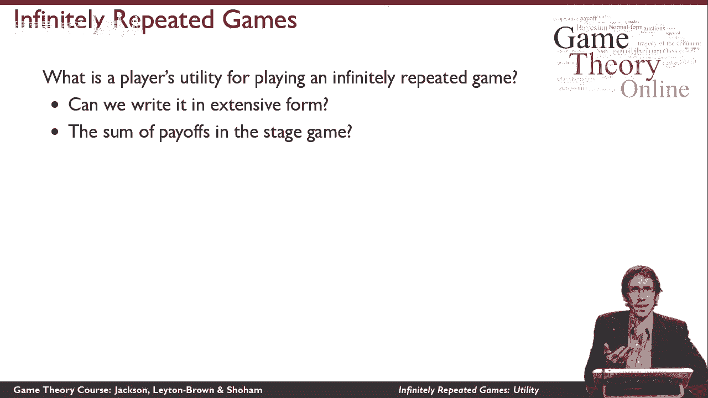
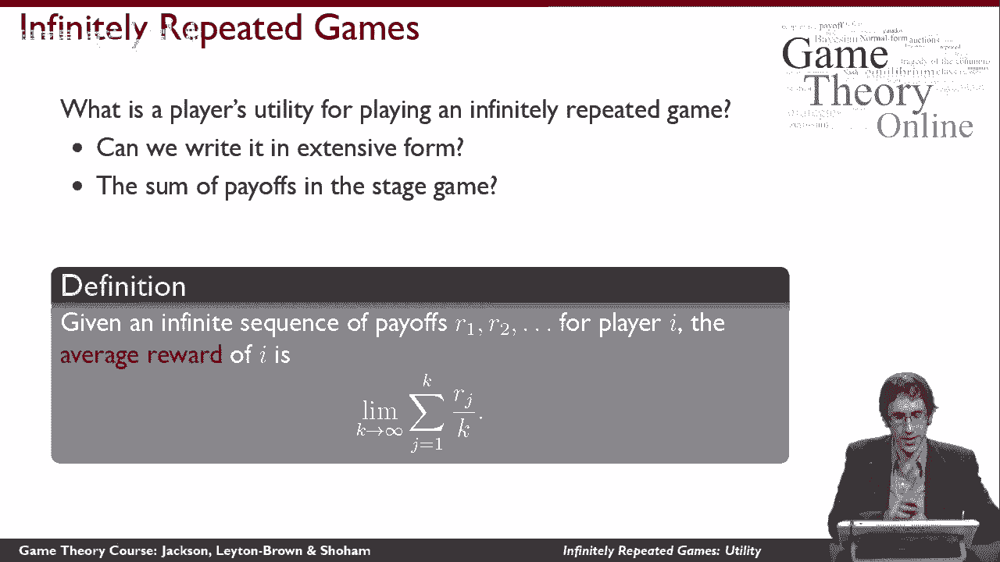
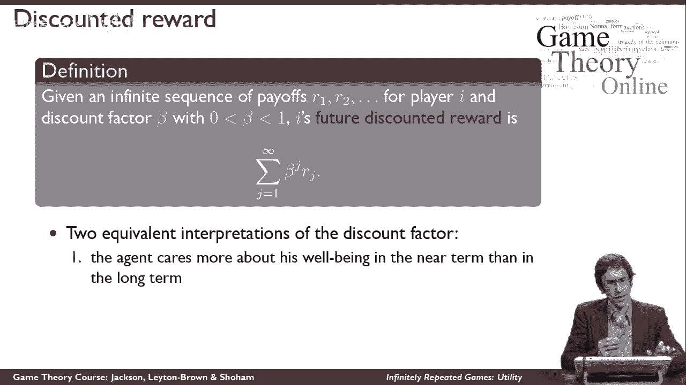
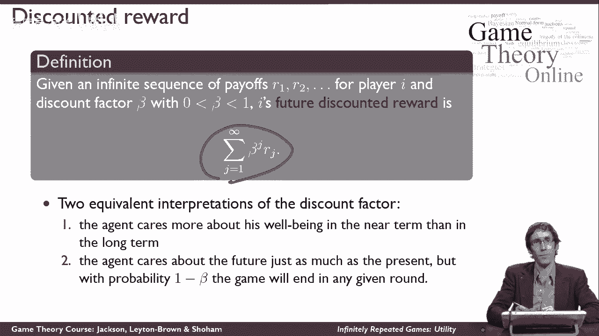

# 【斯坦福大学】博弈论 （全） - P36：【斯坦福大学】博弈论（35）实用的无限次重复博弈 - 自洽音梦 - BV1644y1D7dD

在这个视频里，我们将研究如何在无限重复的博弈中定义效用，所以请记住，无限重复的游戏是如何工作的，我们有一些舞台游戏，这是一个正常形式的游戏，玩家们一遍又一遍地玩同一个游戏。

这意味着每个玩家都得到一系列的收益，让我们说，玩家I在第一次重复中得到序列r 1，第二次重复r 2，三个不停地，所以我们有这个无限的实值序列，这是这个玩家得到的收益，但如果我们想为这个游戏讲道理。

我们不能用效用理论来解释无限序列，相反，我们必须把这个序列变成一个数字，它谈到了玩家在玩这个序列时的效用，那么我们如何做到这一点，正确的思考方式是什么，所以首先要注意的是，我们以前学到的东西。

博弈论不足以回答这个问题，所以你可能会想，我们是否可以把这个无限重复的游戏，只是用广泛的形式写出来，当然我们不能，原因是外延形式将是无限深的，我们永远不会到达一个叶子节点，在那里我们可以写一个回报。

所以这对我们没有帮助，你可能也会想知道，我们能总结一下收益的顺序吗，我的效用是这些值的总和，问题是这个和可以是无界的，因为例如，如果我得到的每一个回报都是正的，那么在最后我会有一些无限的效用。

所以这对我不起作用。

我想有有限的实用程序，因此，取而代之的是，有两种规范的方式来定义这一点，我会在这个视频中告诉你他们两个的情况，这是第一个，所以第一件事是说，让我直观地看一下我在这个序列上的平均收益。

现在序列的平均收益也没有很好地定义，因为我取平均值的方法是把所有的东西都加起来，然后我把它除以事物的数量，我们已经看到和可以是无界的，事物的数量也是无限的，所以我会有无穷大除以无穷大。

这对我在这里没有帮助，但我能做的是看看有限平均的极限，随着平均数越来越长，所以我能说的是让我看看平均值，在我序列中的前k件事上，然后让我取这个平均值的极限，当k趋于无穷大时，实际上从技术上来说。

这并不总是很好地定义，它几乎总是有很好的定义，我们可以对这个定义做一个简单的修复，我把它留在这里是为了防止它变得太技术性，但在定义明确的情况下，这样做是正确的，以及我们在本课程中将要讨论的一切。

它会被很好地定义，所以这是定义为平均奖励，玩家克服了无限的序列，所以这给了我们一个数字。

我们有第二个定义的原因，关于平均奖励有一些违反直觉的东西。

我把它放回去，这有点违反直觉的原因是，如果我在有限的时间内得到了一些不好的回报，假设对于前十万个迭代，我得到负一百万的报酬，然后在剩下的时间里，我得到了一些很好的回报，假设一个效用单位。

那么手段的极限就是一个，因为，我一开始得到的负收益只是在有限的时间内，它在平均值中被冲刷掉，如果我走到未来足够长的时间，嗯，数学就是这么说的，但这并不总是模型，我们想真正推理的是，因为我们有直觉，那个。

你早期得到的收益比收益更重要。

你会走到很远的未来，所以如果我们想有一个具有这种性质的效用模型，我们需要说，不同的收益是不同的，所以对我来说更重要，在第一次迭代中获得良好的回报，而不是在第一百万次迭代中得到一个，我可以建模的方式。

也就是说我的收益乘以一些折现系数，所以我的折现系数是指我在不同时间的收益值，所以我的折现系数是严格地在0和1之间的一个值，你可以把它想象成利率，它说你知道用钱，如果我想告诉别人。

我打算一年付给他们一百美元，嗯，他们今天会把它估价不到100美元，因此，他们今天会低估它的价值，与利率相对应，这正是这里的数学所发生的事情，我想说的是我对收益流的效用，我们的溪流，收益流由折现系数加权。

序列中收益的幂，所以我要对每个收益依次贴现，所以第一个要应用一次折扣系数，第二个是将折扣系数应用两次，所以我要把折扣系数平方，在整个序列中以此类推，所以它们中的每一个都会减少，但它们中的每一个都很重要。

我们有两种方法来思考折扣系数的含义，第一个是到目前为止我一直告诉你们的解释，代理人只关心近期而不是长期，还有另一个不同的定义，但在数学上是相同的，所以想想很有趣，那就是代理真的是我们刚才谈到的代理。

在平均奖励案例中，同样关心每一个回报，但在一定的概率下，概率实际上是一负贝塔，游戏将在每一轮结束，所以我们的游戏不一定是无限重复的，这是一种潜在的无限重复，但每次我们玩游戏，我们要抛硬币。

概率为1负贝塔，游戏就要结束了，和概率贝塔，游戏要继续，这意味着这里，我们会谈论我在游戏中的预期奖励，因为有一个贝塔机会，我要进入下一轮，有一个贝塔平方的机会，我要前进两圈，有一个β立方体的机会。

我要向前打三个回合，以此类推，所以这意味着我在这个游戏中的预期效用是相同的公式，这就是在这些游戏中定义效用的地方。

