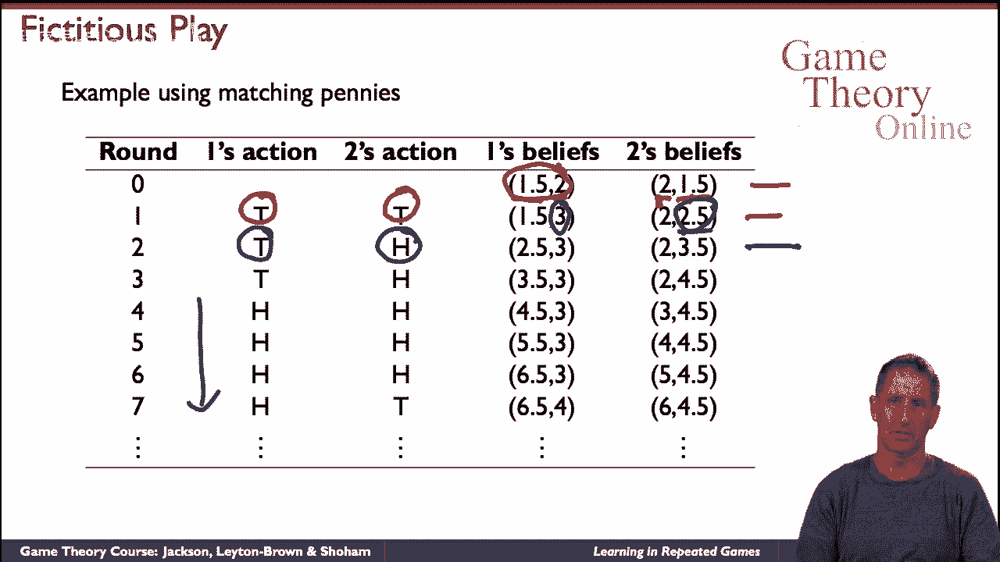
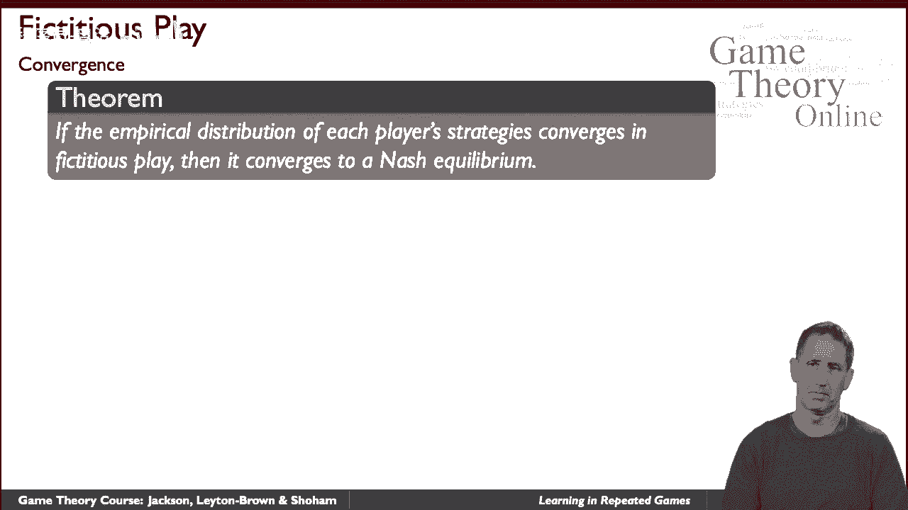
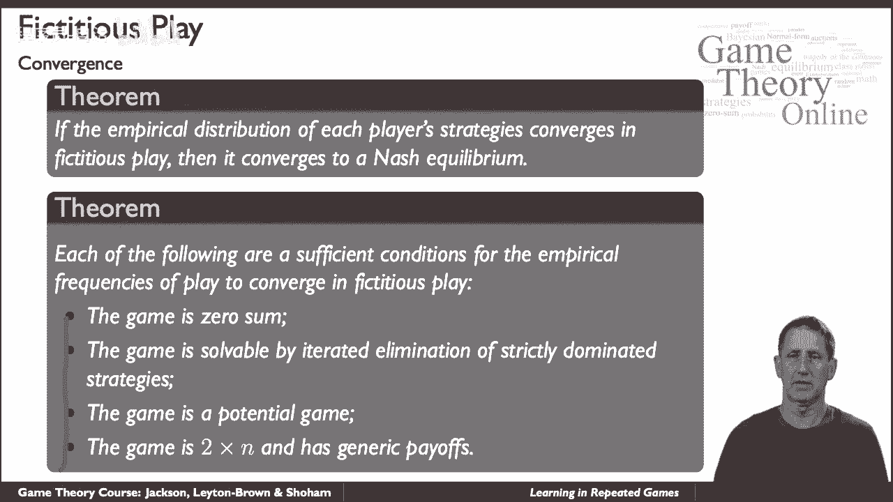
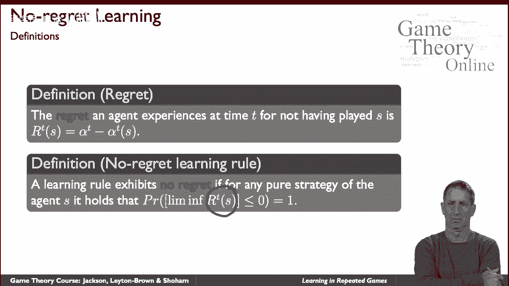
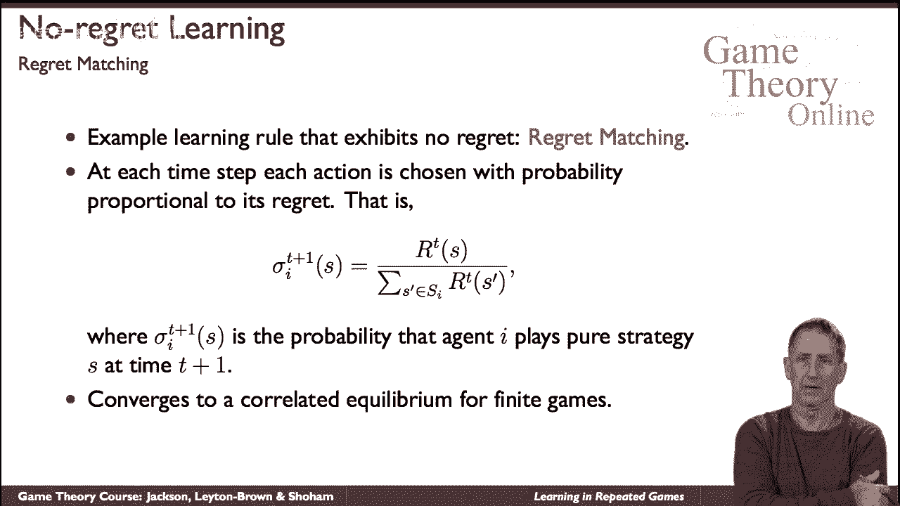

# 【斯坦福大学】博弈论 （全） - P38：【斯坦福大学】博弈论（37）重复博弈中的两种学习形式 - 自洽音梦 - BV1644y1D7dD

呃的话题，学习是博弈论中非常丰富和迷人的一个，我们就可以呃，尝一尝，我们将重点讨论在游戏中学习的两个例子，一种叫做虚拟游戏的方法，另一个叫无悔学习，特别是一种叫做后悔匹配的算法，但是呃，话题真的很大。

所以在我们真正研究具体的方法之前，让我说几句话，首先，嗯，我们应该认识到，博弈论的学习与某些其他学科的学习有根本的不同，例如，就像机器学习一样，在人工智能和计算机科学中，或在统计中，论优化。

在那些学科的人中，人们通常会想到一个单独的演员在一个环境中表演，不是环境对代理来说是未知的，它可能是随机的，它可能是部分可以观察到的，因此，很难弄清楚什么是最佳策略，但是有一个很好定义的最佳策略概念。

学习的目标是了解一些关于环境的东西，以及如何在其中表现得最好，在呃的情况下，博弈论，环境包括，或者可能完全由其他代理组成，所以即使你在努力学习和适应，他们也是，所以最终发生的是。

你真的不能把学习的概念和教学的概念分开，因为当你适应的时候，你在影响其他特工的活动，非正式地想象一下有两个特工的情况，呃，他们反复向对方驶去，玩小鸡的游戏，然后呃，也许是青春期的飙车，也许嗯，那个呃。

一个，其中一个，呃，其中一个，所以他们想做的是，他们当然想直行，让其他人到路边去，并给了他们通行权，当然啦，如果他们两个都这么做，它们碰撞，这是个坏主意，所以他们互相测试，随着时间的推移，多多少少敢。

所以想象一下有一个司机，一个非常好的建模者的另一个好的驱动程序，所以一号司机学得很好，不管一个策略是什么驱动因素，一号驾驶员将了解二号驾驶员的策略并随着时间的推移做出最佳反应，我们会想出办法的。

它将是一个伟大的回应者，看来你没有比这更好的了，嗯，想象一下2号玩家是个恶霸司机，谁不是真正的模特，第一个司机很好，但就在前面，不关心情况，也许同意，我愿意到处打几下来吓跑，第一个司机，会发生什么。

是第二个学习很差的司机，第一个司机的一个非常糟糕的建模者会一直往前走，第一次驾驶是一个很好的学习者，最佳反应者将学会适应，发生的事情是第二个司机可能是个糟糕的学习者，但是一个很好的老师。

所以当你考虑在游戏中学习时，这是一件要记住的事情，另一个是学习是一个超负荷的术语，你可以在游戏中学到很多东西，我们将看到一个非常特殊的切片，我们将看到的上下文是专门重复的游戏。

当我们谈到在重复游戏中学习时，我们将真正讨论当它们展开时的策略，得出有趣的推论，或者以有趣的方式利用积累的经验，这就是我们学习的本质，和，事实上，大多数文献和博弈论都考虑到了这一点，呃，这里有两个例子。

第一个，这可能是博弈论学习简历的鼻祖，叫做虚构游戏，事实上，它最初并不是构思出来的，今天也不被视为一种现实或有效的学习方法，但它确实包含了许多你在更复杂的学习版本中看到的元素，它是，呃。

首先作为计算的启发式提出，游戏中的计算与自然平衡，事实证明这不是一个非常有效的程序，但是它，这是一种有趣的基本学习过程，它的工作方式很简单，每个代理人都从一个信念开始，即他们的代理人的策略是什么，呃。

每个代理最佳响应，代理根据他们在，在游戏的这个迭代中，游戏重复，正如我所说，这是一个非常普遍的制度，事实上，这是一个基于模型的学习的一般机制，在那里你有一个代理的模型，随着时间的推移。

您最好对更新做出响应，虚构戏剧是一个特例，其中模型只是到目前为止另一个代理的动作的计数，你数数他们，所以更正式一点，让我们呃，我们假设，w a是对手过去玩动作a的次数，对于非零的，有一些初始值。

概率与过去播放的时间成正比，那是一个非常简单的程序，所以你，你总是有一些有点矛盾的事情发生，因为每个探员都假设，呃，让我们来谈谈这里的两个特工，这两个特工总是在玩纯粹的策略，但他们在互相模仿。

总是玩混合策略，就这样吧，我们还应该注意到你需要担心边缘情况比如领带断裂，那么发生了什么，如果你必须有两个动作，它们在过去播放的次数相等，你需要担心的是，这里有一个它可能如何工作的例子。

在匹配便士的背景下，再次匹配便士，两个玩家各自选择正面或反面，如果他们都选择了相同的，谁先赢，如果表现不一样，同一个人赢了，让我们假设这些是他们心目中的初始频率，所以我对两个的看法是，两个盘子头。

你知道的，频率为一点五和，这是二号选手，关于球员一的信念，好的，现在是第一回合，他们应该做好什么，一号玩家想对他的信仰做出最好的回应，他认为这个，他认为这是二号玩家的分布，他想匹配，所以他要玩尾巴。

这样他们就可以匹配，这是对这个混合策略的最佳回应他认为2号博弈者，所以他要玩尾巴，二号博弈者怎么样，二号玩家有这样的信念，他想错配，因为他相信1号玩家正面比反面更有可能，他要玩尾巴，所以他也要玩尾巴。

舞台结束了，现在让我们进入下一阶段，在这一点上，发生了什么很好，这些是玩家的最新信念，观察到两个玩尾巴的玩家，所以他把二增加到三，2号博弈者也增加了他对1号博弈者会做什么的信念，他们擅长什么。

一号选手还想和二号选手比赛，他仍然相信，事实上，更强烈的是2号玩家会玩，呃，嗯，概率更大的尾巴，所以他又要玩尾巴了，另一方面，二号玩家现在相信这些是概率，所以2号博弈者认为1号博弈者更有可能。

玩家2想要不匹配，所以2号玩家现在要玩人头游戏，继续这个计算，你可以说服自己这出戏将以这种方式进行，这就是虚构的游戏，发生了，所以注意一些有趣的事情，呃呃，策略不收敛，如果你继续玩下去。

你会看到T和H以及两边，有点潮起潮落，但你会看到随着时间的推移，会有一定的平衡发生，这是而且而且而且而且事实上，在这个游戏中，平均，如果你看看策略的长期平均值，每个代理将以相等的速度玩尾巴和头。

可能以相等的概率点5，所以我们称之为经验频率，现在请注意，在匹配的便士中，5也是唯一的纳什均衡，问题是这是意外吗答案是否定的。

这里有一个定理定理说，如果经验频率，戏剧在虚构的戏剧中汇合，然后它们必须收敛到博弈的纳什均衡。

现在它们可能一般不会收敛，这就是为什么它不是一个有效的学习过程，但在许多条件下，即使戏剧没有收敛到经验频率，这里有一些条件是足够的，如果游戏是零和，如果它是通过一种叫做迭代的东西来解决的。

严格占优策略的迭代消除，如果这是一个叫做潜在博弈的东西，我们想在这里定义，或者如果是一个两个结束的游戏，换句话说，一个玩家只有两种策略，另一个可能有更多，但它有所谓的通用对，我们也想在这里找到。

但最重要的是，从这里得到的是，有一些充分条件，他们，保证。

虚拟游戏中游戏的经验频率会趋同，甚至，即使戏剧本身不会让我们现在转向一种非常不同的学习形式，这是一门完整的学问，叫无悔学习，它在根本上是不同的，首先，方法本身将不是基于模型的。

他们不会显式地建模另一个代理正在做什么，呃，而是会适应，嗯，呃，战略，但也许更根本的是，在这种情况下，我们不从学习方法开始，但我们从我们的标准开始，我们希望方法满足，那么这说明了什么。

我们会说一个特工在时间T的遗憾，因为没有玩一些策略是，这种差异，他当时实际得到的一对之间的差异，如果他玩策略，他会得到的一对，是呀，这是一个很自然的概念，我们现在将定义，当学习规则没有遗憾，这将是关键。

如果情况下，如果在极限内，代理不会玩，不会表现出任何遗憾，换句话说，如果你随着你的走，遗憾会趋于零，是一个。

那些规则将被称为无悔学习规则，这里有一个这样的规则，这是惊人的简单，这叫后悔匹配，它的工作方式如下，上面写着，简单地看看你所经历的遗憾，呃，到目前为止，对于你的每一个纯策略。

并根据其遗憾的比例选择纯粹的策略，所以如果我们再次定义增益，策略的遗憾在时间t是s的rt，那么下次你玩的概率是，这是所有纯策略中所有遗憾的总和，带上你的亲戚，呃，呃，相对于所有人的遗憾，所有遗憾的总和。

所以一个非常简单的规则，它具有惊人的强大性能，首先呢，事实证明它并不后悔，当你使用后悔时，它实际上会收敛策略，遗憾匹配，收敛于相关均衡，至少为了有限的重复，呃，对于有限博弈，小游戏，重复的有限博弈。

这是学习规则的两个例子，一个模特儿专门虚构的游戏，另一个是无模型的，呃，后悔匹配，呃，展示…的家族之一，呃，无怨无悔的学习方法，就像我们一开始说的，嗯，学习游戏的话题非常丰富。

但至少我们有品味。