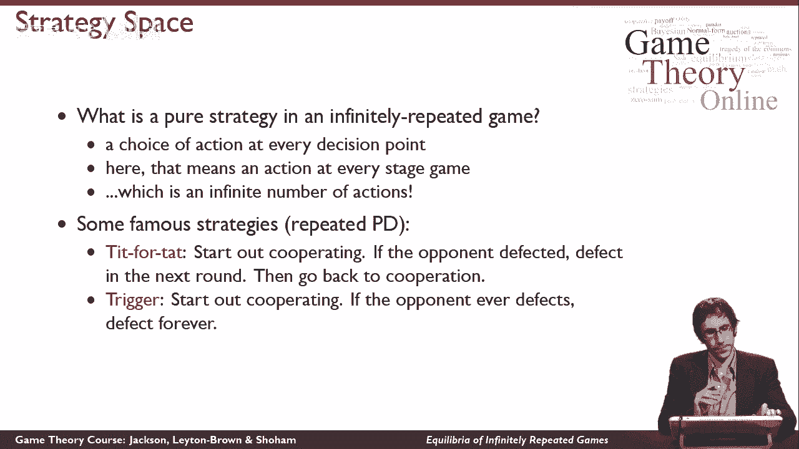
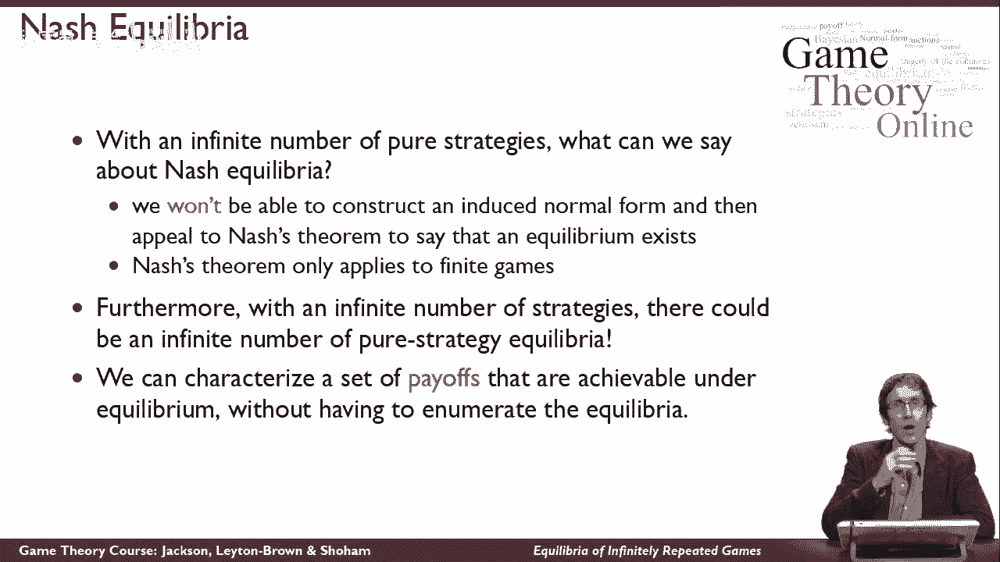
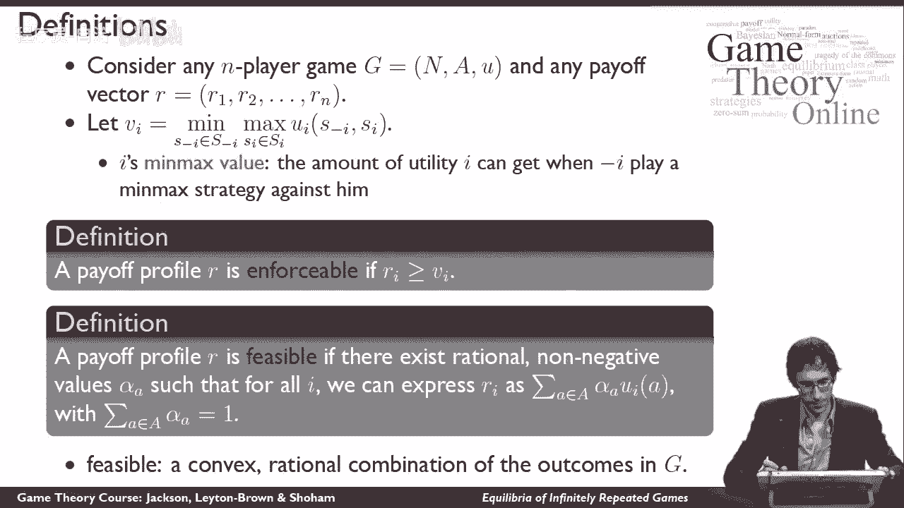
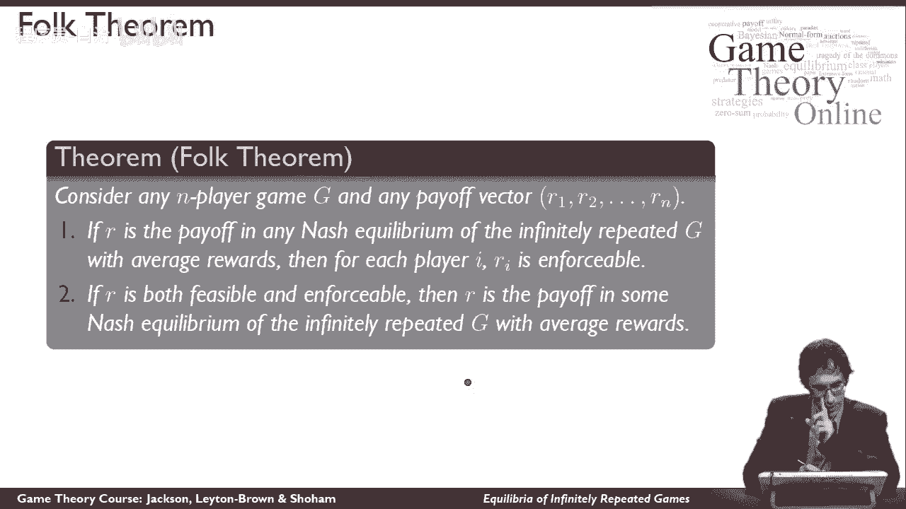
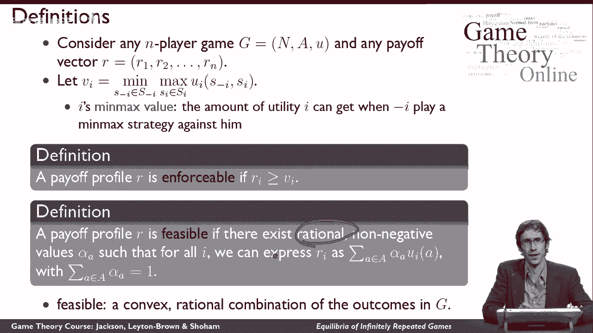
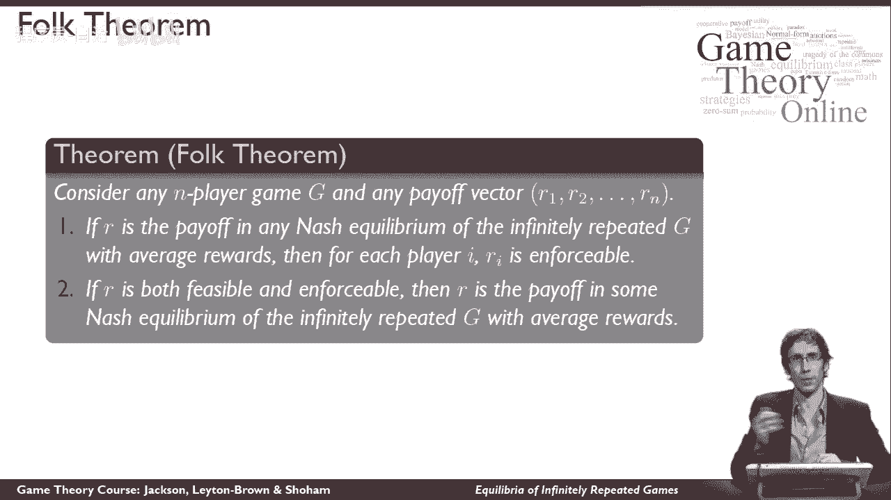
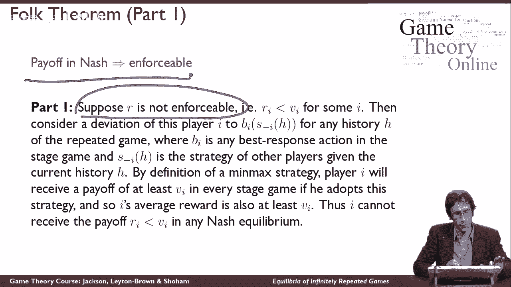
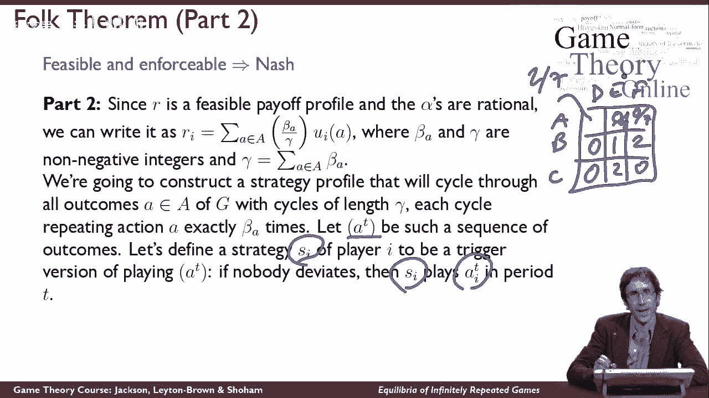
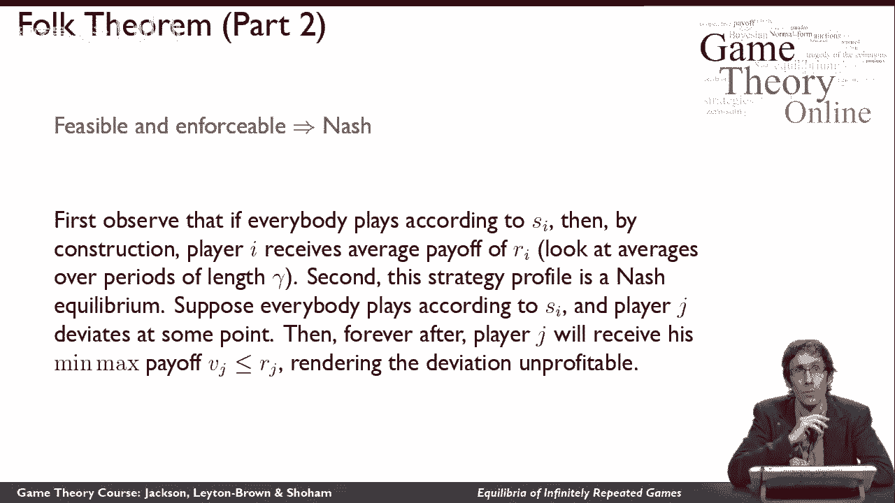

# 【斯坦福大学】博弈论 （全） - P39：【斯坦福大学】博弈论（38）无限重复博弈中的均衡问题 - 自洽音梦 - BV1644y1D7dD

在这个视频里，我们将研究无限重复博弈的均衡，所以为了讨论均衡，我们需要从问，我们所说的无限重复博弈中的纯策略是什么意思，你可能想在这一点上暂停视频，看看你能不能回答这个问题然后我再告诉你答案。

如果你需要提示，你应该记住，我们用来定义策略的经验法则，因为我们已经改变了，博弈表征一直在说，一个纯粹的策略应该是，无论你需要告诉另一个人代表你参加游戏，最终做你会做的事情。

所以一个纯粹的策略一直是你的策略，你会跟着，以你实际做的方式做出所有的决定，所以无论你需要传达什么政策，在无限重复的游戏中，你的策略是在每个决策点选择行动，这意味着你在每个舞台游戏中都会采取的行动。

并记住，当你采取这些行动时，你实际上可以对你以前在游戏中见过的一切进行推理，也就是说你可以记住自己以前的所有动作，你还可以记住之前阶段游戏中其他玩家的所有动作，所以真的，你的纯策略空间是一个映射。

从每一段历史到你会清楚地做出的行动选择，这是无限多的动作，所以与以前的游戏不同，我们在正常形式的游戏中研究了广泛的形式游戏，你甚至不会有有限的纯策略集，在无限重复的游戏中，让我给你们举几个例子。

在无限重复的游戏中，一些著名的纯策略，然而，为了给你一种感觉，我们可以说一些关于纯策略的有趣的事情，即使可能的纯策略集是无限的，所以想想玩重复的囚徒困境，所以我要玩囚徒困境游戏。

无数个著名的策略叫做以牙还牙，原来有一些著名的比赛，人们提交，反复上演囚徒困境的节目，然后他们观察这些程序是如何相互对抗的，以牙还牙是出了名的在那些比赛中表现出色的策略，它的工作方式，一开始是合作。

然后如果它观察到它的对手有缺陷，所以上一轮对手变节了，然后在下一轮以牙还牙的缺陷，然后又回到合作，那么如果它叛逃了，但是对手配合了，然后它就会通过合作来回应，所以如果以牙还牙，它会永远合作。

但如果它和一个有缺陷的人比赛，它会直觉地惩罚叛逃，在下一轮变节，但这是非常宽容的，一次惩罚就会恢复合作，相比之下，触发策略是一种非常卑鄙的针锋相对的版本，所以一开始是合作，但如果它的对手有缺陷。

那就是它，它只会永远叛逃，所以它会扣动扳机，说我永远不会原谅你，你冤枉过我一次，我要冤枉你，直到天荒地老，这就是为什么我们叫它触发器，所以你可以看到在这两种情况下，我可以向你描述。

这些策略将如何应对来自无限历史的任何东西，他们会在算法的术语中看到，而实际上没有写出一个策略，在形式语言中，所以你可以看到有可能认为，关于无限重复博弈中有趣策略的连贯。

现在，当然啦，作为博弈论家，我们真正想做的是，描述无限重复对策的纳什均衡，我们过去采取的方法是，首先，展示我们如何从一个游戏中得到一个诱导的正态形式，我们弄清楚游戏中的策略是什么。

我们展示了如何使诱导范式，然后我们就诉诸纳什定理说，因为我们有一个正常形式的游戏，我们知道存在一个纳什均衡，所以一切都像以前一样，过去对我们很有效，因为我们最终总是得到有限大小的诱导正规形式，不幸的是。

因为我们有无限多的纯策略，我们将得到一个无穷大乘无穷大的矩阵，即使在两个玩家的情况下，所以我们不会有什么，纳什定理不再适用了，因为现在我们有了一个无限大小的博弈和纳什定理，只适用于有限游戏。

这意味着根据我们目前所知，我们没有任何理由，甚至可以确定均衡在这些博弈中确实存在，另一方面，因为它们是无限多的策略，甚至可能有无限个纯策略均衡，所以我们看到了过去的事实，有可能有无限个混合策略均衡。

比如说，如果我在正常形式的游戏中有两种策略，我不关心的两个纯粹的策略，然后呢，它们之间的任何混合对我来说也是最好的回应，所以有一种感觉，其中我可以有无限个混合策略均衡，但在这里。

我可以有无限多个质的不同的纯策略均衡，这似乎是个问题，所以我们不能，以某种方式列出重复博弈必然的均衡，有趣的是，我们仍然可以连贯地做一些事情，给出满意的答案，关于无限重复博弈的纳什均衡，在这个视频中。

我要告诉你它是什么，实际上是因为它太令人满意了，我甚至要向你证明这个定理，所以你真的会明白这是如何工作的，这是我们最终将证明的定理的思想，我们可以描述在均衡条件下可以实现的收益。

我们可以举一个均衡策略的例子，它导致了这些收益，而不给出导致这些收益的每一个均衡，所以我们要描述哪些策略是平衡的，在无限重复的游戏中，通过他们的收益，我将能准确地告诉你，在均衡情况下。

哪些收益向量是可以实现的。

所以要做到这一点，我需要给你一点记号，所以我们可以讨论这些收益向量，这是我们的记谱幻灯片，一旦我们度过这个难关，我们将有所有的积木，我们需要证明我们的定理，所以我们将从一个n人游戏开始。

所以这只是我们的舞台游戏，一些正常形式的游戏，我们还将从这里的收益向量开始，我的意思是玩家在游戏中获得的效用，在这段视频中，我将谈论平均奖励案例，这些数字中的每一个实际上都编码了我平均得到的效用。

在无限重复的游戏中遵循我的策略，所以这就意味着，我关心我现在得到的回报，就像我现在得到的回报一样，和收益，我得到了一百万次迭代到未来，我们可以在折扣奖励的情况下做类似的事情，这将是另一个视频的主题。

但在这个视频中，我们将只讨论平均奖励案例，原因是，在一般的奖励案例中，证据更容易思考，即使折扣奖励奖励案件是，也许更实际的设置，我们可以通过这个证明来理解这两个证明的要点。这个容易一点。

所以让我们这样做，我需要提醒你这里的最小最大值的概念，我们引入了零和博弈的概念，但事实证明，对于重复的游戏来说，这是非常重要的，所以我要提醒你这里是什么，所以这是最小最大值的数学定义。

但让我首先用语言来说明这意味着什么，因为嵌套的min和max运算符有点难考虑，本质上i的最小最大值是多少，是玩家I能够为自己获得的效用，如果我们称之为负的所有其他球员，我完全不关心他们自己的效用，相反。

他们只是想尽可能地伤害我，所以他们都在他们的混合策略空间里玩这个策略，如果我对此做出回应，尽我所能为自己做最好的事情，越低越好，所以他们试图最小化i的效用，考虑到我试图最大化，以响应其最小化。

最后出来的数字是我能得到的效用量，尽他所能，尽可能地反对所有试图伤害他的人，所以这是i的最小最大值，所以很直观，如果我想在游戏中尽可能多地惩罚你，你知道我在惩罚你，你得到的效用量是你的最小最大值。

所以我会说一个回报简介，请记住，收益概况是每个人的收益金额是可执行的，我给它取个名字，可强制执行，如果在这种情况下，每个人的收益都在收益简介中，至少是它们的最小最大值。

所以如果有人在给定的收益配置文件中得到的低于他们的最小最大值，我会说，这是一个不可执行的回报概况，我会说回报剖面是可行的，我会用这个专业术语，可行的，如果下列条件为真，直觉上，关于可行性我想说的是。

实际上有可能得到回报概况，通过将实际游戏中的收益组合在一起，请注意，可执行性实际上并不要求，有可能，你知道的，我可以说我的回报是一百万美元，在囚徒困境中给你一百万是一个可执行的回报。

因为它高于我们的最小最大值，但是没有办法，我们实际上可以在囚徒困境中每人得到一百万，因为数字没有那么高，所以可行性是谈论它实际上有可能做什么，我们要说的是，我要把自己限制在有理数上。

我要说的是如果存在有理数和非负数，对所有玩家来说，我可以表达播放器，这个收益向量中的i元素作为和，在这个阿尔法的正常形式游戏中，所有的回报动作配置文件，乘以I的效用，A如此直观，哦，然后我当然需要这个。

让我说说条件的最后一部分，这些阿尔法都和为一，在所有的操作配置文件中，所以让我向你们解释一下这意味着什么，所以说，所以我有一个正常形式的游戏，我想说的是我对游戏中的每个细胞都有一定的权重。

这些是阿尔法A，它们加起来都是一个，我想做的是从这个牢房里拿我的报酬，按细胞的alpha加权，我对下一个细胞的回报，我的阿尔法为那个细胞加权，把所有这些加起来，给我的那些加权公用事业，然后我得到里。

所以我想说的是存在阿尔法，我可以使用，这将把实际游戏中的收益混合在一起，以这样一种方式，我得到了RI，此外，这必须同时适用于其他人，特别是，它必须是正确的，与其他人相同的阿尔法。

这样我就能想出一些阿尔法来让我得到我的RI，但我必须用同样的阿尔法来得到玩家的RJ，J我必须在所有的重量上都有相同的重量，这里的细胞，这样我就能得到每个人的相同数字，所以让我们想想下面的游戏。

这将给你一个可行性是如何工作的例子，假设我有一个游戏，它看起来是这样的，所以在这个游戏中，我声称收益简介1 1是可执行的，原因是我可以给这个细胞50%的重量，这个细胞的重量是50%。

而这些细胞的重量是零，你可以看到我在这个游戏中的收益是50%乘以2，加0乘以0，加0乘以0加50%乘以0，这是一个，在这个博弈中，另一方的收益是零的50倍。加0乘以0，加0乘以0，加百分之五十乘以二。

也是一个，所以在这个游戏中，这是一个可行的回报，另一方面，收益2 2在这个游戏中是不可行的，原因是我不可能在这些细胞上有重量，加起来就是一个，然后给我们俩两个，因为对我来说，要得到两个的回报。

这一定是一个，那是我唯一能得到报酬的牢房，对我的对手来说，要做到这一点，必须是一个，然后它们加起来会不止一个，这里的这个条件就会被违反，所以我们就是做不到，所以这不是一个可行的回报。

好的，现在我们准备好证明民间定理了，有点好笑，这叫做民间定理，这有点像数学家的民歌，所以民歌是大家都知道的歌，但没人知道是谁先写的，民间定理是一个人们都知道和谈论的定理，在他们抽出时间写下来之前。

他们不太确定它是从哪里来的，这就是博弈论的民间定理，尽管起源不确定，这很重要，在民间定理中，基本上告诉我们什么，纳什均衡是无限重复博弈，就这些收益而言，就我刚才告诉你的定义而言。

所以对于不同的设置有不同的民间定理，这是关于平均奖励无限重复游戏的民间定理，所以民间定理有两个部分。

这基本上是因为我在这里做了一个限制，到理性阿尔法，事实证明我们实际上并不需要那个，但数学变得更烦人，如果我们必须处理真正的价值，所以为了让事情变得简单。

我这么做只是为了有理数，所以民间定理说在任何n人游戏中，我们将对任何收益向量无限重复，R一个要跑，就像我们一直在说的，首先我们要谈谈，嗯，在这种情况下，如果r是收益。

在有平均报酬的无限重复博弈的纳什均衡中，关于收益向量，我们可以得出什么结论，我们得出的结论是，对于每个参与者来说，R必须是可执行的，记住可强制执行的意思是大于或等于该玩家的最小最大值。

所以我可以得出结论，如果r是收益，在有平均报酬的无限重复博弈的均衡中，那么对每个人来说，这些都必须是可执行的，这似乎是一个软弱的说法，民间定理的第二部分更令人惊讶，它说基本上这是我们唯一需要的限制。

如果r是可执行的，而且如果可行的话，如果，从游戏的收益中获利是有可能的，那么r是某个纳什均衡下的收益，所以一起，这说明了基本上可行性和可执行性，是纳什均衡的全部故事，可执行性似乎是一件很小的事情。

它说你得到的回报不低于你得到的回报，如果每个人都惩罚你，尽可能让他们惩罚你的可行性，说在游戏中获得这些收益是可能的，民间定理说基本上就是这样，只要你满足这两个条件，你有一个纳什均衡。

这就是关于纳什均衡的基本说法，你会注意到这两者之间有一点回旋余地，定理陈述的这两部分，嗯，这与我们在这里谈论的可行性有关，我们不是在这里谈论它，所以我们不能断定每一个纳什均衡都是可行的。

你可能会想为什么会这样，那只是因为它们中的一些不能用理性来表达，他们中的一些阿尔法人不会理智，所以这就是我在这个证明中遗漏的部分，但这是一个技术问题，所以关于民间定理，你应该记住的是，基本上。

可行性和可执行性一起等价于重复博弈中的纳什均衡，如果你想停在这里，你现在知道什么是民间定理了，但我鼓励你继续看剩下的视频。

你会看到我们在那里是如何证明这一点的，所以让我们从证明第一部分开始，这么说，为什么，如果收益在纳什均衡中可以实现，我可以得出结论，它必须是可执行的，好吧来证明这一点，我要用矛盾来证明，所以我先假设。

支付向量是不可执行的，如果没有，这意味着一定有某个玩家，i，对他来说，他的回报RI严格低于他的最小最大值，现在让我考虑一个情况，这个玩家我改变了他的策略，让我们想象一下他反而偏离了演奏。

s的i减去i h，我马上告诉你那是什么意思，任何时候他都在重复游戏的历史中，上面写的是什么，这是其他玩家的策略，我们假设他知道那是什么，因为我们说的是纳什均衡，我们会说。

每次其他玩家玩他们的策略配置文件时，我都是他最好的回应，s减去i为每个历史记录给出h，h，所以说，让我们考虑一下他最好的回应，其他玩家在做什么，根据极大极小策略的定义。

你必须在每个阶段游戏中获得至少最小最大值的回报，如果你遵循我们刚刚定义的策略，因为记住最小最大值的定义是你得到的是，每个人都想尽可能地伤害你，你最好对此做出回应，所以直觉上。

如果我已经得到低于我的最小最大值，这意味着我不能对其他人做出最好的回应，因为如果他们想尽可能地伤害我，这对我来说是最糟糕的情况，我最好回应他们，我会得到我的最小最大值，所以直觉上，我可以改变策略。

这对我来说是改善的，这必须使我达到我的最小最大值，因为这会提高我的效用，这对我来说是一个比我以前做的更好的回应，因为基本上这里，我们只是为参与者I构建了一个有利可图的偏差，又因他有益处的偏离。

也就是说他之前玩的策略，不可能是纳什均衡，所以这导致我们从我们的假设中得出一个矛盾，我们一开始做的，R是不可执行的，所以你可以看到我们可以得出结论，如果r是不可执行的，我们不能有纳什均衡。

这就证明了我们想证明的，嗯。

这就是第一部分，这是一种容易的方向和不太有趣的方向，让我们现在做第二个也是更有趣的部分，这说明了我所需要假设的，回报概况是可行的和可执行的，这意味着我找到了一个纳什均衡，这部分有趣的是什么。

我们要通过建筑来做到这一点，所以我要告诉你怎么做，如果你得到任何可行和可执行的回报简介，你可以为两个玩家建立一套策略，彼此平衡的，它为两个玩家获得了正好的平均回报，首先呢，让我们来介绍一些记账法。

我们将在这里使用，所以因为r是可行的，既然我们假设这些阿尔法是理性的，然后我们可以把每个RI写如下，所以基本上我们可以组成新的变量a和gamma。

在那里我们用beta a代替每个alpha a除以gamma，基本上这并不难做到，因为我们知道阿尔法是非理性的，所以我们知道我们，可以把这些阿尔法中的每一个都写成分数。

然后我们可以把伽马变成它们的公分母，我们可以适当地设置测试版，然后有可能想出贝塔和伽马，使这个表达式为真，如此如此所以这不应该太令人惊讶，这只是从这些阿尔法是理性的和可行性的事实中得出的。

现在我要建立一个战略档案，然后在下一张幻灯片上，我要说的是这个策略是均衡的，或者我们可以把它变成一个平衡，所以让我们做一个战略简介，循环所有的结果，使用长度伽马循环，它的工作方式是每个循环都会重复。

动作一次正好是贝塔一次，所以我们将在这里有我们的游戏矩阵，记住，β和γ都是整数，例如，假设这里我们有，假设伽马射线是7，假设这里我们有测试版2，所以这里，α是2/7，假设这里是零比七，零除以七。

我从零点开始写测试版，一个，从零到零，如此如此，假设这就是我们在这场比赛中所拥有的，那么策略会做的是它只是循环通过，所以玩家一的策略是玩，让我们给这些名字一个b c d f。

所以一号玩家的策略是玩a b b c，然后回去永远这样做，二号玩家的策略是玩d d，e，e，然后回去，如果这两个参与者永远以协调的方式一起玩这两套策略。

他们会根据测试版循环准确地击中这个游戏中的每一个动作配置文件，就像测试版，正如所说，让我们把这样的序列A表示为T，现在让我来制定策略，我要说的参与者的真正策略在这里是均衡的，让我们制定一个策略。

玩家I的SI是此策略的触发版本，所以如果没有人偏离，然后SI告诉玩家玩，A会告诉他们玩什么，所以球员们将开始循环这些结果，就像我告诉你的那样，如果一个玩家注意到另一个玩家没有做什么，他们应该做的。

根据a，然后他们就会扣动扳机，相反，从那时起。

他们将对另一个玩家玩最小最大值，所以如果对不起，这正是这里所说的，所以如果有一个时期有人做了错误的事情，并播放最小最大值，对那个人采取策略，使那个人得到他们的最小最大值，如此如此，让我再说一遍。

以确保我们都明白，所以A是一个序列，它的构造是为了击中这里的每个动作配置文件，准确地说是这些beta整数给出的次数，如果我们永远循环，我们感兴趣的策略是它的触发版本，说每个人都试图这样做。

但如果有人做了错事，每个人都永远惩罚他们，给他们最小最大值，好的，所以我想声称，这是一个有平均回报的无限重复博弈的纳什均衡，首先请注意，如果每个人都按照这个策略玩，那么每个人都将得到我们I的平均回报。

就像我们想要的那样，现在你可能会被这样一个事实所迷惑，嗯，有时他们不太明白，因为他们只是在序列的中途，但我们只对极限感兴趣，所以如果你看一段时间的平均值，所以你看看伽马之后会发生什么。

两个伽马之后会发生什么，三伽马之后会发生什么，你就会，你就能说服自己，他们真的得到了正确的回报，因为确实，在每一个伽马周期之后，他们从建筑中得到了确切的回报，如此如此确实。

这确实导致了我们试图获得的回报，还有什么要展示的，事实上，我声称这是为了表明，让我们想象一下其他人都在按照这个策略玩，一些玩家J在某个时候偏离了，嗯，如果在那之后的所有时间里都发生这种情况。

玩家J将得到他的最小最大回报，这将使偏差无利可图，因为我们假设这个回报剖面是可行的和可执行的，这意味着他至少已经得到了他的最小最大值，因为这将永远发生，对吧，这将永远发生在之后，这最终会主导平均水平。

在之前有限的时间内发生的一切，将被冲出平均水平，相反，他的平均回报将是他的，他的最大收益，由我们的，但通过我们在这里试图证明的事情，我们知道它小于或等于RJ，这足以证明民间定理，所以说。

所以我们现在看到的是，可行性和可执行性，与可实现的回报概况相对应。

