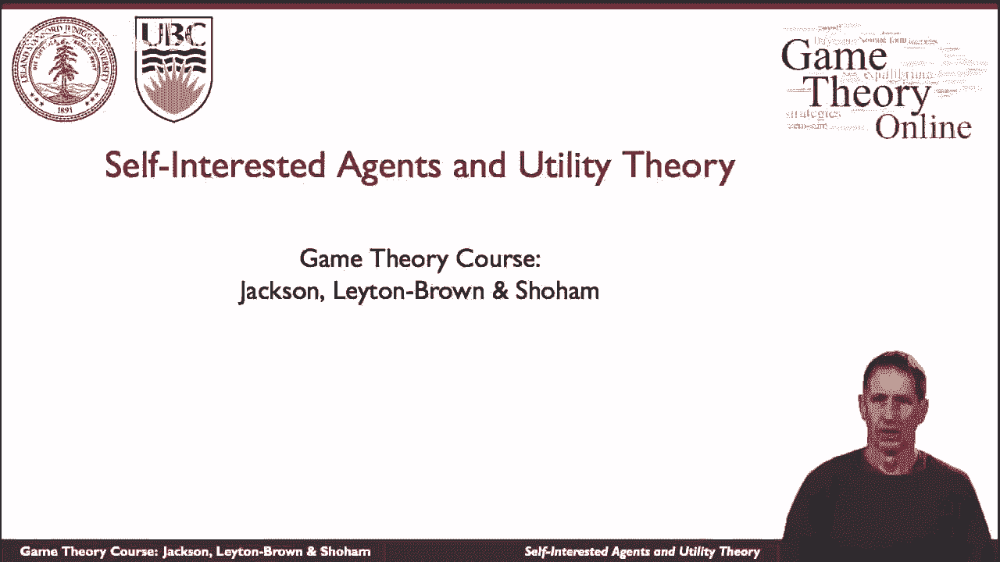
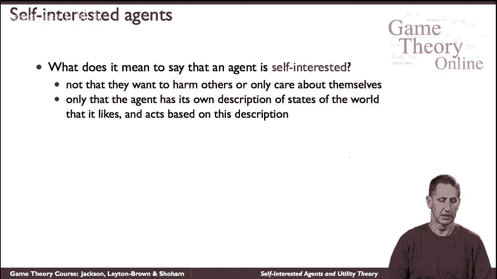
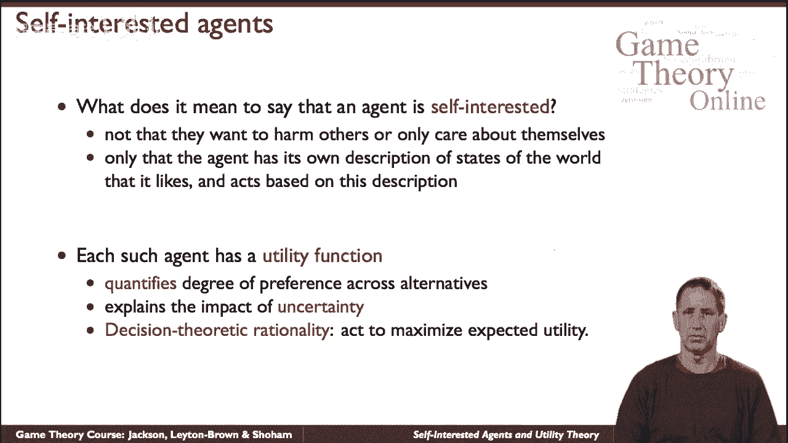
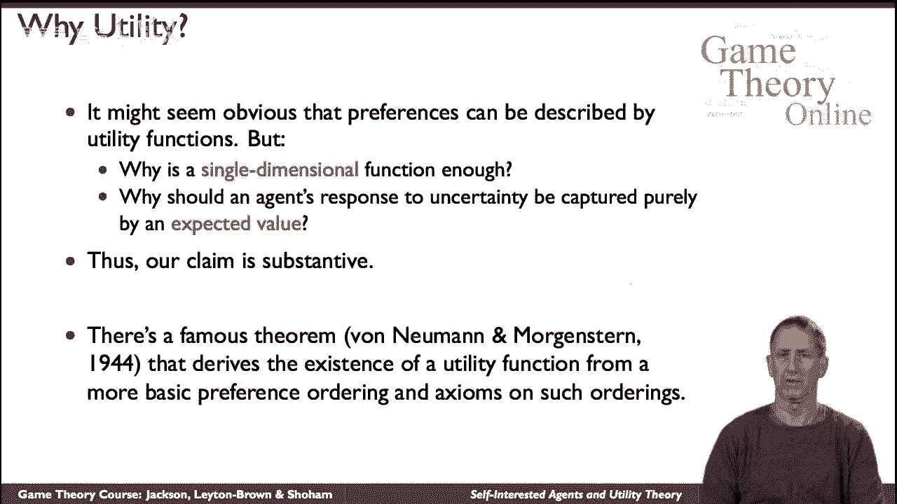

# 【斯坦福大学】博弈论 （全） - P3：【斯坦福大学】博弈论（2）利己主义的代理人和效用理论 - 自洽音梦 - BV1644y1D7dD

我们将讨论自利代理及其相互作用，所以让我们先谈谈我们所说的自我是什么意思。

我们不一定说特工是敌对的，或者不在乎其他特工的遭遇，我们的意思是代理人有意见，有偏好，所以有一些对世界的描述，世界会是怎样的，在不同的描述中，代理有不同的偏好和不同的实用程序。

我们会说，所以我们所说的效用函数，是一个数学度量，告诉你代理有多喜欢，或者不喜欢给定的情况，它，呃描述，他们不仅对一定事件的态度，例如，明天气温正好是摄氏2。5度，但是嗯，但实际上它描述了对A的偏好。

这些结果的分布，所以它真的捕捉到了他们对事件不确定性的态度，例如，如果我告诉你会是2。5度概率是2。7，两个四度，概率点三，你可能会对你有多喜欢有意见，与其他一些分布相比，和决策论方法。

这就是现代博弈论的基础，说，你要努力以最大化你期望的方式行事。

或平均效用，所以这是一个我们需要适应的概念，然后嗯，不明显的是，人们会想使用这样的方法，所以说，比如说，嗯，我们要看一个单一的维度，所以你的喜好会，因为我们会看到规模并不那么重要，不像概率。

公用事业不必处于零一比例，但它们将位于线性维度上，也许呃，也许这是不合适的，比如说，你可能有一定程度的财富和一定程度的健康，对于每一个的一定程度，你会有一些，呃，一些幸福的概念。

但是把两者放在一起用一个尺度合适吗，你可能，你可能会问，同样，y也在看期望值，当你看着你的不确定性，同时考虑期望值和捕捉你态度的适当方法，所以这些不是微不足道的陈述，事实上并不是同义反复。

他们提出实质性索赔，但有一个很长的传统，也许是最著名的，呃，参考是指，呃上，呃上，呃，在某些方面，现代博弈论的导论，呃，这些效用函数来自人们所做的更基本的假设，然后呃，我们就不谈这个了。

但我们只是想把这个问题标记为。

