# P40：【斯坦福大学】博弈论（39）折扣重复博弈 - 自洽音梦 - BV1644y1D7dD

嗨，伙计们，欢迎回来，又是马特，我们现在要谈谈重复的游戏，当玩家贴现未来的收益时，让我们更多地谈谈这一点，这意味着什么。

所以当我们看打折的重复游戏时，我们的想法是，我们在看玩家玩同样游戏的游戏，一遍又一遍，但不是看手段的极限，就平均值的某个极限而言，道路将在遥远的未来，以不同的方式看待今天和明天的价值。

所以打折重复游戏的想法是，前途未卜，你经常被今天发生的事情所激励，你在今天和未来之间进行权衡，所以你关心的不是无限的未来，但你说我真的很在乎今天，我比明天更关心它，所以也许明天的价值是。

这意味着第二天值得，如果我说今天值得，明天值九点，第二天的价值是八点，一点七，两个，等等等等，所以就折扣而言，事情正在呈指数级下降，所以这里的想法是啊，如果我今天行为不端，现在我得想想什么是。

人们对此会有什么反应，我今天能规规矩矩的，或者我可以欺骗和诋毁缺陷，如果我那样做了，我将获得暂时的收益，然后我将来可能会受到惩罚，所以很重要的问题，这就是将来人们会不会想惩罚我，这会符合他们的利益吗。

我有多在乎我有多在乎，呃我的折扣是多少，我很关心未来吗。

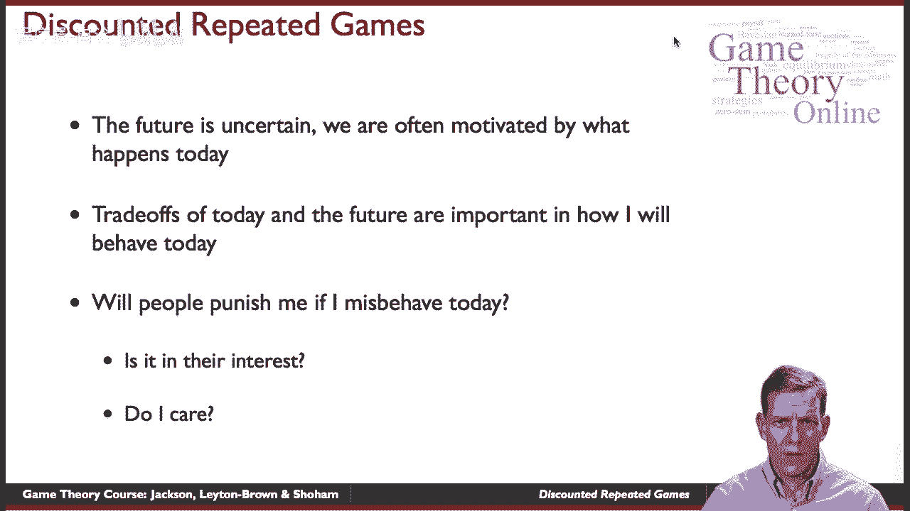

或者只是一点点，所以我们在看一个舞台游戏，所以再一次舞台游戏只是采取正常形式的游戏，随着时间的推移，我们将反复播放，现在每个玩家都有一个折扣系数，所以一号玩家有一个折扣系数，折现系数等于零。

通常我们把βi严格小于，嗯，这样它就更有趣了，如果等于零，那就意味着你根本不关心未来，这基本上只是一个阶段的游戏，所以一般来说有趣的情况是当玩家关心未来时，但他们更关心今天而不是明天等等在这些游戏中。

人们在有共同折扣因素的情况下看待它，所以每个人都有相同的折扣系数，在某些情况下，这将使事情变得相当容易，然后打折的想法是，那么你从一系列行动中获得的回报，所以动作的简介，一个人演奏，嗯，第一期。

牙齿期的一个T，等等，你只要把这些收益加起来，但现在你用指数递减函数对它们进行加权，也就是T的次方的折现因子，所以如果我在乎，你知道我得到，如果这个回报是每天一个，我今天会得到一个，加九点。

加八点加七点二，等权利，所以这就是我的想法，好的，所以嗯。

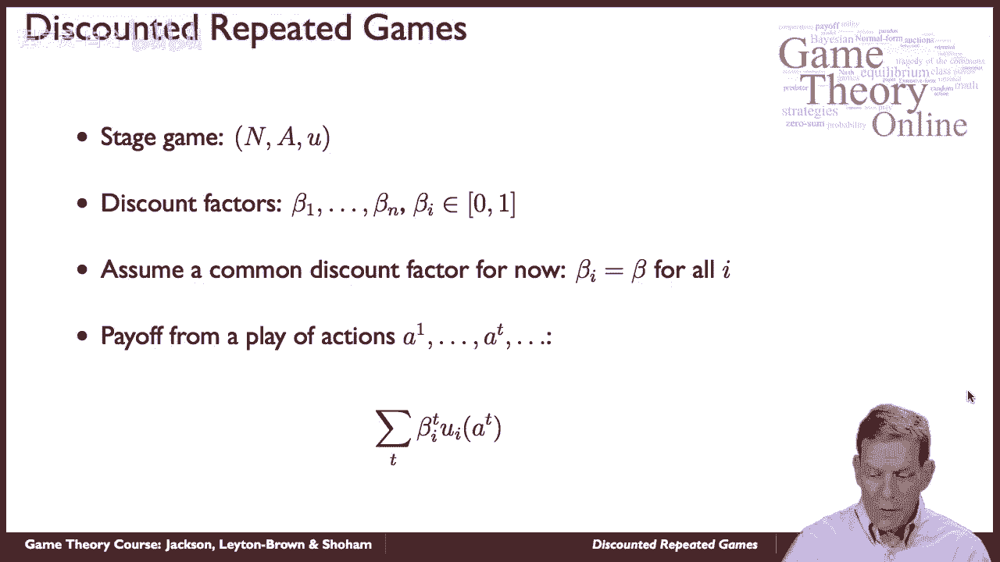

当我们再看这些游戏的时候，球员可以根据过去的历史来调整他们的比赛，所以一段历史，一定长度的有限历史，它只是一个清单，列出了每次约会发生的一切，所以在这里，1等于每个球员在第一阶段所做的事情的简介。

所以在我们第一次玩这个游戏的时候，大家都做了什么，通常每个人都会在时间上做T对吗，所以我们有，从1到n，所以这些东西是向量，他们告诉我们在第一阶段每个人都做了什么，每个人在第二节课都做了什么等等。

然后我们可以谈论所有有限的历史，所以我可能面对的所有可能的历史，当我玩这个游戏的时候，我要考虑的所有事情，我该怎么办，如果发生这种情况，我该怎么办，如果在无限重复的游戏中发生这种情况，我有所有这些历史。

我该怎么处理每一种情况，所以策略是一张地图，从每一个可能的到一个可能的混合策略，在给定的时间里我能做什么。

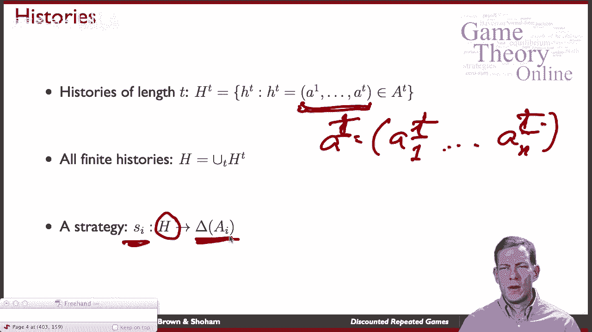

面对给定的历史，所以如果我在看囚徒困境，在特定的时期内，人们可以合作或叛逃，所以如果我们在考虑长度的历史，三，一种可能性如下，我们在第一节课都合作过，可能二号玩家在第二节叛逃了。

然后他们两个在第三节都叛逃了，所以这将是一个可能的历史，然后他们可以说，好的，现在我们在第四节课要做什么，嗯，也许过去的就让它过去吧，试着恢复合作，也许我们会叛逃，我们互相生气，谁知道呢，好的。

所以第四阶段的策略是你在看到。

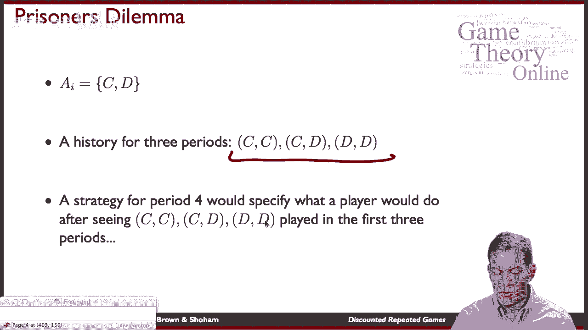

呃，前三个时期的不同历史，所以子游戏再次完美，和平时一样，纳什在每个子游戏中的策略简介，这里的子游戏是什么，子游戏只是在某个时期开始，谈论剩下的东西，所以它必须是一个纳什均衡，遵循每一个可能的历史。

从那一点开始，必须永远是纳什，所以现在的策略将是我们在每种情况下都会做什么的具体说明，然后我们在每个历史上都有纳什，有一件事要检查，这里重要的是反复玩舞台游戏的纳什均衡，嗯。

所以只要找到一个静态的纳什均衡，它是如此，例如，缺陷，囚徒困境中的缺陷，永远演奏下去，不管过去发生了什么，它总是会是完美的子游戏，所以对于每一个可能的历史，每个人都会这么说，他们将永远玩纳什均衡，嗯。

你可以检查这是一个子博弈完美均衡，对呀，这将是纳什在每一个可能的子游戏，所以检查一下，如果其他人都这么做，我不想偏离，所以稍微想想这其中的逻辑，因为有很多可能的子游戏需要考虑，但你可以说服自己那是真的。

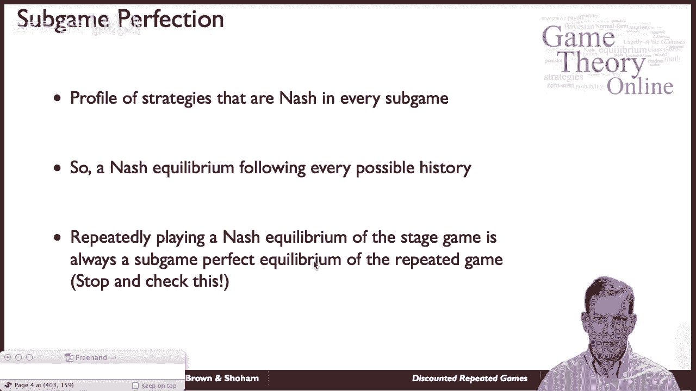

好的，所以解决了反复的囚徒困境，让我们现在在折扣的背景下稍微考虑一下，所以让我们假设我们要做的是，我们希望保持合作，对呀，所以我们得到了标准的囚徒困境，把合作的报酬放在这里，你叛逃5个零。

和另一个合作的人，如果你们都叛变了，还有一个，所以静态博弈的唯一纳什均衡是有收益的缺陷效应，一个，我们要支持三三，如果我们能这样合作，只要过去每个人都有，和未来永远的缺陷，如果有人偏离，所以说。

什么时候达到平衡，如此清晰，那是不平衡的，所以如果我们设置嗯测试版，我对两个玩家都等于零，我们不能把这件事做好，因为我不在乎未来，没有人关心未来，那么我们最终在每个时期都只有缺陷效应，作为唯一的子游戏。

完美平衡，玩家只关心现在，他们总是会近视缺陷，他们不关心未来，所以什么都行不通，所以这里的问题是，对于哪些测试版，我们可以维持这种策略，也就是只要大家有，如果我们，如果合作破裂，那我们就说算了吧。

我们会永远叛逃。

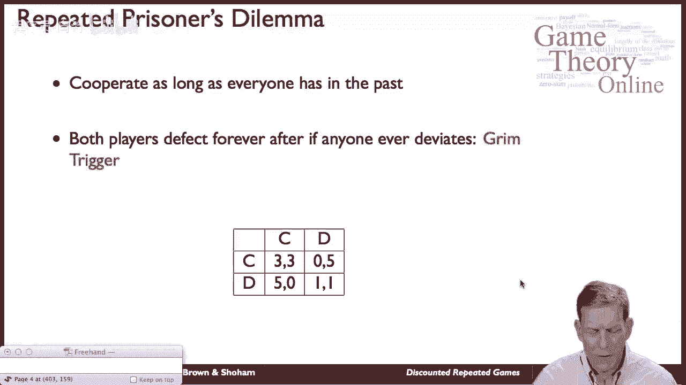

让我们看一下，所以如果你合作，嗯，和其他合作的玩家，如果过去没有人不合作，我们得到了什么，我们永久得到三个，对呀，所以我们得到三加贝塔乘以三，所以现在采取一个共同的折扣因子，贝塔平方乘以3。

第三个周期的β-立方，以此类推，永远如此，如果你记得你的级数之和，这就是，也就是3/1减去β，好的，如果我叛逃怎么办，人们在玩这种可怕的触发策略，嗯，其他人都很合作，对方在第一阶段的合作。

所以我要设法从合作变成叛逃，第一节课我得五分，但他们会看到的，下一个时期他们对此做出反应，他们叛变了，他们说每个人都会永远叛逃，在那之后，我们就永远得到了一堆正确的，那么我们得到了什么。

我们得到5然后贝塔乘以1贝塔平方以此类推，如果你记得这里的级数和，这只是贝塔乘以1加上贝塔1等等，这是贝塔乘以1/1减去贝塔，所以如果我偏离了，发生的是在第一个时期，我得到了收获。

但后来我在接下来的时间里输了，所以有一个权衡。

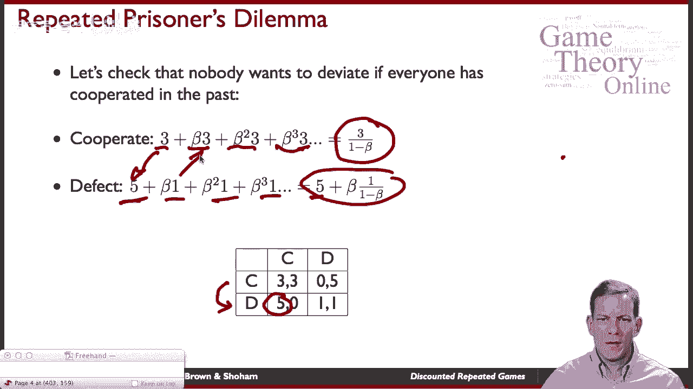

折价的大小取决于折现系数的大小，所以我们得到了这两种不同的收益，我们可以看看这些之间的区别，嗯，如果我继续合作而不是叛逃，我放弃到今天，我可以叛逃，但我保留了未来合作的好处，这样我就不会毁了事情。

这意味着我得到了一堆两个，以后的临时演员，所以当你看着这个，它的值是贝塔乘以2/1减去贝塔，减去今天的2和4，只要这不是负面的，我什么时候想继续合作，对呀，这就变成负数了，那我今天更糟了，通过合作。

我还不如叛逃，所以差异不是负的，如果贝塔大于1，-贝塔或者基本上贝塔必须大于或等于，所以如果你只是通过解决这个不等式的代数，你会得到大于等于一半的贝塔，所以只要人们关心明天，至少是今天的一半。

他们会愿意在这方面合作的，在反复的囚徒困境中，我们之前看过的这些特定的收益，所以当我们看这个的时候。

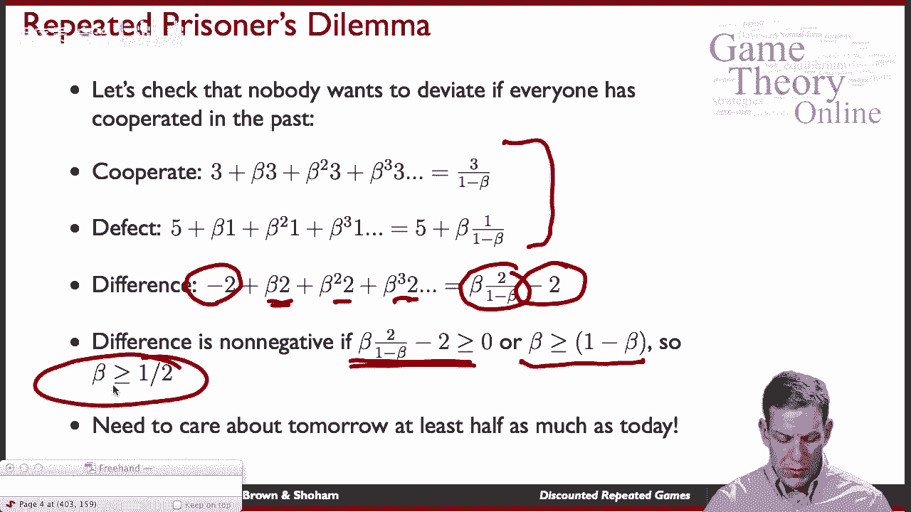

这个收益，这里的回报结构，那么我们就有了一个情况，贝塔必须是贝塔，如果每个beta i至少是一半，那么他们就可以在这方面保持合作。

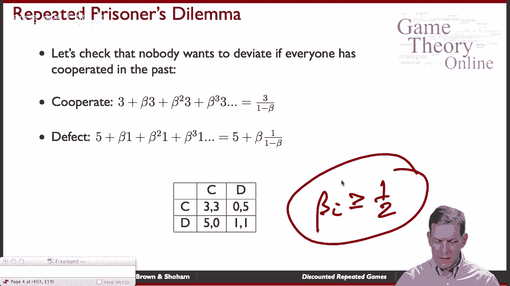

有限重复的或无限重复的囚徒困境。

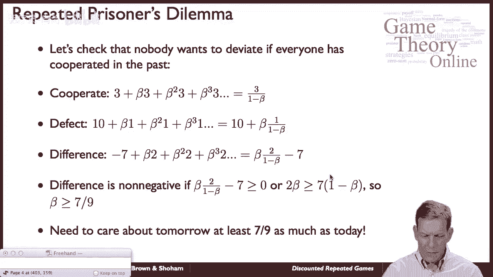

好的，所以让我们呃，稍微改变一下数字，看看会发生什么，所以现在，让我们嗯，试着让叛逃更有吸引力，所以叛逃值十个而不是五个，所以现在叛逃看起来真的很吸引人，嗯，必须发生什么。

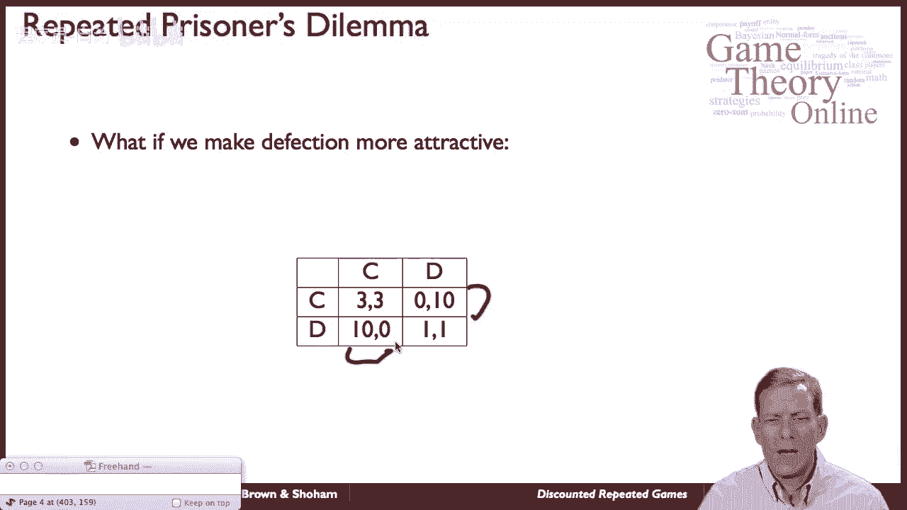

我们可以进行与刚才相同的精确计算，但我们只是要改变数字，对呀，所以我们有同样的，如果长期合作的价值是3比1减去贝塔，唯一不同的是我们得到的数字更高，然后我们仍然回到缺陷，当你在这里做差异的时候。

你知道你会得到同样的东西，除了现在，而不是负2，我们得到负七分之差，你放弃了今天不叛变的七个单位，所以当你现在解决这个问题时，测试版必须在至少七个晚上之前，玩家会愿意合作，所以你要关心明天。

至少有今天的七个晚上，所以你可以看到这里的基本逻辑，对呀，所以明天的惩罚和今天的好回报是有权衡的，某物是否能作为一种平衡结合在一起，它将由什么决定，我们要知道，未来有多大，与现在，叛逃有多诱人。

相对于当前，的，我们目前在做什么，嗯，威胁有多大，那么有多糟，如果我们将来诉诸于什么，就交易而言，这有多糟糕，所有这些都很重要，在团结方面，在这类环境中的合作，这又回到了我们早些时候讨论的，说欧佩克。

对呀，嗯，你有多在乎未来，你的测试版是什么，会有什么反应，如果我开始抽更多的油，他们会有什么反应，他们是否会开始开采更多的石油并压低价格，这会对我有多大伤害，所有这些都很重要。

它们决定了一个平衡是否能保持在一起。

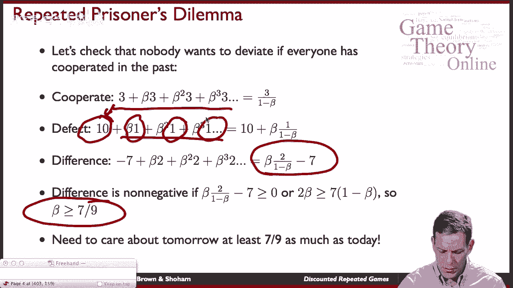

好的，所以基本逻辑起作用的是收益相对较高的东西，即使它不是静态博弈的均衡，你可以维持它，嗯，你通过惩罚来维持它，如果有人偏离，你诉诸于收益较低的东西，至少对那个球员来说，重要的是这一切都必须可信。

必须是子博弈中的均衡，为了使其发挥作用，必须是未来较低的收益就足够了，确保你，你知道你。

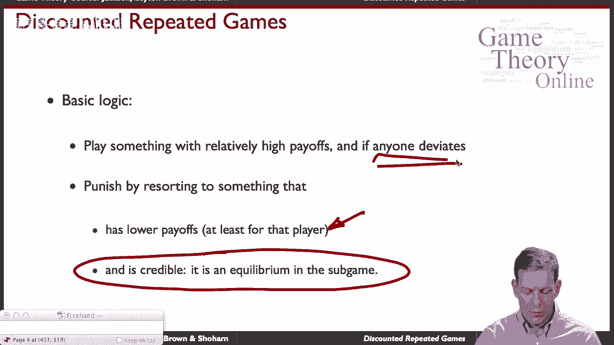