# 【斯坦福大学】博弈论 （全） - P41：【斯坦福大学】博弈论（40）折扣重复博弈的一种民间定理 - 自洽音梦 - BV1644y1D7dD

嗨，伙计们，让我们来谈谈一个民间定理，现在为一个打折的重复游戏，所以我们在有折扣因素的情况下，人们更关心今天而不是未来，比明天等等，我们想思考逻辑的扩展，我们刚刚在一些例子中经历了。

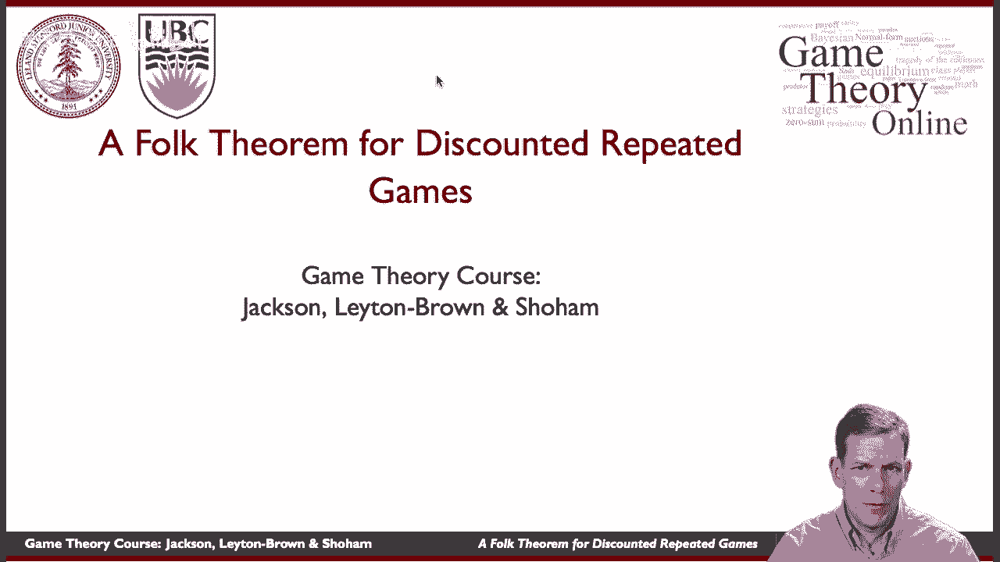

但看看这是否适用于重复游戏的一般环境，那么民间定理是什么呢，重复游戏的延伸是什么，所以采取正常形式的游戏，所以民间定理实际上有很多版本，我们会做一个非常特别的，我认为这背后的基本直觉。

一个相当简单的证明，所以这个想法是我们在看舞台游戏的纳什均衡，所以来一场舞台游戏，查找配置文件，这是舞台博弈的纳什均衡，然后也寻找一些替代策略，这里有几个错别字，应该是最好的，所以寻找一些替代策略。

一个质数，这样每个人从质数中得到的回报严格高于质数，其中A是纳什均衡。

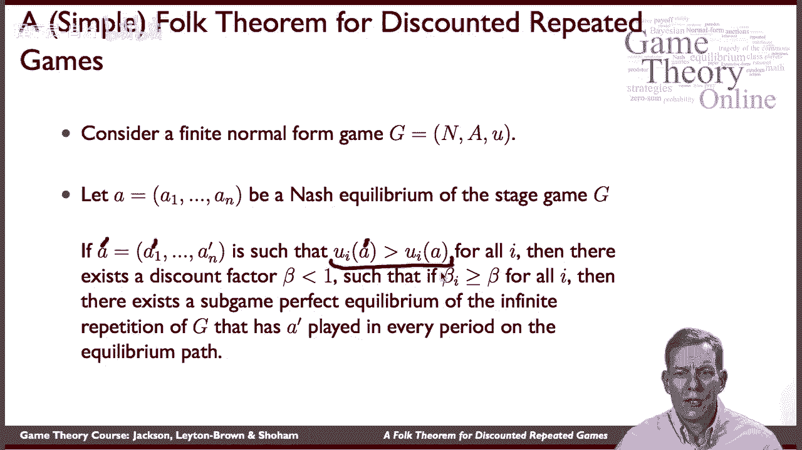

那么在1以下存在一些折现系数，如果每个人都有高于这个水平的折现系数，那么就存在一个子博弈，有素数的博弈无限重复的完美均衡，在平衡路径上的每个周期都玩，所以这告诉我们的是。

是我们在这两个囚犯困境例子中所经历的逻辑，我们发现折扣率是一半或至少七个9，等，嗯，接受任何游戏，嗯，找到一个纳什均衡，然后找到比那更好的东西。

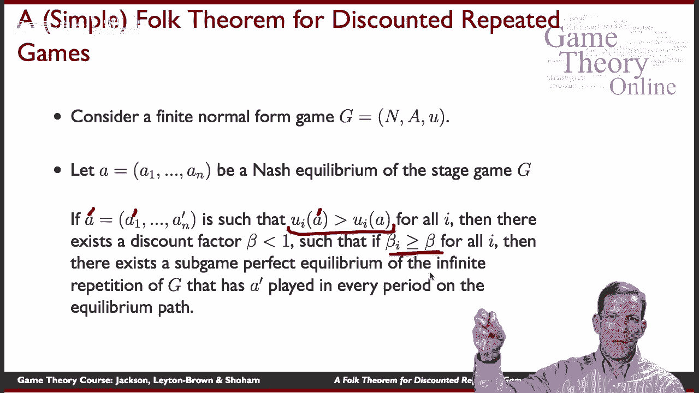

你想在无限重复的游戏中维持，你可以做与我们在这些例子中所做的相同的逻辑。

在一般情况下，在那里会有足够高的折扣系数，使其可持续发展，好的，基本上这个定理的证明，与我们在这些例子中所经历的非常相似，所以这个想法是，你知道只要每个人都玩，我们就玩质数，如果有人偏离了这一点。

然后我们将进入一个可怕的触发，我们只是威胁要永远玩纳什均衡，在这之后，我们的收益比质数低，我们只需要确保人们足够关心未来的损失，为了抵消今天比赛的收获。

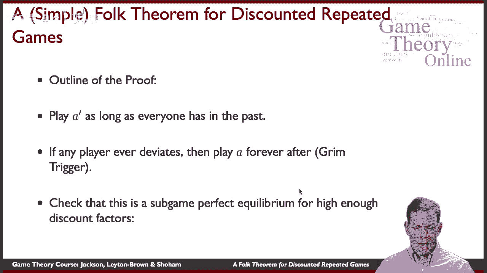

所以在证据方面，这是一个足够高的折扣因子的子博弈均衡，我们有什么要做的好玩一个永远，如果大家，从来没有人偏离过，是一个子游戏的一部分，完美的延续，如果我们有偏差。

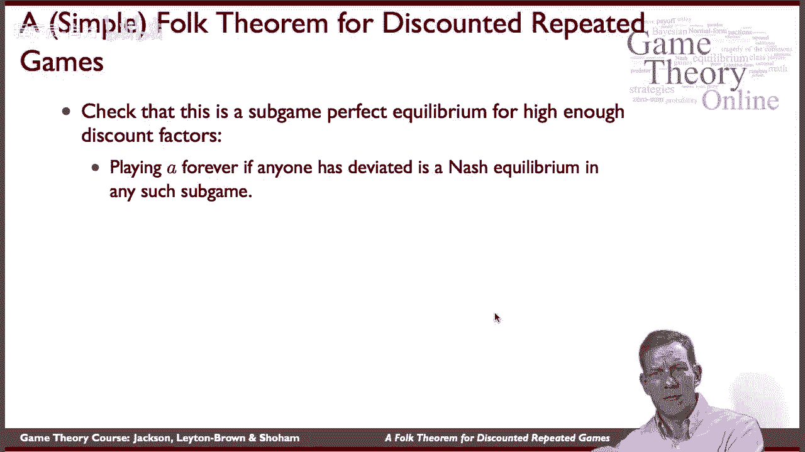

因为每场比赛都是纳什，嗯，所以我们需要检查一下，会有人想偏离质数吗，如果过去没有人，我们可以绑定增益，所以增益的上限是所有玩家的最大值，以及所有可能的偏差，他们可以从中获得最好的收益和回报。

所以这给了我们最大可能的收益，um每期损失的最短期限，所以这是他们从今天开始能获得的最大值，我们将与他们从明天开始可能损失的最低限度进行比较。

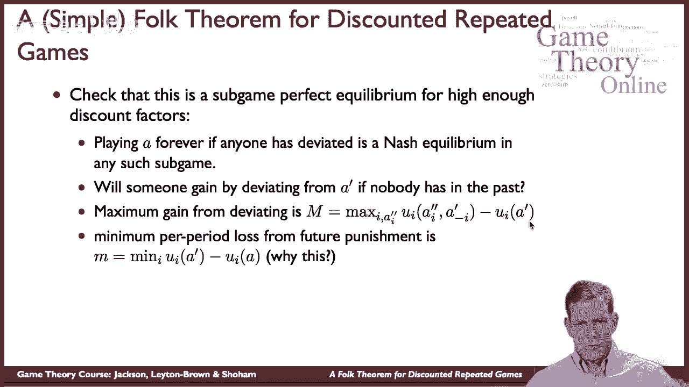

所以他们可能损失的最低限度是得到一个质数，而不是一个质数，他们要去一个嗯，就是这样，取不同玩家之间的最小值，一个问题是为什么。

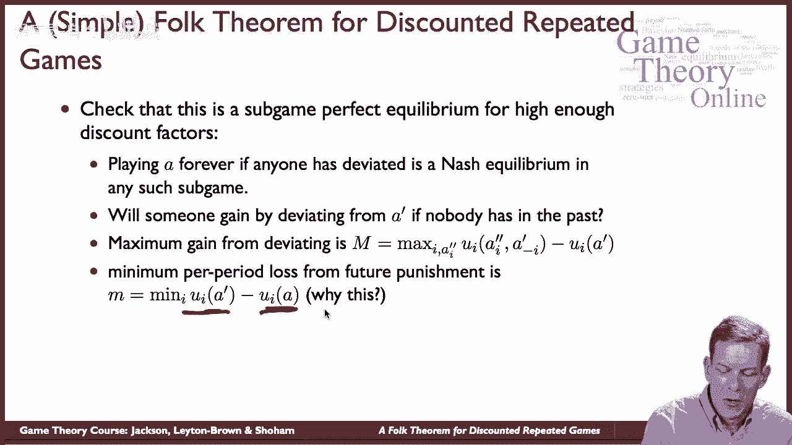

这里的问题是，你知道的，呃实际上是相对于纳什均衡的最小值，或者他们会得到所以稍微考虑一下，嗯，为什么他们不想在未来改变纳什均衡，对呀，所以他们的想法是，他们将无法帮助自己，通过试图改变惩罚。

因为这是纳什均衡。

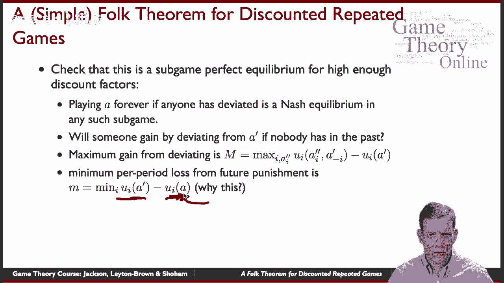

所以他们已经得到了最好的回报，如果其他人执行惩罚，所以我们有最大可能的游戏，尽可能小的损失，所以如果我偏离了，考虑到其他球员的所作所为，总体上可能的最大净收益为，我今天要得M，但在未来的明天。

我可能会失去我，我将来至少会失去M。

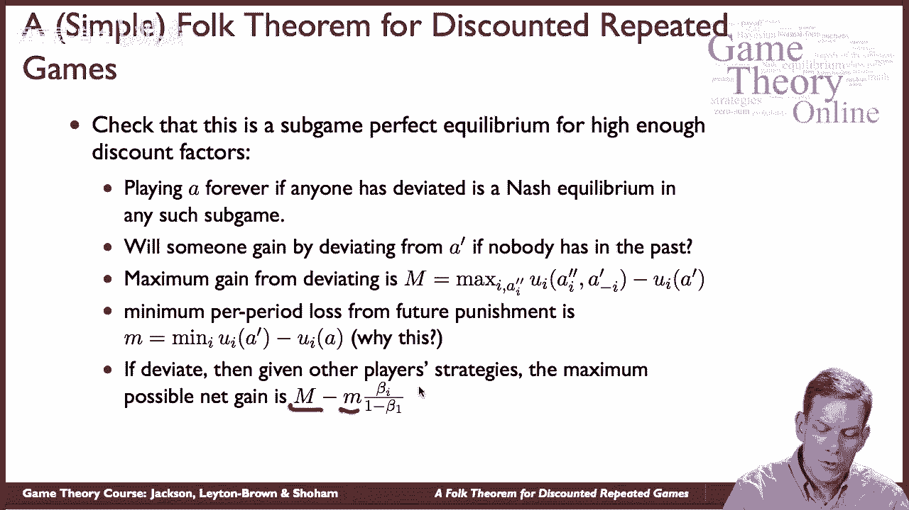

这应该是一个I，我们得到了βi除以1减去βi如果你继续，你知道，设置这必须是非负的，嗯，抱歉必须是负面的，这样玩家就不想偏离。

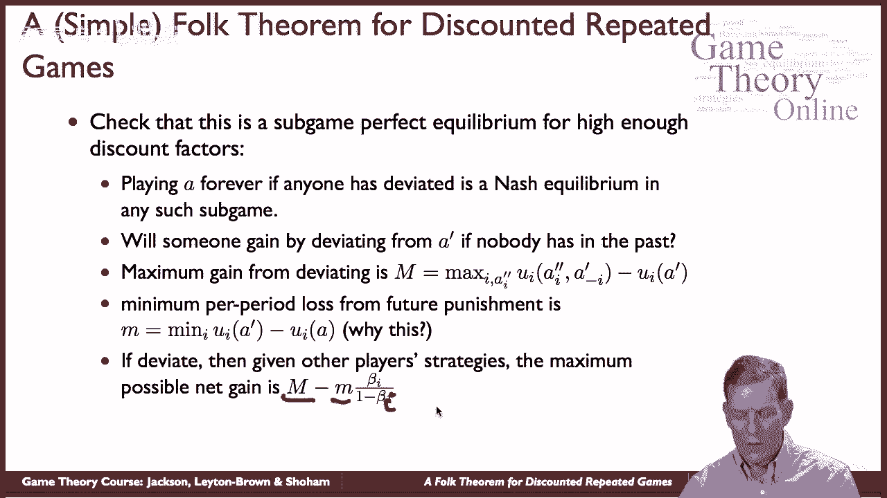

那么我们需要什么，我们需要，m小于等于这个，所以m除以m小于等于βi除以1减去βi。

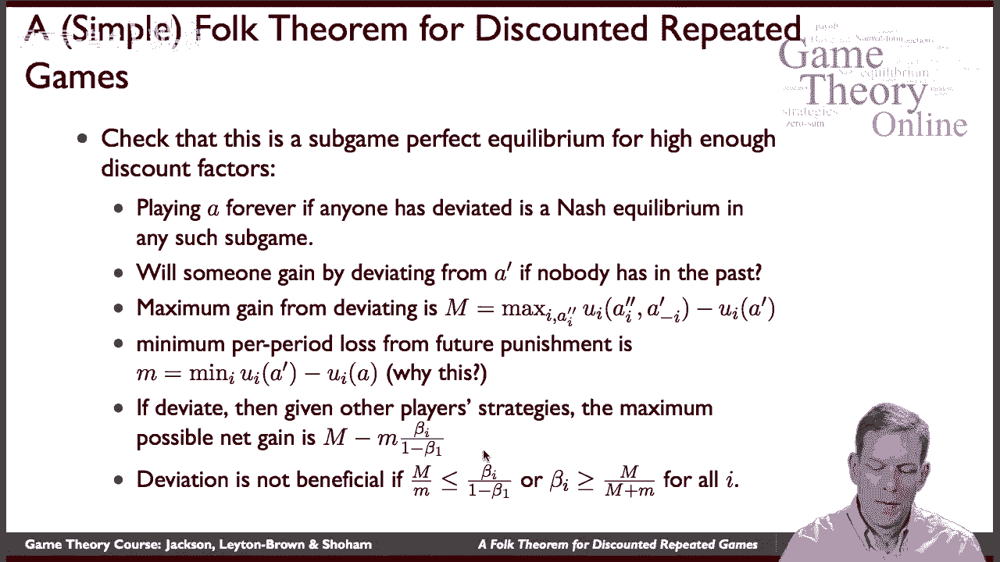

这给了我们一个beta i的下限，它必须至少是m/m加m，所以这不是一个严格的下限。

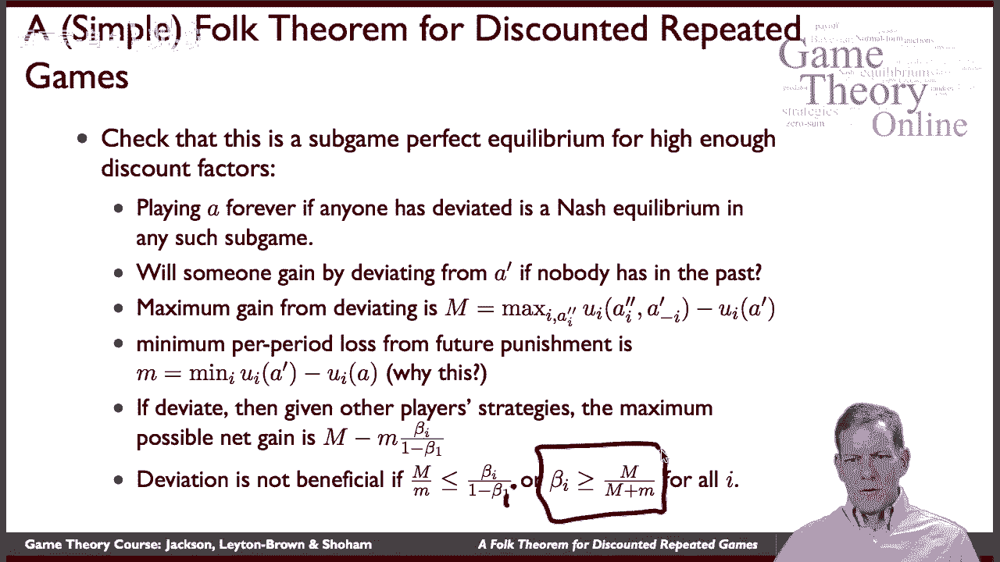

从某种意义上说，我们在这里有相当宽松的界限。

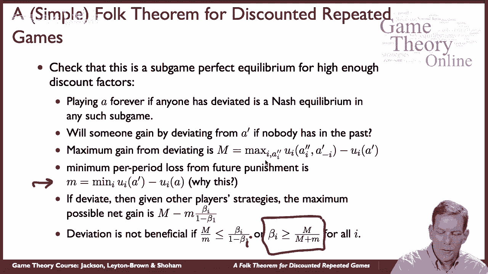

但如果每个人都有足够高的折扣系数，然后你就可以持续合作。

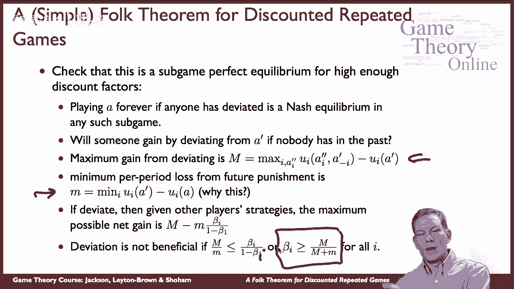

所以这只是我们之前看过的例子的一个简单的概括，它向我们表明，我们可以保持合作，在无限重复的设置中，嗯，这是提供的，人们对未来有足够的耐心，现在这上面有很多铃铛和哨子。

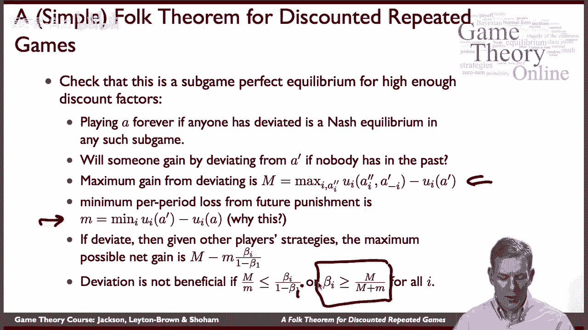

嗯，要考虑的一件事，嗯，你可以，你可以维持相当复杂的游戏，如果你愿意的话，让我们来看看比赛，我们之前看过的，所以囚徒困境，但现在我们从偏离一件事中得到了非常高的回报，你可以注意到这里是收益的总和。

球员加起来得10分。嗯，如果他们合作，他们总共只得到六个，所以在这里玩这个让其中一个玩家过得很好，所以如果他们永远玩这个，他们得到了三个三个，假设他们尝试做以下事情，他们说在奇怪的时期会播放CD对吗。

所以在一、三、五等时期，我们将由第一个玩家合作，另一个的缺陷，所以第二个玩家在这段时间里会得到10分，然后我们再玩，会在偶数周期内反转，所以现在，大致平均，玩家每人得到五个，而不是每人三个。

所以我们要做的是，我们轮流，只要我们继续遵守这些规则，我们很好地做到这一点，嗯，那么在未来，嗯，只要大家都这么做，我们会继续做下去，如果有人偏离这一点，那我们就去投诚，缺陷。

你可以检查看看你需要什么样的折扣因素，然后嗯，第一个玩家需要不同的折扣因素吗，玩家在第一阶段获得CD，而不是第二个玩家，等等，所以你可以通过，实际上，例如，嗯，你知道的，想象一下，你有一个情况。

你有公司竞标政府合同，他们在重复，你知道随着时间的推移，他们会反复这样做，他们可以这样做的一个方法是说，好的听着，我们可以相互竞争，每天出价很高，或者必须出价，你知道每天给他们政府一个低成本。

如果有采购合同，但他们可以说，好的，你看，今天我会让你赢得合同，你明天让我赢，我们只是交替，只要我们继续合作，我们不会互相竞争，我们将享受高回报，嗯，但如果它崩溃了，然后我们要回到比赛中，事实上。

有一些不同的案例有一些证据表明公司会倾向于这样做，试图玩弄系统，增加回报，所以你可以看到这种逻辑和必须是真的，为了实现这一点。

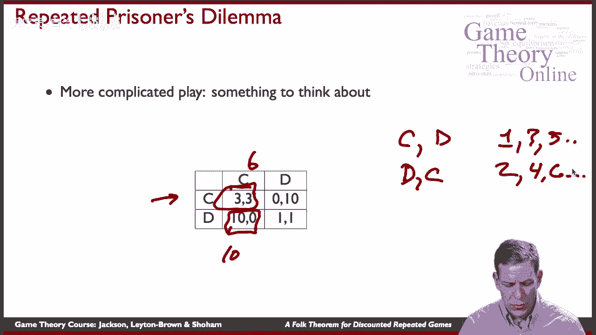

好的，如此重复的游戏，玩家可以根据过去的行为来决定他们未来的游戏，让他们以他们不能的方式对事情做出反应，在静态游戏中，它在博弈中产生新的均衡，民间定理，部分是指这些已经被知道了很长时间。

民间传说和博弈论在它们被写下来之前，嗯，在这些事情中有许多均衡，它们是基于关键成分，观察其他玩家的行为，能够对此做出反应，并且在未来有足够的价值，要么通过作为极值的手段的限制，或足够高的折扣系数。

让玩家真正关心未来，现在重复游戏实际上是最近一个相当活跃的研究领域，关于这些还有很多其他有趣的问题，如果你不总是看到其他球员做什么会发生什么，你只看到，有时事情会有一些噪音。

如果随着时间的推移有不确定的收益会发生什么，我们的收益是不同的，嗯，所以有一系列的问题，也有像重新谈判这样的问题，你知道这里的逻辑是可以的，如果我们任何人偏离了，然后我们就会永远进入一个糟糕的平衡。

所以假设发生了这种情况，有人偏离了，然后我们，你知道，大约几个周期后，我们说，嗯，这有点傻，为什么我们，让我们回到最初的协议，让我们把过去的事忘掉吧，所以我们可以做得更好，从头开始，对呀，好的，嗯。

那太好了，困难在于，如果我们现在相信，如果我们偏离，最终我们会被原谅的，那就改变了整个游戏的本质改变了一开始的激励，所以融入这种逻辑是相当复杂的，和另一个研究领域，在这些如此重复的游戏中非常有趣。

它们有很多应用程序，他们有一些有趣的逻辑，有时你可以保持合作或比在静态环境中更好的回报，有时候你不能。

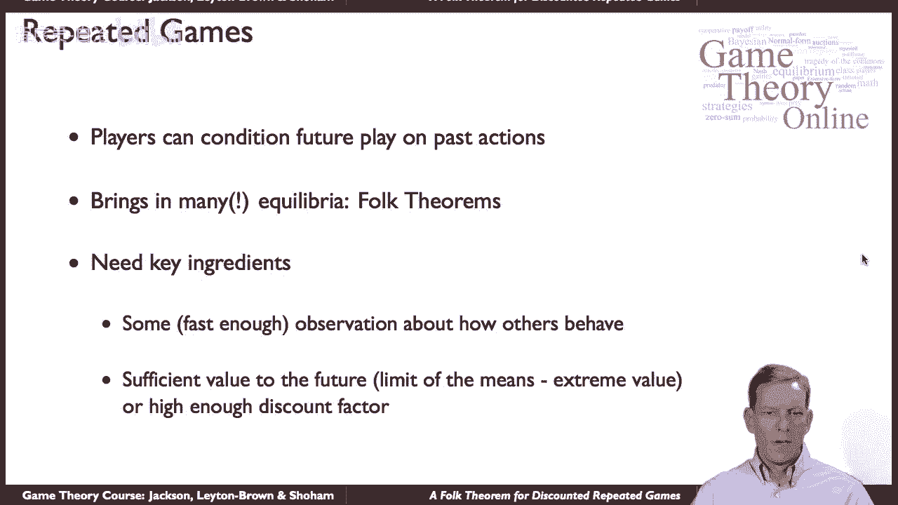