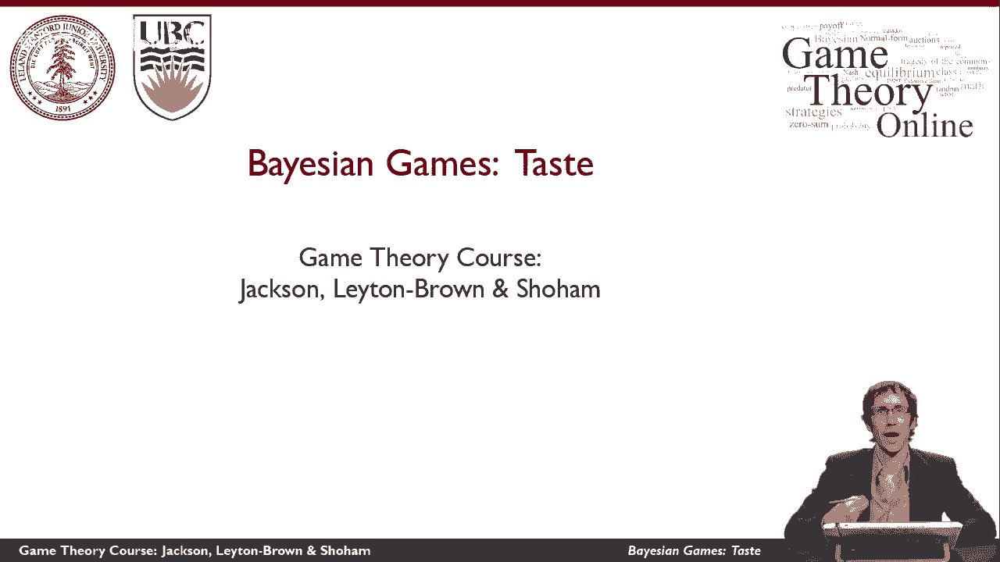
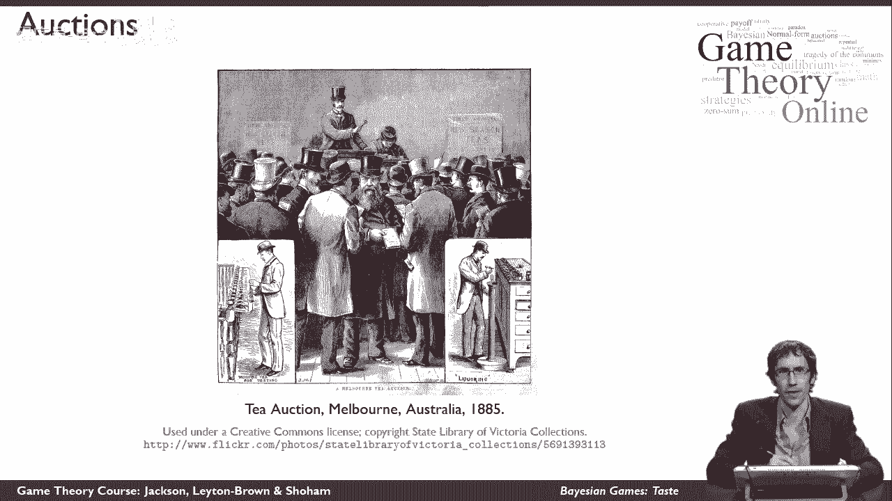
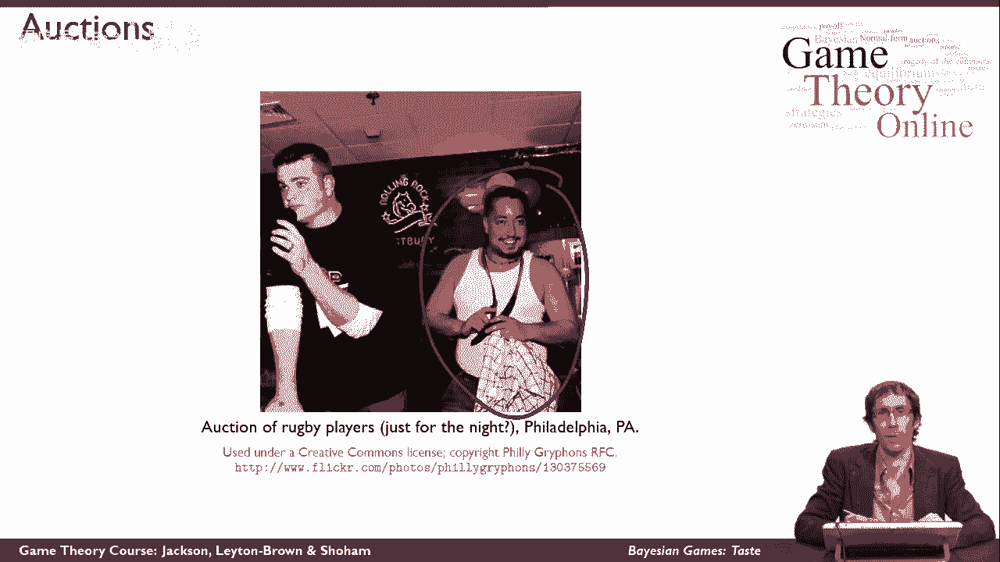
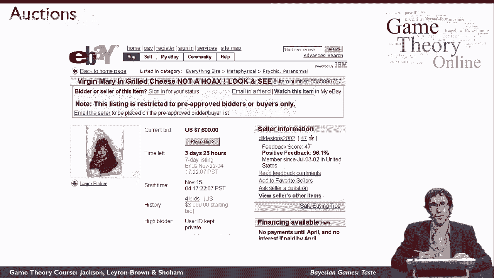
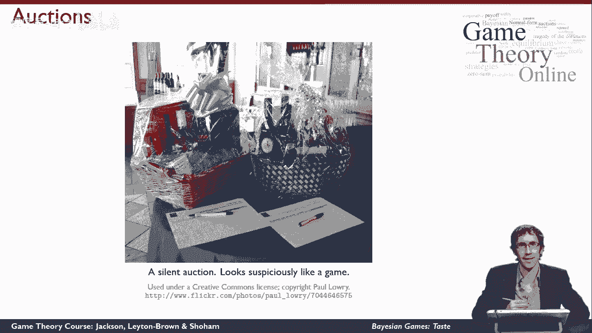

# 【斯坦福大学】博弈论 （全） - P42：【斯坦福大学】博弈论（41）贝叶斯博弈基本定义 - 自洽音梦 - BV1644y1D7dD

这个视频将有助于介绍贝叶斯游戏的想法，这是一种新的游戏表示。

所以在这里我想考虑一下拍卖，当我们考虑拍卖时，我们想到了1885年的木刻，展示澳大利亚墨尔本T的拍卖，我们有一个戴大礼帽的人站在房间前面，他手里拿着木槌，他说话的声音可能很滑稽，在某个时候。

他敲响了木槌，有人刚刚赢了一堆茶，但拍卖是一件非常实际的事情，他们在世界上真的很重要，它们被用来做很多不同的事情。

这里有一个更现代的拍卖例子，你可以看到这是2000年的8场拍卖会用来卖鱼，因为鱼变质快，价值变化快，所以找到一种方法来确定什么是很重要的，价格应该是逐日的，这是美国的拍卖会，s，法警服务，所以美国。

元帅，有一群戴着牛仔帽的家伙，把这个人的马围捕起来，然后把它们卖掉，再收回一些被挪用的钱，你可以看到为什么拍卖可能会在这里使用，因为像马这样的东西的价值很不清楚，这取决于供求，它依赖于无形的东西。

就像马的价值，特定时间市场上其他好马的数量等等，又有一场拍卖，这是橄榄球运动员的拍卖，大概只有有限的时间，你可以再次看到为什么拍卖可能需要使用，因为很不清楚这家伙会值多少钱。

当然啦，这是几年前在eBay上发生的一场著名的拍卖，是一种情况，佛罗里达的一个女人正在吃烤奶酪三明治，她为自己做的，你可以在这里看到它的照片，她咬了一口，然后她惊讶地发现了她认为是完美的相似之处。

圣母玛利亚的，在，烤奶酪三明治上烧伤痕迹的形状，所以她很惊讶，她认定这是宗教遗物，她不吃三明治了，就像任何人都会做的那样，如果他们发现了上帝的征兆，她把它发布在eBay上卖给出价最高的人，这有点有趣。

因为它很荒谬，还因为它展示了互联网是如何允许拍卖的，在以前根本不存在的地方创造市场，所以如果这发生在互联网之前，似乎很明显，这个女人会很难，为她的烤奶酪三明治找买家，但你可以看到当我拍这张截图的时候。

拍卖还有将近四天的时间，最高出价已经是七千六百美元，这真的不是个骗局，这是一次真正的拍卖，新闻报道了这件事，这真是件了不起的事，它展示了拍卖在撮合买家和卖家方面的力量。

这是最后一张拍卖照片，我想给你看，这就是所谓的无声拍卖，在慈善拍卖中，那么是怎么回事，这里有那里，所以这里有一个礼品篮出售，所有有兴趣购买它的人，能够上去检查它，决定他们认为这对他们来说值多少钱。

然后他们写出价，他们写上自己的名字和愿意支付的金额，在这张纸上，这里，我认为无声拍卖特别有趣的原因，我们真的可以看到这看起来像一个游戏，我们这里有一个很好定义的动作空间，你来了，你看着这张纸。

你可以看到在你之前移动过的球员的动作，然后你采取一个行动，选择写下一个数字，在最后，你大概不会写下一个数字，比礼物篮对你的价值还高，在最后，如果你有最高的数字，你赢得了礼品篮，你意识到一定程度的效用。

这取决于从你的角度来看礼物篮有多好，就是你写在那张纸上，大概少一点，你得到的差异是你玩游戏的效用，所以这一切看起来都像是，我们可以在这门课的背景下建模，如果我们意识到我们可以这样模拟无声拍卖。

我们可能会看到，我们可以模拟其他选项，我刚才也用这种方式描述了，然而，无声拍卖的案例确实有一些关键之处，这与我们在本课程中已经讨论过的游戏不同，那就是当我想对其他人在这场比赛中的表现进行推理时。

我需要想想他们认为礼品篮对他们来说值多少钱，这将是非常重要的事情，他们在游戏中选择的行为方式。

至关重要的是，这将影响它们的效用，这不是我所知道的，所以这是一个案例，我不太确定其他玩家的效用函数是什么，即使在我可以想象游戏中所有动作的情况下，所以这是一个不同于我们以前看过的环境。

希望你能看到这对于建立拍卖模型是非常必要的，这对拍卖来说是非常重要的，我不是很确定，这件物品对拍卖的所有其他参与者来说值多少钱，这个事实对我在拍卖中的战略推理非常重要，这种不确定性，效用函数的不确定性。

