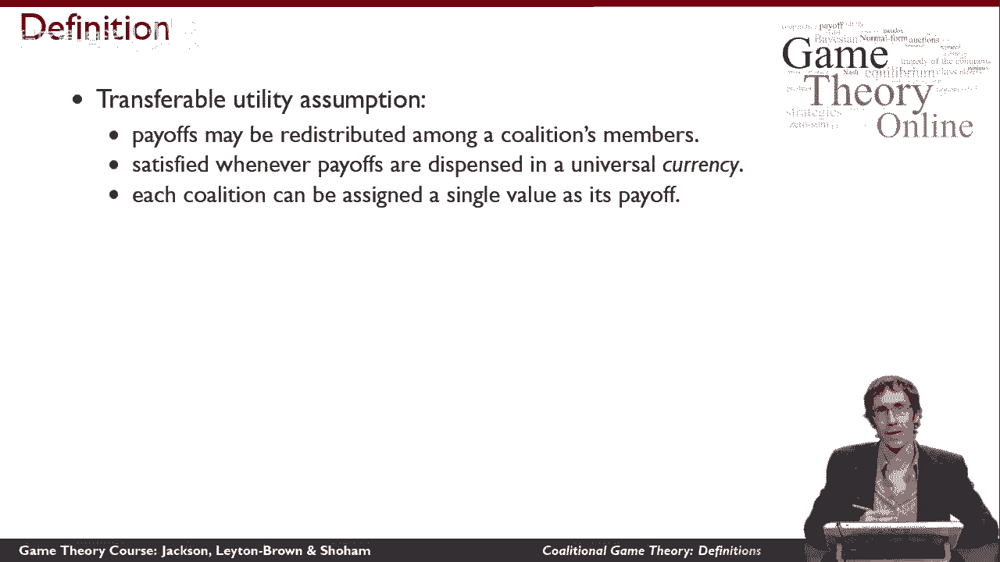
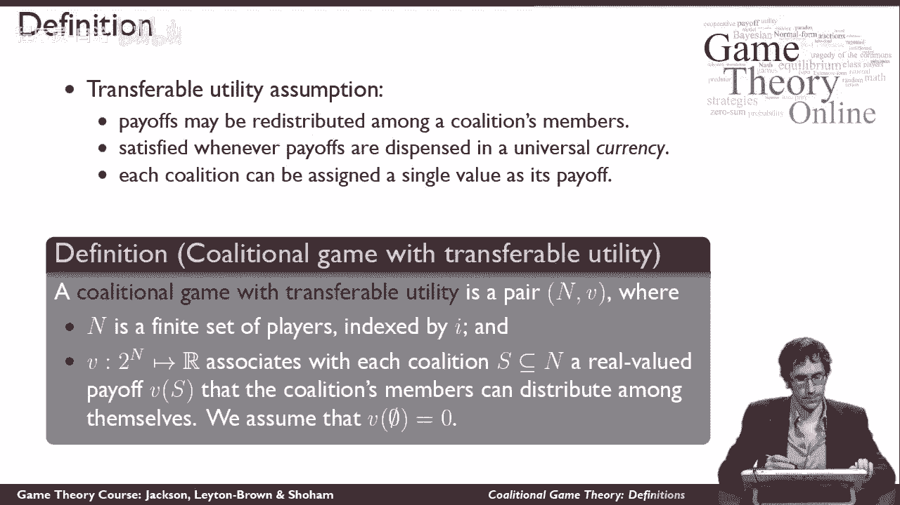
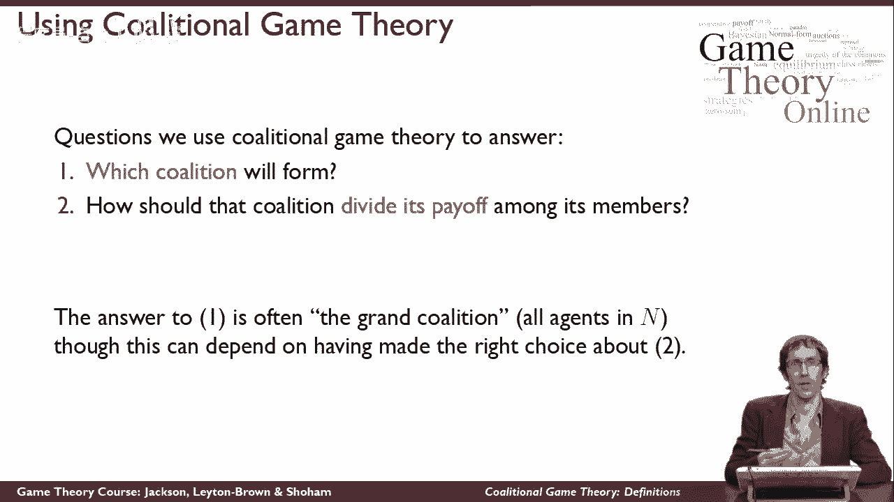
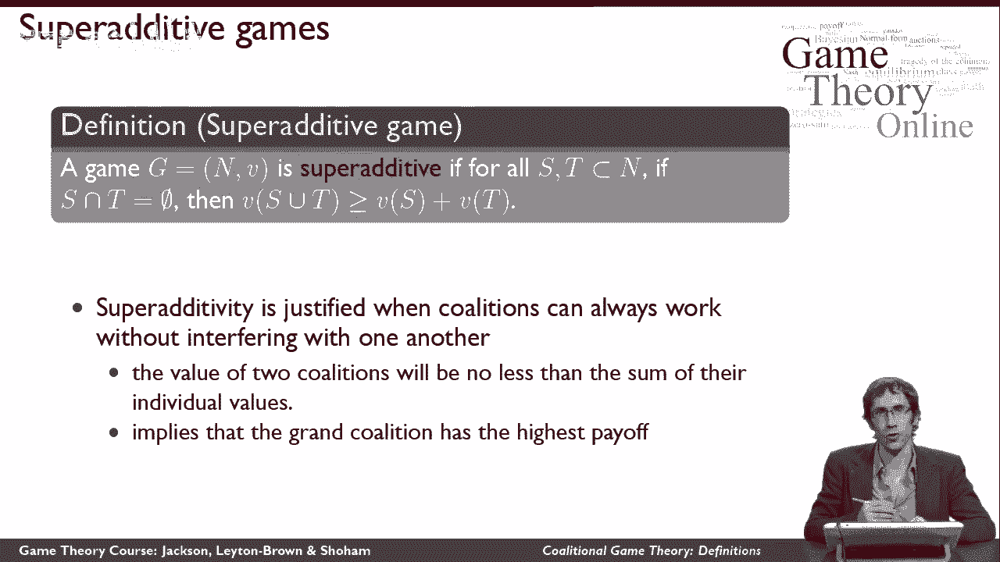
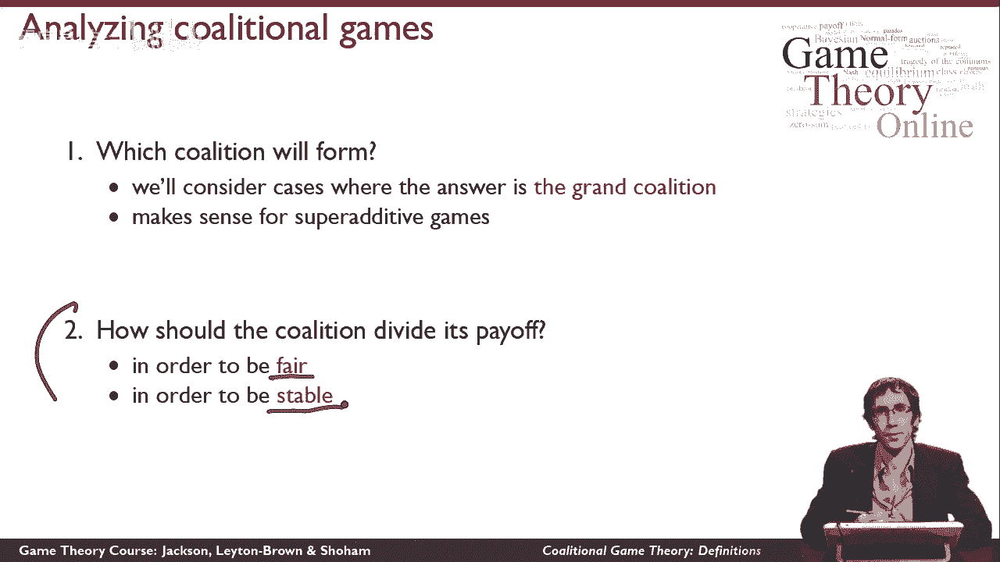

# 【斯坦福大学】博弈论 （全） - P49：【斯坦福大学】博弈论（48）合作博弈定义 - 自洽音梦 - BV1644y1D7dD

这段视频将定义联盟游戏并解释它们的用途，所以联盟游戏，不像我们到目前为止谈到的非合作游戏，不要对采取行动的单个代理进行建模，相反，他们认为一群特工一起行动，这个想法是我们考虑一组代理。

并询问可以形成什么联盟，哪些代理群体可以选择一起工作，为了做到这一点，我们要定义，每一组不同的代理人现在能为自己做得有多好，特别是，在联盟游戏中，我们不会考虑代理人是如何单独划分的，联盟内部的工作。

或者它们是如何相互协调的，为了组成联盟，我们将把所有这些都视为给定的，相反，想想联盟是如何做的，他们能获得什么样的回报，我们将从一个叫做可转移效用的假设开始，这个假设意味着，有可能，为了联盟。

重新分配价值，它能够在其成员中任意实现，所以说，比如说，如果联盟得到了它的金钱价值，就有可能把这笔钱分了在成员之间支付额外的费用，以任何方式一般，这个假设意味着，我们将能够分配一些单一的值。

作为联盟的回报。

并相信它可以在成员之间任意分配，在这个假设下，以下是我们如何定义联盟游戏，联盟博弈有两个部分n和v，和以前的模型一样，n只是一组有限的参与者，当我们想谈论片场中的单个玩家时，我们会再次用i索引这个。

v的作用类似于联盟博弈的效用函数，上面写着，对于玩家的每一个子集，It’如此，对于每一个联盟，这可能会形成，包括游戏中的所有玩家，回报是什么，联盟能实现的V，还有这个，当然啦。

将允许联盟在其成员之间分裂，我们将做一个归一化假设，即空集的值为零。

我们想用联盟博弈论问两个典型的问题，这两种基本问题，首先是组建哪个联盟是有意义的，想在这场比赛中组建哪个联盟，其次，一旦我们知道哪个联盟会形成，联盟应该如何将其收益分配给联盟中的所有人。

现在我们不会花太多精力去思考第一个问题，通常情况下，答案是所谓的大联盟，也就是说每个人，所以通常所有的代理人都会同意一起工作，然而，有时是为了保证这是真的，我们必须小心考虑联盟将如何分配其收益。

在其成员中，特别是，这里有一个游戏可以帮助我们思考第一个问题，我们说联盟博弈对所有联盟对都是超级附加的，s和t都是n的严格子集，如果这两个联盟之间的交集为空。

这意味着这两个联盟涉及不同的完全不同的代理人，那么如果我们建立一个新的联盟，把这两个联盟结合在一起的联盟，这个更大的联盟的价值至少是，就像两个联盟的价值之和一样大，所以换句话说。

如果我用两个独立的联盟组成一个更大的联盟，那个更大的联盟的价值总是，至少，一样大，作为值的和，这两个独立的联盟能够靠自己，这个假设是有道理的，如果联盟有可能总是在不相互干扰的情况下工作。

这通常是我们在联盟游戏中做出的假设，注意，这个超级加法假设意味着所有收益中最高的，至少每周最高的收益是由大联盟实现的，所以当我们考虑一个超级附加游戏时，人们很自然地认为大联盟会想要组建。

在回答我之前谈到的第一个问题时，我们倾向于假设大联盟形成，我们将集中讨论第二个问题，联盟应该如何分配其回报，有理由怀疑我的意思，当我说它应该如何分配它的回报时，这取决于联盟试图实现什么。

我们将考虑两种不同的方法来回答这个问题，首先是它应该如何分配回报，如果它所关心的是公平，其次，相反，我们可能会想知道它应该如何分配它的回报，如果它关心的是稳定，我们的意思是每个人都愿意组成联盟。

而不是组成更小的联盟，因为他们可能会为自己实现更高的价值。

