# 【斯坦福大学】博弈论 （全） - P4：【斯坦福大学】博弈论（3）定义游戏 - 自洽音梦 - BV1644y1D7dD

嗨，伙计们，欢迎回来，这是马特·杰克逊，我们现在谈论的是定义游戏，我们将研究关键成分的一些基本定义，在游戏中。

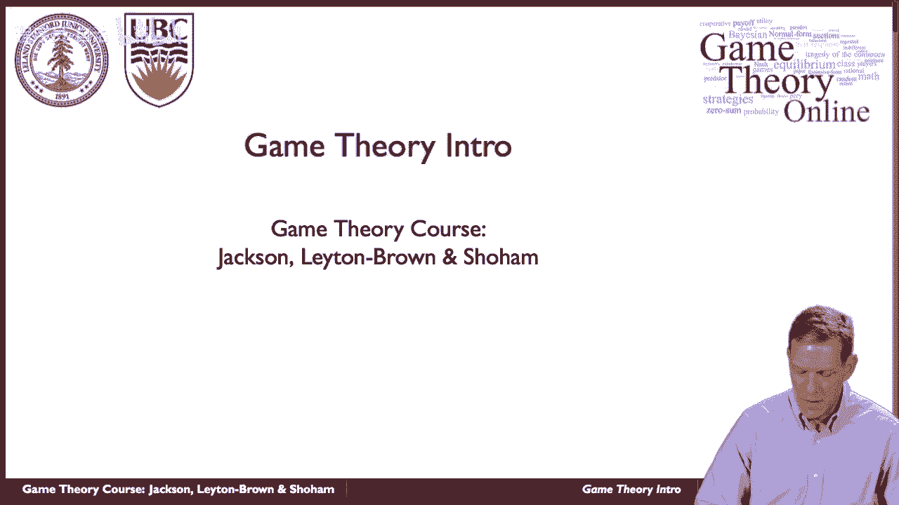

所以让我们来看看其中的一些，所以很明显，其中最明显的是游戏中的玩家，那么谁来做决定，他们是人吗，我们说的是政府就贸易协定进行谈判吗，我们是在说公司选择开发新产品的策略吗，嗯，我们做什么。

我们想深入到为公司内部的人建模的地步，与整个公司相反，所以这整个，关于我们将如何选择球员，有一系列的问题，但他们是，在我们接下来要做的事情中。

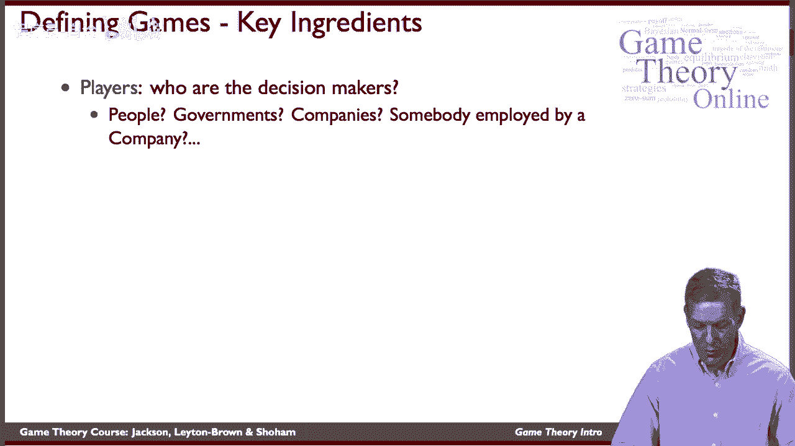

我们必须决定如何模拟行动，那么可以玩什么，玩家实际上可以采取什么行动，所以说，在稍后的课程中，我们会看到拍卖，他们会出价的，这样他们就可以进入一些投标，当我们谈论讨价还价时，当我们考虑投资时。

可能是投资者在决定，买多少股票或卖多少股票，何时买卖，他们应该如何应对市场上的其他人，他们应该如何根据价格做出决定，嗯，他们怎么投票，所以会有一系列的行动，我们要小心确保我们有必要的行动，建模的，收益。

那么是什么激励着球员，他们只是关心某种利润吗，他们关心其他球员吗，嗯，那么他们如何获得效用作为什么的函数，在游戏的背景下，动作会导致什么。

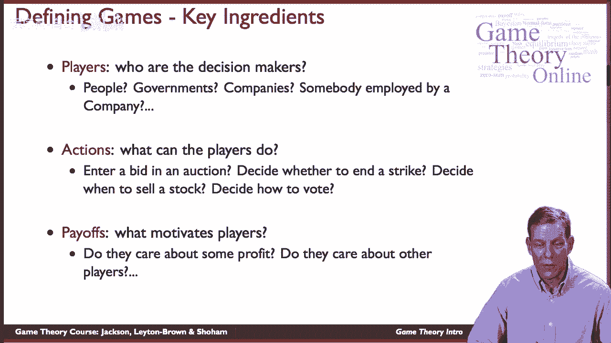

所以游戏基本上有两种标准的表示，一个是所谓的正常形式，这就是我们将在课程中开始的，它所做的是，这是一个非常简单和赤裸裸的游戏表现，所以它列出了玩家获得的收益作为他们行为的函数，嗯，通常情况下。

它被认为就像玩家同时移动一样，但是策略，我们会更详细地讨论这个，它可以编码很多东西。

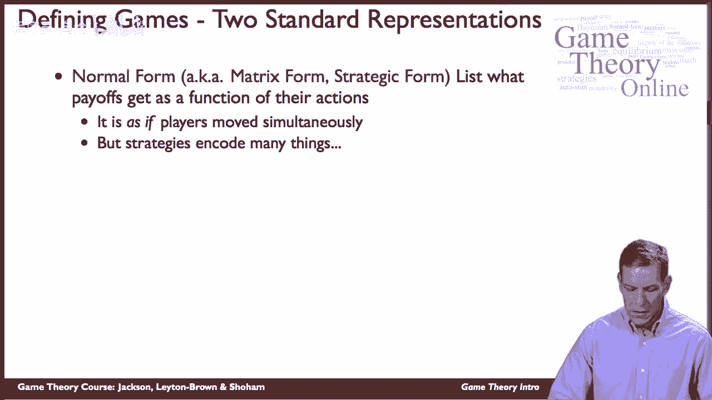

所以另一种可供选择的表示是所谓的扩展形式，所以谁在，什么在什么时间点，所以它将经常被表示为一棵树，所以说，例如，在国际象棋中，一个玩家先动，白人玩家一般先行动，黑色玩家可以看到移动。

另一个玩家对此做出反应等等，因此，它将更好地表示为一棵树，而不是正常形式，有人先动，他们打赌，嗯，但另一个玩家只看到赌注，而不一定是另一个玩家看到的牌，在某些情况下，我们会有顺序游戏。

玩家在不同的时间点会有不同的信息，我们也想讨论明确的建模，所以我们将从正常形式开始，然后我们将在课程的后面转移到扩展形式。

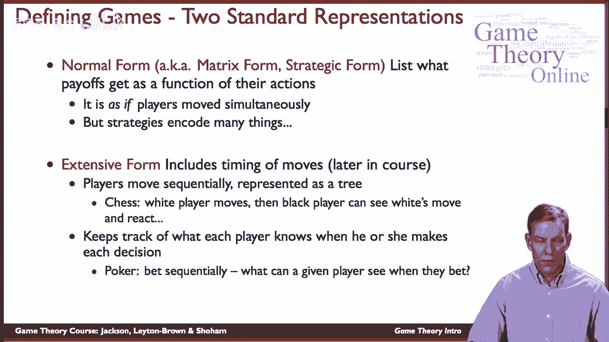

我们将更详细地讨论这两者之间的关系，好的，所以正常形式的游戏，主要成分是什么，嗯再次，玩家，所以我们要有，一般来说，我们要考虑有限的玩家集，所以从1到n的小n将代表玩家的集合，一般来说。

我们会用一个i来索引这些东西，所以我们用一个小i来表示，普通球员，嗯，玩家的动作设置，嗯，将由一个子代表，我没事，所以我们让它代表参与者i的动作，然后我们将讨论行动的概况。

这只是每个玩家正在做的事情的列表，例如，他们是，与其他玩家合作或不合作，例如，在，在我们将要讨论的囚徒困境中。

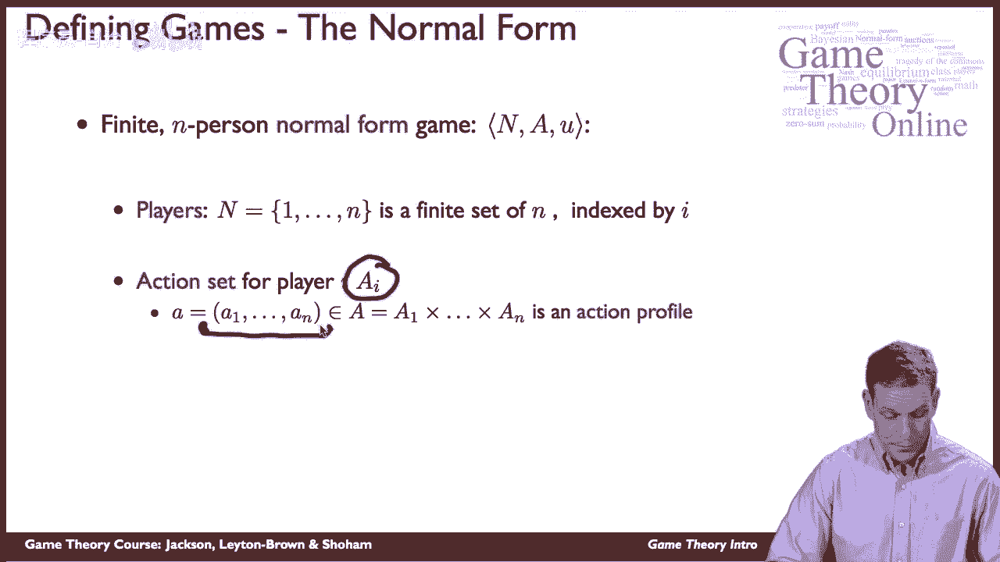

效用函数是一个支付函数，它指示所有正在播放的动作的函数，不同参与者的收益是什么，所以对于每个玩家我，我们最终得到一个函数，它告诉我们他们如何评估游戏的结果，以及他们如何评价这些东西，可以封装很多东西。

这将是非常重要的，以确保我们，我们得到了，呃。

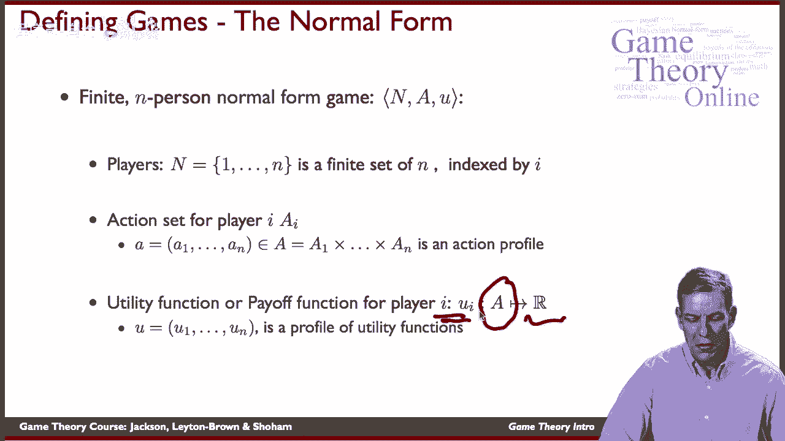

真正激励人们的正确表现，好的，当我们代表正常形式的游戏时，非常简单的做法，这只是在矩阵表示中，所以让我们看看这个，非常简单游戏的最标准表示，将两人游戏写成矩阵，所以我们会有一个玩家，一个将是行玩家玩家。

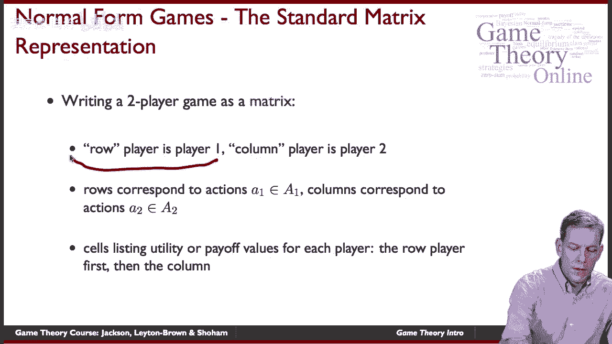

两个将是一个专栏玩家，所以他们会选择将在矩阵列中表示的动作，单元格内的单元格将代表收益。

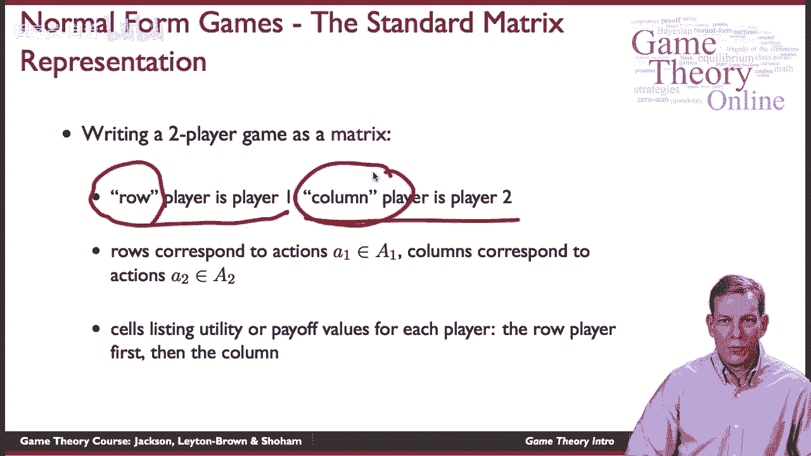

所以说，例如，在，可以写成如下矩阵，所以角色扮演者可以选择C或D，这是一号玩家的选择，通常称为行播放器，我是二号玩家，纵队球员，他们的选择，然后在细胞内是不同参与者的收益。

所以如果一号玩家合作二号玩家合作，那么这是两个玩家的收益，第一个收益玩家1，季后赛第二名球员，所以这是给列播放器的，这个要给行玩家，好的。

我们最终，你知道的，例如，如果行播放机选择D，列播放机选择C，然后我们在这里得到回报，对行播放机为零，对列播放机为负4，所以矩阵是一种很简单的方式来表示所有的啊，正规形式游戏的基本元素。

这样我们就可以准确地跟踪战略互动是什么，玩家想做什么作为游戏的功能，让我们谈谈另一个游戏，我们将无法用如此简单的形式写下，所以让我们想想一个大的集体行动，游戏，所以说，例如。

不管一个人是否想反抗这个政府，所以这里我们有更多的球员，所以让我们想象一下，我们有一千万玩家，所以我们显然不能把它写下来，作为我们屏幕上的矩阵，所以我们可以更抽象地做到这一点，但我们会有一千万玩家。

他们做什么，他们，他们在这里的行动是什么，让我们保持简单，所以他们在这里有一个选择，要么反抗，要么不反抗，所以他们的动作集只是二进制的，两个选择，那么收益将是这个游戏中最关键的事情，嗯，发生了什么好事。

你至少需要两百万人参与，所以在这个特殊的风格化的例子中，我们最终会得到什么，那么我们就可以代表一个成功的反抗，因为玩家得到了一个，所以动作配置文件A的UI等于1，如果这里的人数，球员人数j。

以至于他们选择反抗，这个数字至少有两百万，所以如果我们最终有至少200万人，它得到一个，注意这里这是真的，所以这是一个你关心最终结果的游戏，不一定从参与中获得效用，我们可以改变这种情况。

让人们从参与中获得乐趣，或者直接承担参与费用，好的，那么如果，如果事情失败了，嗯这里，如果我们最终少于200万，那么这取决于你是否参与了叛乱所以如果你，如果玩家，然后他们得到负1的回报。

所以这可能是在他们受到政府惩罚的情况下，他们得到的回报为零，所以他们不是现在真正反抗的人之一，显然这是非常程式化的，但它确实捕捉到了玩家必须战略性地分析和预测，其他玩家会怎么做。

他们的收益不仅仅取决于他们做对了什么，所以在这种情况下玩家的眼睛收益取决于他们是否反抗，但这也取决于其他玩家在做什么，它可以以相当复杂的方式依赖于，游戏中的所有玩家都在做什么。

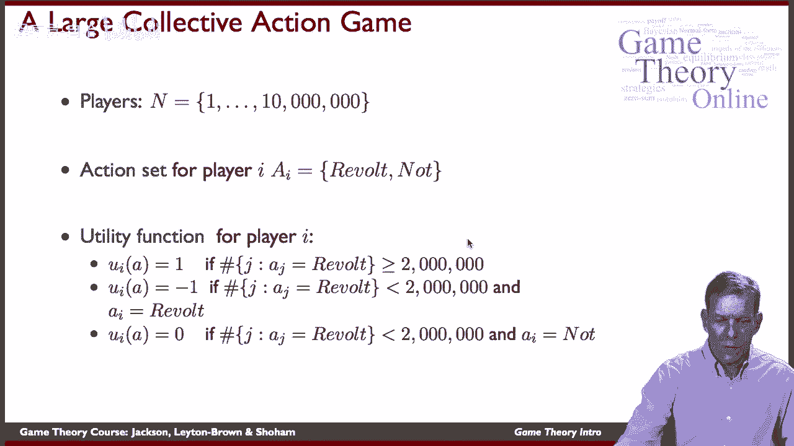

好的，所以总结一下，在定义游戏中，嗯，我们有两种不同的形式，正规形式和广泛形式，现在我们从正常形式开始，关键成分，玩家行为和收益，后来，当我们拿到分机表单时，这将带来时间信息，等等。

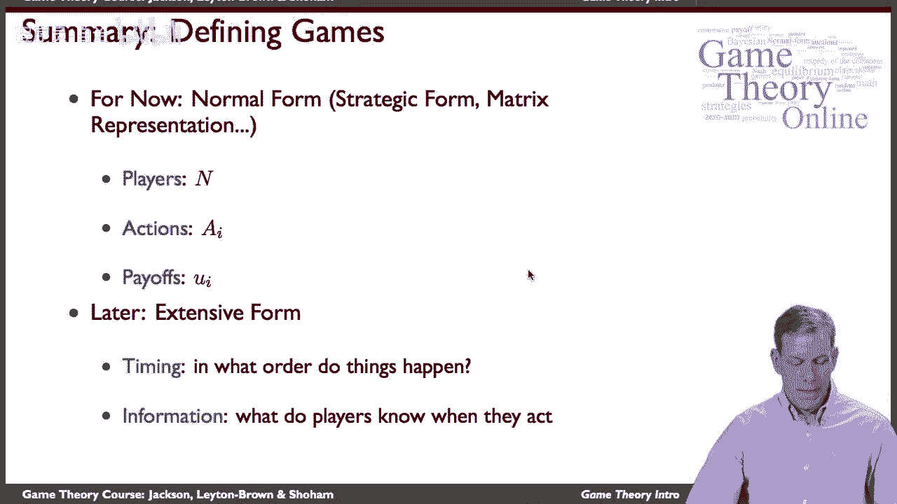