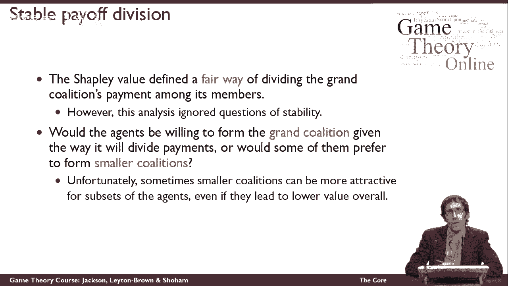
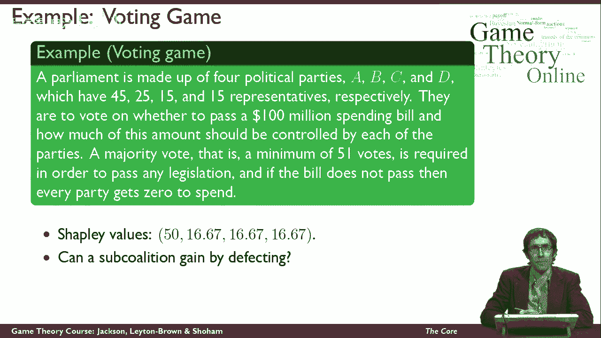
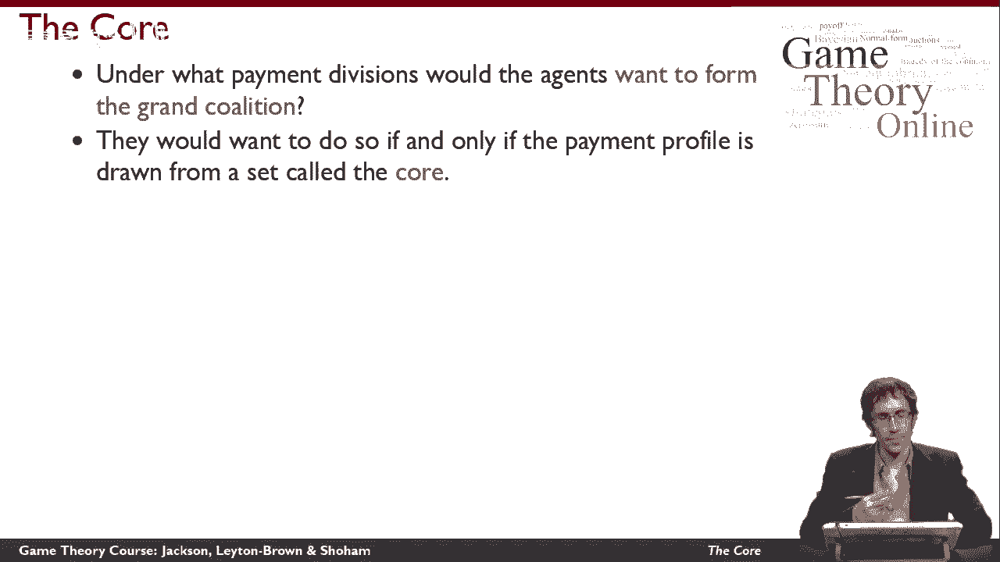
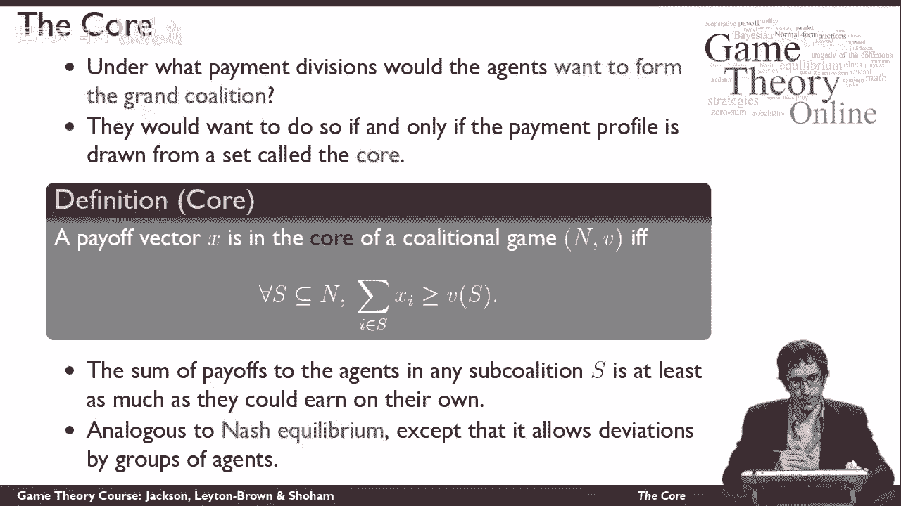
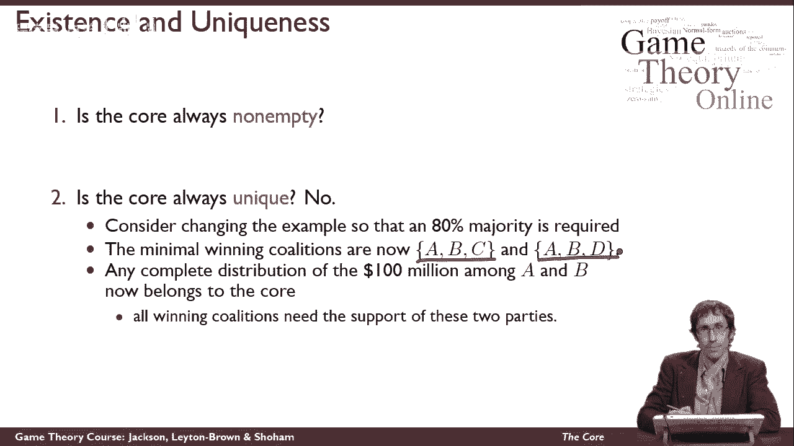
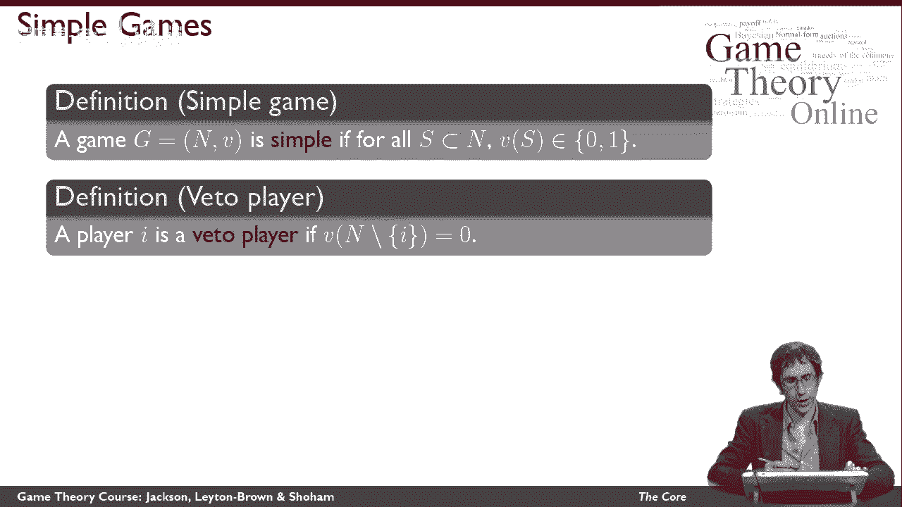
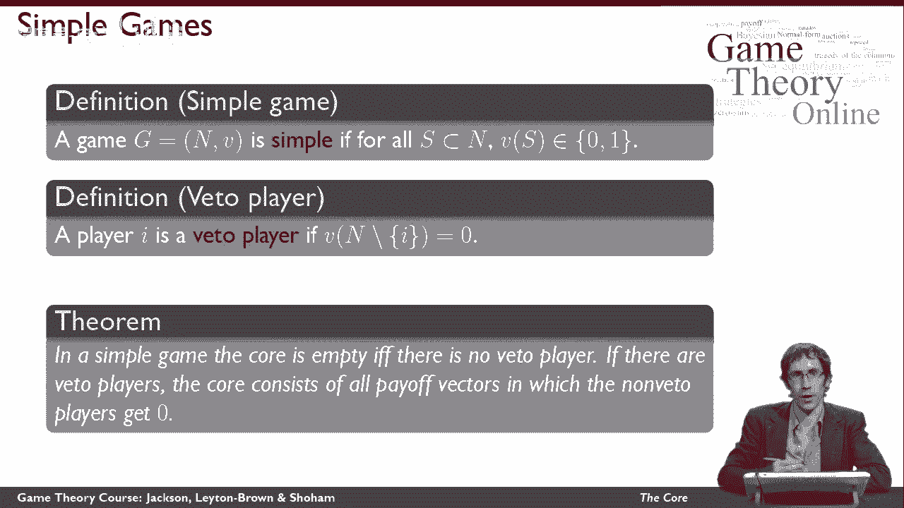
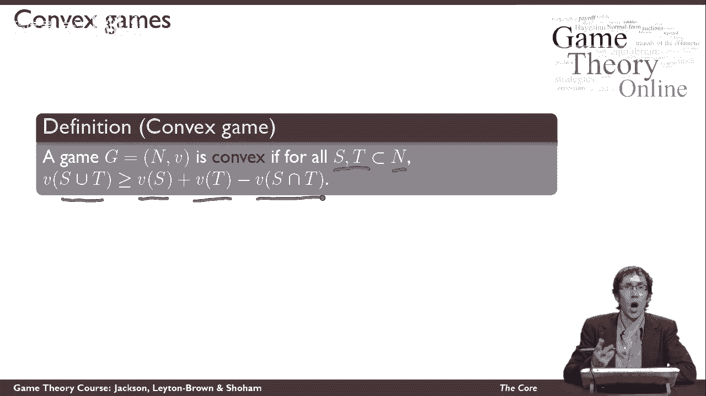
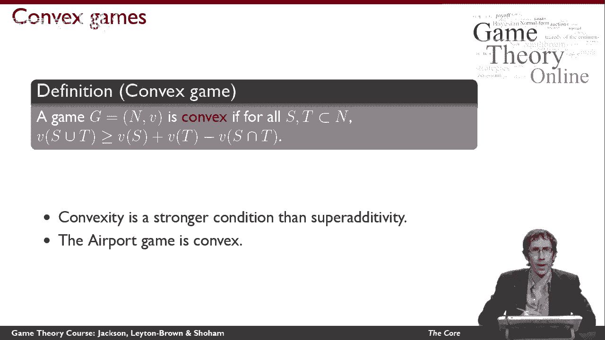
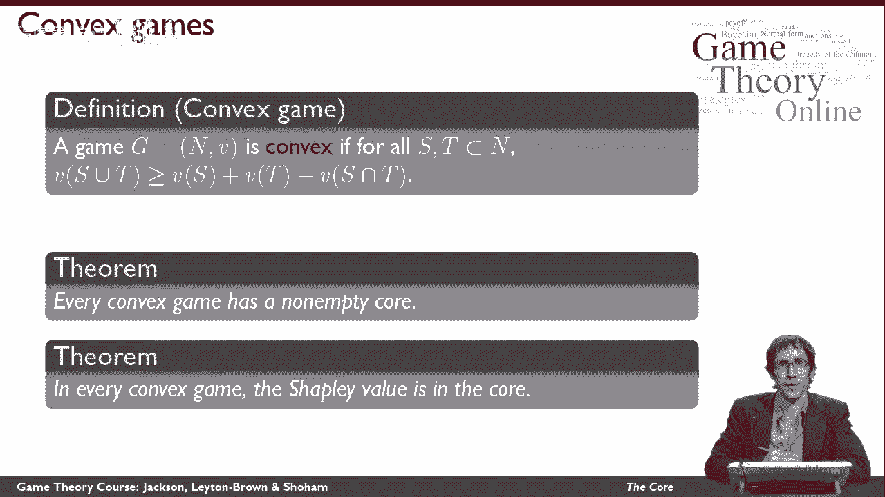

# P51：【斯坦福大学】博弈论（50）合作博弈The Core - 自洽音梦 - BV1644y1D7dD

这个视频是关于联盟博弈论解决方案的概念，叫做核心，召回，沙普利值告诉我们如何公平地分配联盟的价值，在其所有成员中，在这个视频里，我们想考虑特工们是否愿意组成大联盟，与组建较小的联盟相比。

这可能会给他们所有的成员更大的价值，比他们在大联盟中所能实现的要多。

让我们先看一个例子，我们称之为投票游戏，我们将考虑一个由四个政党组成的议会，我们称之为a b，c和d，这些政党在议会中拥有不同数量的席位，四，五个座位，两个，五个，十五和十五，分别是。

政党必须投票决定是否通过一亿美元的支出法案，并在他们之间决定如何在政党之间分配这笔支出，获得多数是必要的，也就是说五票一才能通过任何立法，当然还有，如果法案不通过，那就没有钱让任何一个派对花了。

让我们从沙普利值开始，在这种情况下，我马上就告诉你答案，但你可能想在这里暂停视频，自己锻炼一下，在这种情况下Shapley值是什么，这些是这里的Shapley值，我不会告诉你我们是怎么计算的。

请特别注意，即使B和C和D的票数不同，它们最终在Shapley值中得到相同的值，我今天想重点讨论的问题是，是否有任何次级联盟能通过再次叛逃大联盟而受益，我会请你停下来想一想，在我给你答案之前。

所以答案是一个次级联盟可以获得，特别是A和B一起可以组成一个小联盟，这将比根据沙普利价值支付的大联盟做得更好，所以说，A和B自己有足够的票数通过这项立法，没有c和d的帮助，如果他们把这一亿分给他们自己。

比如说，七十五，两个，五个，那么他们每个人都会得到比他们在Shabley价值划分下得到的更多的东西，他们仍然会通过立法，所以这表明，虽然Shapley值可能是公平的。

他们不一定给所有不同的政党正确的激励，想真正加入大联盟，所以我们应该寻找不同的方法让各方可以分配报酬，这样他们就愿意组建大联盟，这就是我们在这个视频中要思考的问题，在什么支付部门下。

特工们愿意组成大联盟吗，答案，我们将看到他们愿意这样做，如果支付配置文件属于我们称之为核心的集合。

以下是我们如何定义核心，所以我们要考虑一个给定的支付向量，这将是一个一定价值的转让，联盟的每个不同成员，我们要说的是，这个支付载体的核心是，在联盟游戏的核心。

当且仅当以下条件对每一个可能形成的联盟都为真，它是大联盟的子集或等于大联盟，所以大联盟的每一个子集，情况是，对于该子集中的所有代理，如果我们对该子集中的所有代理求和，抱歉，打扰一下。

收益向量所说的收益量，我们给每一个特工，子集中的i，这个总数至少相当于代理应该得到的价值，作为一个联盟，如果他们偏离了，相反，直觉上形成了子集，我们在这里保证的是收益的总和。

对任何次级联盟中的所有特工来说至少是他们能赚的，如果他们真的离开并组成了次级联盟，你可以在投票游戏中看到，这就是我们所看到的没有实现的，那个，我们在Shapley价值支付下支付的A和B的金额。

没有他们能走的那么多，自己得到的，所以如果不存在任何次级联盟，特工们本可以自己得到更多，那么我们的回报向量在核心，直觉上，这就像纳什均衡，因为我们要说的是，代理人没有任何有利可图的偏差，事实并非如此。

任何次级联盟都可能偏离大联盟，最终为自己获得更高的报酬，它与纳什均衡的不同之处在于，我们在考虑一组特工共同偏离，所以从某种意义上说，这是一个比纳什均衡更强的概念，我们在这里不只考虑单方面的偏差。

因此，任何时候向您介绍解决方案概念，有两个问题你应该想知道，第一个问题是解决方案的概念是否总是返回一些东西，纯策略纳什均衡并不总是存在，混合策略均衡总是存在的，所以我们可能会想，核心总是非空的吗。

它是否总是向我们建议至少一个付款配置文件，其次，我们可能会想，核心总是独一无二的吗，当它真的把东西还给我们的时候，它总是返回一件事吗，它是否提出了尖锐的建议，或者它可能会返回多个东西，嗯。

首先是核心总是非空的，不幸的是，这里的答案是否定的，所以说，有一些游戏，其中没有任何稳定的付款可以分配给代理人，我们已经在投票游戏中看到了这一点，能够通过立法的最低限度联盟是一个，b，a，c，a，d。

和b，c，d，所有这些代理人的子集都有足够的票数通过立法，现在我们可以看看这些场景，理由是，没有办法分开付款，对所有子联盟来说都是稳定的，特别是，我们可以看到，如果B中各方的收益之和。

c和d最终小于100，那么这群特工就有理由偏离并在他们可以的地方组成这个联盟，然后呢，如果b，C和D得到一亿美元的全部回报，那么A可以与B中的任何一个组成联盟，c或d就足够了。

它可以用B中的任何一个来做到这一点，C和D得到报酬，最少，在我们假设足以支付B的任何付款情况下，c和d，因此，我们可以看到，总有一些次级联盟可以从任何支付情况中获利，我们提议。

这意味着这个游戏的核心是空的，我们可能想知道的第二件事是在核心不是空的情况下，它是独一无二的吗，再在这里，坏消息，因为没有，核心并不总是唯一的，所以现在让我们考虑改变投票游戏。

所以我们需要百分之八十的多数而不是五比一的多数，现在的情况是获胜的联盟，这两个联盟，这些是唯一能够获得80多数的联盟，是唯一最小的联盟，现在的情况是，在所有获胜的联盟中，A和B都是必需的。

这意味着在A和B之间的一亿的任何完整分布，将属于核心，因为C和D不可能，即使他们没有任何报酬，可以离开，组成一些不同的联盟，给他们更多的报酬，所以只要A和B得到报酬，大联盟就稳定了，一切。

现在让我给你更多的定义，所以我可以说一些关于核心的更积极的事情，首先，让我定义一个简单的游戏，我要说游戏很简单，如果对所有联盟来说，联盟的价值不是零就是一，注意我们的投票游戏是一个简单的游戏。

原因是我们要么生产一亿美元，要么零，取决于我们是否获得多数，所以我们可以衡量这些收益，其中一个是一亿美元，零是零，然后我们可以把它编码为一个简单的游戏，我的第二个定义是否决者，我会说我有否决权的球员。

如果所有不涉及i的联盟的值为零，所以换句话说，我参加联盟是必要的，如果联盟要产生任何价值，把这两件事放在一起。

在一个简单的游戏中可以证明这一点，当没有否决玩家时，核心正好是空的，这正是我们在投票游戏示例中看到的，我们没有否决权我们需要51%的多数，因为另一方面，有一个联盟没有涉及，在那种情况下，核心是空的。

另一方面，如果有否决者，核心由所有那些没有否决权的玩家得到零的回报向量组成，收益由否决者分配，在我们的投票游戏示例中，我们再次看到了这一点，我们获得了所需的80%的多数，其中A和B都是否决权玩家。

我想再说一件关于核心的积极的事情，为了做到这一点，我将举例说明另一个联盟博弈的例子，所以这叫做机场游戏，在本例中，在同一地理区域有几个不同的城市需要进入机场，不同的城市有不同的规模。

所以它们需要能够容纳不同大小的飞机，他们必须决定是各自建造自己的机场还是建造一个地区机场，并在所有城市之间分担建设区域机场的费用，如果他们建造地区机场，它的成本将取决于必须容纳的最大飞机。

所以联盟中任何一个建造地区机场的城市都需要，最大的飞机将为每个人设定机场的大小，否则每个人都会建造自己的机场，所以我们将其建模为一个联盟博弈，如下所示，而且是，当然啦，城市的集合。

每个联盟的价值基本上是避免的工作量，与为每个城市单独建造所有机场相比，所以更具体地说，联盟的价值是每个城市修建跑道成本的总和，in s减去最大跑道的费用，这是一个实际上必须为地区机场建造的，嗯。

我将定义一个凸对策如下，博弈是凸的，对于n的严格子集的所有联盟，这两个不同联盟的那些子集的联合的值是，至少和第一个自己能实现的价值一样大，加上第二个自己能达到的量。

减去这两者之间的共同联盟可以为自己实现的金额。

请注意，我们已经讨论过超级活动，这是一个更强的假设，因为超可加性假设S和T有一个空的交集，而在这里，我们允许他们有一个交集，我们只是减去它的交点值，所以这说明了。

还有S和T确实有一个或多个共同代理的情况，然而，凸博弈相对常见。

机场博弈是凸博弈的一个例子，所以我提到凸游戏的原因，是说一些关于核心的好话，这里有两种关于核心的正定理，首先在凸对策的情况下，核心总是非空的，所以在所有的代理之间总是至少有一些分配付款的方法。

支持大联盟，以一种没有代理子集愿意偏离的方式，为了自己的利益，其次，更好的是Shapley值是凸博弈的核心，这意味着对于这些特定的游戏，以稳定的方式划分大联盟的价值，并以公平的方式划分大联盟的价值。

不是相互矛盾的目标。

