# P7：【斯坦福大学】博弈论（6）战略推理 - 自洽音梦 - BV1644y1D7dD

再次嗨，是马特，现在我们更多地讨论战略推理。

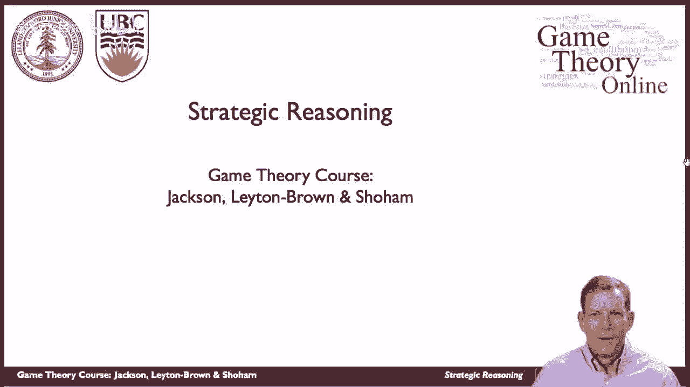

特别是，嗯，现在让我们来分析一下凯恩斯选美比赛的游戏，谈谈这个博弈的纳什均衡，所以记住这个游戏的结构是什么，每个玩家命名一个1到100之间的整数，所以你有很多球员，他们都在命名整数，嗯。

由人们命名的胜利，其他人什么都得不到，领带被随机地均匀地打破。

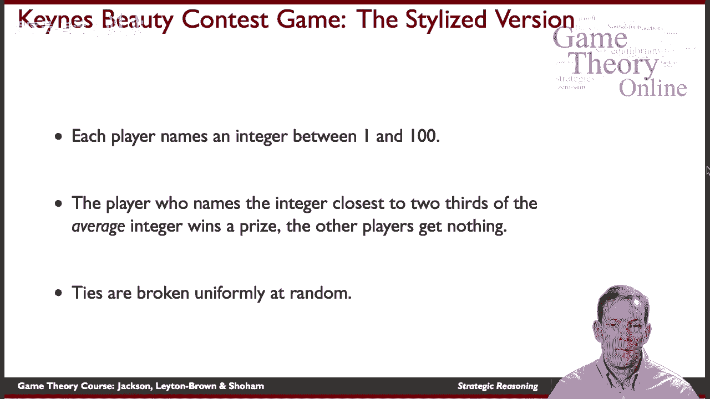

好的，所以再一次，其他玩家会怎么做，你得讲道理，然后嗯，那么我该怎么回应呢，所以这些是纳什均衡的关键因素，纳什均衡是每个人都选择自己的最优反应，在这场比赛中给他们最大获胜机会的人，其他玩家在做什么。

这将是一个纳什均衡，好的。

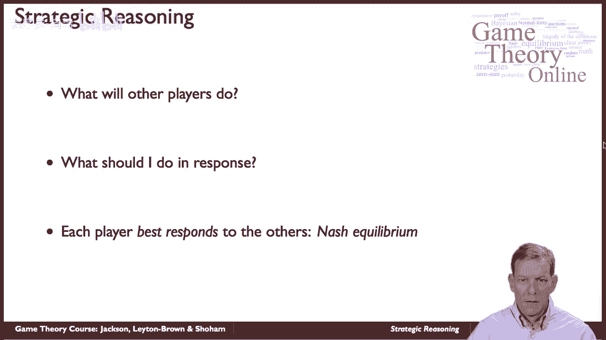

所以让我们来看看，嗯，所以说，我们怎么能对此进行推理呢？假设我认为呃，平均来说，嗯，在这个游戏中命名的平均整数将是某个数字x，所以你知道，我想这将是平均水平，嗯，我的回答必须是真的，对此。

我的回答应该是X的三分之二，对，我应该命名最接近三分之二的整数，我相信平均数会是这样，我的最佳策略应该是命名一个最接近x的三分之二的整数，所以在这里我们只是启发式地工作，稍后我们将讨论正式的定义和分析。

但现在让我们来看看基本的推理，好的，所以我应该试着说出三分之二的东西，我想平均水平会很好。

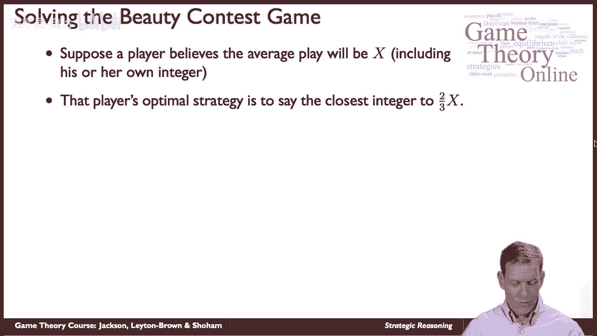

x必须小于100，对呀，平均猜测不可能超过一百个，所以任何玩家的最佳策略都不应该超过67，好吧，如果我认为每个人都是理性的，如果我相信那是真的，那么我认为没有人应该命名一个大于67的整数，好的。

那这是什么意思，这意味着我不认为平均值会高于67，如果平均x不大于67，那么我应该说出不超过六十七个中的三分之二，现在你可以开始看到这是怎么回事，这意味着如果我认为其他人都理解这个游戏。

并明白任何人都不应该命名一个大于67的数字，任何人都不应该命名大于67的三分之二的数字，嗯，我们继续这样，所以任何人都不应该说出超过三分之二的名字，现在六十七的三分之二，很明显，当你一直在看的时候。

每个人都想比，其他人的猜测，所以无论平均值在哪里，你应该比那个低，每个人都能说出的唯一一个数字是什么，并始终如一地选择最佳响应，他们必须什么，平均猜测是这个博弈的唯一纳什均衡，就是每个玩家宣布一个。

好的，嗯，是的，所以我们一直在宣布一个，这是唯一的纳什均衡，现在发生的事情，我们都宣布一个，我们打成平手，有人随机获胜，如果我试图偏离这一点，如果我试图宣布一个更高的整数，我只是比一般的猜测要高。

所以我不会在平均值的三分之二，所以这将是一个稳定的点，好的，所以让我们看看当人们玩这个时会发生什么，所以这个推理的一部分是，你试图对其他球员的所作所为形成期望，你需要确保这些期望与现实相匹配。

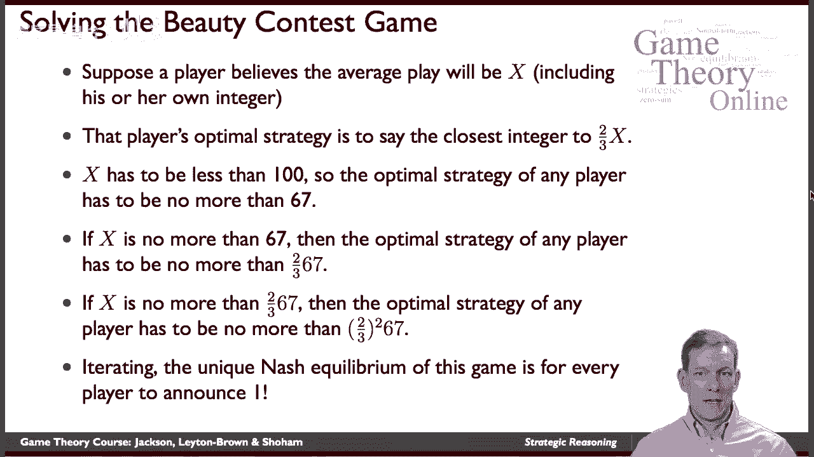

所以让我们来看看这个游戏的一些玩法，所以这是这里的一个情节，我们实际上给你在线课程的结果，去年教的时候，我们让玩家玩这个游戏，所以这些就是结果，从2012年开始，我们有一万多人参与了这个特殊的游戏。

我们在这下面看到了什么，我们有从零到一百的整数，然后在这里我们有频率，那么有多少人被点名给出一个整数，所以这里的50是模式，所以我们得到了五十的模式，最常被命名的整数是50，一千六百人命名五十井。

显然他们还没有经过所有的推理，需要一段时间来弄清楚这个游戏的均衡是什么，这里是什么意思，所以平均值是三四，所以实际上，你说了些有趣的话，有些人说出了100个永远不会真正获胜的数字，所以不清楚到底是什么。

呃，嗯，它最终可能会赢，如果每个人都说出一百个，然后你可能会在那里打成平手，但那样你会更好，所以当我们最终看完这个，我们最终得到的是一些人命名高数字，但很少有人，然后我们最后得到一些有趣的尖刺。

一群叫五十的人，不清楚，五十岁的理由到底是什么，嗯，有趣的是，如果你认为一群人会这么做，你可能想说出50个中的三分之二，好的，嗯，这里三点有一个很大的尖峰，嗯，一群人相信其他人会说出50个。

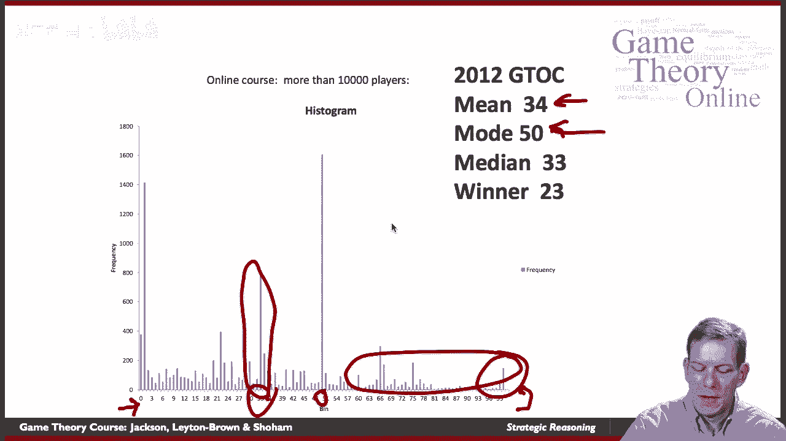

如果我们继续下去。

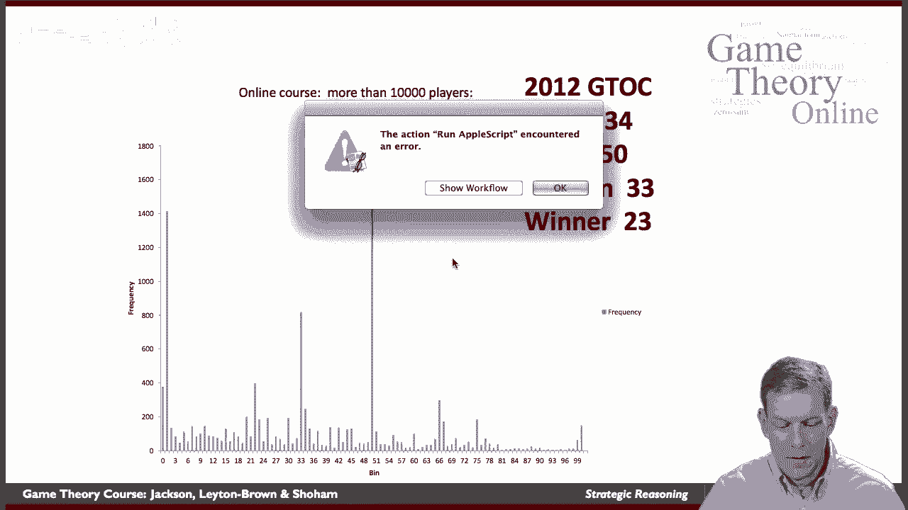

在这里，如果我们继续看这个，我们看到了什么。

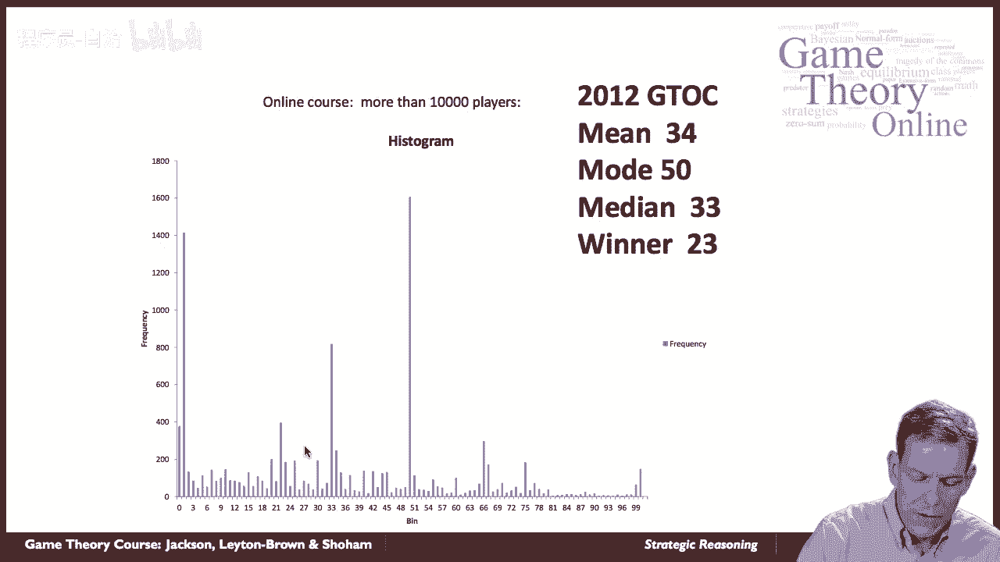

然后我们看到另一个尖峰在三分之二的三三，所以有人说，好的，嗯，也许一群人会认为，平均将是50，他们要说出三个三个，我要说一个比那更好的，我要给一些东西起个名字，大约是2，2，2，3。

你知道这场比赛的赢家是什么吗，获胜者实际上是二三，所以三分之二的平均猜测是大约三分之二，平均是三四，所以这些人中随机的一个最终会成为这个游戏的赢家，好的，嗯，实际上有一群人，他一直走到纳什均衡。

这里很有趣，因为纳什均衡是有效的，如果你真的相信其他人会给整数1命名，那这就是你最好的回应，但在一群人不一定理解游戏的情况下，还没有讲道理，那么你最好命名一个更高的数字，所以纳什均衡是一个稳定点。

如果每个人都明白了，每个人都遵守它，那这是你能做的最好的事，嗯，但可能有些玩家不一定明白，到底发生了什么，好吧，现在假设你从这个游戏开始，他们不一定在玩纳什均衡，但现在我们没有再玩了，对呀。

所以他们可以这么做，再放一遍，然后看看会发生什么，现在这些人应该意识到他们高估了，这里有一群人把数字定得太高了，他们应该把他们的公告转移到更低的数字上，对呀，他们应该向下移动，如果我预料到了。

每个人都会调整并向下移动，我也应该把我的公告往下移。

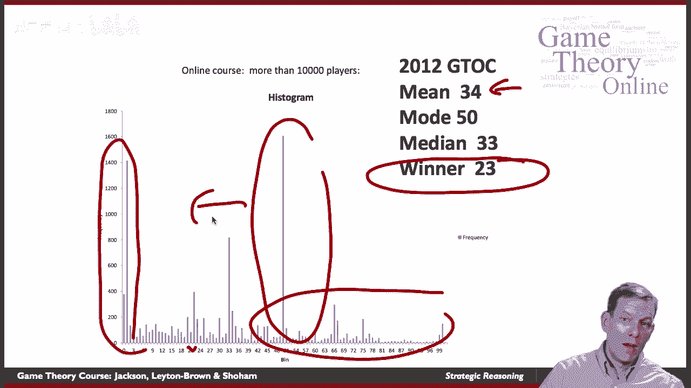

所以让我们来看看会发生什么，所以这里是玩家的子集，实际上是我在校园里上的一节课，他们得到了，这是游戏的第二场，所以在第一场戏之后，然后我们让他们再玩一次，现在你可以开始看到事情，你知道五十个已经消失了。

上面的号码都不见了，人们已经搬下来了，事实上，更多的人正在走向平衡，一旦你到了第二部分，第二次机会，所以如果你玩过这个游戏，你开始看到它的逻辑，你再放一遍，现在我们越来越接近纳什均衡。

所以纳什均衡在这里是一个更好的预测器，如果来自玩过这个游戏的有经验的玩家，明白了，并与相同的人群互动，你可以看到事情开始瓦解，并向所有宣布一个。

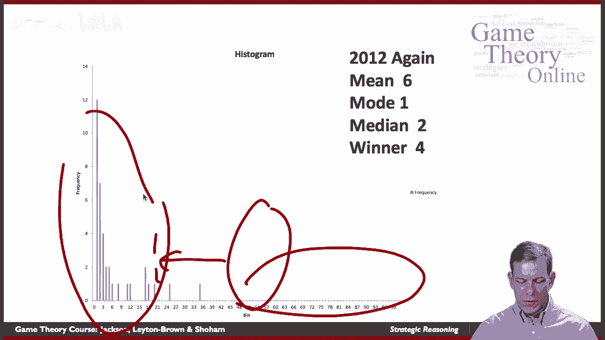

好的，所以纳什均衡，基本思想，一致的行动清单，所以每个玩家都在最大化他或她的收益，考虑到其他玩家的动作，应该是自洽稳定的。

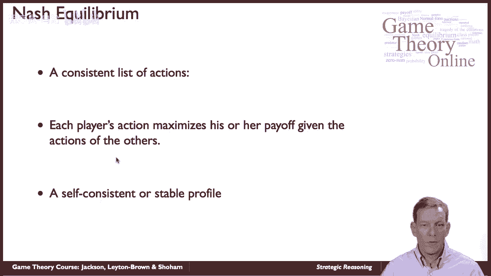

嗯，这个好的地方，每个玩家的行动都是最大化他们能给其他玩家的东西，没有人有动机偏离他们的行动，如果播放平衡剖面。

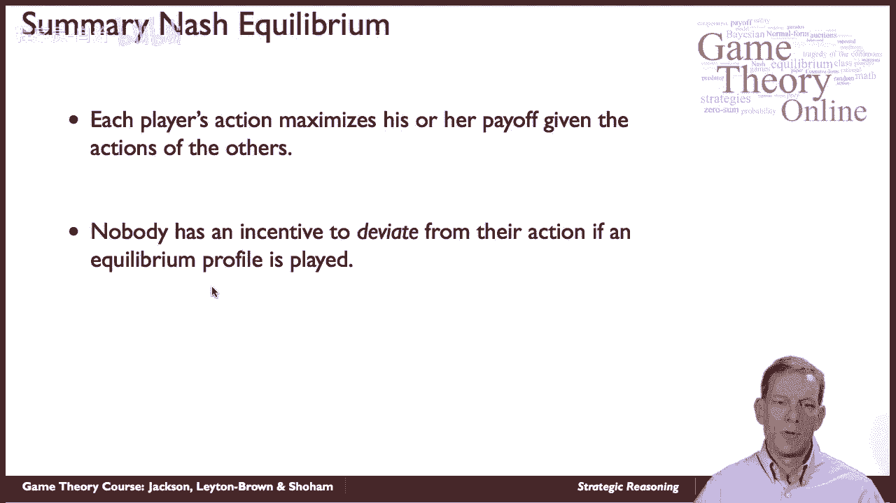

有人确实有偏离的动机，从不形成平衡的行为的轮廓，所以这些是基本的想法，我们将更详细地研究纳什均衡，所以在做出预测方面。

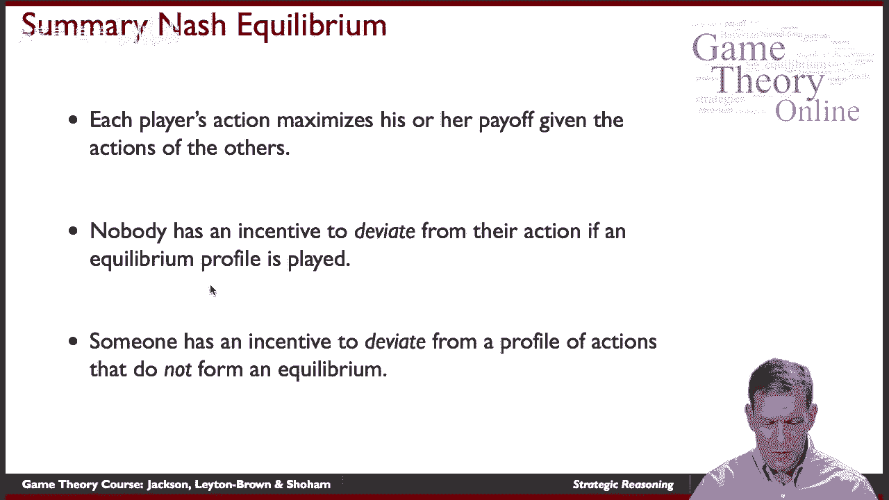

你知道的，我们为什么要期待纳什均衡得到很好的发挥。

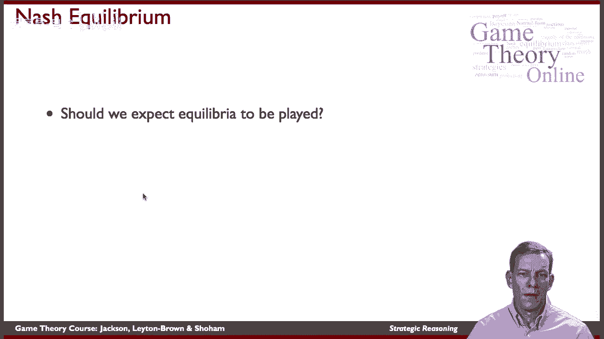

我想这里有一个有趣的逻辑，这个逻辑实际上可以追溯到纳什最初的一些讨论，嗯，当我们想对游戏中发生的事情做出预测时，我们想要的东西，如果玩家真的明白事情，它将是一致的，有趣的是，不是在某种意义上稳定。

如果玩家理解它，看看在不平衡的情况下会发生什么，他们应该远离那个，我们在选美比赛的第二轮中看到了这一点，然后人们开始向下移动到纳什均衡，所以我们不一定总是期望均衡被发挥。

但是我们应该期望非平衡会随着时间的推移而消失，会有各种动态和其他类型的设置，随着时间的推移，会有强大的推动力走向平衡，它们可能会进化等等所以随着课程的进行，我们将越来越多地讨论一些动力学。

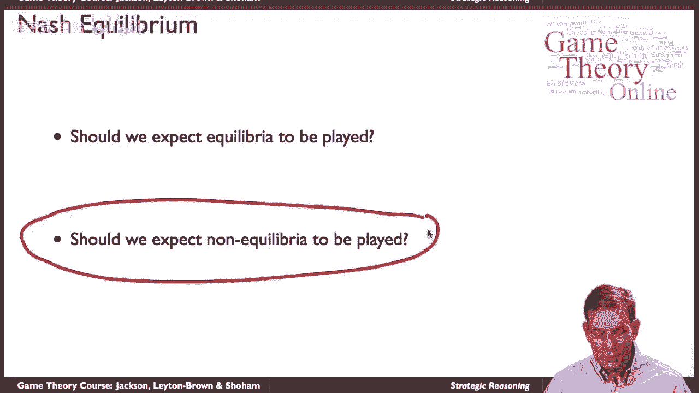