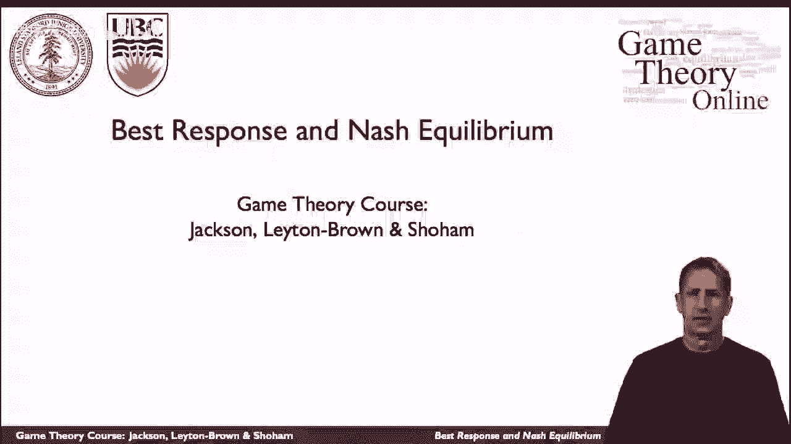
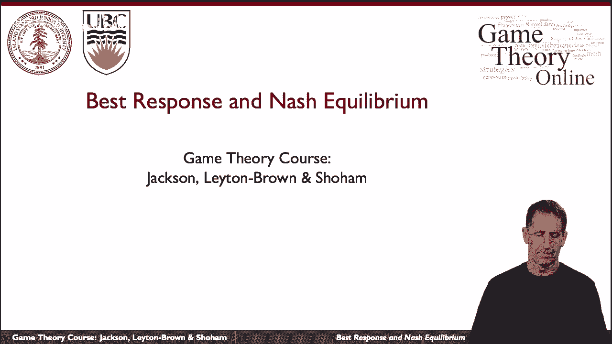
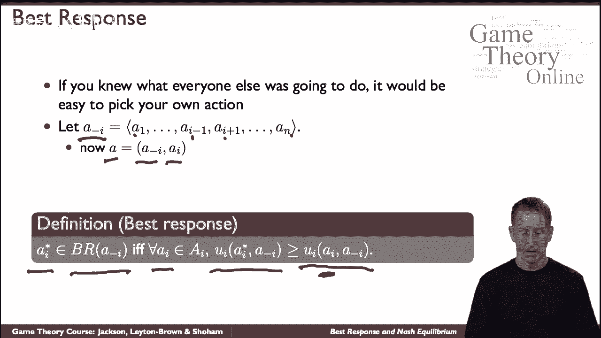
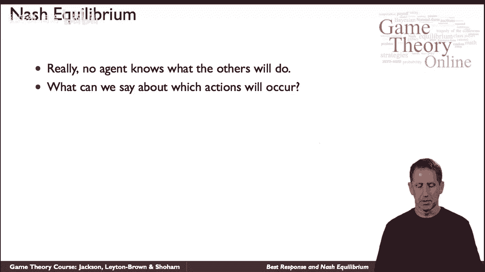
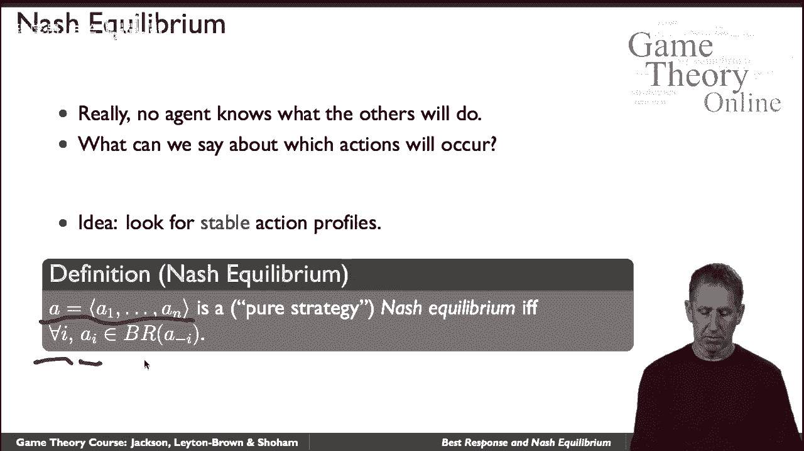

# 【斯坦福大学】博弈论 （全） - P8：【斯坦福大学】博弈论（7）最佳对策和纳什均衡 - 自洽音梦 - BV1644y1D7dD

现在将讲述我们如何预测人们将在一个游戏中玩，特别是关于最佳响应和纳什均衡的概念。

现在让我们暂时假设你是其中一名球员，其他玩家会以一种，你知道的，然后我们可以谈谈你最好做什么，我们称之为最佳反应。

从技术上讲，让我们使用以下表示法，除了你，每个人的动作序列，所以是一号玩家，以此类推，玩家I减去一，我加上一个和所有其他的，所以整个动作向量，我们称之为。

动作配置文件A实际上是由所有这些A-I和你自己的动作组成的，用那个符号，这是定义，我们会说你的最佳反应，我们称之为I星，它可能不是唯一的，但它必须是布景的一部分，我们称之为br，最佳反应。

假设所有其他代理都是a-i，如果是这样的话，为了任何事情，你可能会考虑做一个B，对于所有的潜艇I，必须是这样的，你玩那个的实用程序，换句话说，当你扮演艾星而其他人扮演我的时候，因为无论它是什么。

它都必须至少和其他任何东西一样伟大，你可以选择一个潜艇I，如果是这样的话，我们会说i星是最好的回应，非常直观的概念。

这将使我们几乎一路到达那里，这个问题，当然啦，你不知道其他人会怎么做，不过没关系，因为我们使用最佳响应的概念作为构建块。

定义我们所说的纳什均衡，简单地说，自然平衡是一组动作，每个特工一个，这样每一个都是对其他的最好的回应，具体来说，我们将在这里查看操作配置文件a a到a n，我们会说这是一个纳什均衡。

稍后我们会告诉你为什么我们称之为纯粹的策略，纳什均衡，如果每个特工，那个动作。

