# Python 版 1： 1.1 开场白 📊 

在本节课中，我们将要学习统计学习的基本概念，并通过一系列生动的例子来了解统计学习在现实世界中的应用。我们将从定义统计学习开始，并探讨它与机器学习的关系，最后通过多个领域的实例来展示其广泛用途。

## 什么是统计学习？

我是特雷弗·哈斯蒂，我是罗布·蒂布希拉尼。欢迎来到我们的统计学习课程。这是我们首次开设的在线课程，我们对此感到非常兴奋。

统计学习是什么？特雷弗和我都是统计学家。我们实际上是80年代斯坦福大学的研究生，彼此认识已有大约30年。在那个时候，我们像许多统计学家一样从事应用统计学。统计学自1900年或更早之前就已存在。但在20世纪80年代，计算机科学领域的人们发展出了机器学习，尤其是神经网络成为了一个非常热门的话题。我当时在多伦多大学，特雷弗在贝尔实验室。最早的神经网络之一就是在贝尔实验室开发的，用于解决邮政编码识别问题，我们稍后会在幻灯片中展示一些相关内容。

大约在那时，特雷弗、我以及一些同事——杰里·弗里德曼、布拉德·埃夫隆、布莱恩·奥布莱恩——实际上，你们将在本课程中听到杰里和布拉德的声音，我们有一些对他们的采访——我们开始研究机器学习领域，并发展出了我们自己的观点，现在这被称为统计学习。因此，我们与斯坦福大学及其他地方的同事们一起，发展了这个统计学习领域。

在本课程中，我们将向你们介绍该领域的一些发展，并提供大量示例。

## 统计学习的应用实例

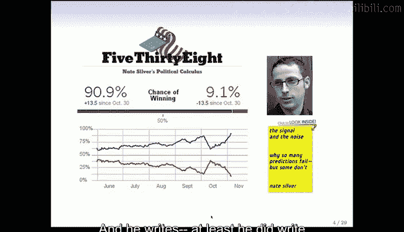

以下是统计学习问题的一系列示例，我们将逐一介绍，以便让你了解我们将要思考的各类问题。

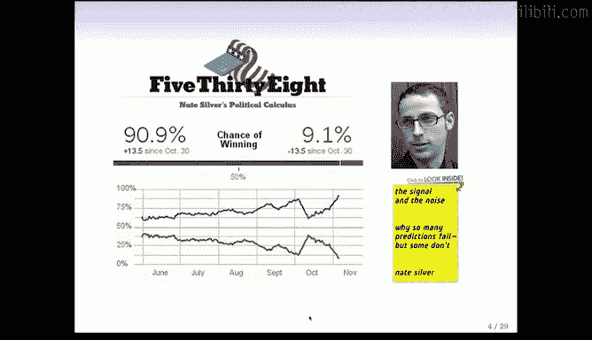

### 1. 沃森：计算机程序玩《危险边缘》

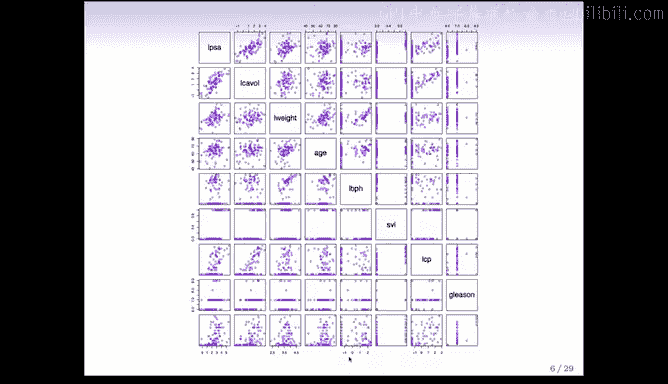

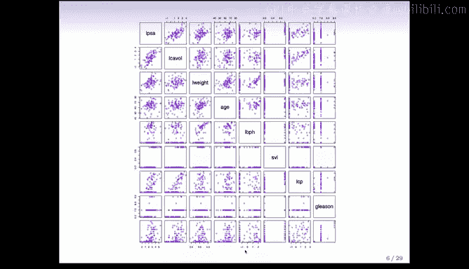

第一个例子是一个名为“沃森”的计算机程序在玩《危险边缘》游戏。它由IBM构建，并在三局两胜的比赛中击败了人类选手。开发该系统的IBM人员认为，这确实是机器学习的一次胜利。其中涉及了许多非常智能的技术，包括硬件和软件，而算法正是基于机器学习。因此，我认为这是人工智能和机器学习领域的一个分水岭时刻。

### 2. 谷歌与数据科学

谷歌是数据的大量使用者和分析者。这是2009年《纽约时报》上谷歌首席经济学家哈尔·瓦里安的一句话：“我一直说，未来10年最性感的工作将是统计学家。”事实上，图中是卡丽·格兰姆斯，她是斯坦福统计学的毕业生，也是谷歌最早雇佣的统计学家之一。现在谷歌拥有许多统计学家。

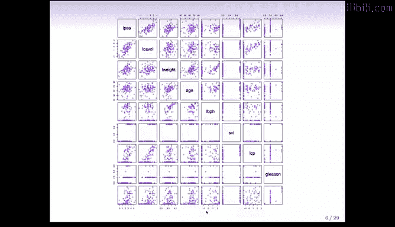

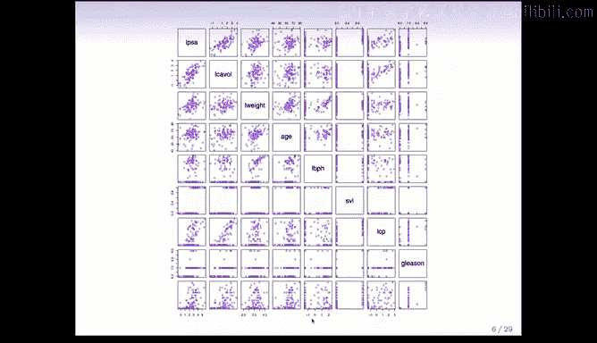

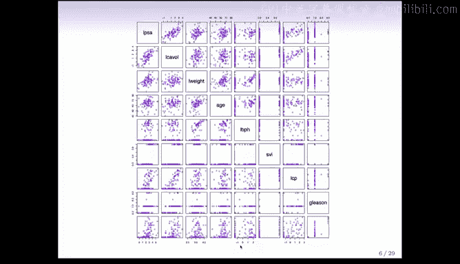

### 3. 内特·西尔弗与选举预测

下一个例子是右边的内特·西尔弗的照片。内特拥有经济学硕士学位，但他称自己为统计学家。他曾经为《纽约时报》撰写一个名为“538”的博客。在那个博客中，他非常准确地预测了2012年总统和参议院选举的结果。事实上，他正确预测了所有参议院竞选，并且对总统选举的预测也非常非常准确。他使用了来自各地的、经过仔细抽样的统计数据。当许多新闻媒体不确定谁会赢时，他完成了一项极其准确的选举预测工作。他现在非常有名，就像摇滚明星一样。我们开玩笑说，当你去派对告诉别人你是统计学家时，他们会跑向门口。但现在我们可以说，我们做机器学习，嗯，他们仍然会跑向门口，但需要更长一点时间才能到那里。事实上，我们现在称自己为数据科学家。这是一个时髦的词。

### 4. 前列腺癌数据

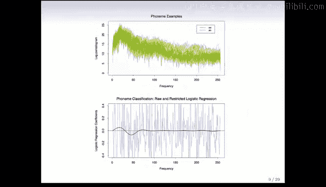

我们要看的第一个数据是关于前列腺癌的。这是一个相对较小的数据集，包含97名前列腺癌患者。这些数据实际上是由斯坦福医生斯坦博士在80年代末收集的。

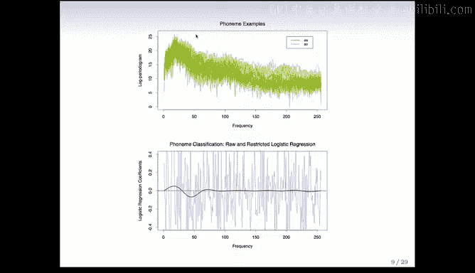

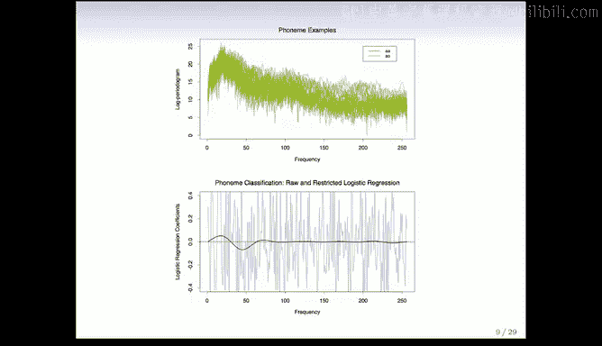

我们拥有每个受试者的PSA测量值，以及来自患者的一系列临床和血液测量值。一些测量与癌症大小和严重程度有关，另一些来自血液。这是一个散点图矩阵，实际上显示了数据。在对角线上是每个变量的名称，每个小图是一对变量。因此，如果你有相对较少的变量，你可以在这样一张图片中一次性看到所有数据，并了解数据的性质、哪些变量相关等等。这是查看数据的好方法。在这个特定案例中，目标是尝试根据其他测量值预测PSA。它位于顶部，你可以看到这些测量值之间存在一些相关性。

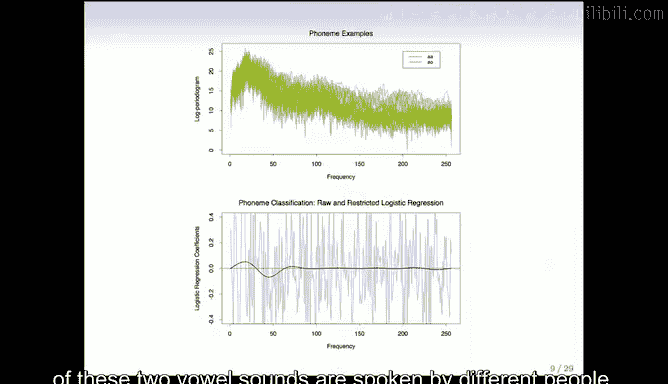

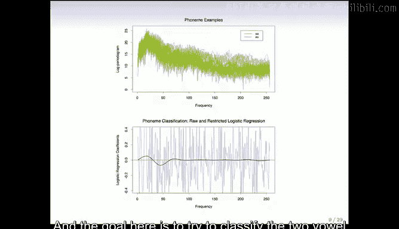

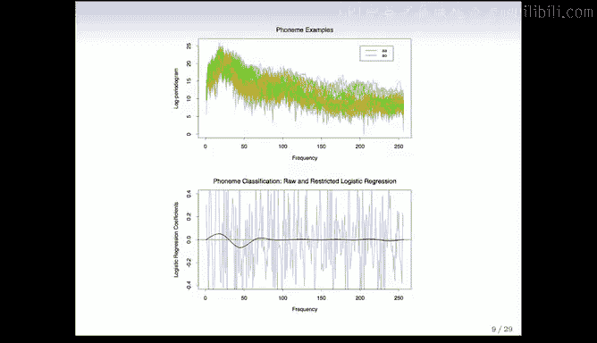

这实际上是这些数据的另一个视图，看起来非常相似，除了这里的一个实例，即对数重量。这是对数尺度上的变量，这是对数重量。你注意到这里有一个点看起来有点像异常值。事实证明，在对数尺度上，它看起来有点像异常值，但当你在正常尺度上看时，它非常巨大。基本上，那是一个打字错误。如果那是真实的测量值，那就意味着这位特定患者的前列腺重达449克。我们收到了一位退休泌尿科医生斯蒂芬·李博士的消息，他向我们指出了这一点，因此我们更正了之前发布的这个散点图版本。这是一个需要记住的好事情：当你获得一组数据进行分析时，第一件事不是将其运行到花哨的算法中，而是制作一些图表，查看数据。我认为在计算机出现之前的旧时代，人们更常这样做，因为这很容易。我的意思是，你手工操作，分析需要很多很多小时。所以人们会先查看数据，即使是大数据，我们也需要记住，在进行分析之前，你应该先查看数据。

### 5. 语音识别：元音分类

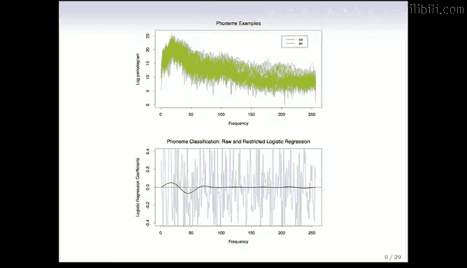

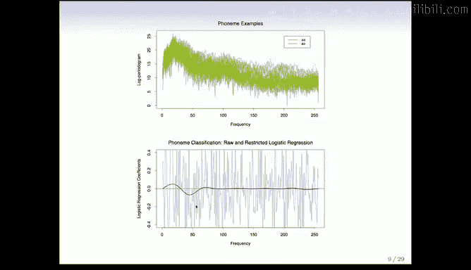

下一个例子是两个元音音素的语音识别。这张图显示了两个不同音素（AA和AO）在不同频率下的对数周期图功率。特雷弗，你怎么发音那些？AA是“odd”，AI是“odd”。正如你所知，特雷弗说话很有趣，但希望在本课程中，你能帮助我们区分它们。“Od”和“art”。好的，所以你看到这些由不同人发出的两个元音音素在不同频率下的对数周期图，橙色和绿色。

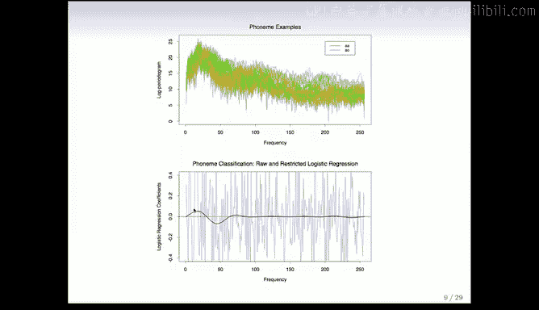

这里的目标是尝试根据不同频率下的功率来分类这两个元音音素。在底部，我们看到一个对数模型已经拟合到数据上，试图根据不同频率下的功率将两个类别彼此分类。加载的模型来自逻辑回归，用于根据对数周期图将其分类为两个元音音素之一，我们将在课程中详细讨论。逻辑模型中估计的系数在底部图中的灰色轮廓中。你可以看到它们非常不平滑，很难判断重要的频率在哪里。

但是当你应用一种平滑技术时（我们也会在课程中讨论），它将利用附近频率应该相似的事实（而灰色曲线没有利用这一点），我们得到了红色曲线。红色曲线非常清楚地显示，重要的频率看起来像一个元音音素在25左右有更多功率，而另一个元音音素在50之前有更多功率。

### 6. 心脏病风险预测

根据人口统计、饮食和临床测量预测某人是否会心脏病发作。这些实际上是来自南非男性的数据。红色的是患有心脏病的人，蓝点是没有心脏病的人。这是一个病例对照样本。因此，所有心脏病发作病例都被作为病例，并抽取了对照样本。目的是了解心脏病中的风险因素。当你有一个像这样的二元响应时，你可以为散点图矩阵着色，这样你就可以看到这些点，这相当方便。

这些数据来自南非的一个地区，那里心脏病的风险非常高。对于这个年龄组来说，超过5%。这些人尤其是男性，他们吃很多肉，三餐都吃肉。事实上，肉如此普遍，以至于鸡被视为蔬菜。特雷弗和罗布喜欢那个。我曾经喜欢那份工作。好的，同样，你可以看到这些数据中的相关性，目标是拟合一个模型，共同涉及所有这些不同的风险因素，为心脏病建立一个风险模型，在这种情况下，心脏病被标记为红色。

### 7. 电子邮件垃圾邮件检测

下一个例子是电子邮件垃圾邮件检测。现在每个人都使用电子邮件，垃圾邮件绝对是一个问题。因此，垃圾邮件过滤器是机器学习的一个非常重要的应用。这个表格中的数据实际上，我认为可能来自90年代末。是的，确切地说是90年代末。它来自惠普公司。这是一个名叫乔治的人写给惠普的。这是在电子邮件的早期，当时垃圾邮件也不够复杂。我们这里的数据来自发送给惠普实验室一个名叫乔治的个人的4000多封电子邮件。每一封都被手动标记为垃圾邮件或正常邮件。目标是尝试预测。实际上，他们现在称正常邮件为“ham”。好的，所以。

目标是根据电子邮件中单词的频率开始将垃圾邮件与正常邮件分类。这里我们只有一些更重要特征的汇总表。所以它是基于电子邮件中的单词和字符。例如，这表明如果这封电子邮件中有“George”，那么它更可能是正常邮件而不是垃圾邮件。那时候，如果你看到你的名字George出现在你的电子邮件中，它更可能是正常邮件。当然，现在垃圾邮件要复杂得多。他们知道你的名字，他们知道很多关于你生活的信息。事实上，你的名字在里面实际上使它成为正常邮件的可能性更小。但那时候，垃圾邮件发送者要简单得多。例如，如果你的名字在里面，成为正常邮件的可能性很小，而“remove”这个词则相反。好的，所以我猜它可能写着类似“如果你想从列表中移除，请点击”的内容。显然，这通常是垃圾邮件，对吧？所以目标是，我们将详细讨论这个例子，使用57个特征（这里是其中的七个特征）作为一个分类器，共同尝试预测一封电子邮件是垃圾邮件还是正常邮件。

### 8. 手写邮政编码识别

识别手写邮政编码中的数字。这是我们之前提到的。你有一些从信封上取下的手写数字，目标是根据这些数字中任何一个的图像，说出数字是什么，即将其分类到10个数字类别中。

对人类来说，这看起来是一项相当容易的任务。你知道，我们非常擅长模式识别。事实证明，这对计算机来说是一项众所周知的困难任务。随着时间的推移，它变得越来越好。所以这是最早用于开发神经网络的学习任务之一。神经网络最初就是用来解决这个问题的。

我们认为这应该是一个容易解决的问题，结果发现它真的很难。我记得特雷弗，我们第一次研究机器学习问题就是这个问题。当时你在贝尔实验室工作。我访问了贝尔实验室。你刚刚拿到这些数据，你说人工智能领域的人正在研究这个问题。我们想，哦，让我们尝试一些统计方法。我们尝试了判别分析，对吧？我们得到了大约8.5%的错误率，大约20分钟内最好的错误率，而当时其他人最好的错误率大约是4%或5%。我们想，哦，这会很容易。我们已经在10或15分钟内达到了8%。6个月后，6个月后，我们可能还在原地。所以我们意识到，实际上，正如通常的情况一样，你可以很快地获取一些信号，但要达到一个非常好的错误率，在这种情况下，试图分类一些更难分类的东西，比如这个4。或者实际上，大多数这些都很容易。但如果你查看数据库，有些非常困难，困难到人眼无法真正分辨它们是什么，或者有困难。这些正是机器学习算法真正受到挑战的地方。无论如何，这是一个可爱的问题，长期以来一直吸引着机器学习者和统计学家。

### 9. 基因表达与癌症分类

下一个例子来自医学，根据基因表达谱将组织样本分类为几种癌症类别之一。特雷弗和我都在斯坦福医学院兼职工作，我们和其他人做的很多事情是尝试使用机器学习、学习、大数据分析来了解癌症和其他疾病的数据。所以这是其中一个例子，这是乳腺癌的数据，称为基因表达数据。这是从基因芯片收集的。我们在左边看到的是一个数据矩阵。每一行是一个基因，这里大约有8000个基因。每一列是一个患者。这被称为热图。所以这个热图表示的是给定患者、给定基因的低和高基因表达。绿色表示低，红色表示高。基因表达意味着如果一个基因正在表达，它在细胞中工作得很努力。如果它不表达，它是安静的，沉默的。

目标是尝试找出哪些基因，嗯，尝试找出基因表达的模式。这些是患者，这些是患有乳腺癌的女性。试图找出乳腺癌女性基因表达的共同模式，并了解为什么存在显示不同基因表达的乳腺癌亚类。所以我们在这里看到的是完整数据的热图，列中有88名女性，行中再次有大约8000个基因。层次聚类（我们将在本课程的最后部分讨论）已应用于列，你在这里顶部看到聚类树，它已被展开以便你在顶部查看。层次聚类已被用于根据基因表达将这些女性大致分为一、二、三、四、五、六个亚组。非常有效，尤其是有了这些颜色。你可以看到这些聚类脱颖而出。是的，层次聚类和热图实际上对基因组学来说是一个非常重要的贡献，这就是一个例子，仅仅因为它们使你能够在一张图片中看到并组织完整的数据集。

在右下角这里，我们进一步深入查看了基因表达，例如，这个亚组，这些红色患者似乎在这些基因中，可能还有这些基因中，表达量很高。所以我们将在课程后期详细讨论这个例子。

### 10. 收入与人口统计变量关系

在人口调查数据中建立收入与人口统计变量之间的关系。这里有一些调查数据，我们看到2009年美国中大西洋地区的收入，你可能会看到作为年龄函数的收入最初上升，然后趋于平稳，最后随着人们年龄增长而下降。收入随着年份逐渐增加，因为生活成本增加，收入随着教育水平变化，那是右边的图，那些是箱线图。是的，我们看到影响收入的三个变量，同样，目标是我们将使用回归模型来尝试理解这些变量共同的作用，并看看是否存在交互作用等等。

### 11. 卫星图像与土地利用分类

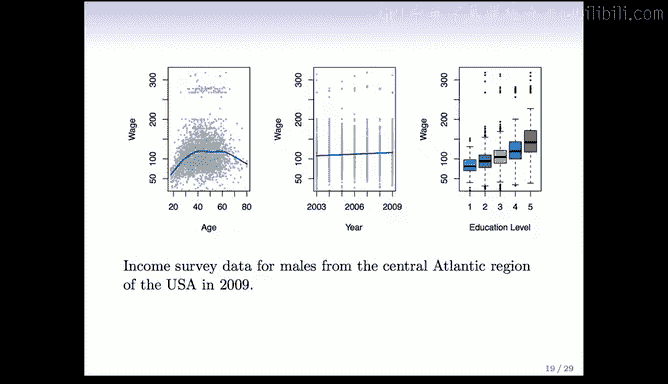

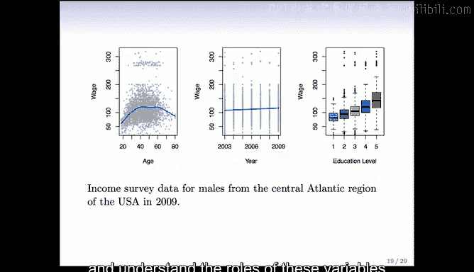

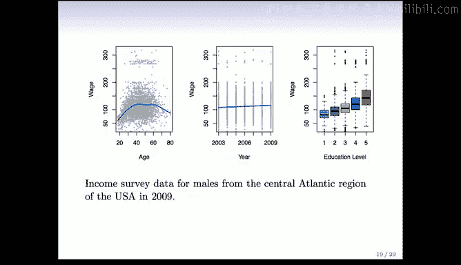

最后一个例子是澳大利亚一个土地利用区域的陆地卫星图像。这是澳大利亚的一个农村地区。这些颜色很刺眼，罗布，你选择了这些颜色吗？你可能对颜色有独特的品味。那是什么时候发生的？我没看到新闻备忘录。好的，所以这些来自陆地卫星图像。让我们从这个面板开始。所以这又是澳大利亚的一个农村地区，那里的土地利用已被标记。我认为实际上是由研究生或研究人员标记为一、二、三、四、五、六类。它们已用这些颜色标记，表示不同的标签，这些是真实标签，目标是尝试从卫星图像中获取的四个频率的光谱带预测这些真实标签。所以这里是不同频率的功率，在四个光谱带中。

所以我们有特征，现在它们相当复杂，因为我们有特征，空间特征，四层，我们将尝试使用这些特征的组合来预测我们在这里看到的土地利用。并且是逐像素的，尽管我们可能想利用附近像素比远处像素更可能具有相同土地利用这一事实。我们将讨论分类器。我认为我们在这里使用的实际上是最近邻，这是一个非常简单的分类器。它在右下角产生预测。你可以看到它相当好。它并不完美。它犯了一些错误。但就大部分而言，它相当准确。

好的，这就是一系列示例的结束。在下一节中，我们将告诉你们一些符号，说明我们如何为监督学习设置问题，这将在课程的其余部分使用。

## 总结

本节课中，我们一起学习了统计学习的基本定义及其与机器学习的渊源。通过从游戏节目、搜索引擎、选举预测到医学诊断、垃圾邮件过滤、图像识别等十个具体实例，我们看到了统计学习在解决分类、回归、预测等核心问题上的强大能力和广泛应用。这些例子涵盖了从小型临床数据集到大型基因表达数据、从结构化表格数据到非结构化的图像与文本数据等多种数据类型。在开始深入算法细节之前，理解这些多样化的应用场景至关重要。下一节课，我们将正式引入监督学习的数学符号和问题框架，为后续的学习打下坚实基础。